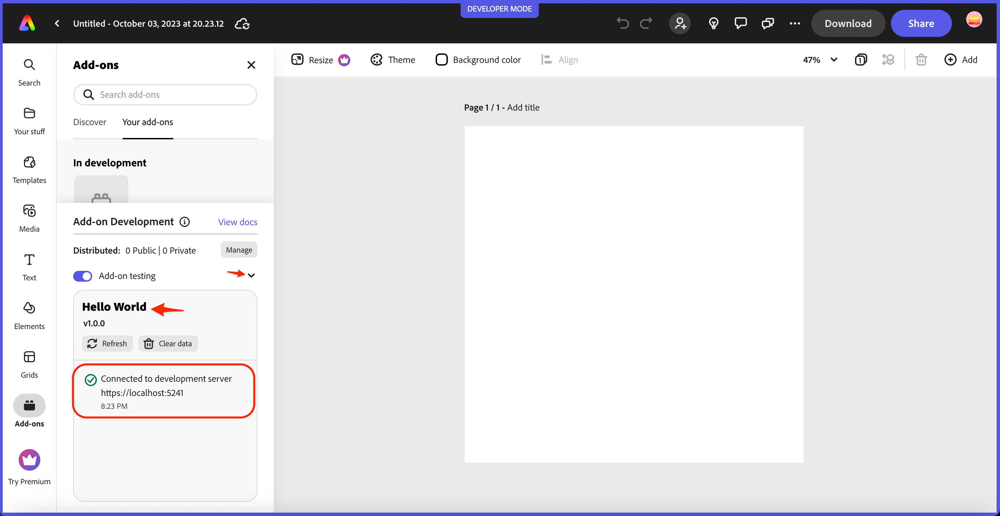

# Quickstart - Hello World Add-on

This quick start guide will help you create and run your first add-on, a starter add-on that outputs "hello world" when it's run in Adobe Express.

## Prerequisites

- [NodeJS](https://nodejs.org/en/download/) (major version >= 16) and [npm](https://docs.npmjs.com/downloading-and-installing-node-js-and-npm) (major version >= 8) installed
- Familiarity with programming in HTML, CSS and JavaScript
- An email address associated with an Adobe ID. (If you don't have one yet, you'll be taken through steps to create one in this guide)
- Access to the beta version of Adobe Express - [Join the waitlist](https://airtable.com/shr3IK38z2MCNHJEm)
- Express Add-on CLI - [Join the waitlist](https://airtable.com/shr3IK38z2MCNHJEm)

## Add-on CLI (Command Line Interface)
To facilitate the development of add-ons, we have provided a command line interface (CLI) that allows you to create and host Adobe Express add-ons directly from your local machine so they can be loaded into the beta version of Adobe Express running in your browser. 


<InlineAlert slots="text" variant="info"/>

**IMPORTANT:** These steps require access to the beta version of Adobe Express and the Add-on CLI, which are currently offered to interested developers on a *wait list basis*. If you're interested, please fill in and submit [this wait list form](https://airtable.com/shr3IK38z2MCNHJEm) to get on the list now!

### Step 1: Create your add-on project
Open your terminal and run the following command:

```bash
npx @adobe/create-ccweb-add-on hello-world --template javascript     
```

This command will create a new add-on based on a basic `javascript` template. See the [Templates section](../getting_started/dev_tooling/#templates) in the **Developer Tooling** page for more details on the built-in templates available with the Adobe Express Add-ons CLI. 

<InlineAlert slots="text" variant="success"/>

`npx` is an `npm` package runner that can execute packages without installing them explicitly.


### Step 2: Build and start your add-on
Next, execute the following commands to change into the newly created **hello-world** add-on folder, `build` the add-on, and `start` the add-on in a local server:

```bash
cd hello-world;
npm run build;
npm run start;
```

The `start` script will display messages like the following after it executes:

```bash
Your panel 'hello-world' can now be sideloaded
By enabling the Developer Mode </> from the Add-ons panel.
```

### Step 3: Load and run your add-on

- Navigate your browser to the [beta version of Adobe Express](https://new.express.adobe.com/new) and create a new project.
- Click the **Add-ons** icon, then enable the "developer mode" by clicking on the **Add-on testing** toggle button.
- Once clicked, a modal will appear where you will provide the URL of your locally hosted add-on.

  **Note:** Use the default `https://localhost:5241` supplied unless you are intentionally using a different port.

- Check the *I understand the risks of loading an add-on from an external server* checkbox and press the **Connect** button.
- Your add-on should now be displayed in the add-ons panel on the right side of your Adobe Express tab running in your browser. 



Congratulations! 👏 You've completed the quickstart and run your first add-on! 🏅 

Next, check out our [Concepts](../getting_started/concepts.md) page to discover more details on topics to be aware of while building add-ons, followed by our [guides section](../guides/), where you will find in-depth resources for [designing](../guides/design/), [developing](../guides/develop/), [debugging](../guides/debug/) and [distributing](../guides/distribute/) your add-ons.