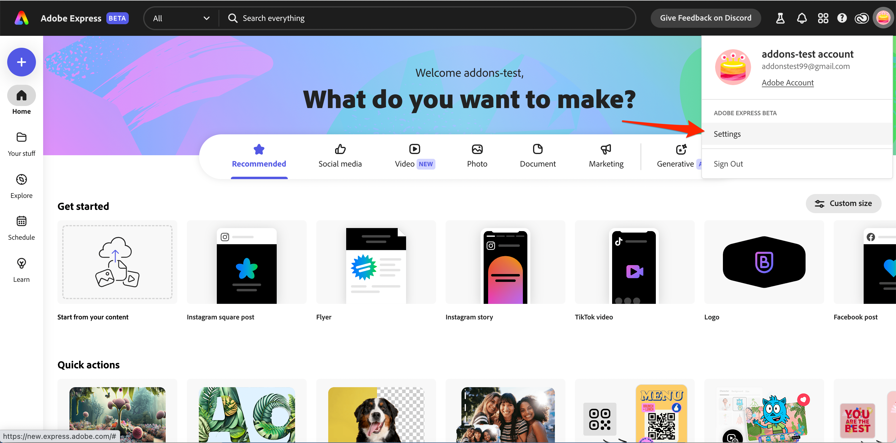
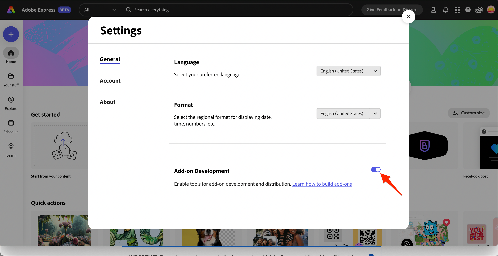
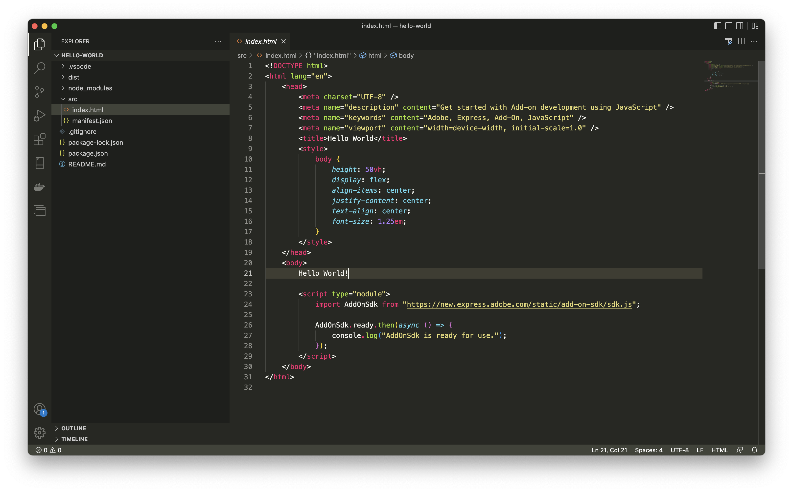
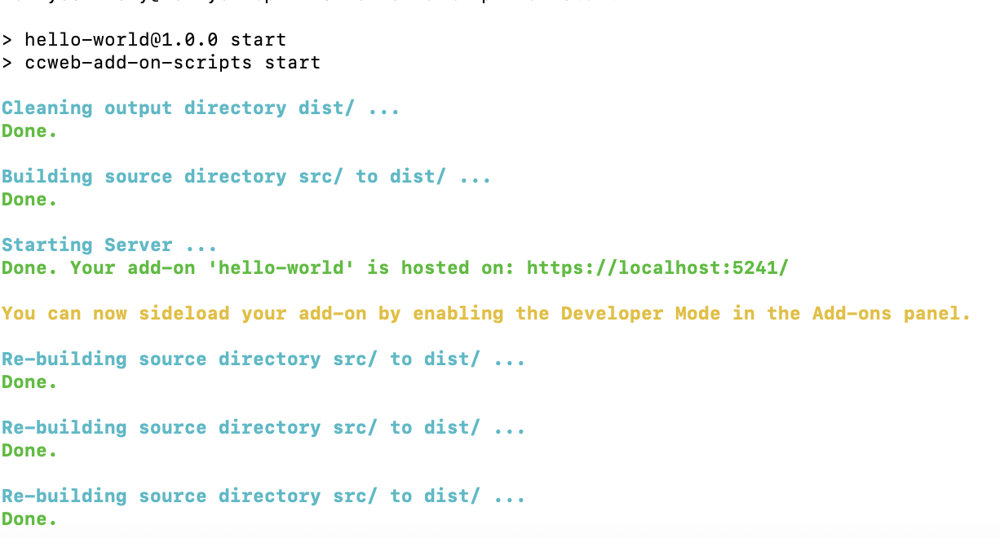
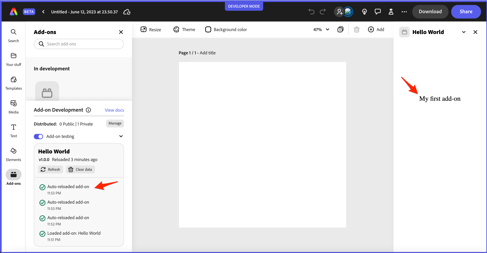
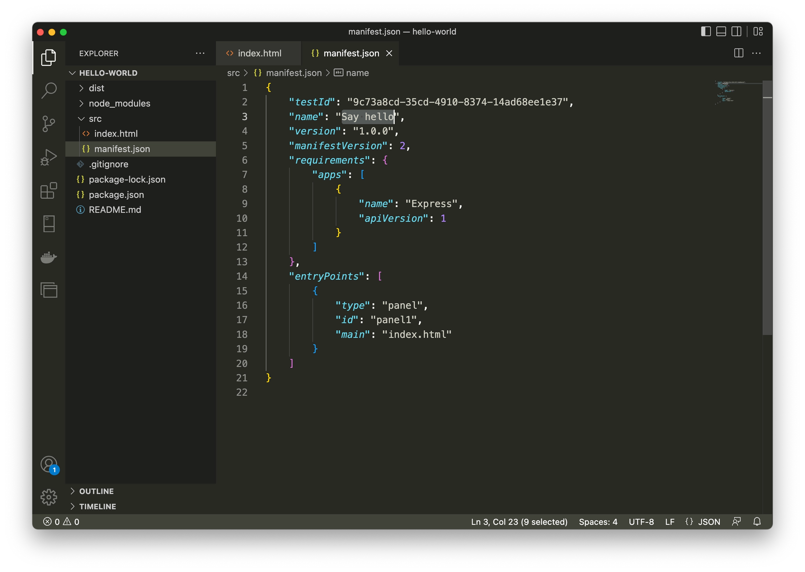
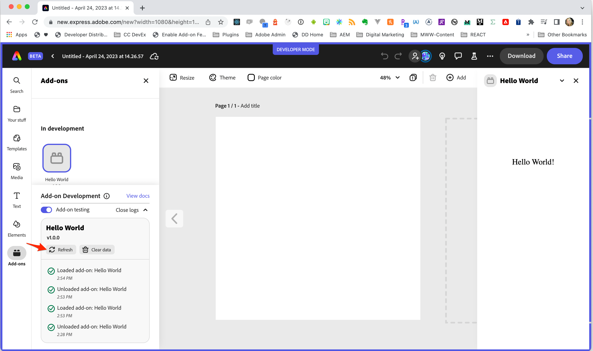
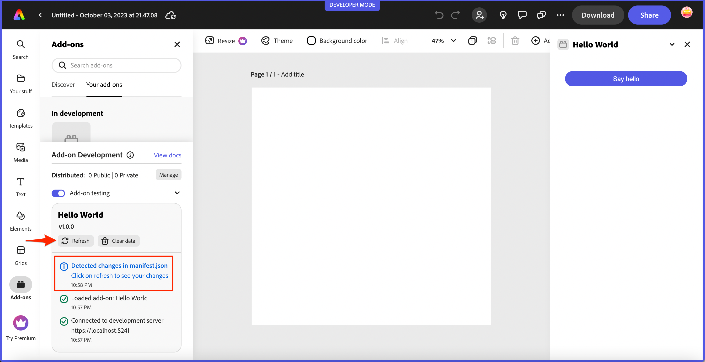
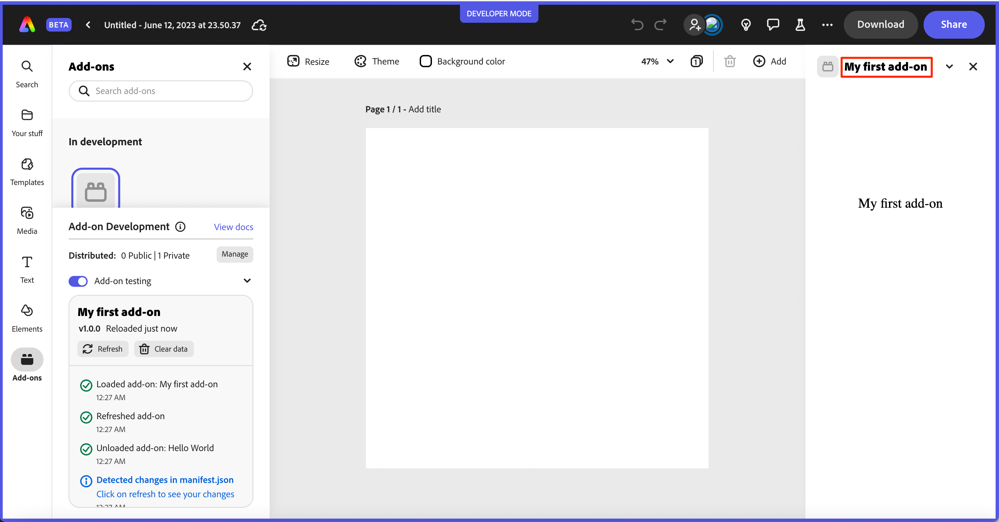

<InlineAlert slots="text" variant="info"/>

Preview Adobe Express add-on SDK documentation while you wait to [join our private beta](https://adobe.com/go/express-developer).

<br/><br/>

# Quickstart 

This quick start guide will help you create and run your first add-on, a starter add-on that outputs "hello world" when it's run in Adobe Express.

## Prerequisites

- [NodeJS](https://nodejs.org/en/download/) (major version of 16 or greater) and [npm](https://docs.npmjs.com/downloading-and-installing-node-js-and-npm) (major version of 8 or greater) installed
- Familiarity with programming in HTML, CSS and JavaScript
- An Adobe Express account (use an existing Adobe ID or simply create one for free).
- Access to the beta version of Adobe Express ([Join the waitlist](https://adobe.com/go/express-developer))
- Adobe Express add-on CLI ([Join the waitlist](https://adobe.com/go/express-developer))

## Add-on CLI 
To facilitate the development of add-ons, we have provided a CLI (Command Line Interface) that allows you to create and host Adobe Express add-ons directly from your local machine so they can be loaded into the beta version of Adobe Express running in your browser. 


<InlineAlert slots="text" variant="info"/>

**IMPORTANT:** These steps require access to the beta version of Adobe Express and the add-on CLI, which are currently offered to interested developers on a *wait list basis*. If you're interested, please fill in and submit [this wait list form](https://adobe.com/go/express-developer) to get on the list now!

### Step 1: Create your add-on project
Open your terminal and run the following command:

```bash
npx @adobe/create-ccweb-add-on hello-world --template javascript     
```

This command will create a new add-on based on a basic `javascript` template. See the [Templates section](dev_tooling.md#templates) in the **Development Tools** page for more details on the built-in templates available with the Adobe Express add-ons CLI. 

<InlineAlert slots="text" variant="success"/>

`npx` is an `npm` package runner that can execute packages without installing them explicitly.


### Step 2: Build and start your add-on
Next, execute the following commands to change into the newly created **hello-world** add-on folder, `build` the add-on, and `start` the add-on in a local server:

```bash
cd hello-world;
npm run build;
npm run start;
```

The `start` script will display messages like the following after it executes:

```bash
Your panel 'hello-world' can now be sideloaded
By enabling the Developer Mode </> from the **Add-ons** panel.
```

### Step 3: Enable add-on development mode (first-time only)
- Navigate to the [beta version of Adobe Express](https://new.express.adobe.com/).
- Click on your user avatar in the top righthand corner and choose **Settings**.

   

- Click the toggle button for **Add-on Development** to enable the add-on development and distribution tools:

   


### Step 4: Load and run your add-on
- Navigate your browser to the [beta version of Adobe Express](https://new.express.adobe.com/new) and create a new project.
- Click the **Add-ons** icon in the left rail.
- Toggle on the radio **Add-on testing** toggle button.
- Once clicked, a modal will appear where you will provide the URL of your locally hosted add-on.

  **Note:** Use the default `https://localhost:5241` supplied unless you are intentionally using a different port.

- Check the *I understand the risks of loading an add-on from an external server* checkbox and press the **Connect** button.
- Your add-on should now be displayed in the add-ons panel on the right side of your Adobe Express tab running in your browser. 

   


### Step 5: Edit your add-on
Now, while your add-on is still loaded and running, open the `src/index.html` file and update the **"Hello World!"** string in the `<body>` below:



to **"My first add-on"**:


Note the terminal where your add-on is running will display messages showing that the `src` has been rebuilt like below. This is due to the hot reload feature built into the CLI. 



Go back to your browser where your add-on is running in Adobe Express, and notice the new string is automatically shown, and the **Add-on Development** panel shows that it was auto-reloaded:



You can continue to update your code while your add-on is running and the add-on will automatically be rebuilt. 

Note, however, any changes to your `manifest.json` will require a manual reload of your add-on. The **Add-on Development** panel will indicate this in the log messages, and the **Refresh** button can be used to reload the add-on directly within Adobe Express. You can try this by updating the `name` field in the `src/manifest.json` file of your running add-on to **My first add-on**, for instance: 



Then, switch back to your Adobe Express window and you should see a message that changes have been detected in your manifest, such as below:

<!--  -->



Click the **Refresh** button, then click your add-on icon to load it again, and note the updated name in the title of your add-on as outlined below:



Congratulations! You've completed the quickstart and run your first add-on! 

Next, check out the [development tools](dev_tooling.md) page to discover more details on topics to be aware of while building add-ons, followed by the rest of the [guides section](../), where you will find in-depth resources for [designing](../design/index.md), [developing](../develop/index.md), [debugging](../debug/index.md) and [distributing](../distribute/index.md) your add-ons. If you're ready to dive into our developer platform, we highly recommend exploring our collection of [code samples](../../samples.md). These samples provide hands-on examples of how to use our platform SDKs and APIs, and are a great resource to help you get started building your own add-ons.
