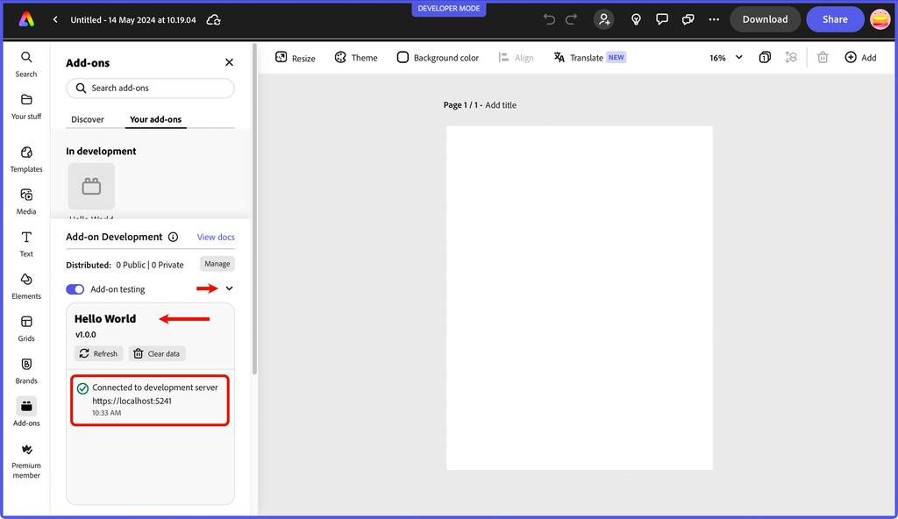

---
keywords:
  - Adobe Express
  - Express Add-on SDK
  - Express Editor
  - Adobe Express
  - Add-on SDK
  - SDK
  - JavaScript
  - Extend
  - Extensibility
  - API
  - Add-on Manifest
title: Quickstart
description: A quickstart guide to getting started building your first Adobe Express add-on
contributors:
  - https://github.com/hollyschinsky
  - https://github.com/undavide
---

# Quickstart

This quickstart guide will help you create and run your first add-on, a simple hello world add-on built with plain JavaScript.

## Introduction

Check out this short video below for a quick visual introduction to the steps you'll take to create your very first add-on.

<Embed slots="video" />

https://www.youtube.com/embed/kSq4ykQGOdo

## Prerequisites

- [NodeJS](https://nodejs.org/en/download/) (major version of 16 or greater) and [npm](https://docs.npmjs.com/downloading-and-installing-node-js-and-npm) (major version of 8 or greater) installed
- Familiarity with programming in HTML, CSS and JavaScript
- An Adobe Express account (use an existing Adobe ID or simply create one for free).

### Add-on CLI

The **[Adobe Express add-on CLI](dev-tooling.md#using-the-cli) (Command Line Interface) is required for add-on development** and allows you to create and host Adobe Express add-ons directly from your local machine.

## Step 1: Create your add-on project

Open your terminal and run the following command:

```bash
npx @adobe/create-ccweb-add-on hello-world --template javascript-with-document-sandbox
```

This command will create a new add-on based on pure JavaScript with Document Sandbox support (the set of APIs that allow you to interact with Adobe Express documents).

- `hello-world` is the name of the add-on you are creating.
- The `--template` flag specifies the template to use for the add-on; in this case, `javascript-with-document-sandbox`. The parameter is optional, and when missing, the CLI will prompt you to choose one from a list.

The [Templates section](dev-tooling.md#templates) on the **Development Tools** page provides a list of available options; if your add-on doesn't need to manipulate documents, you may want to pick a sandbox-free template (e.g., `javascript` instead of `javascript-with-document-sandbox`).

**For Windows Users:** If you're using the CLI in the terminal, you'll need to add `openssl` to the `path` under Environment Variables. If `git` is installed, `openssl` can be found at `C:\Program >Files\Git\usr\bin`. Otherwise, you can download `git` from https://git-scm.com/downloads, and add the directory location to the `path` variable in your Environment Variables.

<InlineAlert slots="heading, text1, text2, text3, text4, text5" variant="info"/>

#### CLI troubleshooting

`npx` is an `npm` package runner that can execute packages without installing them explicitly.

Please run this command to clear the `npx` cache and ensure the latest version of the CLI is invoked.

```bash
npx clear-npx-cache
npx @adobe/create-ccweb-add-on hello-world
```

The above may prove useful when updated versions of the CLI are released. If you want to read each individual CLI command manual page, run them via `npx` with the `--help` flag, for example:

```bash
npx @adobe/ccweb-add-on-scripts start --help
```

## Step 2: Build and start your add-on

Next, execute the following commands to change into the newly created **hello-world** add-on folder, `build` the add-on, and `start` the add-on in a local server:

```bash
cd hello-world;
npm run build;
npm run start;
```

The `start` script will display messages like the following after it executes:

```bash
Done. Your add-on 'hello-world' is hosted on: https://localhost:5241/

You can now sideload your add-on by enabling the Developer Mode in the Add-ons panel.
```

## Step 3: Enable add-on development mode (first-time only)

- Navigate to [Adobe Express](https://new.express.adobe.com/).
- Click on your user avatar in the top righthand corner and choose **Settings**.


- If you haven't already, click the **Accept and Enable** button to enable the add-on development switch (which is grayed out). Clicking the "Go to Developer Terms of Use" will open them in a new tab.


- When you have accepted the terms of use, the switch becomes available and should be toggled on.


## Step 4: Load and run your add-on

- Navigate your browser to [Adobe Express](https://new.express.adobe.com/new) and **create a new project**—a blank one will suffice.
- Click the **Add-ons** icon on the left rail.

<InlineAlert slots="text1, text2" variant="info"/>

It's possible to access the **Add-ons** from the home page as well (i.e., without the need to open a new project first). In this case, you must follow the listing creation outlined [here](../distribute/private-dist.md#step-1-create-a-new-add-on-listing) first.

For simplicity's sake, this Quickstart guide covers the document creation method.

- Notice there are two tabs: **Discover** and **Your add-ons**.


- Click on the **Your add-ons** tab to access the **Add-on Development** tools panel, and toggle on the **Add-on testing** switch.


- Once clicked, a modal will appear where you will provide the URL of your locally hosted add-on.

  **Note:** Use the default `https://localhost:5241` supplied unless you are intentionally using a different port.

  Select the *I understand the risks of loading an add-on from an external server* checkbox and press the **Connect** button.


- The **Add-on Development** panel will expand and show a message that the add-on is connected in the log, along with the name and version of your add-on. You can click on the down arrow icon to collapse the panel.



- To run your add-on, simply click on it from the **In development** panel. Your add-on should now be displayed in the add-ons panel on the right side of your Adobe Express window:


## Step 5: Edit your add-on

While your add-on is still loaded and running, open the `src/index.html` file and update the **"Create Rectangle"** string in the `<button>` below.


To something else, like **"Draw Rectangle"**.


Note that the terminal where your add-on runs will display messages showing that the `src` has been rebuilt, as shown in the screenshot below. This is due to the hot module reload feature built into the CLI.


Go back to your browser where the add-on is running in Adobe Express and notice the new string is automatically updated, and the **Add-on Development** panel shows that it was auto-reloaded.


You can continue to update your code while your add-on is running, and the add-on will automatically be rebuilt on save.

**Manifest updates**

Any changes to the `manifest.json` will *require a manual reload of your add-on*. The **Add-on Development** panel will indicate this in the log messages, and the **Refresh** button can be used to reload the add-on directly within Adobe Express. You can try this by updating the `name` field in the `src/manifest.json` file of your running add-on from "Hello World" to, say, **"Draw Rectangle"**.


Then, switch back to your Adobe Express window, and you should see a message that changes have been detected in your manifest.


Click the **Refresh** button, then click your add-on icon to load it again, and note the updated name in the title of your add-on as outlined below.


## Next steps

Congratulations! You've completed the quickstart and run your first add-on!

Next, check out the [development tools](dev-tooling.md) page to discover more details on topics to be aware of while building add-ons, followed by the rest of the [guides section](../index.md), where you will find in-depth resources for [designing](../design/index.md), [developing](../develop/index.md), [debugging](../debug/index.md) and [distributing](../distribute/index.md) your add-ons.

If you're ready to dive into our developer platform, we highly recommend following the [tutorials](../../guides/tutorials/index.md), and exploring our collection of [code samples](../../samples.md). These samples provide hands-on examples of how to use our platform SDKs and APIs and are a great resource to help you get started building your own add-ons.
