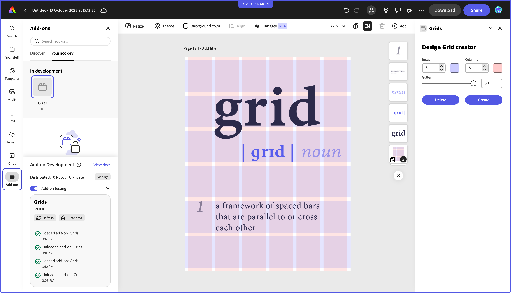
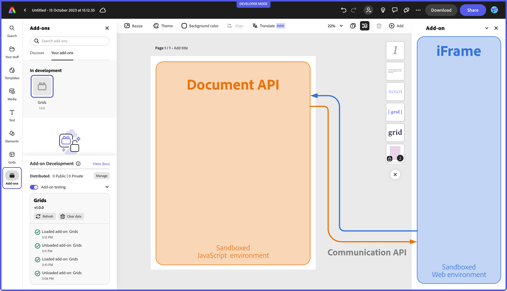
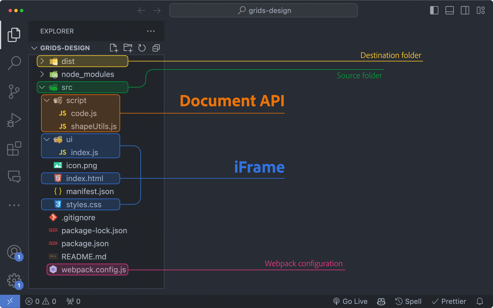

---
keywords:
  - Adobe Express
  - Express Add-on SDK
  - Express Editor
  - Adobe Express
  - Add-on SDK
  - SDK
  - JavaScript
  - Extend
  - Extensibility
  - API
  - Add-on Manifest
title: Quickstart
jsDoc: true 
description: This is the Quickstart page
contributors:
  - https://github.com/undavide
---

# Document API tutorial

This tutorial will guide you through the creation of your first Express add-on based on the Document API.

## Introduction

We'll build a fully functional Grids System add-on from scratch. Grid systems are widely used in the design world to bring structure and consistency to all visual content, from flyers to web pages or social media posts.



Your add-on will allow users to create a variable number of rows and columns, controlling the gutter and color overlays.
### Prerequisites

- Familiarity with HTML, CSS, JavaScript and the Adobe Express add-ons environment. If you need a refresher, follow the [quickstart](/guides/getting_started/quickstart.md) guide.
- An Adobe Express account (use your existing Adobe ID or create one for free).
- Node.js (version 16 or newer).

### Topics Covered

<!-- List block here -->
<ListBlock slots="text1, text2" repeat="4" iconColor="#2ac3a2" icon="disc" variant="fullWidth" />

iFrame and Script Runtime communication

Spectrum Web Components

Document API

Color Pickers

Nodes insertion point

Creating and manipulating shapes

Grouping elements

Context permanence

### Getting Started with the Document API

As part of the [Script Runtime](/references/scriptruntime/index.md), the Document API is a powerful tool that extends the capabilities of Adobe Express add-ons, offering direct interaction with the open document. Let's take a moment to review the difference between the two core components of add-ons' architecture.

- The **iFrame** hosts the add-on User Interface and runs its internal logic. You can think about it as a web application operating in a sandboxed environment: it needs to be separate from the rest of the Adobe Express content for security reasons, which is precisely why the add-on is hosted within an `<iframe>` element (a detailed technical description is found [here](/guides/develop/context.md#iframe-sandbox)). If you come from a CEP/UXP background, it's akin to developing the panel of an extension or plugin.
- The **Script Runtime**: allows you to operate on the document. It's a sandboxed JavaScript environment that communicates with the iFrame (thanks to the [Communication API](/references/scriptruntime/communication/)), providing access to the [Document API](/references/scriptruntime/editor/). Drawing the parallel with CEP and UXP again, it represents scripting; that is, the possibility to drive Express programmatically and, for example, add pages or artboards, create new shapes, rotate or group them, etc.

This is a high-level overview of the overall structure; while the implementation has more technical nuances, there's no need to dive deeper now.



### The Project Structure

The complete code for the Grids System add-on can be found [here](#), although it would be best if you followed along, starting from this [blank template](#): it sets up a JavaScript/Webpack environment with everything we need to complete the project. You can download the code, `cd` in the `grids-design` folder and then:

```bash
npm install
npm run build
npm run start
```

This will install the required dependencies, build the project, and then serve it locally on port 5241; if you need more clarification about how to load an add-on in Adobe Express, please refer to the [quickstart](/guides/getting_started/quickstart.md) guide for a step-by-step walkthrough.

Before jumping into the code, let's look at how the project is structured. At the time of this writing, the CLI provides a few templates, but Only ReactJS-based ones have a Webpack configuration, which is handy when using Spectrum Web Components (SWC). This project provides both hooks to the Script Runtime and the development environment needed to use SWCs.



As usual, we'll work in the `src` folder while Webpack outputs the result in `dist`. The add-on entry point is `index.html`, which relies on `ui/index.js` for the iFrame logic code (UI element handlers, etc.). The Document API entry point is instead `script/code.js`, as defined in the `manifest.json`:

```json
{
	// ...
	"entryPoints": [
		{
			"type": "panel",
			"id": "panel1",
			"main": "index.html",
			"script": "code.js"    // 👈 here
		}
	]
}
```

If you're wondering about `script/shapeUtils.js`, it is an auxiliary file containing private code consumed by `script.js` that doesn't need to be exposed to the iFrame.