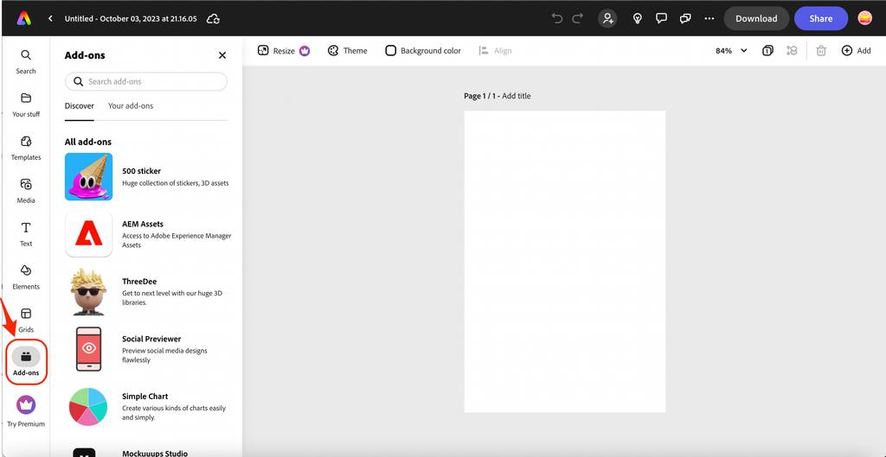

---
keywords:
  - Adobe Express
  - Express Add-on SDK
  - Express Editor
  - Adobe Express
  - Add-on SDK
  - SDK
  - JavaScript
  - Extend
  - Extensibility
  - API
  - Add-on Manifest
title: Adobe Express Add-ons Guides
description: Find the most recent documentation, code samples and resources for building add-ons for Adobe Express.
contributors:
  - https://github.com/hollyschinsky
---

<Hero slots="heading, text" background="rgb(138, 43, 226)"/>

# Overview

Adobe Express is the AI-first, all-in-one creativity app that makes it fast, easy, and fun for any user to design and share standout content.

## Add-ons

<InlineAlert slots="text" />

**How likely are you to recommend developing add-ons for Adobe Express to a fellow developer?**   
(Not at all likely) [1](https://survey.adobe.com/jfe/form/SV_5BzPeiUMnNVxY1g?Q_PopulateResponse=%7B%22QID42%22:%221%22%7D&Source=documentation) • [2️](https://survey.adobe.com/jfe/form/SV_5BzPeiUMnNVxY1g?Q_PopulateResponse=%7B%22QID42%22:%222%22%7D&Source=documentation) • [3️](https://survey.adobe.com/jfe/form/SV_5BzPeiUMnNVxY1g?Q_PopulateResponse=%7B%22QID42%22:%223%22%7D&Source=documentation) • [4️](https://survey.adobe.com/jfe/form/SV_5BzPeiUMnNVxY1g?Q_PopulateResponse=%7B%22QID42%22:%224%22%7D&Source=documentation) • [5️](https://survey.adobe.com/jfe/form/SV_5BzPeiUMnNVxY1g?Q_PopulateResponse=%7B%22QID42%22:%225%22%7D&Source=documentation) • [6️](https://survey.adobe.com/jfe/form/SV_5BzPeiUMnNVxY1g?Q_PopulateResponse=%7B%22QID42%22:%226%22%7D&Source=documentation) • [7️](https://survey.adobe.com/jfe/form/SV_5BzPeiUMnNVxY1g?Q_PopulateResponse=%7B%22QID42%22:%227%22%7D&Source=documentation) • [8️](https://survey.adobe.com/jfe/form/SV_5BzPeiUMnNVxY1g?Q_PopulateResponse=%7B%22QID42%22:%228%22%7D&Source=documentation) • [9️](https://survey.adobe.com/jfe/form/SV_5BzPeiUMnNVxY1g?Q_PopulateResponse=%7B%22QID42%22:%229%22%7D&Source=documentation) • [10](https://survey.adobe.com/jfe/form/SV_5BzPeiUMnNVxY1g?Q_PopulateResponse=%7B%22QID42%22:%2210%22%7D&Source=documentation) (Extremely likely)

Add-ons extend the functionality of [Adobe Express](https://new.express.adobe.com/), unlocking creative workflows for Adobe Express users. The add-ons marketplace is a dedicated platform for developers to distribute and users to discover new add-ons. Check out this quick introduction to Adobe Express add-ons to learn more, then read on to get started.   

  <iframe width="560" height="315" src="https://www.youtube.com/embed/CHBiTTN1neE" title="Introduction to Adobe Express Add-ons" frameborder="0" allow="accelerometer; autoplay; clipboard-write; encrypted-media; gyroscope; picture-in-picture; web-share" allowfullscreen></iframe>

 

To discover add-ons in [Adobe Express](https://new.express.adobe.com/new):

1. Open the Adobe Express editor and [create a new file](https://new.express.adobe.com/new) or open an existing one.
2. Click on the **Add-ons** button located in the left-hand sidebar.
3. Browse through the different categories of add-ons or use the search bar to find specific add-ons.
4. Click on an add-on to view more information and to install it.

That's it! You can now use the installed add-ons in your Adobe Express projects.

### Use Cases

Ready to build your own? Check out these popular use cases supported by our add-on SDK for inspiration:

- Importing images and video
- Exporting renditions of images in different formats
- Connecting to external sources via OAuth 2.0
- Storing and retrieving data
- Drag-and-drop support of content to the canvas
- Retrieving manifest data
- Managing language and locale
- Retrieving the current theme and detecting theme changes

See the [implementing common use cases](develop) page and [code samples](../samples.md) for more details on how to implement the features above.

## Add-on Developer Journey

The journey to developing an add-on is outlined below:

1. Create an add-on project with the CLI. You can refer to the [Getting Started](./getting_started/) guides to help you create your first project quickly.
2. Design your UI using [Adobe's Spectrum Design System](https://spectrum.adobe.com/). This system provides guidelines and resources for designing user interfaces that follow Adobe's design language and best practices.
3. Use the [common use case implementations](./develop/), [code samples](../samples.md), and [references](../references/) to learn how to include all of the features you want to showcase in your add-on. This can help you save time and avoid common mistakes when developing your add-on.
4. [Debug and test](./debug/) your add-on using your favorite browser tools, Visual Studio Code, and the add-on logging window provided in the Adobe Express UI development environment. This will help you identify and fix any bugs or issues before distributing your add-on.
5. Distribute your add-on for public or private sharing. You can refer to the [add-on distribution guidelines](./distribute/) to learn how to package and distribute your add-on on the Adobe add-ons marketplace or privately to your clients.

If you run into any issues at any time throughout your development process, please refer to the [Debug Guides](../guides/debug/) and [FAQ](../guides/faq.md) for more help.
