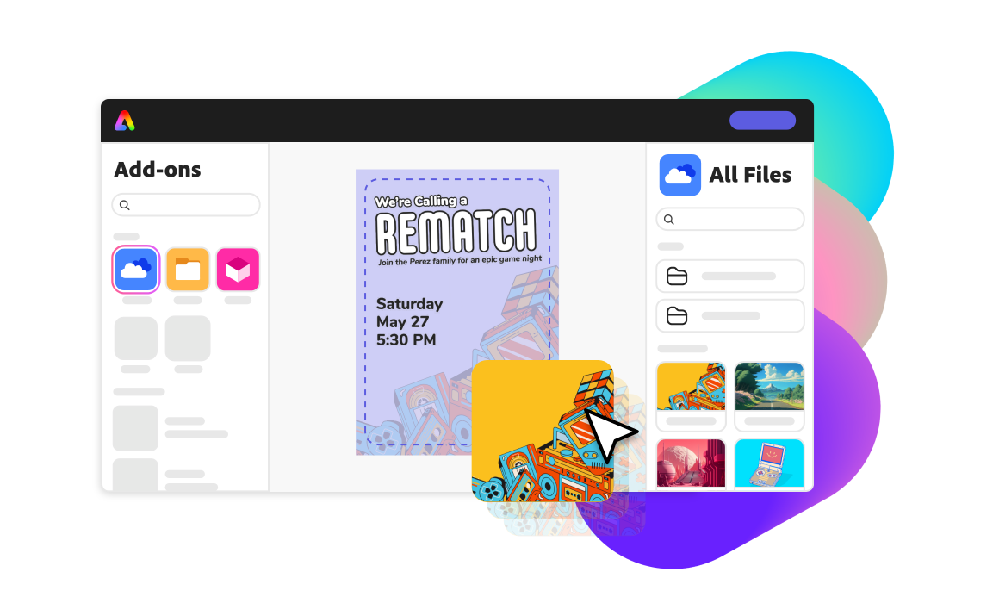
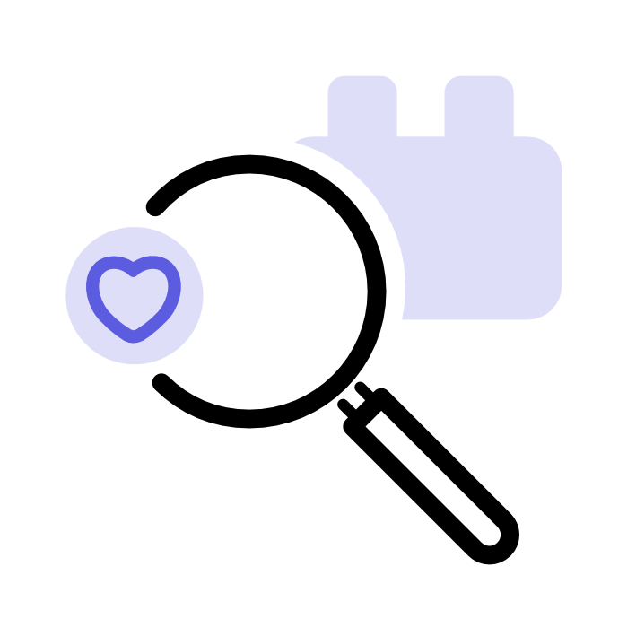
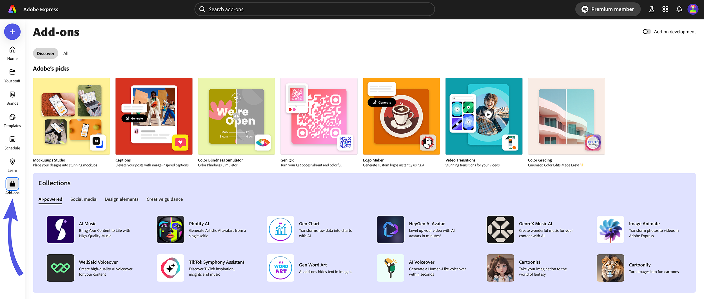

---
keywords:
  - Adobe Express
  - Express Add-on SDK
  - Express Editor
  - Adobe Express
  - Add-on SDK
  - SDK
  - JavaScript
  - Extend
  - Extensibility
  - API
  - Add-on Manifest
title: Adobe Express Add-ons Guides
description: Find the most recent documentation, code samples and resources for building add-ons for Adobe Express.
contributors:
  - https://github.com/hollyschinsky
  - https://github.com/undavide
hideBreadcrumbNav: true
---

import '/src/styles.css'

<Hero slots="heading, text"  className="hero-gradient" />

## Build add-ons for Adobe Express

Expand the capabilities of the quick and easy create-anything app. Empower the global creative community with solutions for millions of users.

<div className="hero-image-container">
  
</div>

<br/><br/>

## Welcome to Adobe Express Add-ons!

Ready to build your own add-on? Check out the Developer Journey to get started, or browse the sidebar to learn more about the [Code Playground](./getting_started/code_playground.md) and start tinkering with the API right away.

## 🤔 Frequently Asked Questions

### Q: What should I read first as a new developer?

**A:** Follow this recommended path:

1. **[Developer Journey](./getting_started/developer-journey.md)** - Get the big picture
2. **[Hello World](./getting_started/hello-world.md)** - Your first add-on
3. **[Code Playground](./getting_started/code_playground.md)** - Experiment with APIs

### Q: Should I use the Code Playground or CLI for development?

**A:** Choose based on your needs:

- **Code Playground**: Perfect for learning, prototyping, and simple add-ons
- **CLI**: Required for complex add-ons with external dependencies and production builds

### Q: How do I get help when I'm stuck?

**A:** Multiple support options available:

- **[FAQ](./support/faq.md)** - Common issues and solutions
- **[Office Hours](https://developer.adobe.com/developers-live)** - Monthly live support sessions
- **[GitHub Issues](https://github.com/AdobeDocs/express-add-ons-docs)** - Report documentation problems

## ⚠️ Common Beginner Mistakes

### ❌ Error: "Add-on Development mode not enabled"
**Solution:** Enable it in Adobe Express Settings → Add-on Development toggle

### ❌ Error: "Cannot access document APIs"
**Solution:** Ensure you're using Document Sandbox APIs correctly:

```js
// Document Sandbox (code.js) - CORRECT
import { editor } from "express-document-sdk";

// This works in Document Sandbox
const element = editor.createRectangle();
```

```js
// UI Runtime (index.js) - INCORRECT for document manipulation
// Don't try to use editor APIs here
```

### ❌ Error: "Code doesn't run in playground"
**Solution:** Check you're in the right tab:
- **Script tab**: For direct document manipulation
- **Add-on tab**: For full add-on with UI

<TextBlock slots="image, heading, text, text1" width="50%"/>



### Discover

Explore how add-ons can expand capabilities and streamline creative workflows.

[Find inspiration →](./getting_started/developer-journey.md#discover)

<TextBlock slots="image, heading, text, text1" width="50%"/>


### Learn

Familiarize and experiment with powerful features in our Code Playground.

[Dive deeper →](./getting_started/developer-journey.md#learn)

<TextBlock slots="image, heading, text, text1" width="50%" />


### Develop

Transform your ideas into a polished product following our best practices.

[Start building →](./getting_started/developer-journey.md#develop)

<TextBlock slots="image, heading, text, text1" width="50%" />


### Distribute

Share your add-on with the world in the Adobe Express Marketplace.

[Launch now →](./getting_started/developer-journey.md#distribute)

<!-- ## Adobe Fund for Design: Bring Your Ideas to Life! -->

<br/><br/>

<div style="display: flex; justify-content: center;">
  <iframe width="779" height="438" src="https://www.youtube.com/embed/CHBiTTN1neE" title="Introduction to Adobe Express Add-ons" frameborder="0" allow="accelerometer; autoplay; clipboard-write; encrypted-media; gyroscope; picture-in-picture; web-share" allowfullscreen></iframe>
</div>
<br/><br/>

## Get paid to build add-ons

Have a creative idea for an Adobe Express add-on? Get **funding**, resources, and support through the [Adobe Fund for Design](https://developer.adobe.com/fund-for-design).

<div style="display:flex; justify-content:center; margin-bottom: 20px; margin-top: 30px;">
  <iframe width="315" height="560" style="border-radius: 10px;"
    src="https://www.youtube.com/embed/76hGc6mlSSA"
    title="YouTube Shorts"
    frameborder="0"
    allow="accelerometer; autoplay; clipboard-write; encrypted-media; gyroscope; picture-in-picture; web-share"
    allowfullscreen>
  </iframe>
</div>

We're backing innovative solutions that unlock the most popular and [trending](https://developer.adobe.com/fund-for-design/#what-were-looking-for) use cases. [Apply now](https://developer.adobe.com/fund-for-design) and turn your vision into reality!

## Get inspiration and try out add-ons in the Marketplace

Do you want to try some add-ons first? Open [Adobe Express](https://express.adobe.com/add-ons) and click on the **Add-ons** button located in the left-hand sidebar. Browse through Adobe's picks, the Collections or use the search bar to find specific add-ons.

[](https://express.adobe.com/add-ons)

Click on an add-on to view more information and install it. That's it!

## What's next?

Continue by reading the [Developer Journey](./getting_started/developer-journey.md) and explore the [Code Playground](./getting_started/code_playground.md)!

<InlineAlert slots="text" />

**Join Us: Office Hours for Adobe Express Developers** <br /><br />
Receive real-time support, have your questions answered, and connect with both experts and peers for discussions on all things related to add-ons. Join us every month on Wednesdays at 8 AM PT. [Register for our next session here](https://developer.adobe.com/developers-live).

<br/><br/><br/><br/>
