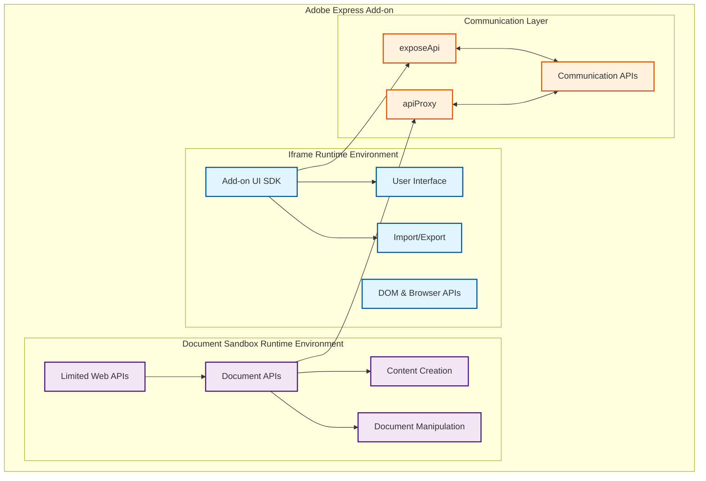

---
keywords:
  - Adobe Express
  - Express Add-on SDK
  - Add-on UI SDK
  - Document Sandbox
  - Document APIs
  - SDK terminology
  - API reference
  - Developer glossary
  - Naming conventions
  - Import statements
  - Runtime environments
  - Communication APIs
  - JavaScript
  - TypeScript
  - Extensibility
  - Manifest configuration
  - File structure
  - Bundle organization
  - Development workflow
  - Debugging
  - Cross-origin isolation
title: Developer Terminology Reference
description: A comprehensive reference guide for Adobe Express Add-ons SDK terminology, 
  naming conventions, and standardized definitions to ensure consistency across 
  documentation and development.
contributors:
  - https://github.com/hollyschinsky
# LLM optimization metadata
canonical: true
ai_assistant_note: "This page provides authoritative definitions and relationships 
  for Adobe Express Add-on terminology. Use these standardized terms when helping 
  developers choose between Add-on UI SDK (iframe/UI), Document APIs (content 
  creation), and Communication APIs (connecting the two environments)."
semantic_tags:
  - canonical-reference
  - terminology-authority
  - sdk-disambiguation
  - import-patterns
  - runtime-environments
  - manifest-configuration
  - file-structure
  - development-workflow
  - debugging-guide
---

# Developer Terminology Reference

## Overview

This reference clarifies the naming conventions and terminology used throughout the Adobe Express Add-ons documentation. Use this guide to understand the standardized terms and their relationships.

## Quick Reference

<InlineAlert slots="text" variant="success"/>

**Need a quick answer?** Jump to these common questions:

- **Building UI?** → [Add-on UI SDK](#add-on-ui-sdk) (iframe environment)
- **Creating content?** → [Document APIs](#document-apis) (document sandbox)
- **Connecting UI to content?** → [Communication APIs](#communication--apis)
- **File organization?** → [File Structure & Bundle](#file-structure--bundle-terminology)
- **Manifest setup?** → [Manifest & Configuration](#manifest--configuration-terminology)
- **Debugging issues?** → [Development Workflow & Debugging](#development-workflow--debugging-terminology)
- **Import errors?** → [Troubleshooting](#troubleshooting-common-issues)
- **Which SDK when?** → [Decision Matrix](#decision-matrix-which-sdk-to-use)

### Key Relationships



## Core SDK Components

### Add-on UI SDK

<InlineAlert slots="text" variant="info"/>

**Preferred Term:** Add-on UI SDK

The SDK that provides APIs for the UI panel of your add-on running in the iframe environment.

**Import Statement:**

```javascript
import addOnUISdk from "https://new.express.adobe.com/static/add-on-sdk/sdk.js"
```

**Also Known As:** UI SDK, addOnUISdk (in code)  
**Use When:** Building UI components, handling user interactions, importing/exporting content

### Document Sandbox

<InlineAlert slots="text" variant="info"/>

**Preferred Term:** Document Sandbox

The sandboxed JavaScript runtime environment that provides access to the Document APIs for content authoring.

**Import Statement:**

```javascript
import addOnSandboxSdk from "add-on-sdk-document-sandbox"
```

**Also Known As:** Document Model Sandbox, documentSandbox (in manifest)  
**Use When:** Creating or modifying document content, accessing document structure

### Document APIs

<InlineAlert slots="text" variant="info"/>

**Preferred Term:** Document APIs

The APIs that allow you to interact with and modify Adobe Express documents.

**Import Statement:**

```javascript
import { editor } from "express-document-sdk"
```

**Also Known As:** Document API, Express Document API  
**Use When:** Manipulating document elements, creating shapes, working with text

## Runtime Environments

| Term | Definition | Context | Related Terms |
|------|------------|---------|---------------|
| **Iframe Runtime** | The browser environment where your add-on's UI runs | UI development, user interactions | Add-on UI SDK, Panel, UI Runtime |
| **Document Sandbox Runtime** | The isolated JavaScript environment for document manipulation | Content authoring, document editing | Document Sandbox SDK, documentSandbox |

## Communication & APIs

| Term | Definition | Import/Access | Related Terms |
|------|------------|---------------|---------------|
| **Communication APIs** | APIs for bidirectional communication between iframe and document sandbox | `addOnSandboxSdk.instance.runtime` | exposeApi(), apiProxy() |
| **Web APIs** | Limited browser APIs available in the document sandbox | Global objects in sandbox | Console, fetch (via proxy) |

## Import Patterns & Code References

### Standardized Import Statements

```javascript
// Add-on UI SDK (for iframe/UI code)
import addOnUISdk from "https://new.express.adobe.com/static/add-on-sdk/sdk.js";

// Document Sandbox SDK (for document sandbox code)
import addOnSandboxSdk from "add-on-sdk-document-sandbox";

// Document APIs (for document manipulation)
import { editor } from "express-document-sdk";

// Additional common imports in document sandbox
import { editor, colorUtils, constants } from "express-document-sdk";
```

### Runtime References

```javascript
// In iframe code
const { runtime } = addOnUISdk.instance;

// In document sandbox code  
const { runtime } = addOnSandboxSdk.instance;
```

## Decision Matrix: Which SDK to Use?

<InlineAlert slots="text" variant="info"/>

**Choose the right tool for your task:**

| Your Goal | Use This | Import Statement |
|-----------|----------|------------------|
| Build UI components, handle user input | **Add-on UI SDK** | `import addOnUISdk from "..."` |
| Create/modify document content | **Document APIs** | Available in document sandbox |
| Communicate between UI and document | **Communication APIs** | `runtime.exposeApi()` / `runtime.apiProxy()` |
| Access limited browser features in sandbox | **Web APIs** | Global objects in document sandbox |

## Quick Reference by Use Case

**Building a UI Panel?** → Add-on UI SDK  
**Creating new content?** → Document APIs (in Document Sandbox)  
**Modifying existing content?** → Document APIs (in Document Sandbox)  
**Connecting UI to Document?** → Communication APIs  
**Need browser features in sandbox?** → Web APIs or proxy from iframe

## Common Confusion Points

### "SDK" vs "API" vs "Runtime"

- **SDK (Software Development Kit)**: A collection of tools, libraries, and documentation (e.g., Add-on UI SDK)
- **API (Application Programming Interface)**: Specific methods and interfaces you can call (e.g., Document APIs)
- **Runtime**: The execution environment where code runs (e.g., Iframe Runtime, Document Sandbox Runtime)

### Import Statement Patterns

```javascript
// ✅ Correct patterns
import addOnUISdk from "https://new.express.adobe.com/static/add-on-sdk/sdk.js";
import addOnSandboxSdk from "add-on-sdk-document-sandbox";

// ❌ Common mistakes
import { addOnUISdk } from "..."; // Wrong: should be default import
import addOnSandboxSdk from "add-on-ui-sdk"; // Wrong: mixed up the SDKs
```

### Context Switching

| When you're in... | You have access to... | To communicate with the other side... |
|-------------------|----------------------|--------------------------------------|
| **Iframe Runtime** | Add-on UI SDK, DOM, browser APIs | Use `runtime.exposeApi()` or `runtime.apiProxy()` |
| **Document Sandbox** | Document APIs, limited Web APIs | Use `runtime.exposeApi()` or `runtime.apiProxy()` |

## File Structure & Bundle Terminology

### Add-on Bundle Structure

**Add-on Bundle**
The complete packaged structure of your add-on, including all files and the manifest.

Based on the Adobe Express Add-on CLI templates:

**Basic JavaScript Template (UI only, no document sandbox):**

```text
my-addon/
└── src/
    ├── index.html        # Main UI entry point
    ├── index.js          # UI logic
    ├── manifest.json     # Configuration
    └── README.md         # Documentation
```

**JavaScript Template with Document Sandbox:**

```text
my-addon/
└── src/
    ├── sandbox/
    │   ├── code.js       # Document sandbox code
    │   └── tsconfig.json # TypeScript config for sandbox
    ├── ui/
    │   ├── index.html    # Main UI entry point
    │   ├── index.js      # UI logic
    │   └── tsconfig.json # TypeScript config for UI
    ├── index.html        # Root HTML file
    ├── manifest.json     # Configuration
    └── README.md         # Documentation
```

### Entry Point Files

**Main Entry File (`index.html`)**
The primary HTML file that loads when your add-on panel opens. Contains or references your UI code.

**Document Sandbox Entry (`code.js`)**
The JavaScript file that runs in the document sandbox environment. Contains document manipulation logic.

**Relative Path Resolution**
How files within your bundle reference each other using relative paths:

```html
<!-- In basic template: src/index.html -->
<script src="./index.js"></script>

<!-- In sandbox template: ui/index.html -->
<script src="./index.js"></script>
```

```javascript
// In sandbox/code.js - no imports needed for sandbox SDK
// addOnSandboxSdk is globally available
```

### Static Assets Organization

**Static Assets**
Non-code resources like images, icons, fonts, and media files included in your bundle.

**Asset Referencing**
How to properly reference static assets from your code:

```html
<!-- Relative paths from HTML -->

```

```javascript
// Dynamic asset loading
const iconUrl = new URL('./assets/icons/star.svg', import.meta.url);
```

### Bundle Optimization

**Bundle Size Considerations**
Keeping your add-on bundle small for faster loading:

- Minimize large assets
- Use efficient image formats
- Remove unused dependencies
- Consider lazy loading for non-critical resources

**File Organization Best Practices**
Structuring your bundle for maintainability:

- Separate concerns (UI, logic, styling)
- Group related assets in folders
- Use consistent naming conventions
- Keep manifest.json at root level

### External Dependencies

**Library Integration**
How to include external JavaScript libraries in your bundle:

```html
<!-- Local copy in bundle -->
<script src="./lib/lodash.min.js"></script>

<!-- CDN reference (requires network access) -->
<script src="https://cdn.jsdelivr.net/npm/lodash@4.17.21/lodash.min.js"></script>
```

**Dependency Management**
Strategies for managing external dependencies:

- **Bundle locally** - Include in your add-on bundle (recommended for reliability)
- **CDN loading** - Load from external CDN (requires internet connection)
- **Hybrid approach** - Local fallback with CDN primary

## Manifest & Configuration Terminology

### Core Manifest Concepts

**Manifest File (`manifest.json`)**
The configuration file at the root of your add-on bundle that defines metadata, entry points, and permissions.

**Manifest Version**
The schema version of the manifest format. Currently version 2 is the latest standard.

```json
{
  "manifestVersion": 2,
  "version": "1.0.0"
}
```

### Entry Points & Structure

**Entry Point**
A defined way for users to access your add-on functionality. Currently only `"panel"` type is supported.

**Panel Entry Point**
The main UI interface of your add-on that appears in the Adobe Express sidebar.

```json
// Basic template (UI only, no document sandbox)
"entryPoints": [{
  "type": "panel",
  "id": "panel1",
  "main": "index.html"
}]

// With document sandbox (separate ui/ and sandbox/ folders)
"entryPoints": [{
  "type": "panel",
  "id": "panel1",
  "main": "ui/index.html",
  "documentSandbox": "sandbox/code.js"
}]
```

**Main File**
The HTML file that serves as the entry point for your add-on's UI (typically `index.html`).

**Document Sandbox File**
The JavaScript file containing code that runs in the document sandbox environment (typically `code.js`).

### Development vs Production

**Test ID**
A unique identifier used during development workflows only. Auto-generated by CLI and ignored in marketplace submissions.

**Production Name**
The add-on name provided during marketplace submission, which overrides the development `name` field.

### Permissions & Security

**Sandbox Permissions**
Security restrictions that control what browser features your add-on can access:

- `allow-popups` - Enable popup windows
- `allow-downloads` - Enable file downloads
- `allow-presentation` - Enable presentation API
- `allow-popups-to-escape-sandbox` - Required for premium content flows

**OAuth Permissions**
Domains allowed for OAuth authentication flows:

```json
"permissions": {
  "oauth": ["www.dropbox.com", "api.example.com"]
}
```

### Device & Platform Support

**Device Class**
The form factor categories your add-on supports:

- `desktop` - Browser on desktop/laptop (currently the only supported option)
- `mobile` - Browser on mobile devices (future support)
- `tablet` - Browser on tablet devices (future support)

**Touch Support**
Boolean flag indicating whether your add-on works on touch-only devices:

```json
"requirements": {
  "supportsTouch": false
}
```

## Development Workflow & Debugging Terminology

### Development Environment

**Add-on Development Panel**
The built-in debugging interface in Adobe Express that allows you to load, reload, and manage add-ons during development.

**Hot Reload**
Automatic refresh of your add-on when file changes are detected during development. May occasionally fail and require manual reload.

**Manual Reload**
Using the "Refresh" button in the Add-on Development Panel to force reload your add-on and pick up changes.

### Debugging Context

**Browser Developer Tools**
Standard browser debugging features accessible by right-clicking and selecting "Inspect Element":

- **Console** - Log messages, errors, and execute JavaScript
- **Debugger** - Set breakpoints and step through code
- **Network Monitor** - Track network requests and responses
- **Profiler** - Analyze performance and identify bottlenecks

**Console Context**
Understanding which runtime environment your console messages appear in:

- **Iframe Console** - Messages from UI code (`index.html` and related scripts)
- **Document Sandbox Console** - Messages from document manipulation code (`code.js`)

### Common Development Issues

**Communication Bridge Failure**
When the connection between iframe and document sandbox fails to initialize properly. Often resolved by manual reload.

**Race Condition**
Timing issue where the communication bridge isn't ready when UI interactions occur. Clicking buttons may appear to do nothing.

**Reentrancy Protection**
Preventing users from triggering multiple simultaneous operations that could corrupt the document or undo stack:

```javascript
// Disable UI during async operations
button.disabled = true;
await performDocumentOperation();
button.disabled = false;
```

**API Proxy Mismatch**
Common error where wrong proxy types are requested:

```javascript
// ✅ Correct
// In iframe: runtime.apiProxy("script")
// In sandbox: runtime.apiProxy("panel")

// ❌ Wrong - will fail silently
// In iframe: runtime.apiProxy("panel")
```

### Cross-Origin Isolation (COI)

**Cross-Origin Isolation**
Security model that affects how your add-on can interact with external resources and APIs. May require specific headers or workarounds for certain integrations.

**COI Handling**
Techniques for working within the cross-origin isolation constraints, such as using proxy endpoints or alternative authentication flows.

### Performance Monitoring

**Frame Duration Warnings**
Console messages about excessive frame duration (e.g., "Detected a possible stutter") that can generally be ignored during development.

**Transaction Warnings**
Messages like "Empty transaction not added to pendingTransaction" that are informational and can be ignored.

## Semantic Relationships

### Hierarchical Structure

```text
Adobe Express Add-on
├── Iframe Runtime Environment
│   ├── Add-on UI SDK
│   ├── User Interface Components
│   └── Import/Export Capabilities
└── Document Sandbox Runtime Environment
    ├── Document APIs
    ├── Content Authoring
    └── Limited Web APIs
```

### Functional Relationships

- **Add-on UI SDK** ↔ **Communication APIs** ↔ **Document APIs**
- **Iframe Runtime** ↔ **Document Sandbox Runtime** (via Communication APIs)
- **Document APIs** ⊂ **Document Sandbox** (APIs are available within the sandbox)

## Troubleshooting Common Issues

### "undefined" Errors

<InlineAlert slots="text" variant="error"/>

**Problem**: `addOnUISdk.constants.SomeConstant` returns `undefined`

**Solution**: Some constants require explicit imports. Check the [Add-on UI SDK Constants Guide](./ui-sdk-constants.md) or [Constants Reference](../../../references/addonsdk/addonsdk-constants.md)

### Import Errors

<InlineAlert slots="text" variant="warning"/>

**Problem**: `Cannot resolve module 'add-on-sdk-document-sandbox'`

**Solution**: This import only works in document sandbox context, not iframe context

### Communication Errors

<InlineAlert slots="text" variant="warning"/>

**Problem**: Cannot call methods between iframe and document sandbox

**Solution**: Ensure you're using `exposeApi()` in one environment and `apiProxy()` in the other

## Frequently Asked Questions

### General Terminology

**Q: What's the difference between "Add-on UI SDK" and "Document APIs"?**  
A: The **Add-on UI SDK** runs in the iframe and handles UI, user interactions, and import/export. **Document APIs** run in the document sandbox and handle content creation and document manipulation. Think of it as UI vs Content.

**Q: Why are there two different runtime environments?**  
A: Security and performance. The **iframe runtime** is sandboxed for security but has full browser capabilities. The **document sandbox runtime** has direct access to Adobe Express's document engine but limited browser APIs.

**Q: What does "sandbox" mean in this context?**  
A: A **sandbox** is an isolated execution environment. The **document sandbox** specifically refers to the secure JavaScript environment where Document APIs run, separate from the iframe where your UI runs.

### Import and Usage

**Q: Why do I get "undefined" when accessing `addOnUISdk.constants.SomeConstant`?**  
A: Some constants require explicit imports and aren't available through the `constants` object. Check the [Constants Reference](../../../references/addonsdk/addonsdk-constants.md) to see which constants need to be imported directly.

**Q: When do I use `addOnUISdk` vs `addOnSandboxSdk`?**  
A: Use `addOnUISdk` in your **iframe code** (usually `index.html` or `ui/` folder). Use `addOnSandboxSdk` in your **document sandbox code** (usually `code.js` or `sandbox/` folder).

**Q: Can I use Document APIs in my iframe code?**  
A: No, Document APIs only work in the document sandbox. To use them from your iframe, you need to expose them via Communication APIs using `exposeApi()` and `apiProxy()`.

### Architecture and Communication

**Q: How do I communicate between my UI and document sandbox?**  
A: Use the **Communication APIs**:

- In one environment: `runtime.exposeApi(myObject)`
- In the other: `const proxy = await runtime.apiProxy("environmentName")`

**Q: What's the difference between "iframe runtime" and "UI runtime"?**  
A: They're the same thing. **"Iframe runtime"** is the preferred term - it's the browser environment where your add-on's UI runs.

**Q: Why can't I use `fetch()` in the document sandbox?**  
A: The document sandbox has limited Web APIs for security. You can either use the limited APIs available or proxy `fetch()` from your iframe using Communication APIs.

### Choosing the Right SDK

**Q: I want to add a button that creates a rectangle. Which SDK do I use?**  
A: Both! Use the **Add-on UI SDK** to create the button in your iframe, then use **Communication APIs** to call **Document APIs** in the document sandbox to create the rectangle.

**Q: I'm building a form to collect user input. Which environment should this be in?**  
A: The **iframe runtime** using the **Add-on UI SDK**. Forms and user interactions belong in the iframe where you have full DOM access.

**Q: I want to change the color of selected elements. Where does this code go?**  
A: In the **document sandbox** using **Document APIs**. Content manipulation always happens in the document sandbox.

### Legacy and Deprecated Terms

**Q: I see "Document SDK" in some older documentation. What should I use instead?**  
A: Use **"Document APIs"** instead. "Document SDK" is deprecated terminology.

**Q: What's the difference between "Document Model Sandbox" and "Document Sandbox"?**  
A: They're the same thing. **"Document Sandbox"** is the preferred, simplified term.

**Q: I see references to "UI SDK" - is this different from "Add-on UI SDK"?**
A: No, they're the same. **"Add-on UI SDK"** is the full, preferred term for clarity.

## Related Documentation

- [Add-on UI SDK Reference](../../../references/addonsdk/index.md)
- [Document Sandbox Overview](../../../references/document-sandbox/index.md)
- [Communication APIs](../../../references/document-sandbox/communication/index.md)
- [Platform Concepts](../platform_concepts/context.md)
- [Constants Usage Guide](./constants.md)
