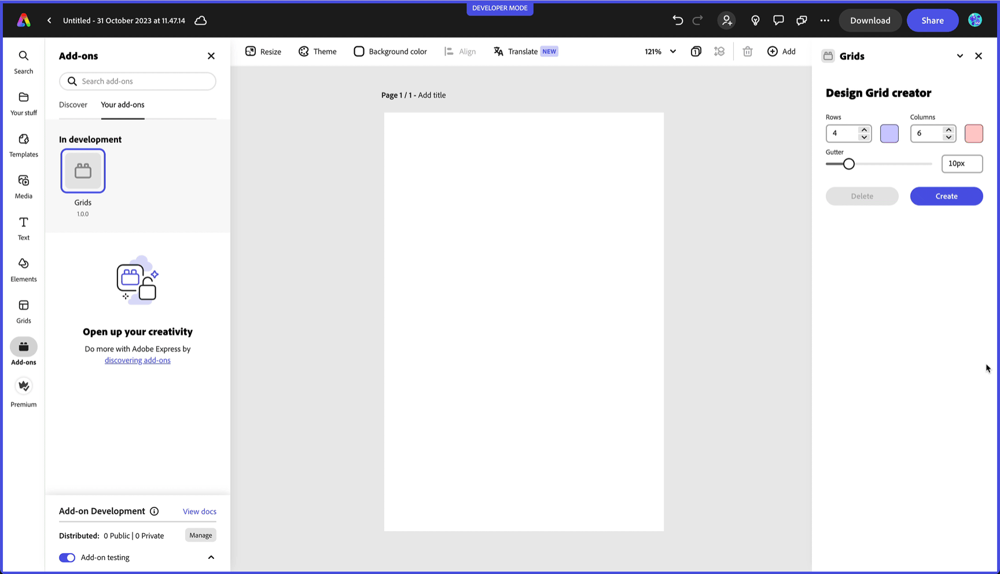

---
keywords:
  - Adobe Express
  - Express Add-on SDK
  - Express Editor
  - Adobe Express
  - Add-on SDK
  - SDK
  - JavaScript
  - Extend
  - Extensibility
  - API
  - Add-on Manifest
title: About our How-to guides
description:
contributors:
  - https://github.com/hollyschinsky
  - https://github.com/undavide
---

# About our How-to guides

The following guides contain a set of common use cases and accompanying code snippets that will help you quickly implement a wide variety of features in your add-ons.

<InlineAlert slots="header, text1" variant="info" />

Code Playground integration is coming soon!

The [Code Playground](../../getting-started/code-playground.md) is the perfect tool to test each how-to snippet. We're currently working on a leaner integration between the Playground and our documentation; running the code will be even easier soon!

We're constantly adding new how-tos, so make sure to check back often. If you're looking for Tutorials that guide you in building add-ons from the ground up, please check the [Complete Projects](#complete-projects) section.

## How-to guides

<!-- - Authentication & Authorization
  - [Use OAuth 2.0](./oauth2.md)
- Data & Environment
  - [Store Data](./local-data-management.md)
  - [Theme & Locale](./theme-locale.md)
- UI & Interaction
  - [Use Drag & Drop](./drag-and-drop.md)
  - [Use Modal Dialogs](./modal-dialogs.md)
- Use Design Elements
  - [Use Text](./use-text.md)
  - [Use Geometry](./use-geometry.md)
  - [Use Color](./use-color.md)
  - [Use Images](./use-images.md)
  - [Use Videos](./use-videos.md)
  - [Use Audio](./use-audio.md)
  - [Use PDF and PowerPoint](./use-pdf-powerpoint.md)
  - [Group Elements](./group-elements.md)
  - [Position Elements](./position-elements.md)
- Use Metadata
  - [Document Metadata](./document-metadata.md)
  - [Page Metadata](./page-metadata.md)
  - [Element Metadata](./element-metadata.md)
- Exporting & Output
  - [Create Renditions](./create-renditions.md)
  - [Manage with Premium Content](./premium-content.md)
- User Info
  - [Identify users](./user-info.md) -->

  

| Topics                         | How-to guides                                       |
| ------------------------------ | --------------------------------------------------- |
| Authentication & Authorization | [Use OAuth 2.0](./oauth2.md)                        |
| Data & Environment             | [Store Data](./local-data-management.md)            |
|                                | [Theme & Locale](./theme-locale.md)                 |
| UI & Interaction               | [Use Drag & Drop](./drag-and-drop.md)               |
|                                | [Use Modal Dialogs](./modal-dialogs.md)             |
| Use Design Elements            | [Use Text](./use-text.md)                           |
|                                | [Use Geometry](./use-geometry.md)                   |
|                                | [Use Color](./use-color.md)                         |
|                                | [Use Images](./use-images.md)                       |
|                                | [Use Videos](./use-videos.md)                       |
|                                | [Use Audio](./use-audio.md)                         |
|                                | [Use PDF and PowerPoint](./use-pdf-powerpoint.md)   |
|                                | [Group Elements](./group-elements.md)               |
|                                | [Position Elements](./position-elements.md)         |
| Use Metadata                   | [Document Metadata](./document-metadata.md)         |
|                                | [Page Metadata](./page-metadata.md)                 |
|                                | [Element Metadata](./element-metadata.md)           |
| Exporting & Output             | [Create Renditions](./create-renditions.md)         |
|                                | [Manage with Premium Content](./premium-content.md) |
| User Info                      | [Identify users](./user-info.md)                    |

## Complete Projects

We've created a set of in-depth tutorials that guide you through the process of building a complete add-on from scratch.

  

| Topics                        | Tutorials                                                                                      |
| ----------------------------- | ---------------------------------------------------------------------------------------------- |
| Document APIs                 | [Design Grid creator](./tutorials/grids-addon.md)                                              |
| Communication APIs            | [Stats Add-on](./tutorials/stats-addon.md)                                                     |
| Adobe Spectrum Web Components | [Basic JavaScript add-on with Spectrum Web Components](./tutorials/spectrum-workshop/index.md) |
| Lit & TypeScript              | [Using Lit & TypeScript](./tutorials/using-lit-typescript.md)                                  |

We recommend you to start with the [Design Grid creator](./tutorials/grids-addon.md), which covers the basics of the add-on SDK and how to use the Document API.

## Other resources

We've also created a collection of [Code Samples](../samples.md) that you can use to get started. You can use the [SDK References](https://developer.adobe.com/express/add-ons/docs/references/addonsdk/) to find all of the objects, methods, properties and events supported for building add-ons.
