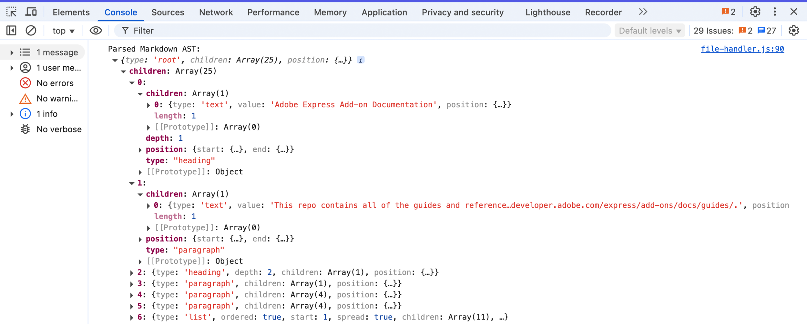

# Create a Markdown Parser Add-on with the Text API

Learn how to build from scratch an Adobe Express add-on capable of parsing Markdown files and converting them into rich text directly within an Adobe Express document.


## Introduction

Welcome to this hands-on tutorial where we'll build a complete Markdown Parser add-on. It will provide a way for your users to import Markdown documents and see them instantly transformed into styled text elements inside Adobe Express, respecting formatting like headings, bold, italics, and lists.

<InlineAlert variant="info" slots="header, text1" />

What's Markdown?

Markdown is a popular lightweight markup language, widely used for formatting textual content quickly and intuitively.

```md
# Markdown sample – heading

For example, this is **bold**, _italic_ and even `monospace` text.
It can do much more!
```

### What you'll learn

- Creating an interactive **drag-and-drop user interface** with **Spectrum Web Components**.
- Integrating **file upload** and parsing mechanisms.
- The power of the **Text API**.
- Applying **fonts** using the Document API.
- Advanced **character styling**: font size and weight.
- Advanced **paragraph styling**: alignment and list styles.

### What you'll build

The add-on will feature a drag-and-drop area for uploading Markdown files and a button to parse the content. It'll read and interpret the Markdown file, and use the Text API to create and insert a Text node with the appropriate Character and Paragraph styles.

### Prerequisites

Before diving into the tutorial, ensure you have:

- An **Adobe account** (use your existing Adobe ID or [create one for free](https://account.adobe.com/)).
- Basic knowledge of **HTML, CSS, and JavaScript**.
- **Node.js** installed (version 18 or newer is recommended).
- A **text editor or IDE** of your choice.
- Experience with Adobe Express add-ons. If you're new or need a refresher, review the [Quickstart Guide](https://developer.adobe.com/express/add-ons/docs/guides/getting-started/quickstart/).

### Difficulty

This tutorial is designed for intermediate developers who are comfortable with JavaScript and the Adobe Express add-on SDK.

## 1. Project Setup

We'll start by setting up the foundational structure for our add-on.

### 1.1 Environment Setup

First, let's get your development environment ready. Download the [Markdown Parser Add-on](https://github.com/AdobeDocs/express-add-on-samples/tree/main/document-sandbox-samples/express-markdown-parser-addon/express-markdown-parser-addon-start) from GitHub.

The `express-markdown-parser-addon-start` folder follows a simple and organized structure:

```txt
.
├── package.json             📦 Project configuration
├── webpack.config.js        🔧 Build configuration
├── src
│   ├── index.html           🌐 UI container
│   ├── ui
│   │   └── index.js         💻 UI logic
│   └── sandbox
│       └── code.js          📝 Document Sandbox API logic
```

We'll add a few files and packages along the way, but this is the starting point, which comes from a slightly adapted [CLI template](../../../getting-started/local-development/dev-tooling.md#templates).

### 1.2 Initial Code

The sample starts with a simple "Hello World" setup to ensure the communication bridge between the UI and the document sandbox is working.

Here is a breakdown of this initial setup:

- The `index.html` file provides the **basic UI**, with a single button wrapped in `<sp-theme>` to match the Adobe Express style.
- In `ui/index.js`, the script waits for the Add-on SDK to be ready (`addOnUISdk.ready`).
- It then creates a `sandboxProxy` by calling `runtime.apiProxy("documentSandbox")`. This proxy is the communication link to the document sandbox.
- An event listener on the button uses this proxy to call the `sayHello` function.
- In `sandbox/code.js`, the `runtime.exposeApi()` method makes the `sayHello` function available to the UI.
- This two-way communication setup is fundamental for add-ons that interact with the document. Clicking the button now proves that our UI and sandbox can communicate successfully and **logs a message** to the console.

<CodeBlock slots="heading, code" repeat="3" languages="index.html, ui/index.js, sandbox/code.js"/>

#### index.html

```html
<!DOCTYPE html>
<html lang="en">
<head>
  <meta charset="UTF-8" />
  <meta name="viewport" content="width=device-width, initial-scale=1.0"/>
  <title>Markdown Parser add-on</title>
  <link rel="stylesheet" href="styles.css"/>
</head>

<body>
  <sp-theme scale="medium" color="light" system="express">
    <h2>Markdown Parser</h2>
    <sp-button id="helloButton">Say Hello</sp-button>
  </sp-theme>
</body>
</html>
```

#### ui/index.js

```javascript
import "@spectrum-web-components/styles/typography.css";
import "@spectrum-web-components/theme/src/themes.js";
import "@spectrum-web-components/theme/theme-light.js";
import "@spectrum-web-components/theme/express/theme-light.js";
import "@spectrum-web-components/theme/express/scale-medium.js";
import "@spectrum-web-components/theme/sp-theme.js";
import "@spectrum-web-components/button/sp-button.js";

import addOnUISdk from "https://express.adobe.com/static/add-on-sdk/sdk.js";

addOnUISdk.ready.then(async () => {
  console.log("addOnUISdk is ready for use.");

  // Get the Authoring Sandbox
  const { runtime } = addOnUISdk.instance;
  const sandboxProxy = await runtime.apiProxy("documentSandbox");

  // Log the message to the console when the button is clicked
  document.getElementById("helloButton").addEventListener("click", () => {
    sandboxProxy.sayHello("from the UI");
  });
});
```

#### sandbox/code.js

```javascript
import addOnSandboxSdk from "add-on-sdk-document-sandbox";
const { runtime } = addOnSandboxSdk.instance;

function start() {
  // APIs to be exposed to the UI runtime
  const sandboxApi = {
    sayHello: (message) => {
      console.log(`Hello ${message}, the sandbox is also running.`);
    },
  };
  runtime.exposeApi(sandboxApi);
}

start();
```


## 2. Build the UI and Handle Files

Now, let's create the actual user interface for our add-on and implement the file handling logic.

### 2.1 Design the UI with Spectrum Web Components

We'll use Spectrum Web Components (SWC) to create a UI that feels native to Adobe Express. Our interface will have a dropzone for files, a button to trigger parsing, and a progress indicator. The project has already imported the Spectrum Theme and Button components, let's add the other ones we need.

```bash
npm install @spectrum-web-components/dropzone \
            @spectrum-web-components/illustrated-message \
            @spectrum-web-components/link \
            @spectrum-web-components/progress-circle
```

Update `src/index.html` with the following markup.

- The core of the UI is the `<sp-dropzone>` component, which creates an intuitive **drag-and-drop area** for files.
- For accessibility, a standard `<input type="file">` is included but hidden with CSS.
- A `<sp-link>` element is used to programmatically trigger the hidden file input, providing an alternative clickable way to handle file uploads.
- The main `<sp-button>` is initially `disabled`. This is a good practice to prevent user actions before the add-on is ready or before a file has been loaded. It will be enabled programmatically.

<CodeBlock slots="heading, code" repeat="2" languages="index.html, styles.css"/>

#### index.html

```html
<!DOCTYPE html>
<html lang="en">
<head>
  <meta charset="UTF-8" />
  <meta name="viewport" content="width=device-width, initial-scale=1.0"/>
  <title>Markdown Parser add-on</title>
  <link rel="stylesheet" href="styles.css"/>
</head>

<body>
  <sp-theme scale="medium" color="light" system="express">
    <h2>Markdown Parser</h2>
    <div class="row">
      <sp-dropzone tabindex="0" id="dropzone" drop-effect="copy">
        <sp-illustrated-message id="message"
          style="--mod-illustrated-message-display: flex;"
          heading="Drag and drop your file">
          <svg xmlns="http://www.w3.org/2000/svg" viewBox="0 0 150 103"
               width="150" height="103">
            <path
              d="M133.7,8.5h-118c-1.9,0-3.5,1.6-3.5,3.5v27c0,0.8,0.7,1.5,1.5,1.5s1.5-0.7,1.5-1.5V23.5h119V92c0,0.3-0.2,0.5-0.5,0.5h-118c-0.3,0-0.5-0.2-0.5-0.5V69c0-0.8-0.7-1.5-1.5-1.5s-1.5,0.7-1.5,1.5v23c0,1.9,1.6,3.5,3.5,3.5h118c1.9,0,3.5-1.6,3.5-3.5V12C137.2,10.1,135.6,8.5,133.7,8.5z M15.2,21.5V12c0-0.3,0.2-0.5,0.5-0.5h118c0.3,0,0.5,0.2,0.5,0.5v9.5H15.2z M32.6,16.5c0,0.6-0.4,1-1,1h-10c-0.6,0-1-0.4-1-1s0.4-1,1-1h10C32.2,15.5,32.6,15.9,32.6,16.5z M13.6,56.1l-8.6,8.5C4.8,65,4.4,65.1,4,65.1c-0.4,0-0.8-0.1-1.1-0.4c-0.6-0.6-0.6-1.5,0-2.1l8.6-8.5l-8.6-8.5c-0.6-0.6-0.6-1.5,0-2.1c0.6-0.6,1.5-0.6,2.1,0l8.6,8.5l8.6-8.5c0.6-0.6,1.5-0.6,2.1,0c0.6,0.6,0.6,1.5,0,2.1L15.8,54l8.6,8.5c0.6,0.6,0.6,1.5,0,2.1c-0.3,0.3-0.7,0.4-1.1,0.4c-0.4,0-0.8-0.1-1.1-0.4L13.6,56.1z">
            </path>
          </svg>
        </sp-illustrated-message>
        <div>
          <label for="file-input">
            <sp-link href="#"
              onclick="document.getElementById('file-input').click()">
              Select a Markdown File
            </sp-link>
            from your computer
          </label>
          <input type="file" id="file-input" style="display: none" />
        </div>
      </sp-dropzone>
    </div>

    <div class="row button-row">
      <sp-button id="parseButton" variant="accent" disabled>
        Parse Markdown
      </sp-button>
      <sp-progress-circle size="s" indeterminate id="progress-circle">
      </sp-progress-circle>
    </div>

    <div class="row info-text">
      <p>
        Parses Markdown and creates styled text in your Adobe Express
        document. Supported formats: Headings, Bold, Italic, and Lists.
      </p>
    </div>
  </sp-theme>
</body>
</html>
```

#### styles.css

```css
body { margin: 0; padding: 0; overflow-x: hidden; }

sp-theme {
  margin: 0 var(--spectrum-global-dimension-static-size-300);
  display: grid;
}

h2 { font-weight: var(--spectrum-global-font-weight-black); }

sp-button { flex: 1; }

sp-dropzone { max-width: 272px; }

sp-progress-circle { margin-left: 10px; }

.row {
  display: flex; flex-direction: row; justify-content: space-between;
  width: 100%; align-items: flex-end;
}

.button-row {
  margin-top: 20px; display: flex; align-items: center;
  justify-content: center;
}

.gap-20 { gap: var(--spectrum-global-dimension-static-size-250); }

.gutter-row {
  display: flex; flex-direction: row; justify-content: flex-end;
  align-items: flex-start; border: 1px solid black; width: 100%;
  margin-bottom: var(--spectrum-global-dimension-static-size-150);
}

.info-text { margin-top: 10px; font-size: 12px; color: #6e6e6e; }
```

### 2.2 Handle File Uploads

To handle file interactions, we'll create a new file called `ui/file-handler.js`. This module will **set up event listeners** on the dropzone and the hidden file input. We'll also touch the `ui/index.js` file to import and pass it the sandbox proxy.

Let's walk through the file handling logic in `ui/file-handler.js`:

- The `setupFileHandler` function **centralizes all UI interaction logic**, and begins by getting references to the necessary DOM elements (dropzone, button, etc.).
- The `handleFile` function is the workhorse here. It first validates that the dropped file is a Markdown file.
- It then uses the browser's standard `FileReader` API to read the file's content asynchronously.
- Once the content is loaded (`reader.onload`), it's stored in a variable, and the "Parse Markdown" button is enabled. The `updateMessage` function is called to update the message to "Got it!"
- Event listeners are set up for both the Spectrum dropzone's custom `sp-dropzone-drop` event and the standard `change` event on the hidden file input, ensuring both upload methods work.

In `ui/index.js`, instead:

- We import all the necessary Spectrum components that we installed earlier.
- The `sandboxProxy` is retrieved from the runtime API and passed to `setupFileHandler()`.

<CodeBlock slots="heading, code" repeat="2" languages="JavaScript, JavaScript"/>

#### ui/index.js

```javascript
import "@spectrum-web-components/styles/typography.css";

import "@spectrum-web-components/theme/src/themes.js";
import "@spectrum-web-components/theme/theme-light.js";
import "@spectrum-web-components/theme/express/theme-light.js";
import "@spectrum-web-components/theme/express/scale-medium.js";
import "@spectrum-web-components/theme/sp-theme.js";

import "@spectrum-web-components/button/sp-button.js";
import "@spectrum-web-components/link/sp-link.js";
import "@spectrum-web-components/illustrated-message/sp-illustrated-message.js";
import "@spectrum-web-components/dropzone/sp-dropzone.js";
import "@spectrum-web-components/progress-circle/sp-progress-circle.js";

import addOnUISdk from "https://express.adobe.com/static/add-on-sdk/sdk.js";
import setupFileHandler from "./file-handler.js";

addOnUISdk.ready.then(async () => {
  console.log("addOnUISdk is ready for use.");

  // Get the Authoring Sandbox
  const { runtime } = addOnUISdk.instance;
  const sandboxProxy = await runtime.apiProxy("documentSandbox");

  // Pass the sandbox proxy to the file handler
  setupFileHandler(sandboxProxy); // 👈
});
```

#### ui/file-handler.js

```javascript
// Sets up file handling functionality for the markdown parser add-on
export default function setupFileHandler(sandboxProxy) {
  customElements.whenDefined("sp-dropzone").then(() => {
    const dropzone = document.getElementById("dropzone");
    const parseButton = document.getElementById("parseButton");
    const message = document.getElementById("message");
    const fileInput = document.getElementById("file-input");
    const progressCircle = document.getElementById("progress-circle");
    let input;
    let beingDraggedOver = false;
    let markdownContent = null;

    // Hide progress initially
    if (progressCircle) { progressCircle.style.display = "none" }

    const isMarkdownFile = (file) => {
      return (
        file.name.toLowerCase().endsWith(".md") ||
        file.type === "text/markdown"
      );
    };

    const updateMessage = () => {
      message.heading =
        input !== undefined
          ? beingDraggedOver
            ? "Drop here to replace!"
            : "Got it!"
          : "Drag and drop your file";
    };

    const handleDropOrChange = (event) => {
      let file;

      // Handle different event sources
      if (event.type === "drop") {
        file = event.dataTransfer.files[0];
      } else if (event.type === "change") {
        file = event.target.files[0];
      } else if (event.detail && event.detail.dropEvent) {
        // Handle sp-dropzone-drop event
        file = event.detail.dropEvent.dataTransfer.files[0];
      }
      if (!file) {
        console.error("No file found in the event"); return;
      }
      if (!isMarkdownFile(file)) {
        message.heading = "Please drop a markdown (.md) file"; return;
      }

      // Set input to a temporary value to show "Got it!" immediately
      input = "loading";
      dropzone.setAttribute("filled", true);
      beingDraggedOver = false;
      updateMessage();

      const reader = new FileReader();
      reader.onload = (e) => {
        const content = e.target.result;
        input = content;
        markdownContent = content;
        console.log("Markdown content:", content);
        // Enable parse button now that we have content
        parseButton.disabled = false;
        // Ensure message is updated after content is loaded
        updateMessage();
      };
      reader.readAsText(file);
    };

    // Function to parse markdown and insert styled text
    // into the document - To be implemented later...
    const parseMarkdownAndInsert = async () => {
      if (!markdownContent) {
        console.error("No markdown content to parse"); return;
      }
      console.log("Parsing will be implemented in the next section.");
      message.heading = "Parsing not implemented yet.";
    };

    // Event listeners
    dropzone.addEventListener("dragover", (event) => {
      event.preventDefault();
      beingDraggedOver = true;
      updateMessage();
    });
    dropzone.addEventListener("dragleave", () => {
      beingDraggedOver = false;
      updateMessage();
    });
    dropzone.addEventListener("drop", (event) => {
      event.preventDefault();
      handleDropOrChange(event);
    });
    // Also listen for the Spectrum Web Component's native event
    dropzone.addEventListener("sp-dropzone-drop", (event) => {
      event.preventDefault();
      handleDropOrChange(event);
    });
    fileInput.addEventListener("change", (event) => {
      handleDropOrChange(event);
    });

    // Parse button click handler
    parseButton.addEventListener("click", parseMarkdownAndInsert);
    // Initially disable parse button until we have content
    parseButton.disabled = true;
  });
}
```


As soon as you drop a Markdown file, the UI will show "Got it!" and the Parse Markdown button will be enabled.


## 3. Parse Markdown

The next step is to take the raw text from the uploaded file and convert it into a structured format that we can work with.

### 3.1 Parse Markdown into an Abstract Syntax Tree (AST)

Parsing involves analyzing a Markdown text as a string and converting it into a data structure called an **Abstract Syntax Tree (AST)**. An AST is a tree representation, where each node denotes a construct occurring in the text.

For example, the Markdown `## Hello` would be parsed into a `heading` node with a `depth` of 2, containing a `text` node with the value "Hello".

We will use two popular libraries for this task:

- [`unified`](https://www.npmjs.com/package/unified): A powerful engine for processing content as structured data (ASTs) with plugins.
- [`remark-parse`](https://www.npmjs.com/package/remark-parse): A `unified` plugin plugin that defines how to take markdown as input and turn it into a syntax tree.
- [`remark-stringify`](https://www.npmjs.com/package/remark-stringify): A `unified` plugin that defines how to take a syntax tree as input and turn it into serialized markdown.
- [`mdast-util-to-string`](https://www.npmjs.com/package/mdast-util-to-string): A tiny utility that gets the textual content of a node.

Let's install them:

```bash
npm install unified \
            remark-parse \
            remark-stringify \
            mdast-util-to-string
```

### 3.2 Implement the Parser

Now, let's create the `ui/markdown-parser.js` file. This module will be responsible for taking Markdown text and returning an AST.

Here's what our parser module does:

- **Parses Markdown into a Data Structure**: At its core, the module takes the raw Markdown text from the uploaded file and uses the `unified` and `remark-parse` libraries to transform it into an Abstract Syntax Tree (AST). An AST is an organized, tree-like representation of the document's structure (headings, lists, bold text, etc.).
- **Creates a Specially Formatted Text String**: It then traverses the AST to generate a single, continuous string of text. This isn't just plain text; the `getFormattedText` function strategically inserts double newlines (`\n\n`) between major elements like paragraphs and headings.
- **Prepares Text for Styling**: This special formatting is key to our strategy. The single string with calculated newlines serves as the canvas upon which we'll apply styles. The newlines ensure that when the text is placed in Adobe Express, paragraphs are correctly separated. We will later use this string to calculate the exact character positions for applying styles like bold, italics, or heading sizes.
- **Exports Key Information**: The main function, `processMarkdown`, bundles up the AST and the formatted text string, making them available to the other parts of our add-on.

<CodeBlock slots="heading, code" repeat="1" languages="JavaScript"/>

#### ui/markdown-parser.js

```javascript
import { unified } from "unified";
import remarkParse from "remark-parse";
import remarkStringify from "remark-stringify";
import { toString } from "mdast-util-to-string";

// Parse markdown content into an abstract syntax tree (AST)
export async function parseMarkdown(markdownContent) {
  try {
    // Create a unified processor with remark-parse
    const processor = unified().use(remarkParse);
    // Parse the markdown content into an AST
    const ast = processor.parse(markdownContent);
    // Run any transformations needed
    const result = await processor.run(ast);
    return result;
  } catch (e) {
    console.error("Error parsing markdown in markdown-parser.js:", e);
    throw e;
  }
}

// Replace multiple consecutive spaces, tabs,
// and newlines with a single space
function cleanText(text) { return text.replace(/\s+/g, " ").trim() }

// Get properly formatted text from the AST
export function getFormattedText(ast) {
  let text = "";

  // Process nodes to create proper paragraph breaks
  const processNode = (node) => {
    if (!node) return "";
    if (node.type === "root") {
      // Process each child node
      node.children.forEach((child, index) => {
        const childText = processNode(child);
        text += childText;
        // Add paragraph breaks between block elements
        if (
          index < node.children.length - 1 &&
          ["paragraph", "heading", "list"].includes(child.type)
        ) {  text += "\n\n" }
      });
      return text;
    }

    // Handle specific node types
    switch (node.type) {
      case "paragraph": return cleanText(toString(node));
      case "heading":   return cleanText(toString(node));
      case "list":
        let listText = "";
        node.children.forEach((item, index) => {
          // const marker = node.ordered ? `${index + 1}. ` : "• ";
          const itemText = cleanText(toString(item));
          // listText += marker + itemText;
          listText += itemText;
          if (index < node.children.length - 1) { listText += "\n" }
        });
        return listText;
      default:
        // For other node types, just return the text
        return cleanText(toString(node));
    }
  };
  return processNode(ast);
}

// Convert AST back to markdown string (for testing/debugging)
export async function astToMarkdown(ast) {
  try {
    const processor = unified().use(remarkStringify);
    const result = processor.stringify(ast);
    return result;
  } catch (e) {
    console.error("Error converting AST to markdown:", e);
    throw e;
  }
}

// Extract plain text from the AST
export function extractTextFromAst(ast) { return toString(ast) }

// Process markdown by parsing to AST + transforming for Adobe Express
export async function processMarkdown(markdownContent) {

  const ast = await parseMarkdown(markdownContent);
  // Extract all headings for potential TOC
  const headings = [];
  const processNode = (node) => {
    if (node.type === "heading") {
      headings.push({
        depth: node.depth, text: toString(node),
        children: node.children
      });
    }
    if (node.children) { node.children.forEach(processNode) }
  }
  processNode(ast);

  // Get both formatted text (with proper paragraphs) and raw text
  const formattedText = getFormattedText(ast);

  return { ast, headings, plainText: formattedText, formattedText }
}
```

### 3.3 Connect the Parser

Now that we have a module capable of turning Markdown text into an Abstract Syntax Tree (AST), let's connect it to our UI. This will serve as a great checkpoint to verify that our file reading and parsing logic are working correctly before we move on to styling.

First, import the `parseMarkdown` function at the top of `src/ui/file-handler.js`; next, update the placeholder `parseMarkdownAndInsert` function with a new logic to call the parser and log the result to the console.

<CodeBlock slots="heading, code" repeat="1" languages="JavaScript"/>

#### ui/file-handler.js

```javascript
import { parseMarkdown } from "./markdown-parser.js";     // 👈

export default function setupFileHandler(sandboxProxy) {
  customElements.whenDefined("sp-dropzone").then(() => {

    // 👆 (keep the rest of the file the same) 👆

    const parseMarkdownAndInsert = async () => {
      if (!markdownContent) {
        console.error("No markdown content to parse");
        return;
      }
      try {
        progressCircle.style.display = "block";
        message.heading = "Processing markdown...";
        parseButton.disabled = true;

        // 1. Parse the markdown to get the AST           // 👈
        const ast = await parseMarkdown(markdownContent); // 👈
        console.log("Parsed Markdown AST:", ast);         // 👈

        message.heading = "AST logged to console!";
      } catch (error) {
        console.error("Error during parsing:", error);
        message.heading = "Error parsing markdown";
      } finally {
        progressCircle.style.display = "none";
        parseButton.disabled = false;
      }
    };

    // 👇 (keep the rest of the file the same) 👇

  });
}
```

Now, when you run the add-on, upload a Markdown file, and click "Parse Markdown", you should see the structured AST object in your browser's developer console. This confirms that the core parsing mechanism is working perfectly.



## 4. Integrate with the Adobe Express Text API

With our Markdown parsed into an AST, the final and most exciting part is to render it as styled text in the Adobe Express document.

### 4.1 Convert the AST into Styled Text for Adobe Express

Our overall strategy is as follows:

1.  **Extract Plain Text**: First, we'll convert the entire AST into a single string of plain text, using our `getFormattedText` function.
2.  **Generate Style Ranges**: We'll traverse the AST again. For each node that requires styling (like a `heading`, `strong`, or `emphasis` node), we'll record its `type` of style and its `start` and `end` position in the plain text string.
3.  **Communicate with Sandbox**: We'll send the plain text and the array of style ranges to our document sandbox.
4.  **Apply Styles in Sandbox**: The sandbox code will create a single `TextNode` with the plain text. Then, it will iterate through the style ranges and apply the corresponding character or paragraph styles using the Text API.

### 4.2 The Formatter: Generating Style Ranges

The new `ui/adobe-express-formatter.js` module is responsible for the second step: traversing the AST and generating style ranges.

This formatter's goal is to **map the AST structure to a list of styling instructions** that Adobe Express can understand.

- The `createExpressStylingFromAST()` function first generates the final, formatted plain text string.
- It then uses a recursive `traverse` function to walk through every node in the AST.
- The key to this process is the `offset` variable, which acts as a cursor, tracking our position within the plain text string.
- For each styleable node (e.g., `heading`, `strong`), we record the `offset` before and after processing its children. This gives us the precise `start` and `end` indices for the style range.
- A crucial detail is handling whitespace. The traversal logic must account for the double line breaks (`\n\n`) we added between block elements to keep the `offset` accurate. This is why the `root` node traversal manually increments the offset.

<CodeBlock slots="heading, code" repeat="1" languages="JavaScript"/>

#### ui/adobe-express-formatter.js

```javascript
import { getFormattedText, extractTextFromAst } from "./markdown-parser.js";

// Creates a mapping of text ranges and their styling commands for Adobe Express
function processNodeForStyling(ast, styleRanges) {
  let offset = 0;

  const traverse = (node) => {
    if (!node) return;

    const startOffset = offset;
    // Helper function to process styled nodes with common pattern
    const processStyledNode = (node, styleType, styleProps = {}) => {
      const rangeStart = offset;
      node.children.forEach(traverse);
      const rangeEnd = offset;

      styleRanges.push({
        start: rangeStart,  end: rangeEnd,
        style: { type: styleType, ...styleProps },
      });
    };

    switch (node.type) {
      case "root":
        node.children.forEach((child, index) => {
          traverse(child);
          if (
            index < node.children.length - 1 &&
            ["paragraph", "heading", "list"].includes(child.type)
          ) {
            offset += 2; // \n\n between blocks
          }
        });
        break;

      case "paragraph":
        node.children.forEach(traverse);
        break;
      case "heading":
        processStyledNode(node, "heading", { level: node.depth });
        break;
      case "text":
        offset += node.value.length;
        break;
      case "emphasis":
        processStyledNode(node, "emphasis", { italic: true });
        break;
      case "strong":
        processStyledNode(node, "strong", { bold: true });
        break;

      // example AST traversal logic for lists:
      case "list":
        const listStart = offset;
        node.children.forEach((item, index) => {
          item.children.forEach(traverse);
          // newline between items
          if (index < node.children.length - 1) offset += 1;
        });
        styleRanges.push({
          start: listStart, end: offset,
          style: { type: "list", ordered: node.ordered },
        });
        break;
      case "inlineCode":
        offset += node.value.length;
        styleRanges.push({
          start: startOffset, end: offset,
          style: { type: "code", isInline: true },
        });
        break;
      default:
        if (node.children) node.children.forEach(traverse);
        break;
    }
  };
  traverse(ast);
}

// Create Adobe Express text styling instructions from a markdown AST
export function createExpressStylingFromAST(ast) {
  // Extract the full text from the AST
  const plainText = getFormattedText(ast);
  const styleRanges = [];
  // Process the AST to generate style ranges
  processNodeForStyling(ast, styleRanges, plainText);
  return { plainText, styleRanges }
}

// Helper function to print out style ranges for debugging
export function debugStyleRanges(text, styleRanges) {
  console.log("---- Style Ranges Debug ----");
  styleRanges.forEach((range, index) => {
    const snippet = text.substring(range.start, range.end);
    console.log(
      `Range ${index}: ${range.start}-${range.end} (${range.style.type})`
    );
    console.log(`Text: "${snippet}"`);
    console.log("Style:", range.style);
    console.log("-----");
  });
}

// Helper function to apply Adobe Express text styling
export async function applyExpressTextStyling(sandboxProxy, text, styleRanges) {
  try {
    // First create a text node with the plain text
    const textNode = await sandboxProxy.createTextNode(text);

    // Then apply styling to the text node
    for (const range of styleRanges) {
      switch (range.style.type) {
        case "heading":
          await sandboxProxy.applyHeadingStyle(
            textNode, range.start, range.end, range.style.level
          );
          break;
        case "emphasis":
          await sandboxProxy.applyTextStyle(
            textNode, range.start, range.end, { italic: true }
          );
          break;
        case "strong":
          await sandboxProxy.applyTextStyle(
            textNode, range.start, range.end, { bold: true }
          );
          break;
        case "link":
          await sandboxProxy.applyLinkStyle(
            textNode, range.start, range.end, range.style.url
          );
          break;
        // You can add cases for other styles here...
      }
    }
    return textNode;
  } catch (error) {
    console.error("Error applying Express text styling:", error);
    throw error;
  }
}
```

### 4.3 The Sandbox: Apply the Styles

Now, let's implement the final piece in `sandbox/code.js`. This script will receive the text and style ranges and use the Text API to perform the magic. We'll also define our styling rules in `sandbox/constants.js` which allows to easily change the visual output (fonts, sizes, spacing) of the parsed Markdown without having to search through the application logic.

This `sandbox/code.js` is where the visual transformation happens. Here are the key points:

- The `createStyledTextFromMarkdown` function receives the plain text and style ranges from the UI.
- It first creates a single `TextNode` with the entire plain text content and adds it to the document.
- **Performance Tip: Font Caching.** The `preloadFonts` function and `fontCache` map are used to load all necessary fonts at once and store them. This avoids making multiple, slow requests for the same font.
- **Safe Asynchronous Edits.** [`editor.queueAsyncEdit()`](../../../../references/document-sandbox/document-apis/classes/Editor.md#queueasyncedit) is essential for making changes to the document _after_ an asynchronous operation (like `preloadFonts`). The Add-on SDK requires that any edits following a pause for an `await` be wrapped in `queueAsyncEdit()`. This ensures that all changes are correctly tracked for the application's save and undo history. While this also has the benefit of batching multiple edits into a single, efficient operation, its primary role here is to guarantee document stability.
- Inside the queue, a base style is applied to the entire text block first. Then, the code iterates through the `styleRanges` array, applying each specific character or paragraph style to the correct portion of the text.

<CodeBlock slots="heading, code" repeat="2" languages="JavaScript"/>

#### sandbox/constants.js

```javascript
export const MD_CONSTANTS = {
  FONTS: {
    HEADING: "SourceSans3-Bold",
    EMPHASIS: "SourceSans3-It",
    STRONG: "SourceSans3-Bold",
    CODE: "AnonymousPro",
    REGULAR: "SourceSans3-Regular",
  },
  HEADING_SIZES: {
    1: 24, 2: 22, 3: 20, 4: 18, 5: 16, 6: 16, DEFAULT: 16
  },
  LAYOUT: {
    MARGIN: 20,
    DEFAULT_FONT_SIZE: 16,
    LINE_SPACING: 1.5,
    PARAGRAPH_SPACE_AFTER: 8,
  },
  DEBUG: false,
};
```

#### sandbox/code.js

```javascript
import addOnSandboxSdk from "add-on-sdk-document-sandbox";
import { editor, fonts, constants } from "express-document-sdk";
import { MD_CONSTANTS } from "./constants.js";

const { runtime } = addOnSandboxSdk.instance;
const DEBUG_STYLES = MD_CONSTANTS.DEBUG;

// Returns the font size for a specific markdown heading level
function getFontSizeForHeadingLevel(level) {
  return (
    MD_CONSTANTS.HEADING_SIZES[level] ||
    MD_CONSTANTS.HEADING_SIZES.DEFAULT
  );
}

// Initializes the document sandbox functionality
function start() {
  // Cache loaded fonts to avoid reloading them
  const fontCache = new Map();

  // Preloads and caches fonts by their postscript names
  async function preloadFonts(postscriptNames) {
    await Promise.all(
      postscriptNames.map(async (psName) => {
        const font = await fonts.fromPostscriptName(psName);
        if (font) { fontCache.set(psName, font) }
        else { console.warn(`Font ${psName} couldn't be loaded.`) }
      })
    );
  }

  // APIs to be exposed to the UI runtime
  const docApi = {
    // Creates a text node in the current document
    createTextNode: (text) => {
      try {
        // Find the current page
        let currentNode = editor.context.insertionParent;
        let page = null;
        while (currentNode) {
          if (currentNode.type === "Page") {
            page = currentNode; break;
          }
          currentNode = currentNode.parent;
        }

        // Create a new text node
        const textNode = editor.createText(text);
        console.log("textNode created", text);

        // Set the text content
        textNode.textAlignment = constants.TextAlignment.left;
        const artboard = page.artboards.first;
        textNode.layout = {
          type: constants.TextLayout.autoHeight,
          width: artboard.width - MD_CONSTANTS.LAYOUT.MARGIN_WIDTH,
        };
        console.log("textNode layout", textNode.layout);

        // Position the text at the top-left corner and fill the page width
        textNode.setPositionInParent(
          { x: MD_CONSTANTS.LAYOUT.MARGIN, y: MD_CONSTANTS.LAYOUT.MARGIN },
          { x: 0, y: 0 }
        );

        console.log("textNode setPositionInParent");

        // Apply default character styles
        textNode.fullContent.applyCharacterStyles({
          fontSize: MD_CONSTANTS.LAYOUT.DEFAULT_FONT_SIZE,
        });
        console.log("textNode applyCharacterStyles");

        // Add to document
        artboard.children.append(textNode);
        console.log("textNode added to the artboard", textNode);
        return textNode;

      } catch (error) {
        console.error("Error creating text node:", error);
        throw error;
      }
    },

    // Creates a styled text node from markdown content
    createStyledTextFromMarkdown: async (markdownText, styleRanges) => {
      try {
        // Create text node first (this is allowed synchronously)
        const textNode = docApi.createTextNode(markdownText);

        // Preload fonts we'll need for styling
        await preloadFonts([
          MD_STYLES.FONTS.HEADING, MD_STYLES.FONTS.EMPHASIS,
          MD_STYLES.FONTS.REGULAR, MD_STYLES.FONTS.CODE,
        ]);

        // Get cached fonts
        const headingFont = fontCache.get(MD_STYLES.FONTS.HEADING);
        const italicFont = fontCache.get(MD_STYLES.FONTS.EMPHASIS);
        const boldFont = fontCache.get(MD_STYLES.FONTS.STRONG);
        const monospaceFont = fontCache.get(MD_STYLES.FONTS.CODE);

        // Now queue all style edits together for better performance
        await editor.queueAsyncEdit(async () => {
          for (const range of styleRanges) {
            if (DEBUG_STYLES) {
              console.log(`Applying ${range.style.type} style:`, range);
            }
            // Apply different styles based on the type
            if (range.style.type === "list") {
              docApi.applyListStyle(
                textNode, range.start, range.end, range.style.ordered
              );
            } else if (range.style.type === "heading") {
              if (DEBUG_STYLES) {
                console.log(
                  "Applying heading style for level:", range.style.level
                );
              }
              // Apply heading styles
              textNode.fullContent.applyCharacterStyles(
                {
                  font: headingFont,
                  fontSize: getFontSizeForHeadingLevel(range.style.level),
                },
                { start: range.start, length: range.end - range.start }
              );
              if (DEBUG_STYLES) {
                console.log("Applied heading style:", range.style.level);
              }
            } else if (range.style.type === "emphasis") {
              if (DEBUG_STYLES) {
                console.log("Applying emphasis style");
              }
              // Apply italic style
              textNode.fullContent.applyCharacterStyles(
                { font: italicFont },
                { start: range.start, length: range.end - range.start }
              );
              if (DEBUG_STYLES) {
                console.log("Applied emphasis style");
              }
            } else if (range.style.type === "strong") {
              if (DEBUG_STYLES) {
                console.log("Applying strong style");
              }
              // Apply bold style
              textNode.fullContent.applyCharacterStyles(
                { font: boldFont },
                { start: range.start, length: range.end - range.start }
              );
              if (DEBUG_STYLES) {
                console.log("Applied strong style");
              }
            } else if (range.style.type === "code") {
              if (DEBUG_STYLES) {
                console.log("Applying code style");
              }
              // Apply monospace font for code
              textNode.fullContent.applyCharacterStyles(
                { font: monospaceFont },
                { start: range.start, length: range.end - range.start }
              );
              if (DEBUG_STYLES) {
                console.log("Applied code style");
              }
            }
            // Add any additional styles here...
          }
          console.log("All styles applied");
        });
      } catch (error) {
        console.error("Error creating styled text from markdown:", error);
        throw error;
      }
    },

    // Applies ordered or unordered list styles to a text range
    applyListStyle: (textNode, start, end, ordered) => {
      try {
        const listType = ordered
          ? constants.ParagraphListType.ordered
          : constants.ParagraphListType.unordered;

        textNode.fullContent.applyParagraphStyles(
          {
            list: {
              type: listType,
              numbering: ordered
                ? constants.OrderedListNumbering.numeric
                : undefined,
              prefix: ordered
                ? MD_STYLES.LIST.ORDERED_PREFIX
                : MD_STYLES.LIST.UNORDERED_PREFIX,
              postfix: ordered
                ? MD_STYLES.LIST.ORDERED_POSTFIX
                : MD_STYLES.LIST.UNORDERED_POSTFIX,
              indentLevel: MD_STYLES.LIST.DEFAULT_INDENT,
            },
            spaceBefore: MD_STYLES.LAYOUT.PARAGRAPH_SPACE_BEFORE,
            spaceAfter: MD_STYLES.LAYOUT.PARAGRAPH_SPACE_AFTER,
            lineSpacing: MD_STYLES.LAYOUT.LINE_SPACING,
          },
          { start, length: end - start }
        );
      } catch (error) {
        console.error("Error applying list style:", error);
        throw error;
      }
    },
  };
  runtime.exposeApi(docApi);
}
start();
```

### 4.4 Put it all together

We have all the pieces in place: the file handler, the parser, the formatter, and the sandbox styler. Now let's connect them all.

First, add the necessary imports to the top of `src/ui/file-handler.js`. Then, update the `parseMarkdownAndInsert` function for the final time. This version will no longer just log the AST, but will call the formatter and the sandbox to render the styled text in the document.

This final change **connects all the pieces** of our application:

- The `parseMarkdownAndInsert` function now implements our complete workflow:
  1.  It calls the `parseMarkdown()` function to get the AST.
  2.  It passes the AST to `createExpressStylingFromAST()` to get the plain text and the list of style ranges.
  3.  It sends this data to the document sandbox using `sandboxProxy.createStyledTextFromMarkdown()`.
- The use of a `DEBUG` flag from our constants file is a convenient way to toggle console logging for the intermediate `plainText` and `styleRanges`, which is very helpful during development.

<CodeBlock slots="heading, code" repeat="1" languages="JavaScript"/>

#### ui/file-handler.js

```javascript
import { parseMarkdown } from "./markdown-parser.js";
import {                                                  // 👈
  createExpressStylingFromAST                             // 👈
} from "./adobe-express-formatter.js";                    // 👈

export default function setupFileHandler(sandboxProxy) {
  customElements.whenDefined("sp-dropzone").then(() => {

    // 👆 (keep the rest of the file the same) 👆

    const parseMarkdownAndInsert = async () => {
      if (!markdownContent) {
        console.error("No markdown content to parse");
        return;
      }

      try {
        progressCircle.style.display = "block";
        message.heading = "Processing markdown...";
        parseButton.disabled = true;

        // 1. Parse the markdown to get the AST
        const ast = await parseMarkdown(markdownContent);

        // 2. Create styling instructions from the AST     // 👈
        const { plainText, styleRanges } =                 // 👈
          createExpressStylingFromAST(ast);                // 👈

        // 3. Send the text and styles to the sandbox      // 👈
        message.heading = "Adding text to document...";    // 👈
        await sandboxProxy.createStyledTextFromMarkdown(   // 👈
          plainText, styleRanges                           // 👈
        );                                                 // 👈

        message.heading = "Markdown successfully added!";
      } catch (error) {
        console.error("Error during parsing and styling:", error);
        message.heading = "An error occurred";
      } finally {
        progressCircle.style.display = "none";
        parseButton.disabled = false;
      }
    };

    // 👇 (keep the rest of the file the same) 👇

  });
}
```


## 5. Conclusion

Congratulations! You have successfully built a functional Markdown Parser add-on for Adobe Express. You've learned how to:

- Structure a complex add-on project.
- Build a user-friendly UI with Spectrum Web Components for file handling.
- Use `unified` and `remark` to parse Markdown into an Abstract Syntax Tree.
- Develop a strategy to translate an AST into styling information.
- Leverage the powerful Adobe Express Text API to apply character and paragraph styles, manage fonts, and create rich text content programmatically.

This project serves as a strong foundation. You can extend it by supporting more Markdown features like tables, blockquotes, or even custom styling options for your users. Happy coding!

### 5.1 Final code

You can find the final code for this tutorial in the [GitHub add-on samples repository](https://github.com/AdobeDocs/express-add-on-samples/tree/main/document-sandbox-samples/express-markdown-parser-addon/); there are two folders:

- `markdown-parser-add-on-start` is the starting point for the tutorial as described [here](#12-initial-code).
- `markdown-parser-add-on-end` is the final code for the add-on.

<CodeBlock slots="heading, code" repeat="8" languages="index.html, styles.css, index.js, file-handler.js, markdown-parser.js, adobe-express-formatter.js, code.js, constants.js" />

#### iframe

```html
<!-- index.html -->

 <!DOCTYPE html>
<html lang="en">
<head>
  <meta charset="UTF-8" />
  <meta name="viewport" content="width=device-width, initial-scale=1.0"/>
  <title>Markdown Parser add-on</title>
  <link rel="stylesheet" href="styles.css"/>
</head>

<body>
  <sp-theme scale="medium" color="light" system="express">
    <h2>Markdown Parser</h2>
    <div class="row">
      <sp-dropzone tabindex="0" id="dropzone" drop-effect="copy">
        <sp-illustrated-message id="message"
          style="--mod-illustrated-message-display: flex;"
          heading="Drag and drop your file">
          <svg xmlns="http://www.w3.org/2000/svg" viewBox="0 0 150 103"
               width="150" height="103">
            <path
              d="M133.7,8.5h-118c-1.9,0-3.5,1.6-3.5,3.5v27c0,0.8,0.7,1.5,1.5,1.5s1.5-0.7,1.5-1.5V23.5h119V92c0,0.3-0.2,0.5-0.5,0.5h-118c-0.3,0-0.5-0.2-0.5-0.5V69c0-0.8-0.7-1.5-1.5-1.5s-1.5,0.7-1.5,1.5v23c0,1.9,1.6,3.5,3.5,3.5h118c1.9,0,3.5-1.6,3.5-3.5V12C137.2,10.1,135.6,8.5,133.7,8.5z M15.2,21.5V12c0-0.3,0.2-0.5,0.5-0.5h118c0.3,0,0.5,0.2,0.5,0.5v9.5H15.2z M32.6,16.5c0,0.6-0.4,1-1,1h-10c-0.6,0-1-0.4-1-1s0.4-1,1-1h10C32.2,15.5,32.6,15.9,32.6,16.5z M13.6,56.1l-8.6,8.5C4.8,65,4.4,65.1,4,65.1c-0.4,0-0.8-0.1-1.1-0.4c-0.6-0.6-0.6-1.5,0-2.1l8.6-8.5l-8.6-8.5c-0.6-0.6-0.6-1.5,0-2.1c0.6-0.6,1.5-0.6,2.1,0l8.6,8.5l8.6-8.5c0.6-0.6,1.5-0.6,2.1,0c0.6,0.6,0.6,1.5,0,2.1L15.8,54l8.6,8.5c0.6,0.6,0.6,1.5,0,2.1c-0.3,0.3-0.7,0.4-1.1,0.4c-0.4,0-0.8-0.1-1.1-0.4L13.6,56.1z">
            </path>
          </svg>
        </sp-illustrated-message>
        <div>
          <label for="file-input">
            <sp-link href="#"
              onclick="document.getElementById('file-input').click()">
              Select a Markdown File
            </sp-link>
            from your computer
          </label>
          <input type="file" id="file-input" style="display: none" />
        </div>
      </sp-dropzone>
    </div>

    <div class="row button-row">
      <sp-button id="parseButton" variant="accent" disabled>
        Parse Markdown
      </sp-button>
      <sp-progress-circle size="s" indeterminate id="progress-circle">
      </sp-progress-circle>
    </div>

    <div class="row info-text">
      <p>
        Parses Markdown and creates styled text in your Adobe Express
        document. Supported formats: Headings, Bold, Italic, and Lists.
      </p>
    </div>
  </sp-theme>
</body>
</html>
```

#### iframe

```css
/* styles.css */
body { margin: 0; padding: 0; overflow-x: hidden; }

sp-theme {
  margin: 0 var(--spectrum-global-dimension-static-size-300);
  display: grid;
}

h2 { font-weight: var(--spectrum-global-font-weight-black); }

sp-button { flex: 1; }

sp-dropzone { max-width: 272px; }

sp-progress-circle { margin-left: 10px; }

.row {
  display: flex; flex-direction: row; justify-content: space-between;
  width: 100%; align-items: flex-end;
}

.button-row {
  margin-top: 20px; display: flex; align-items: center;
  justify-content: center;
}

.gap-20 { gap: var(--spectrum-global-dimension-static-size-250); }

.gutter-row {
  display: flex; flex-direction: row; justify-content: flex-end;
  align-items: flex-start; border: 1px solid black; width: 100%;
  margin-bottom: var(--spectrum-global-dimension-static-size-150);
}

.info-text { margin-top: 10px; font-size: 12px; color: #6e6e6e; }
```

#### iframe

```javascript
// ui/index.js

import "@spectrum-web-components/styles/typography.css";

import "@spectrum-web-components/theme/src/themes.js";
import "@spectrum-web-components/theme/theme-light.js";
import "@spectrum-web-components/theme/express/theme-light.js";
import "@spectrum-web-components/theme/express/scale-medium.js";
import "@spectrum-web-components/theme/sp-theme.js";

import "@spectrum-web-components/button/sp-button.js";
import "@spectrum-web-components/link/sp-link.js";
import "@spectrum-web-components/illustrated-message/sp-illustrated-message.js";
import "@spectrum-web-components/dropzone/sp-dropzone.js";
import "@spectrum-web-components/progress-circle/sp-progress-circle.js";

import addOnUISdk from "https://express.adobe.com/static/add-on-sdk/sdk.js";
import setupFileHandler from "./file-handler.js";

addOnUISdk.ready.then(async () => {
  console.log("addOnUISdk is ready for use.");

  // Get the Authoring Sandbox
  const { runtime } = addOnUISdk.instance;
  const sandboxProxy = await runtime.apiProxy("documentSandbox");
  setupFileHandler(sandboxProxy);
});
```

#### iframe

```javascript
// ui/file-handler.js

import { parseMarkdown } from "./markdown-parser.js"; // Already there
import { createExpressStylingFromAST } from "./adobe-express-formatter.js";

export default function setupFileHandler(sandboxProxy) {
  customElements.whenDefined("sp-dropzone").then(() => {
    const dropzone = document.getElementById("dropzone");
    const parseButton = document.getElementById("parseButton");
    const message = document.getElementById("message");
    const fileInput = document.getElementById("file-input");
    const progressCircle = document.getElementById("progress-circle");
    let input;
    let beingDraggedOver = false;
    let markdownContent = null;

    // Hide progress initially
    if (progressCircle) { progressCircle.style.display = "none" }

    const isMarkdownFile = (file) => {
      return (
        file.name.toLowerCase().endsWith(".md") ||
        file.type === "text/markdown"
      );
    };

    const updateMessage = () => {
      message.heading =
        input !== undefined
          ? beingDraggedOver
            ? "Drop here to replace!"
            : "Got it!"
          : "Drag and drop your file";
    };

    const handleDropOrChange = (event) => {
      let file;

      // Handle different event sources
      if (event.type === "drop") {
        file = event.dataTransfer.files[0];
      } else if (event.type === "change") {
        file = event.target.files[0];
      } else if (event.detail && event.detail.dropEvent) {
        // Handle sp-dropzone-drop event
        file = event.detail.dropEvent.dataTransfer.files[0];
      }
      if (!file) {
        console.error("No file found in the event"); return;
      }
      if (!isMarkdownFile(file)) {
        message.heading = "Please drop a markdown (.md) file"; return;
      }

      // Set input to a temporary value to show "Got it!" immediately
      input = "loading";
      dropzone.setAttribute("filled", true);
      beingDraggedOver = false;
      updateMessage();

      const reader = new FileReader();
      reader.onload = (e) => {
        const content = e.target.result;
        input = content;
        markdownContent = content;
        console.log("Markdown content:", content);
        // Enable parse button now that we have content
        parseButton.disabled = false;
        // Ensure message is updated after content is loaded
        updateMessage();
      };
      reader.readAsText(file);
    };

    const parseMarkdownAndInsert = async () => {
      if (!markdownContent) {
        console.error("No markdown content to parse");
        return;
      }

      try {
        progressCircle.style.display = "block";
        message.heading = "Processing markdown...";
        parseButton.disabled = true;

        // 1. Parse the markdown to get the AST
        const ast = await parseMarkdown(markdownContent);

        // 2. Create styling instructions from the AST
        const {
          plainText, styleRanges
        } = createExpressStylingFromAST(ast);
        // 3. Send the text and styles to the sandbox
        message.heading = "Adding text to document...";
        await sandboxProxy.createStyledTextFromMarkdown(
          plainText, styleRanges
        );

        message.heading = "Markdown successfully added!";
      } catch (error) {
        console.error("Error during parsing and styling:", error);
        message.heading = "An error occurred";
      } finally {
        progressCircle.style.display = "none";
        parseButton.disabled = false;
      }
    };

    // Event listeners
    dropzone.addEventListener("dragover", (event) => {
      event.preventDefault();
      beingDraggedOver = true;
      updateMessage();
    });
    dropzone.addEventListener("dragleave", () => {
      beingDraggedOver = false;
      updateMessage();
    });
    dropzone.addEventListener("drop", (event) => {
      event.preventDefault();
      handleDropOrChange(event);
    });
    // Also listen for the Spectrum Web Component's native event
    dropzone.addEventListener("sp-dropzone-drop", (event) => {
      event.preventDefault();
      handleDropOrChange(event);
    });
    fileInput.addEventListener("change", (event) => {
      handleDropOrChange(event);
    });

    // Parse button click handler
    parseButton.addEventListener("click", parseMarkdownAndInsert);
    // Initially disable parse button until we have content
    parseButton.disabled = true;
  });
}
```

#### iframe

```javascript
// ui/markdown-parser.js

import { unified } from "unified";
import remarkParse from "remark-parse";
import remarkStringify from "remark-stringify";
import { toString } from "mdast-util-to-string";

// Parse markdown content into an abstract syntax tree (AST)
export async function parseMarkdown(markdownContent) {
  try {
    // Create a unified processor with remark-parse
    const processor = unified().use(remarkParse);
    // Parse the markdown content into an AST
    const ast = processor.parse(markdownContent);
    // Run any transformations needed
    const result = await processor.run(ast);
    return result;
  } catch (e) {
    console.error("Error parsing markdown in markdown-parser.js:", e);
    throw e;
  }
}

// Replace multiple consecutive spaces, tabs,
// and newlines with a single space
function cleanText(text) { return text.replace(/\s+/g, " ").trim() }

// Get properly formatted text from the AST
export function getFormattedText(ast) {
  let text = "";

  // Process nodes to create proper paragraph breaks
  const processNode = (node) => {
    if (!node) return "";
    if (node.type === "root") {
      // Process each child node
      node.children.forEach((child, index) => {
        const childText = processNode(child);
        text += childText;
        // Add paragraph breaks between block elements
        if (
          index < node.children.length - 1 &&
          ["paragraph", "heading", "list"].includes(child.type)
        ) {  text += "\n\n" }
      });
      return text;
    }

    // Handle specific node types
    switch (node.type) {
      case "paragraph": return cleanText(toString(node));
      case "heading":   return cleanText(toString(node));
      case "list":
        let listText = "";
        node.children.forEach((item, index) => {
          // const marker = node.ordered ? `${index + 1}. ` : "• ";
          const itemText = cleanText(toString(item));
          // listText += marker + itemText;
          listText += itemText;
          if (index < node.children.length - 1) { listText += "\n" }
        });
        return listText;
      default:
        // For other node types, just return the text
        return cleanText(toString(node));
    }
  };
  return processNode(ast);
}

// Convert AST back to markdown string (for testing/debugging)
export async function astToMarkdown(ast) {
  try {
    const processor = unified().use(remarkStringify);
    const result = processor.stringify(ast);
    return result;
  } catch (e) {
    console.error("Error converting AST to markdown:", e);
    throw e;
  }
}

// Extract plain text from the AST
export function extractTextFromAst(ast) { return toString(ast) }

// Process markdown by parsing to AST + transforming for Adobe Express
export async function processMarkdown(markdownContent) {

  const ast = await parseMarkdown(markdownContent);
  // Extract all headings for potential TOC
  const headings = [];
  const processNode = (node) => {
    if (node.type === "heading") {
      headings.push({
        depth: node.depth, text: toString(node),
        children: node.children
      });
    }
    if (node.children) { node.children.forEach(processNode) }
  }
  processNode(ast);

  // Get both formatted text (with proper paragraphs) and raw text
  const formattedText = getFormattedText(ast);

  return { ast, headings, plainText: formattedText, formattedText }
}
```

#### iframe

```javascript
// ui/adobe-express-formatter.js

import { getFormattedText, extractTextFromAst } from "./markdown-parser.js";

// Creates a mapping of text ranges and their styling commands for Adobe Express
function processNodeForStyling(ast, styleRanges) {
  let offset = 0;

  const traverse = (node) => {
    if (!node) return;

    const startOffset = offset;
    // Helper function to process styled nodes with common pattern
    const processStyledNode = (node, styleType, styleProps = {}) => {
      const rangeStart = offset;
      node.children.forEach(traverse);
      const rangeEnd = offset;

      styleRanges.push({
        start: rangeStart,
        end: rangeEnd,
        style: { type: styleType, ...styleProps },
      });
    };

    switch (node.type) {
      case "root":
        node.children.forEach((child, index) => {
          traverse(child);
          if (
            index < node.children.length - 1 &&
            ["paragraph", "heading", "list"].includes(child.type)
          ) {
            offset += 2; // \n\n between blocks
          }
        });
        break;

      case "paragraph":
        node.children.forEach(traverse);
        break;

      case "heading":
        processStyledNode(node, "heading", { level: node.depth });
        break;

      case "text":
        offset += node.value.length;
        break;

      case "emphasis":
        processStyledNode(node, "emphasis", { italic: true });
        break;

      case "strong":
        processStyledNode(node, "strong", { bold: true });
        break;

      // example AST traversal logic for lists:
      case "list":
        const listStart = offset;
        node.children.forEach((item, index) => {
          item.children.forEach(traverse);
          if (index < node.children.length - 1) offset += 1; // newline between items
        });

        styleRanges.push({
          start: listStart,
          end: offset,
          style: { type: "list", ordered: node.ordered },
        });
        break;

      case "inlineCode":
        offset += node.value.length;
        styleRanges.push({
          start: startOffset,
          end: offset,
          style: { type: "code", isInline: true },
        });
        break;

      default:
        if (node.children) node.children.forEach(traverse);
        break;
    }
  };
  traverse(ast);
}

// Create Adobe Express text styling instructions from a markdown AST
export function createExpressStylingFromAST(ast) {
  // Extract the full text from the AST
  const plainText = getFormattedText(ast);
  const styleRanges = [];

  // Process the AST to generate style ranges
  processNodeForStyling(ast, styleRanges, plainText);

  return { plainText, styleRanges };
}

// Helper function to print out style ranges for debugging
export function debugStyleRanges(text, styleRanges) {
  console.log("---- Style Ranges Debug ----");
  styleRanges.forEach((range, index) => {
    const snippet = text.substring(range.start, range.end);
    console.log(
      `Range ${index}: ${range.start}-${range.end} (${range.style.type})`
    );
    console.log(`Text: "${snippet}"`);
    console.log("Style:", range.style);
    console.log("-----");
  });
}

// Helper function to apply Adobe Express text styling
export async function applyExpressTextStyling(sandboxProxy, text, styleRanges) {
  try {
    // First create a text node with the plain text
    const textNode = await sandboxProxy.createTextNode(text);

    // Then apply styling to the text node
    for (const range of styleRanges) {
      switch (range.style.type) {
        case "heading":
          await sandboxProxy.applyHeadingStyle(
            textNode,
            range.start,
            range.end,
            range.style.level
          );
          break;

        case "emphasis":
          await sandboxProxy.applyTextStyle(textNode, range.start, range.end, {
            italic: true,
          });
          break;

        case "strong":
          await sandboxProxy.applyTextStyle(textNode, range.start, range.end, {
            bold: true,
          });
          break;

        case "link":
          await sandboxProxy.applyLinkStyle(
            textNode,
            range.start,
            range.end,
            range.style.url
          );
          break;

        // You can add cases for other styles here...
      }
    }
    return textNode;
  } catch (error) {
    console.error("Error applying Express text styling:", error);
    throw error;
  }
}
```

#### Document API

```javascript
// sandbox/code.js

import addOnSandboxSdk from "add-on-sdk-document-sandbox";
import { editor, fonts, constants } from "express-document-sdk";
import { MD_CONSTANTS } from "./constants.js";

const { runtime } = addOnSandboxSdk.instance;
const DEBUG_STYLES = MD_CONSTANTS.DEBUG;

// Returns the font size for a specific markdown heading level
function getFontSizeForHeadingLevel(level) {
  return (
    MD_CONSTANTS.HEADING_SIZES[level] || MD_CONSTANTS.HEADING_SIZES.DEFAULT
  );
}

// Initializes the document sandbox functionality
function start() {
  // Cache loaded fonts to avoid reloading them
  const fontCache = new Map();

  // Preloads and caches fonts by their postscript names
  async function preloadFonts(postscriptNames) {
    await Promise.all(
      postscriptNames.map(async (psName) => {
        const font = await fonts.fromPostscriptName(psName);
        if (font) {
          fontCache.set(psName, font);
        } else {
          console.warn(`Font ${psName} couldn't be loaded.`);
        }
      })
    );
  }

  // APIs to be exposed to the UI runtime
  const docApi = {
    // Creates a text node in the current document
    createTextNode: (text) => {
      try {
        // Find the current page
        let currentNode = editor.context.insertionParent;
        let page = null;
        while (currentNode) {
          if (currentNode.type === "Page") {
            page = currentNode;
            break;
          }
          currentNode = currentNode.parent;
        }

        // Create a new text node
        const textNode = editor.createText(text);
        console.log("textNode created", text);

        // Set the text content
        textNode.textAlignment = constants.TextAlignment.left;
        const artboard = page.artboards.first;
        console.log(
          "constants.TextLayout.autoHeight",
          constants.TextLayout.autoHeight
        );
        textNode.layout = {
          type: constants.TextLayout.autoHeight,
          width: artboard.width - MD_CONSTANTS.LAYOUT.MARGIN_WIDTH,
        };
        console.log("textNode layout", textNode.layout);

        // Position the text at the top-left corner and fill the page width
        textNode.setPositionInParent(
          { x: MD_CONSTANTS.LAYOUT.MARGIN, y: MD_CONSTANTS.LAYOUT.MARGIN },
          { x: 0, y: 0 }
        );

        console.log("textNode setPositionInParent");

        // Apply default character styles
        textNode.fullContent.applyCharacterStyles({
          fontSize: MD_CONSTANTS.LAYOUT.DEFAULT_FONT_SIZE,
        });
        console.log("textNode applyCharacterStyles");

        // Add to document
        artboard.children.append(textNode);
        console.log("textNode added to the artboard", textNode);
        return textNode;
      } catch (error) {
        console.error("Error creating text node:", error);
        throw error;
      }
    },

    // Creates a styled text node from markdown content
    createStyledTextFromMarkdown: async (markdownText, styleRanges) => {
      try {
        // Create text node first (this is allowed synchronously)
        const textNode = docApi.createTextNode(markdownText);

        // Preload fonts we'll need for styling
        await preloadFonts([
          MD_CONSTANTS.FONTS.HEADING,
          MD_CONSTANTS.FONTS.EMPHASIS,
          MD_CONSTANTS.FONTS.REGULAR,
          MD_CONSTANTS.FONTS.CODE,
        ]);

        // Get cached fonts
        const headingFont = fontCache.get(MD_CONSTANTS.FONTS.HEADING);
        const italicFont = fontCache.get(MD_CONSTANTS.FONTS.EMPHASIS);
        const boldFont = fontCache.get(MD_CONSTANTS.FONTS.STRONG);
        const monospaceFont = fontCache.get(MD_CONSTANTS.FONTS.CODE);

        // Now queue all style edits together for better performance
        await editor.queueAsyncEdit(async () => {
          for (const range of styleRanges) {
            if (DEBUG_STYLES) {
              console.log(`Applying ${range.style.type} style:`, range);
            }
            // Apply different styles based on the type
            if (range.style.type === "list") {
              docApi.applyListStyle(
                textNode,
                range.start,
                range.end,
                range.style.ordered
              );
            } else if (range.style.type === "heading") {
              if (DEBUG_STYLES) {
                console.log(
                  "Applying heading style for level:",
                  range.style.level
                );
              }
              // Apply heading styles
              textNode.fullContent.applyCharacterStyles(
                {
                  font: headingFont,
                  fontSize: getFontSizeForHeadingLevel(range.style.level),
                },
                { start: range.start, length: range.end - range.start }
              );
              if (DEBUG_STYLES) {
                console.log("Applied heading style:", range.style.level);
              }
            } else if (range.style.type === "emphasis") {
              if (DEBUG_STYLES) {
                console.log("Applying emphasis style");
              }
              // Apply italic style
              textNode.fullContent.applyCharacterStyles(
                { font: italicFont },
                { start: range.start, length: range.end - range.start }
              );
              if (DEBUG_STYLES) {
                console.log("Applied emphasis style");
              }
            } else if (range.style.type === "strong") {
              if (DEBUG_STYLES) {
                console.log("Applying strong style");
              }
              // Apply bold style
              textNode.fullContent.applyCharacterStyles(
                { font: boldFont },
                { start: range.start, length: range.end - range.start }
              );
              if (DEBUG_STYLES) {
                console.log("Applied strong style");
              }
            } else if (range.style.type === "code") {
              if (DEBUG_STYLES) {
                console.log("Applying code style");
              }
              // Apply monospace font for code
              textNode.fullContent.applyCharacterStyles(
                { font: monospaceFont },
                { start: range.start, length: range.end - range.start }
              );
              if (DEBUG_STYLES) {
                console.log("Applied code style");
              }
            }
            // Add any additional styles here...
          }
          console.log("All styles applied");
        });
      } catch (error) {
        console.error("Error creating styled text from markdown:", error);
        throw error;
      }
    },

    // Applies ordered or unordered list styles to a text range
    applyListStyle: (textNode, start, end, ordered) => {
      try {
        const listType = ordered
          ? constants.ParagraphListType.ordered
          : constants.ParagraphListType.unordered;

        textNode.fullContent.applyParagraphStyles(
          {
            list: {
              type: listType,
              numbering: ordered
                ? constants.OrderedListNumbering.numeric
                : undefined,
              prefix: ordered
                ? MD_CONSTANTS.LIST.ORDERED_PREFIX
                : MD_CONSTANTS.LIST.UNORDERED_PREFIX,
              postfix: ordered
                ? MD_CONSTANTS.LIST.ORDERED_POSTFIX
                : MD_CONSTANTS.LIST.UNORDERED_POSTFIX,
              indentLevel: MD_CONSTANTS.LIST.DEFAULT_INDENT,
            },
            spaceBefore: MD_CONSTANTS.LAYOUT.PARAGRAPH_SPACE_BEFORE,
            spaceAfter: MD_CONSTANTS.LAYOUT.PARAGRAPH_SPACE_AFTER,
            lineSpacing: MD_CONSTANTS.LAYOUT.LINE_SPACING,
          },
          { start, length: end - start }
        );
      } catch (error) {
        console.error("Error applying list style:", error);
        throw error;
      }
    },
  };
  runtime.exposeApi(docApi);
}
start();
```

#### Document API

```javascript
// sandbox/constants.js

export const MD_CONSTANTS = {
  // Font settings
  FONTS: {
    HEADING: "SourceSans3-Bold",
    EMPHASIS: "SourceSans3-It",
    STRONG: "SourceSans3-Bold",
    CODE: "AnonymousPro",
    REGULAR: "SourceSans3-Regular",
  },

  // Font sizes for different heading levels
  HEADING_SIZES: {
    1: 24,
    2: 22,
    3: 20,
    4: 18,
    5: 16,
    6: 16,
    DEFAULT: 16,
  },

  // Text layout settings
  LAYOUT: {
    MARGIN: 20,
    DEFAULT_FONT_SIZE: 16,
    LINE_SPACING: 1.5,
    PARAGRAPH_SPACE_BEFORE: 8,
    PARAGRAPH_SPACE_AFTER: 4,
    MARGIN_WIDTH: 40,
  },

  // List styling
  LIST: {
    UNORDERED_PREFIX: "•",
    ORDERED_PREFIX: "",
    ORDERED_POSTFIX: ".",
    UNORDERED_POSTFIX: "",
    DEFAULT_INDENT: 0,
  },

  // Debug mode
  DEBUG: false,
};
```

### 5.2 Next steps

If you want to learn more about Text API you can check the [Text How-to](../use-text.md), which contains several examples on how to apply Character and Paragraph styles, as well as using fonts and colors.
