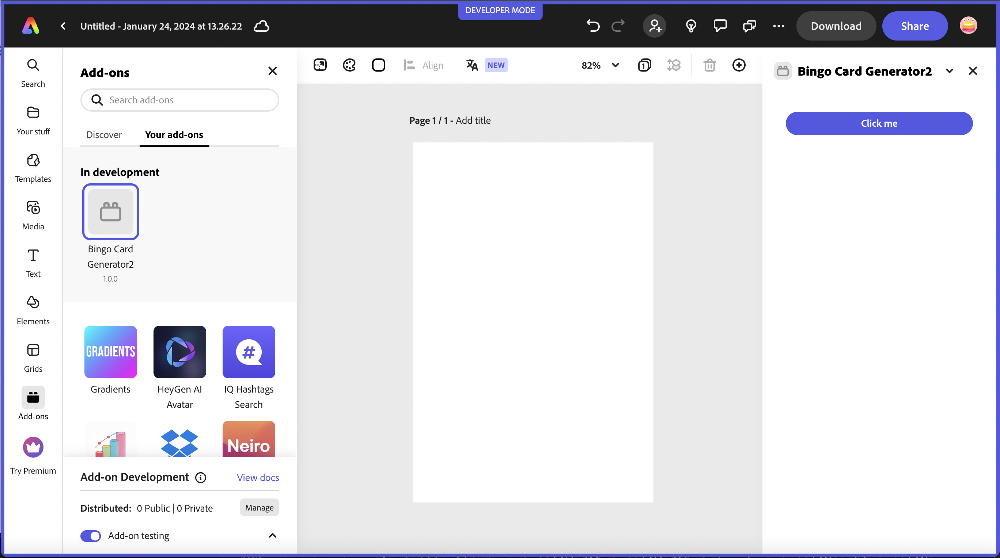
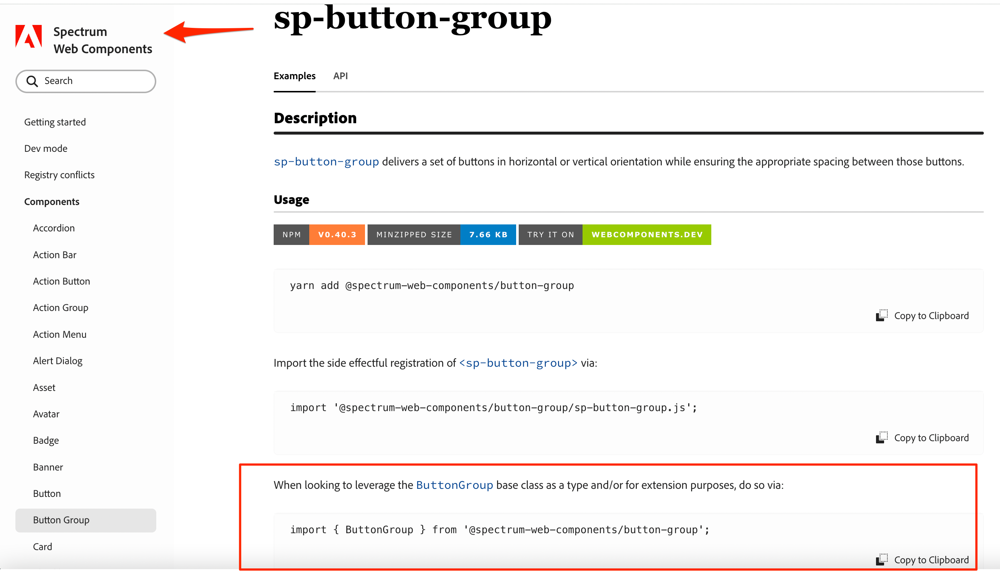
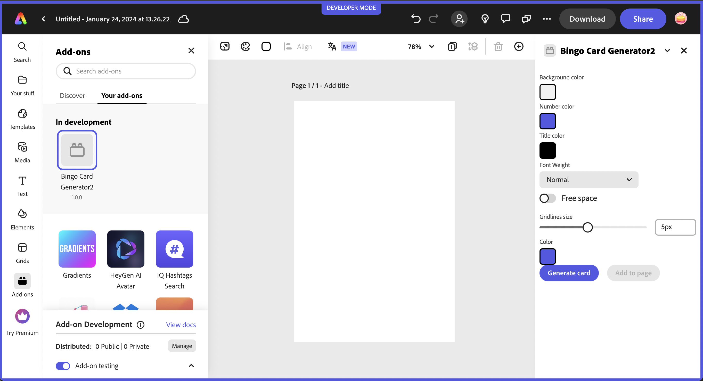

---
keywords:
  - Adobe Express
  - Add-on SDK
  - Spectrum Design System
  - Spectrum Web Components
  - swc-react
  - UI Components
  - Tutorial
  - SDK
  - JavaScript
  - React
  - Extend
  - Extensibility
  - API
title: Lesson 2 - Use Spectrum Web Components in a React-based add-on
description: Learn how to configure and use swc-react (Spectrum Web Component wrappers for React) to build the same bingo card generator add-on using React and modern component patterns.
contributors:
  - https://github.com/hollyschinsky
---

# Lesson 2: Use Spectrum Web Components in a React-based Add-on

Learn how to configure and use Spectrum Web Components in a ReactJS add-on.

## Introduction

In this lesson, you will implement the bingo card generator add-on in a React-based project with a library called [**swc-react**](https://opensource.adobe.com/spectrum-web-components/using-swc-react/), a collection of wrapper components designed to make Spectrum Web Components (SWC) work like native React components in a React application. They serve as a bridge between React and Spectrum Web Components, and their properties and event names are directly derived from their corresponding SWC components. As such, the corresponding [Spectrum Web Components documentation](https://opensource.adobe.com/spectrum-web-components/) can be used as the documentation reference.

<InlineAlert slots="text" variant="info"/>

We recommend using **swc-react** over [**React Spectrum**](https://react-spectrum.adobe.com/react-spectrum/index.html) currently since the Spectrum Web Components library provides a more extensive set of components with an explicit Express theme that is continuously updated. React Spectrum’s Express theme is in alpha, doesn't have full component coverage, and is currently not being updated. Please note, however, that [a new version of Spectrum](https://s2.spectrum.adobe.com/) will be released sometime this year, and an update to the React Spectrum libraries will follow. In the meantime we recommend using the swc-react wrappersx.

## Steps

### Create project

1. Create a new project with the CLI based on the `react-javascript` template:

    `npx @adobe/create-ccweb-add-on bingo-card-generator-react --template react-javascript`

1. Open the project in your favorite code editor and navigate to the `src/components/App.jsx` file. Notice that it's preconfigured with the `@swc-react/theme` and `@swc-react/button` packages and their associated imports, with a basic usage. If you run the project at this point, you should see the button show up in your add-on:

    

    Take a moment to get familiar with what's included in the generated project before moving on. Notice it's pre-configured for webpack, so you don't have to do those configuration steps you had to do in lesson 1 for the basic JavaScript project.

### Install swc-react components

1. Next, start installing the UI components to your new add-on project for use. These components are installed in a similar fashion to how you installed the Spectrum Web Components to lesson 1, via `npm install` or `yarn add`, with just a change to the package prefix, from `@spectrum-web-components` to `@swc-react`. Remember, the **@swc-react/button** and **@swc-react/theme** components were already included in the project generated by the template, so you can skip those.

    ```bash
    npm install @swc-react/button-group@1.7.0 @swc-react/field-label@1.7.0 @swc-react/menu@1.7.0 @swc-react/picker@1.7.0 @swc-react/slider@1.7.0 @swc-react/swatch@1.7.0 @swc-react/switch@1.7.0
    ```

    **NOTE:** The above command specifies the `1.7.0` version specifically, which is the current stable version for swc-react components.

    Alternatively, replace the `dependencies` block in your `package.json` file with the following, and then run `npm install` to install them all at once:

    ```json
    "dependencies": {
        "@swc-react/button": "1.7.0",
        "@swc-react/button-group": "1.7.0",
        "@swc-react/field-label": "1.7.0",
        "@swc-react/menu": "1.7.0",
        "@swc-react/picker": "1.7.0",
        "@swc-react/slider": "1.7.0",
        "@swc-react/swatch": "1.7.0",
        "@swc-react/switch": "1.7.0",
        "@swc-react/theme": "1.7.0",
        "react": "18.2.0",
         "react-dom": "18.2.0"
    },    
    ```

<InlineAlert slots="text" variant="warning"/>

**IMPORTANT:** You must ensure **the versions of all of the @swc-react component packages installed are the same,** or you will see errors upon build or while running. You can open your `package.json` file to double check to ensure they all match before moving on.

### Import swc-react components

In this step you will add the UI component imports for the bingo card generator add-on. The pattern of the imports will follow in a similar manner to what was included in the generated project for `Button` and `Theme`.

As a tip, you can use the [Spectrum Web Components Reference](https://opensource.adobe.com/spectrum-web-components/) for the corresponding component, and in the **Usage** section you will see that the third import uses the class name for the component, which is what you will need, as well as the specific package to use, it will just be prefixed with `@swc-react` instead.

So, for example, the first import is for the **Button Group** component. If you look at the [Spectrum Web Components - Button Group Usage](https://opensource.adobe.com/spectrum-web-components/components/button-group/#usage), the last import definition shows `import { ButtonGroup } from '@spectrum-web-components/button-group';`. It's outlined in the image below for visual reference:



You can simply copy that import from the reference for any given component you want to use in your add-on, and just change the prefix from `@spectrum-web-components` to `@swc-react`. (Notice the existing imports for `Button` and `Theme`). The resulting import to use in your add-on would be:

`import { ButtonGroup } from '@swc-react/button-group';`.

You can then use this same pattern for all of the `@swc-react` wrapper components you want to use.

The imports needed for the bingo card generator add-on sample are listed below for you to copy into your `src/components/App.jsx` file, along with the existing `Button` and `Theme` imports:

```js
import { ButtonGroup } from '@swc-react/button-group';
import { FieldLabel } from '@swc-react/field-label';
import { MenuItem } from '@swc-react/menu';
import { Picker } from '@swc-react/picker';
import { Slider } from '@swc-react/slider';
import { Swatch } from '@swc-react/swatch';
import { Switch } from "@swc-react/switch";
```

### Create event helper class

Next you'll need to create a new class to handle a known issue where React events and web components don't always work well together.  See [this issue for more details](https://github.com/facebook/react/issues/19846). The issue is most often seen in the case of the React `onChange` event, and the events won't properly fire. An option to work around this is to create a helper class that will automatically register the native browser version of the events for the components to ensure they are properly fired.

Create a new file in your `src/components` folder and name it `WC.jsx`, then copy in the block of code below and save it.
  
**Note:** this class is also included in the [lesson 2 final project](https://github.com/hollyschinsky/bingo-card-generator-react-js) if you want to copy it in from there instead.

```js
import React from "react";

export class WC extends React.Component {
    constructor(props) {
        super(props);
        this.el = React.createRef();
        this.handleEvent = this.handleEvent.bind(this);
    }

    handleEvent(evt) {
        const propName = `on${evt.type[0].toUpperCase()}${evt.type.substr(1)}`;
        if (this.props[propName]) {
            this.props[propName].call(evt.target, evt);
        }
    }

    componentDidMount() {
        const el = this.el.current;
        const eventProps = Object.entries(this.props).filter(([k,v]) => k.startsWith("on"));
        eventProps.forEach(([k,v]) => el.addEventListener(k.substr(2).toLowerCase(), this.handleEvent));
    }

    componentWillUnmount() {
        const el = this.el.current;
        const eventProps = Object.entries(this.props).filter(([k,v]) => k.startsWith("on"));
        eventProps.forEach(([k,v]) => el.removeEventListener(k.substr(2).toLowerCase(), this.handleEvent));
    }

    render() {
        const filteredProps = Object.fromEntries(Object.entries(this.props).filter(([k,v]) => !k.startsWith("on")));
        return <div ref={this.el} {...filteredProps}>{this.props.children}</div>
    }
}
```

Now, go back into your `src/components/App.jsx` and import your new `WC` helper class under the `React` and `App.css` imports, for instance:

```js
import React, { useState, useRef } from "react";
import "./App.css";
import { WC } from "./WC.jsx";
```

### Build UI with swc-react components

At this point, you are ready to start using the `swc-react` components. You'll also wrap some with the `<WC>` helper class as needed to handle events appropriately. Open your `src/components/App.jsx` file and replace the current `<Theme>` block in the UI section with the following block:

```html
<Theme system="express" scale="medium" color="light">
    <div className="container">
        <div className="row gap-20">             
            <div className="column">
                <FieldLabel size="l">Background color</FieldLabel>
                <WC onChange={onBgColorClick}>
                    <Swatch className="color-well" color={bgColorSwatch}></Swatch>
                </WC>
                <input ref={bgColorInput} type="color" style={{display: "none"}}
                    value={bgColor} onChange={onBgColorChange}
                />
            </div>
            <div className="column">
                <FieldLabel size="l">Number color</FieldLabel>
                <WC onChange={onFgColorClick}>
                    <Swatch className="color-well" color={fgColorSwatch}></Swatch>
                </WC>
                <input ref={fgColorInput} type="color" style={{display: "none"}}
                    value={fgColor} onChange={onFgColorChange}
                />                        
            </div>                                                       
            <div className="column">
                <FieldLabel size="l">Title color</FieldLabel>
                <WC onChange={onTitleColorClick}>
                    <Swatch className="color-well" color={titleColorSwatch}></Swatch>
                </WC>
                <input ref={titleColorInput} type="color" style={{display: "none"}}
                    value ={titleColor} onChange={onTitleColorChange}
                />                    
            </div>                                
        </div>
        <div className="row gap-20">
            <div className="column margin-top-10">
                <FieldLabel size="l">Font Weight</FieldLabel>
                <Picker size="m" value={fontWeightPicker} 
                    change={event => setFontWeightPicker(event.target.value)}>
                    <MenuItem value="normal">Normal</MenuItem>                        
                    <MenuItem value="bold">Bold</MenuItem>                            
                    <MenuItem value="lighter">Lighter</MenuItem>                
                </Picker>
            </div>  
            <div className="column">
                <WC onChange={event => setFreeSpaceToggle(event.target.checked)}>
                    <Switch emphasized checked={freeSpaceToggle} size="l">Free space</Switch>
                </WC>
            </div>         
        </div>
        <div className="row gap-20">                                
            <WC onChange={event => setGridlineSize(event.target.value)}>
                <Slider label="Gridlines size" variant="filled" editable value={gridlineSize}
                    hide-stepper min="1" max="10"
                    format-options='{"style": "unit", "unit": "px"}' step="1">
                </Slider>
            </WC>                                 
            <div className="column">
                <FieldLabel size="l">Color</FieldLabel>
                <WC onChange={onGridColorClick}>
                    <Swatch className="color-well" color={gridColorSwatch}></Swatch>
                </WC>
                <input ref={gridColorInput} type="color" style={{display: "none"}}
                    value={gridColor} onChange={onGridColorChange}
                />
            </div>                    
        </div>                 
        <div>
            <ButtonGroup horizontal>
                <Button onClick={generateBingoCard}>Generate card</Button>
                <Button onClick={handleAddToPage} disabled={!addToPageEnabled} variant="secondary">Add to page</Button>
            </ButtonGroup>              
        </div>                
        <div className="margin-top-10">                        
            <canvas ref={bingoCanvas}/>            
        </div> 
    </div>                                        
</Theme>
```

Note the use of the `<WC>..</WC>` component created in the previous step to wrap the `swc-react` components to ensure the events are are properly fired.

<InlineAlert slots="text" variant="warning"/>

If you tried to run your add-on at this point, you would get a blank UI, and a check of the devtools console would reveal errors, since the UI components added above call functions that don't exist yet.

### Wire UI code and add canvas drawing logic

Next you will add the logic to enable the UI components to work in your `src/components/App.jsx`. (In a typical project you would probably have more of a separation of concerns with your code rather that everything in the `App.jsx`, but for the purposes of this lesson, it will suffice).

Replace the current logic for the original button component in the top of the `App` class before the `return (...)` with the code below. You can also reference the [`App.jsx` file of the final project](https://github.com/hollyschinsky/bingo-card-generator-react-js/blob/master/src/components/App.jsx) for reference if you have any trouble:

```js
// State variables to hold component values
const [bgColor, setBgColor] = useState("#f2f2f2");
const [bgColorSwatch, setBgColorSwatch] = useState("#f2f2f2");

const [fgColor, setFgColor] = useState("#5258e5");
const [fgColorSwatch, setFgColorSwatch] = useState("#5258e5");

const [titleColor, setTitleColor] = useState("#000000");
const [titleColorSwatch, setTitleColorSwatch] = useState("#000000");

const [gridColor, setGridColor] = useState("#5258e5");
const [gridColorSwatch, setGridColorSwatch] = useState("#5258e5");

const [fontWeightPicker, setFontWeightPicker] = useState("normal");
const [freeSpaceToggle, setFreeSpaceToggle] = useState(true);
const [gridlineSize, setGridlineSize] = useState(5);
const [addToPageEnabled, setAddToPageEnabled] = useState(false);

// Refs to the UI elements for colors, add button and HTML canvas
const fgColorInput = useRef(null);
const bgColorInput = useRef(null);
const gridColorInput = useRef(null);
const titleColorInput = useRef(null);
const bingoCanvas = useRef(null);

// Function to generate the bingo card using an HTML canvas and drawing context 
function generateBingoCard() {              
    const ctx = bingoCanvas.current.getContext("2d");

    // Set canvas width and height
    bingoCanvas.current.width = 300;
    bingoCanvas.current.height = 360;
    
    // Set grid properties            
    const numRows = 6;
    const numCols = 5;
    const cellWidth = 60;
    const cellHeight = 60;
                    
    // Fill background boxes with selected bg color
    ctx.fillStyle = bgColor; 
    for (let x = gridlineSize/2; x <= bingoCanvas.current.width; x += cellWidth-gridlineSize) {            
        for (let y = gridlineSize/2; y <= bingoCanvas.current.height; y += cellHeight-gridlineSize) {
            ctx.fillRect(x, y, cellWidth, cellHeight);
        }
    }                        
            
    // Draw gridlines
    ctx.lineWidth = gridlineSize; 
    let x=0;
    let y=0;
    for (let i = 0; i <= numCols; i++) {        
        // Need to adjust for left/right gridlines size
        if (i===0) {
            ctx.moveTo(gridlineSize/2, 0);
            ctx.lineTo(gridlineSize/2, bingoCanvas.current.height);
        }
        else {
            ctx.moveTo(i * cellWidth-gridlineSize/2, 0);
            ctx.lineTo(i * cellWidth-gridlineSize/2, bingoCanvas.current.height);
            
        }
    }
    
    for (let i = 0; i <= numRows; i++) { 
        // Need to adjust for top/bottom gridlines size               
        if (i===0) {
            ctx.moveTo(0, gridlineSize/2);
            ctx.lineTo(bingoCanvas.current.height, gridlineSize/2,);
        }
        else {
            ctx.moveTo(0, i * cellWidth-gridlineSize/2);
            ctx.lineTo(bingoCanvas.current.height, i * cellWidth-gridlineSize/2);                    
        }                    
    }

    ctx.strokeStyle = gridColor; // Gridlines color
    ctx.stroke();                        
                        
    // Draw bingo title
    ctx.font = fontWeightPicker +' 28px adobe clean';    
    ctx.textAlign = "center";
    ctx.textBaseline = 'middle'; 
            
    ctx.fillStyle = titleColor; // title font color                       
    let bingoTitle = ['B','I','N','G','O'];
    for (let charCnt = 0; charCnt < bingoTitle.length; charCnt++) {
        let letter = bingoTitle[charCnt];
        ctx.fillText(letter, charCnt * cellWidth + cellWidth / 2, cellHeight / 2 + 6);                
    }       
    
    // Fill in the card with random numbers and a free space if checked
    const freeSpace = [3, 2]; // Coordinates of the FREE space
    const numbers = [];
    const usedNumbers = new Set(); // Track used numbers
    ctx.font = fontWeightPicker +' 22px adobe clean';
    ctx.fillStyle = fgColor; // color of the foreground (numbers)                 
            
    for (let i = 1; i < numRows; i++) {
        numbers[i] = [];
        for (let j = 0; j < numCols; j++) {
            if (freeSpaceToggle) {
                if (i === freeSpace[0] && j === freeSpace[1]) {
                    numbers[i][j] = "FREE";
                    continue; // Skip the FREE space
                }
            }

            let num;
            do {
                num = Math.floor(Math.random() * 15) + 1 + (j * 15);
            } while (usedNumbers.has(num)); // Generate unique numbers

            usedNumbers.add(num);
            numbers[i][j] = num;        
            ctx.fillText(num, j * cellWidth + cellWidth / 2 - 3, i * cellHeight + cellHeight / 2 + 3);                
        }
    }
            
    // Draw "FREE" if the toggle is checked
    if (freeSpaceToggle) {
        ctx.font = fontWeightPicker +' 20px adobe clean';     
        ctx.fillText("FREE", freeSpace[1] * cellWidth + cellWidth / 2 - 3, freeSpace[0] * cellHeight + cellHeight / 2 + 3);            
    }    
        
    // Enable drag and drop for the card
    addOnUISdk.app.enableDragToDocument(bingoCanvas.current, {
        previewCallback: el => new URL(bingoCanvas.current.toDataURL()),
        completionCallback: async el => {
            const r = await fetch(bingoCanvas.current.toDataURL());
            const blob = await r.blob();
            return [{blob}];
        }
    })        

    // Enable add card button
    setAddToPageEnabled(true);        
}

// Trigger click on the native color picker input for each
function onBgColorClick(e) {
    bgColorInput.current.click();
}

function onFgColorClick(e) {        
    fgColorInput.current.click();
}

function onTitleColorClick(e) {        
    titleColorInput.current.click();
}

function onGridColorClick(e) {        
    gridColorInput.current.click();
}

// Update the state values with the color selected from the native color picker for each
function onFgColorChange(e) {        
    setFgColorSwatch(e.target.value);
    setFgColor(e.target.value);        
}    

function onBgColorChange(e) {        
    setBgColorSwatch(e.target.value);
    setBgColor(e.target.value);        
}

function onTitleColorChange(e) {        
    setTitleColorSwatch(e.target.value);
    setTitleColor(e.target.value);        
}        

function onGridColorChange(e) {        
    setGridColorSwatch(e.target.value);
    setGridColor(e.target.value);        
}

async function handleAddToPage() {        
    const blob = await new Promise((resolve, reject) => {
        bingoCanvas.current.toBlob(blob => { resolve(blob); })
    })
    addOnUISdk.app.document.addImage(blob);            
}
```

**IMPORTANT!:**

Since you're using the React `useRef` to get references to some of the components, you'll need to add it to the import at the top of your `App.jsx`, along with the `useState` that's currently included. So the result of the import section would look like:

```js
import React, { useState, useRef } from "react"; /* add useRef here */
import "./App.css";                              /* already existed */
import { WC } from "./WC.jsx";                   /* you added in prior step */
```

### Style your UI

If you run your add-on project now with `npm run build; npm run start` (or if it was already running and automatically refreshed), you should see something like the following:



Similar to lesson 1, you'll see that the layout of the UI is not great. In this step you'll add the styling to present the UI as you did in lesson 1.

Open the `/src/components/App.css` file and replace the current contents with the following custom type, class and id selectors for your UI, then check to see the updates reflected in your add-on before moving to the final part of the tutorial.

```css
sp-theme {
    display: grid;        
}

h2 {
    font-weight: var(--spectrum-global-font-weight-black);
}

sp-swatch {
    width: var(--spectrum-swatch-size-medium);                
}

sp-button {
    flex: 1;
    max-width: calc(
        (100% - var(--spectrum-global-dimension-static-size-250)) / 2
    );
}

sp-textfield,
sp-picker {
    width: var(--spectrum-global-dimension-static-size-1700);
    display: flex;
}

sp-number-field {            
    width: 100%;
}

sp-button-group {
    margin-top: var(--spectrum-global-dimension-static-size-300);
    width: 100%;
    display: flex;
    justify-content: space-between;
}

sp-slider {
    width: var(--spectrum-global-dimension-static-size-2800);
    --spectrum-slider-font-size: var(--spectrum-font-size-100);    
} 

sp-field-label {
   font-size: var(--spectrum-global-dimension-font-size-100);   
}

.color-well {
    cursor: pointer;
    --mod-swatch-border-thickness: var(--spectrum-divider-thickness-small);
    --mod-swatch-border-color: var(--spectrum-transparent-black-500);   
}

.row {
    display: flex;
    flex-direction: row;
    justify-content: space-between;
    width: 100%;
    align-items: flex-end;
}

.column {
    display: flex;
    flex-direction: column;    
}

.gap-20 {
    gap: var(--spectrum-global-dimension-static-size-250); 
}

.margin-top-10 {
    margin-top: var(--spectrum-global-dimension-static-size-125); 
}

#bingoCanvas {
    width: 290px;
}
```

## FAQ

#### Q: Why use swc-react instead of React Spectrum?

**A:** swc-react provides React wrappers for Spectrum Web Components with a complete Express theme and extensive component coverage. React Spectrum's Express theme is currently in alpha with limited components and isn't being actively updated. swc-react gives you access to the full Spectrum Web Components library in a React-friendly way.

#### Q: What's the WC.jsx helper class for?

**A:** The WC.jsx helper solves a known issue where React synthetic events don't always work properly with web components. It automatically registers native browser events for components wrapped in `<WC>` tags, ensuring events like `onChange` fire correctly. This is especially important for form components like sliders and switches.

#### Q: How do I handle React synthetic events with web components?

**A:** Use the WC.jsx helper class to wrap components that need event handling:

```jsx
<WC onChange={handleChange}>
  <Slider value={sliderValue} />
</WC>
```

The helper automatically converts React event props to native browser events that web components understand.

#### Q: Can I mix swc-react with regular React components?

**A:** Yes! swc-react components work alongside regular React components. You can use standard React patterns like state management, props, and lifecycle methods. Just remember to wrap swc-react components in `<Theme>` tags and use the WC.jsx helper for event handling when needed.

#### Q: Do I need to import Spectrum Web Components directly when using swc-react?

**A:** No, swc-react packages include the underlying Spectrum Web Components. Just import from `@swc-react/*` packages and use the React component syntax. The theme imports (`@spectrum-web-components/theme/*`) are still needed for styling.

#### Q: Why do all swc-react packages need identical versions?

**A:** Like Spectrum Web Components, swc-react packages share dependencies and internal APIs. Mismatched versions can cause registry conflicts, build errors, or runtime issues. Always use the same version (like `1.7.0`) across all `@swc-react/*` packages.

#### Q: Can I use TypeScript with swc-react?

**A:** Yes! swc-react components include TypeScript definitions. You can use them in `.tsx` files with full type safety. The component props and events are properly typed based on the underlying Spectrum Web Components.

<!-- TODO replace with final and more details about customizing -->
