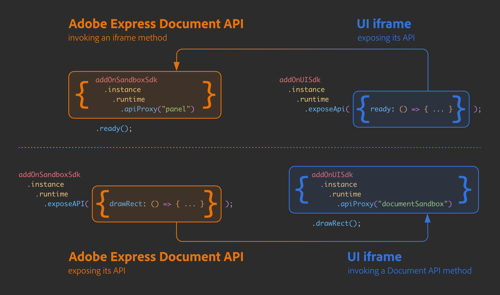
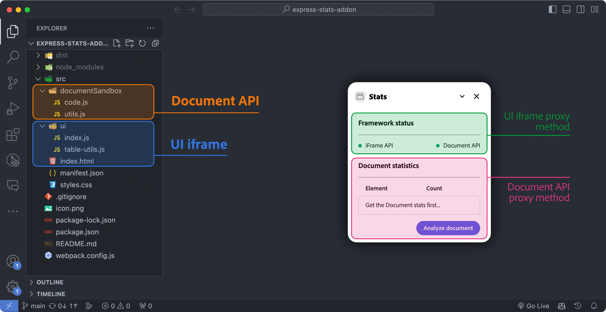
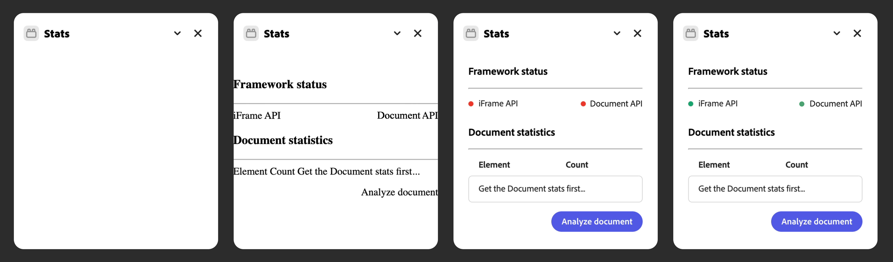
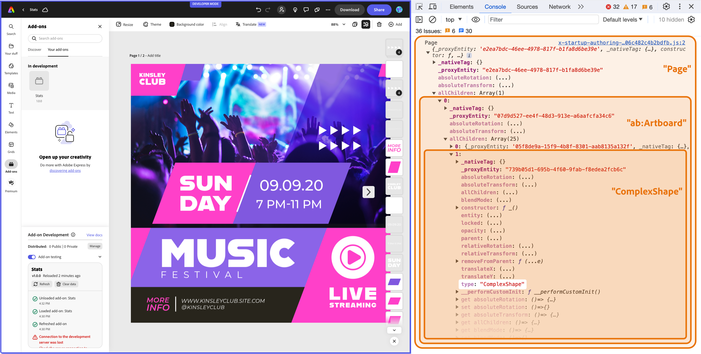
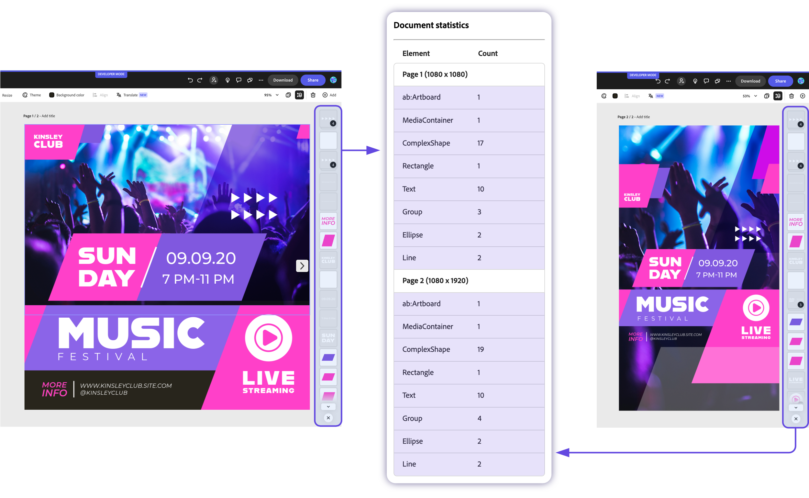

---
keywords:
  - Adobe Express
  - Express Add-on SDK
  - Express Document API
  - Express Communication API
  - Document Model Sandbox
  - Adobe Express
  - Add-on SDK
  - SDK
  - JavaScript
  - Extend
  - Extensibility
  - API
title: Creating a Stats add-on with the Adobe Express Communication API
description: In this tutorial, we'll build an Adobe Express add-on that gathers statistics on the active document using the Communication API.
contributors:
  - https://github.com/undavide
---

# Creating a Document Stats add-on with the Adobe Express Communication API

In this tutorial, we'll build an Adobe Express add-on that gathers statistics on the active document using the Communication API.

## Introduction

Hello, and welcome to this Adobe Express Communication API tutorial, where we'll build together a **fully functional Stats add-on** from scratch. This add-on will retrieve metadata from the currently open Adobe Express document, such as pages and their size, plus information about the kind and number of any element used.


### Timestamp

This tutorial has been written by Davide Barranca, software developer and author from Italy. It's been first published on December 14th, 2023.

### Prerequisites

- Familiarity with HTML, CSS, JavaScript.
- Familiarity with the Adobe Express add-ons environment; if you need a refresher, follow the [quickstart](../../../getting-started/hello-world.md) guide.
- Familiarity with the Adobe Express Document API, covered in [this tutorial](grids-addon.md).
- An Adobe Express account; use your existing Adobe ID or create one for free.
- Node.js version 16 or newer.

### Topics Covered

<List slots="text1, text2" repeat="2" iconColor="#2ac3a2" icon="disc" variant="fullWidth" />

[Invoking Document Model Sandbox methods from the UI iframe](#proxy-api)

[Invoking UI iframe methods from the Document Model Sandbox](#logic)

[Proxy API](#proxy-api)

[Context Closures](#functions)


## Getting Started with the Communication API

As we've seen in the previous Adobe Express [Document API tutorial](grids-addon.md), add-ons belong to the **UI iframe**: a sandboxed environment subject to [CORS policies](../../platform-concepts/context.md#cors), where the User Interface (UI) and the add-on logic are built. The iframe itself has limited editing capabilities, though: via the `addOnUISdk` module, it can invoke a few methods to import media (image, video, and audio) and export the document into a number of formats, like `.pdf`, `.mp4` or `.jpg` for example.

The **Document API** makes new, more powerful capabilities available, allowing the add-on to manipulate elements directly—like scripting in Desktop applications such as Photoshop or InDesign. This API is one component of the Document Sandbox, a JavaScript execution environment that also includes a restricted set of Web API (mostly debugging aids) as well as the means for the UI iframe and the Document API to exchange messages—the Communication API. This infrastructure is paramount as it bridges the gap between the two environments, allowing them to create a seamless experience.

### Proxies

How does this all work, then? The process involves exposing proxies for the _other context_ to use, serving as a user-friendly abstraction; under the hood, the implementation relies on a messaging system, which is hidden to us developers.

```js
// runtime in the UI iframe
import addOnUISdk from "https://express.adobe.com/static/add-on-sdk/sdk.js";
const { runtime } = addOnUISdk.instance;

// runtime in the Document Sandbox
import addOnSandboxSdk from "add-on-sdk-document-sandbox";
const { runtime } = addOnSandboxSdk.instance;
```

The `runtime` object uses the `exposeApi()`to make content available to the other context—it works the same, regardless of whether the subject is the iframe or the Document Sandbox.

```js
// 👇 both in the UI frame and the Document Sandbox
runtime.exposeApi({
  /* ... */
}); // exposing a payload {}
```

We'll get to the details of such a payload in a short while; for the moment, think about it as a collection of methods acting on their environment (UI iframe or Document Sandbox). There needs to be more than exposing, though: some action is required _on the other side_ to surface such a payload—it involves using the `apiProxy()` method documented [here](/references/addonsdk/instance-runtime/).

```js
// UI iframe, importing a payload from the Document Sandbox
const sandboxProxy = await runtime.apiProxy("documentSandbox");

// Document Sandbox, importing a payload from the UI iframe
const panelUIProxy = await runtime.apiProxy("panel");
```

At this point, `sandboxProxy` and `panelUIProxy` represent their counterparts from the original contexts. It all may be easier to understand when the entire process is written down; for example, in the following code, we expose a custom method called `ready()` defined in the UI iframe to the Document API.

<CodeBlock slots="heading, code" repeat="2" languages="UI iframe, Document Sandbox"/>

#### UI iframe

```js
import addOnUISdk from "https://express.adobe.com/static/add-on-sdk/sdk.js";
const { runtime } = addOnUISdk.instance;

// exporting a payload to the Document Sandbox
runtime.exposeApi({
  ready: (env) => {
    console.log(`The ${env} environment is ready`);
  },
});
```

#### Document Sandbox

```js
import addOnSandboxSdk from "add-on-sdk-document-sandbox";
const { runtime } = addOnSandboxSdk.instance;

// importing from the iframe
const panelUIProxy = await runtime.apiProxy("panel");

// We can call this method now
await panelUIProxy.ready("Document Sandbox");
```

As the name implies, the `panelUIProxy` constant in the Document Sandbox is a _proxy_ for the object exposed by the iframe's runtime. The other way around works the same: exposing a Document API method to the iframe.

<CodeBlock slots="heading, code" repeat="2" languages="iframe, Document Sandbox"/>

#### UI iframe

```js
import addOnUISdk from "https://express.adobe.com/static/add-on-sdk/sdk.js";
const { runtime } = addOnUISdk.instance;

// importing from the Document Sandbox
const sandboxProxy = await runtime.apiProxy("documentSandbox");

// We can call this method now
await sandboxProxy.drawRect();
```

#### Document Sandbox

```js
import addOnSandboxSdk from "add-on-sdk-document-sandbox";
const { runtime } = addOnSandboxSdk.instance;

// exporting a payload to the iframe
runtime.exposeApi({
  drawRect: () => {
    // uss the Document API to draw a Rectangle shape...
  },
});
```

The following diagram helps visualize the process.



### Proxy API

Now that we've seen how contexts expose and import each other's API, let's discuss what's inside the payload objects that cross this environment boundary.

#### Functions

Most of the time, you're going to expose **functions**.

```js
// Document Sandbox
runtime.exposeApi({
  drawRect: () => {
    /* ... */
  }, // 👈
  drawEllipse: () => {
    /* ... */
  }, // 👈
  drawShape: () => {
    /* ... */
  }, // 👈
  // etc.
});
```

In the above example, if `drawShape()` needs to call either `drawEllipse()` or `drawRect()`, you may use the _method shorthand syntax_.

```js
// Document Sandbox
runtime.exposeApi({
  drawRect() {
    /* ... */
  }, // 👈
  drawEllipse() {
    /* ... */
  }, // 👈
  drawShape() {
    this.drawRect(); // 👆
    // or
    this.drawEllipse(); // 👆
  },
  // etc.
});
```

When not strictly necessary, keep functions private and expose only the ones needed.

```js
// Document Sandbox
const drawRect = () => {
  /* ... */
}; // 👈 private
const drawEllipse = () => {
  /* ... */
}; // 👈 private

runtime.exposeApi({
  drawShape() {
    drawRect(); // 👆
    // or
    drawEllipse(); // 👆
  },
});
```

Here, `drawRect()` and `drawEllipse()` exist within the closure of the `drawShape()` function exposed to the iframe and will work just fine when the iframe invokes it. This notion of "private" variables defined in one context can be exploited in various ways, for instance, with a counter as follows.

<CodeBlock slots="heading, code" repeat="2" languages="iframe, Document Sandbox"/>

#### UI iframe

```js
const sandboxProxy = await runtime.apiProxy("documentSandbox");

// Calling the exposed method
const shapesNo = await sandboxProxy.drawShape();
console.log("Shapes drawn", shapesNo);
```

#### Document Sandbox

```js
const drawRect = () => {
  /* ... */
};
const drawEllipse = () => {
  /* ... */
};

let counter = 0; // 👈 private to the sandbox

runtime.exposeApi({
  drawShape() {
    if (counter >= 10) {
      throw new Error("Shape's budget depleted!");
    }
    // Randomly draw either a rectangle or an ellipse
    Math.random() < 0.5 ? drawRect() : drawEllipse();

    return ++counter; // 👆
  },
});
```

The `counter` variable in the Document Sandbox is maintained between iframe calls within the same user session. It remains isolated to the specific document and cannot be shared with other open documents or users. However, it can be accessed by the `drawShape()` function. In this context, it's returned to provide the iframe with the count of shapes created up to that point. This introduces us to the notion of **returned values**.

Generally speaking, you should restrict your returns to the following types.

- ✅ Primitive values.
- ✅ Object literals.
- ✅ JSON strings.
- ✅ ArrayBuffers and Blobs.
- ✅ Promises.

The following returns won't work as expected and must be avoided.

- ❌ Classes (constructor functions).
- ❌ Class instances (will get serialized and stripped away from any method).
- ❌ Functions.
- ❌ Proxies.
- ❌ Constructs such as `Maps` and `Sets` won't get through either, nor will `Date` and `RegExp`.
- ❌ `new Error()`, either thrown or returned, won't provide any error message (at the moment) when caught using a `try`/`catch` block.

#### Primitives

Nothing prevents you from using something else besides functions in your proxy. For instance, you can refactor the `drawShape()` example by exposing a `counter` property alongside its setter and getter.

<CodeBlock slots="heading, code" repeat="2" languages="iframe, Document Sandbox"/>

#### UI iframe

```js
// iframe
const sandboxProxy = await runtime.apiProxy("documentSandbox");

for (let i = 0; i < 10; i++) {
  await sandboxProxy.drawShape();
}
sandboxProxy.counter = 0; // resetting the counter
await sandboxProxy.drawShape();
```

#### Document Sandbox

```js
// Document Sandbox
const drawRect    = () => { /* ... */ };
const drawEllipse = () => { /* ... */ };

let _counter = 0; 👈 // private member (mind the underscore)

runtime.exposeApi({
  drawShape() {
    if (_counter >= 10) { // 👈 mind the underscore
      throw new Error("Shape's budget depleted!");
    }
    // Randomly draw either a rectangle or an ellipse
    Math.random() < 0.5 ? drawRect() : drawEllipse();
	this.counter = this.counter + 1; // Use the setter to increment
	return this.counter; // Return the new value after incrementing
  },
  get counter()    { return _counter; }, // 👈 getter
  set counter(val) { _counter = val; }   // 👈 setter
});
```

The `counter` setter has the ability to perform additional actions, such as manipulating the document, in addition to assigning a new value to the private variable `_counter`.

Please note that, given the async nature of the Communication API, retrieving the `counter` value in the iframe requires the use of `await` or a `then()` callback.

```js
let counter = await sandboxProxy.counter;
// or
sandboxProxy.counter.then((counter) => {
  /* ... */
});
```

### Asynchronous communication

The Communication API wraps all inter-context function invocations with a **Promise**. In other words, regardless of the nature of the function called, when it gets from one context to the other (from the iframe to the Document Sandbox or vice-versa), it must be dealt with as if it were **asynchronous**.

```js
// Document Sandbox
runtime.exposeApi({
  drawShape() { /* ... */ } // 👈 Document API methods are typically *synchronous*
});

// iframe
❌ const res = sandboxProxy.drawShape(); // 👀 no await, returns a Promise
❌ console.log(res instanceof Promise);  // true

✅ const res = await sandboxProxy.drawShape(); // using await
✅ console.log(typeof res); // number (it returns the counter, as you remember)
```

## Coding the Stats add-on

You are now equipped with all the theory and reference snippets needed to start building the Stats add-on: it's a simple project implementing the Communication API in a couple of different ways. Feature-wise, it's split into two parts.

1. The add-on shows two **status lights** that indicate whether the SDKs are ready for use.
1. At the press of a button, the add-on (via Document API) collects the document's metadata[^0], which is used to compile and show a **table of Nodes** (elements).



Like in the [Grids add-on tutorial](grids-addon.md), the starting point will be [this template](https://github.com/AdobeDocs/express-add-on-samples/tree/main/document-sandbox-samples/express-addon-document-api-template), which provides a Webpack-managed JavaScript—hence, able to easily import Spectrum Web Components to build the User Interface. Everything's in the `src` folder:

- `index.html` is where the iframe's UI is built.
- `ui/index.js` deals with the add-on's internal logic.
- `ui/table-utils.js` contains table-related functions consumed by the iframe and imported by `index.js` to keep it slim.
- `documentSandbox/code.js` contains the Document API methods exposed to the iframe.
- `documentSandbox/utils.js` stores Document API private functions imported in `code.js`.

### User Interface

To keep a consistent look & feel with the rest of the application, we'll use Spectrum Web Component as much as possible, styling them with the `express` theme provided by the `<sp-theme>` wrapper.


For the "Framework Status", the [Status Light](https://opensource.adobe.com/spectrum-web-components/components/status-light/) component is spot-on: it comes in many variants, which set different light colors—`positive` and `negative` (green 🟢 and red 🔴) will be enough for us. The "Document Statistics" section is going to show a list of key/value pairs (the element type and the number of items found on each page). The most obvious choice is a [Table](https://opensource.adobe.com/spectrum-web-components/components/table/) component, which in SWC is constructed with several tags.

- `<sp-table>` is the outer wrapper.
- `<sp-table-head>` and `<sp-table-head-cell>` set the header.
- `<sp-table-body>` is for the body, which contains `<sp-table-row>` and `<sp-table-cell>` elements.

We'll start with a placeholder row with a friendly message, which is going to be removed at the first launch. A regular `<sp-button>` is placed at the bottom to initiate the metadata-collecting process.

<CodeBlock slots="heading, code" repeat="1" languages="index.html"/>

#### index.html

```html
<body>
  <sp-theme
    scale="medium"
    color="light"
    system="express"
  >
    <h3>Framework status</h3>
    <hr />
    <div class="row">
      <sp-status-light
        size="m"
        variant="negative"
        id="iframe-status"
      >
        iFrame API
      </sp-status-light>
      <sp-status-light
        size="m"
        variant="negative"
        id="document-status"
      >
        Authoring API
      </sp-status-light>
    </div>
    <h3>Document statistics</h3>
    <hr />
    <div class="row">
      <sp-table size="m">
        <sp-table-head>
          <sp-table-head-cell>Element</sp-table-head-cell>
          <sp-table-head-cell>Count</sp-table-head-cell>
        </sp-table-head>
        <sp-table-body id="stats-table-body">
          <sp-table-row id="row-placeholder">
            <sp-table-cell>Get the Document stats first...</sp-table-cell>
          </sp-table-row>
        </sp-table-body>
      </sp-table>
    </div>
    <div class="row align-right">
      <sp-button id="stats">Analyze document</sp-button>
    </div>
  </sp-theme>
</body>
```

### Logic

The diagram below illustrates the communication flow between the two contexts.


The iframe exposes two methods:

- `toggleStatus()` will be used independently by the iframe and the Document API to switch the Framework Status lights to green when ready.
- `createTable()` expects to be passed the document metadata and deals with the `<sp-table>` setup.

The Document Sandbox exposes only a `getDocumentData()` method, which collects the metadata from the open document. Both contexts import each other's API via proxy.

When the iframe has loaded its SDK, it will call `toggleStatus()`, passing the `"iframe"` string as a parameter—telling the function which light to turn green. Similarly, when the Document Sandbox is ready, it will reach out for `toggleStatus()` on its own. Neither process requires the user's intervention.

When the "Analyze Document" button is clicked, the iframe—via the Document Sandbox proxy—invokes `getDocumentData()`. Instead of returning an object with the metadata to the iframe for further processing (which would be OK), **the Document API uses the iframe proxy to run directly** `createTable()` and initiate the table subroutine in an _iframe-to-Document-Sandbox-to-iframe_ roundtrip. Let's have a look at the overall structure in `index.js` implementing the logic I've just described.

<CodeBlock slots="heading, code" repeat="1" languages="index.js"/>

#### ui/index.js

```js
// SWC imports
import "@spectrum-web-components/styles/typography.css";
import "@spectrum-web-components/theme/src/themes.js";
import "@spectrum-web-components/theme/theme-light.js";
import "@spectrum-web-components/theme/express/theme-light.js";
import "@spectrum-web-components/theme/express/scale-medium.js";
import "@spectrum-web-components/theme/sp-theme.js";

import "@spectrum-web-components/status-light/sp-status-light.js";
import "@spectrum-web-components/table/elements.js";
import "@spectrum-web-components/button/sp-button.js";

import addOnUISdk from "https://express.adobe.com/static/add-on-sdk/sdk.js";

// Wait until the addOnUISdk has been loaded
addOnUISdk.ready.then(async () => {
  // API to expose to the Document Sandbox
  const iframeApi = {
    createTable(documentData) {
      /* ... */
    },
    toggleStatus(sdk) {
      /* ... */
    },
  };
  runtime.exposeApi(iframeApi);

  // Toggle the iframe SDK status light
  iframeApi.toggleStatus("iframe");

  // Import the Document Sandbox API proxy
  const { runtime } = addOnUISdk.instance;
  const sandboxProxy = await runtime.apiProxy("documentSandbox");
  // Exposing the iFrame API to the Document Sandbox.

  // Set the button's click handler
  const statsButton = document.getElementById("stats");
  statsButton.addEventListener("click", async () => {
    // Invoke the Document API via Document Sandbox proxy
    // to get the document metadata and initiate the table creation process
    await sandboxProxy.getDocumentData(); // 👈 mind the await
  });

  // Enable the button only when the addOnUISdk is ready
  statsButton.disabled = false;
});
```

Besides the usual SWC imports, everything must be wrapped by a callback invoked when the `addOnUISdk` module is `ready`—which also means we can switch the first SDK status light to green. Please note that `toggleStatus()` must be available to both the iframe and the Document Sandbox: declaring the `iframeApi` constant first (lines 18-21) and passing it to `exposeApi()` later allows me to call it (line 21).

```js
// ❌ _in this case_ it's the wrong syntax choice!
runtime.exposeApi({
  createTable(documentData) { /* ... */ },
  toggleStatus(sdk) { /* ... */ }
});

// ✅ better for our needs _in this context_
const iframeApi = {
  createTable(documentData) { /* ... */ },
  toggleStatus(sdk) { /* ... */ }
});
runtime.exposeApi(iframeApi);
// toggleStatus is accessible in the iframe too
iframeApi.toggleStatus("iframe"); // 👈
```

<InlineAlert variant="info" slots="text" />

Let me remind you again of the need to `await` when invoking `getDocumentData()` (line 37, `index.js`), as the Communication API wraps proxy calls with Promises.

In `documentSandbox/code.js`, we bring the iframe proxy in, toggle the status light, and expose the `getDocumentData()` function. Please note that it must be declared asynchronous (line 7) because of the need to `await` when invoking the `panelUIProxy` method `createTable()` (line 12).

<CodeBlock slots="heading, code" repeat="1" languages="code.js"/>

#### documentSandbox/code.js

```js
import addOnSandboxSdk from "add-on-sdk-document-sandbox";
const { runtime } = addOnSandboxSdk.instance;

async function start() {
  const panelUIProxy = await runtime.apiProxy("panel");
  runtime.exposeApi({
    async getDocumentData() {
      // 👈 async keyword, because 👇
      // Get the document's metadata
      let documentData;
      // ... TODO
      // ... then, directly invoke the iframe method
      await panelUIProxy.createTable(documentData); // 👈 the Communication API is async 👆
    },
  });
  // switch the Framework Status light to green
  panelUIProxy.toggleStatus("document");
}
start();
```

<InlineAlert variant="info" slots="text, text1, text2" />

Please note that it would be perfectly fine to return the `documentData` object to the iframe and let it invoke `createTable()` on its own. I've chosen to do it this way to show you how that this sort of "circular" communication is possible—although the other approach is perhaps more common.

Speaking of coding style in the way the proxy is exposed, you may find more readable to implement the functions elsewhere (either in the same file or in a separate module) and use the object property shorthand syntax.

```js
const getDocumentData = async () => {
  /* ... */
};
// ...
runtime.exposeApi({
  getDocumentData, // 👈 shorthand syntax
  // ...
});
```

### Implementation

Let's start filling in the missing parts in our code; we'll begin with the Framework Status, the easiest bit. The `toggleStatus()` method is immediately invoked in the `addOnUISdk.ready` callback, as well as the Document Sandbox `code.js`, where it is also exposed. It updates the `variant` attribute of the `<sp-status-light>` element based on the `sdk` parameter passed in.

<CodeBlock slots="heading, code" repeat="2" languages="iframe, Document Sandbox"/>

#### UI iframe

```js
const iframeApi = {
  toggleStatus(sdk) {
    // sdk parameter validation
    if (["document", "iframe"].indexOf(sdk) === -1) {
      throw new Error("Invalid SDK type");
    }
    const el =
      sdk === "document"
        ? document.getElementById("document-status")
        : document.getElementById("iframe-status");
    el.setAttribute("variant", "positive"); // 🟢
  },
  // ...
};

iframeApi.toggleStatus("iframe"); // 👈
```

#### Document Sandbox

```js
import addOnSandboxSdk from "add-on-sdk-document-sandbox";
const { runtime } = addOnSandboxSdk.instance;

async function start() {
  const panelUIProxy = await runtime.apiProxy("panel");
  // ...
  panelUIProxy.toggleStatus("document"); // 👈
}
start();
```

When refreshing the add-on, the UI updates almost instantly, but a frame-by-frame analysis would reveal a progression in the rendering process: first, the HTML is loaded, then the CSS with the `<sp-status-light>` components in their original, "red" variant; finally, when the two SDK are fully loaded, we get the green lights.[^1]



Let's tackle the metadata collection in the Document Sandbox, especially the data structure we want to create[^2]. There are many ways to go about this business: I've decided to keep track of elements on a Page basis and store page dimensions, too. Eventually, the iframe will receive `documentData`, an array of objects, one for each page, with `dimensions` and `nodes` properties. If you've got a taste for TypeScript, the type definition would be as follows.

```ts
type DocumentData = Array<{
  dimensions: { width: number; height: number };
  nodes: { [key: string]: number };
}>;
```

The above would transpose into something along these lines.

```js
[
  {
    // page 1
    dimensions: { width: 1200, height: 1200 },
    nodes: {
      "ab:Artboard": 1,
      MediaContainer: 1,
      Text: 2,
      ComplexShape: 3,
    },
  },
  {
    // page 2
    dimensions: { width: 800, height: 400 },
    nodes: {
      "ab:Artboard": 1,
      MediaContainer: 4,
      Rectangle: 2,
    },
  },
  // ...
];
```

The various `"ab:Artboard"`, `"MediaContainer"` and others, are the Node type strings as Adobe Express exposes them. Let's create the `getDocumentData()` function that outputs such a structure.



<CodeBlock slots="heading, code" repeat="1" languages="code.js"/>

#### documentSandbox/code.js

```js
import { getNodeData } from "./utils";

runtime.exposeApi({
  async getDocumentData() {
    const doc = editor.documentRoot; // get the document
    let documentData = []; // initialize the array to return
    for (const page of doc.pages) {
      // loop through each page
      let pageData = {}; // create an empty object
      pageData.dimensions = {
        // get and store the page `dimensions`
        width: page.width,
        height: page.height,
      };
      pageData.nodes = getNodeData(page); // 👈 build the `nodes` object (more on this later)
      documentData.push(pageData); // push the object to the documentData array
    }
    // invoke the iframe method to create the table on the UI
    await panelUIProxy.createTable(documentData);
  },
});
```

The code comments will guide you through the process of getting the document, loop through pages extracting dimensions, and retrieving nodes metadata, but up to a point. What's `getNodeData`? As I mentioned before, I've split the Document API code into two parts: the main Document Sandbox entrypoint (`code.js`, where methods are exposed to and imported from the iframe) and `table-utils.js`, which is kept private to the context and exports just what `code.js` needs—the `getNodeData()` method, which makes use of `increaseCount()`.

<CodeBlock slots="heading, code" repeat="1" languages="utils.js"/>

#### documentSandbox/table-utils.js

```js
const increaseCount = (obj, type) => {
  // If the type is already in the object, increase its count, otherwise set it to 1
  if (obj.hasOwnProperty(type)) {
    obj[type] += 1;
  } else {
    obj[type] = 1;
  }
};

const getNodeData = (node, nodeData = {}) => {
  if (node.type === "MediaContainer") {
    return nodeData;
  }

  // Check if the current node has children and if they are not an empty array
  if (node.allChildren && node.allChildren.length > 0) {
    // Iterate over all children using for..of
    for (const child of node.allChildren) {
      // Increase the count for the current type
      increaseCount(nodeData, child.type);

      // Recursively call getNodeData for each child that has its own children
      // ... unless it's a MediaContainer
      if (
        child.type !== "MediaContainer" &&
        child.allChildren &&
        child.allChildren.length > 0
      ) {
        getNodeData(child, nodeData);
      }
    }
  }

  return nodeData;
};

export { getNodeData };
```

Given the nature of Adobe Express documents (which will be covered in detail in a future tutorial), it makes sense to build `getNodeData()` as a recursive function: a [`PageNode`](/references/document-sandbox/document-apis/classes/PageNode/) can contain multiple [`ArtboardNode`](/references/document-sandbox/document-apis/classes/ArtboardNode/) elements, which in turn can contain multiple [`GroupNode`](/references/document-sandbox/document-apis/classes/GroupNode/) elements, and so on. As follows, the metacode.

1. The `getNodeData()` method begins its execution when called by `getDocumentData()`, taking a single parameter named `page`. At the start, `nodeData` is initialized as an empty object. The method then checks if the current node has the `allChildren` property, which should be a non-empty iterable (please note: it's not an Array, but can be transformed into one if needed via `Array.from()`). If so, it goes through it. During each iteration, it increments the count for the `type` property of each child node (such as `"Text"`, `"Group"`, etc.).

2. If a child node within this array also features a non-empty `allChildren` property, `getNodeData()` is called recursively on that child node. Mind you: during these recursive calls, `nodeData` is passed as the second argument. This approach ensures that the same `nodeData` object is continuously used throughout the recursion, allowing it to accumulate and keep tabs on all node types encountered across all hierarchy levels. The `"MediaContainer"` node is a particular one, [^3] and when encountered, we stop there.

3. The `increaseCount()` method, which we keep private to the `utils.js` module, receives the `nodeData` object and bumps the count for each `child.type`.

When the whole process is repeated for each `page`, we can finally invoke the iframe `createTable()` method, passing the `documentData`.

<CodeBlock slots="heading, code" repeat="1" languages="code.js"/>

#### documentSandbox/code.js

```js
runtime.exposeApi({
  async getDocumentData() {
    // ... create and fill the `documentData` array
    await panelUIProxy.createTable(documentData); // 👈 calling this iframe proxy method
  },
});
```

Now, it's up to the iframe to manage such data (the array of objects collecting page dimensions and node counts) and transform it into a Spectrum Table.

<CodeBlock slots="heading, code" repeat="1" languages="index.js"/>

#### ui/index.js

```js
import { rebuildTable } from "./table-utils";

const iframeApi = {
  toggleStatus(sdk) {
    /* ... */
  },
  createTable(documentData) {
    // 👈
    const table = document.getElementById("stats-table-body");
    rebuildTable(table, documentData);
  },
};
```

The process is not difficult per se, but it may be slightly tedious. The `rebuildTable()` method is declared in the `table-utils.js` module alongside a private `addRowToTable()`.

<CodeBlock slots="heading, code" repeat="1" languages="table-utils.js"/>

#### documentSandbox/table-utils.js

```js
// documentSandbox/table-utils.js

const addRowToTable = (table, rowData) => {
  // Create a new row
  const newRow = document.createElement("sp-table-row");

  // For each cell data, create a cell and append it to the row
  let cell;
  rowData.forEach((cellData) => {
    cell = document.createElement("sp-table-cell");
    cell.textContent = cellData;
    newRow.appendChild(cell);
  });
  if (rowData.length === 1) {
    // Making the page row bold
    cell.className = "page-row";
  }
  // Append the row to the table body
  table.appendChild(newRow);
};

const rebuildTable = (table, documentData) => {
  // Removing all existing rows from the table,
  // either the placeholder or the previous results
  while (table.firstChild) {
    table.removeChild(table.firstChild);
  }
  documentData.forEach((pageData, index) => {
    addRowToTable(table, [
      `Page ${index + 1} (${pageData.dimensions.width} x ${
        pageData.dimensions.height
      })`,
    ]);
    // the for...in loop iterates over the keys of an object
    for (const node in pageData.nodes) {
      // for example,      ["Text", 1]
      addRowToTable(table, [node, pageData.nodes[node]]);
    }
  });
};

export { rebuildTable };
```

As follows, the `rebuildTable()` metacode.

- Initialize the existing table, which is the first argument it receives.
- Loop through each page in the `documentData` array, adding a row with the dimensions via `addRowToTable()`; please note that, although the Table is supposed to have two columns, we can set a row with only one cell, which will span both of them.
- Loop through each node in the `pageData.nodes` object, adding a row with the node type and the number of instances found on that page.
- `addRowToTable()` is a utility function that takes a table and an array of strings as arguments. It creates a new `<sp-table-row>`, then loops through the array, creating a `<sp-table-cell>` for each string and appending it to the row. If the array contains only one element, the cell is given a `page-row` class, which makes it bold.



## Next Steps

Congratulations! You've coded from scratch the Stats add-on for Adobe Express. As an exercise, you may want to extend it with the following features.

- **Better visualization**: you can add `<sp-icon>` elements for each Node type, or bypass the Table altogether using an Accordion component for a hierarchical, collapsible menu.
- **Hide and Show**: via the [Document API](/references/document-sandbox) you may hide and show elements based on their type—the `<sp-table>` has a `selects` and a `selected` attributes that you can put to use.
- **Save Snapshots**: using the [Client Storage API](/references/addonsdk/instance-clientStorage/), you can keep track of the document's metadata and compare it with previous versions.

## Lessons Learned

Let's review the concepts covered in this tutorial and how they've been implemented in the Stats add-on.

- **Communication API**: the iframe and the Document Sandbox can expose and import each other's API via proxy objects. The Communication API wraps all inter-context function invocations with a Promise; hence, the need to `await` when invoking a proxy method.
- **Proxy API**: the payload objects exchanged between the two contexts can contain functions, which are the most common use case: they can return primitives, object literals, JSON strings, ArrayBuffers, and Blobs.
- **Context Closures**: proxy methods have access to variables defined in their context, even when invoked from the other context. This is a powerful feature that can be exploited to keep private variables and functions out of the Communication API.
- **Roundtrip calls**: proxy methods can be chained—the iframe can invoke the Document API via the Document Sandbox proxy, which in turn can invoke the iframe proxy, and so on.

## Final Project

The code for this project can be downloaded [here](https://github.com/AdobeDocs/express-add-on-samples/tree/main/document-sandbox-samples/express-stats-addon). Use [this template](https://github.com/AdobeDocs/express-add-on-samples/tree/main/document-sandbox-samples/express-addon-document-api-template) as a starting point.

<InlineAlert variant="info" slots="text1" />

Please use the UI iframe and Document Sandbox tabs to switch between the two domains and find a dropdown in the top-right corner to select which file to show.

<CodeBlock slots="heading, code" repeat="6" languages="index.html, styles.css, ui/index.js, ui/table-utils.js, documentSandbox/code.js, documentSandbox/utils.js" />

#### UI iframe

```html
<!DOCTYPE html>
<html lang="en">
  <head>
    <meta charset="UTF-8" />
    <meta
      name="description"
      content="Adobe Express Add-on template using JavaScript, the Document Sandbox, and Webpack"
    />
    <meta
      name="keywords"
      content="Adobe, Express, Add-On, JavaScript, Document Sandbox, Adobe Express Document API"
    />
    <meta
      name="viewport"
      content="width=device-width, initial-scale=1.0"
    />
    <title>Stats add-ons</title>
    <link
      rel="stylesheet"
      href="styles.css"
    />
  </head>

  <body>
    <sp-theme
      scale="medium"
      color="light"
      system="express"
    >
      <h3>Framework status</h3>
      <hr />
      <div class="row">
        <sp-status-light
          size="m"
          variant="negative"
          id="iframe-status"
          >iFrame API</sp-status-light
        >
        <sp-status-light
          size="m"
          variant="negative"
          id="document-status"
          >Authoring API</sp-status-light
        >
      </div>
      <h3>Document statistics</h3>
      <hr />
      <div class="row">
        <sp-table size="m">
          <sp-table-head>
            <sp-table-head-cell>Element</sp-table-head-cell>
            <sp-table-head-cell>Count</sp-table-head-cell>
          </sp-table-head>
          <sp-table-body id="stats-table-body">
            <sp-table-row id="row-placeholder">
              <sp-table-cell>Get the Document stats first...</sp-table-cell>
            </sp-table-row>
          </sp-table-body>
        </sp-table>
      </div>
      <div class="row align-right">
        <sp-button id="stats">Analyze document</sp-button>
      </div>
    </sp-theme>
  </body>
</html>
```

#### UI iframe

```css
body {
  margin: 0;
  padding: 0;
  overflow-x: hidden;
}

sp-theme {
  margin: 0 var(--spectrum-global-dimension-static-size-300);
}

.row {
  display: flex;
  flex-direction: row;
  justify-content: space-between;
  margin-bottom: var(--spectrum-global-dimension-static-size-175);
}

.align-right {
  justify-content: flex-end;
}

sp-table {
  width: 100%;
}

sp-button {
  align-self: flex-end;
}

.page-row {
  font-weight: var(--spectrum-global-font-weight-bold);
}
```

#### UI iframe

```js
import "@spectrum-web-components/styles/typography.css";
import "@spectrum-web-components/theme/src/themes.js";
import "@spectrum-web-components/theme/theme-light.js";
import "@spectrum-web-components/theme/express/theme-light.js";
import "@spectrum-web-components/theme/express/scale-medium.js";
import "@spectrum-web-components/theme/sp-theme.js";

import "@spectrum-web-components/status-light/sp-status-light.js";
import "@spectrum-web-components/table/elements.js";
import "@spectrum-web-components/button/sp-button.js";

import addOnUISdk from "https://express.adobe.com/static/add-on-sdk/sdk.js";
import { rebuildTable } from "./table-utils";

addOnUISdk.ready.then(async () => {
  const iframeApi = {
    /**
     * Toggles the status light.
     * @param {string} sdk - The type of SDK that is ready, either "document" or "iframe"
     */
    toggleStatus(sdk) {
      if (["document", "iframe"].indexOf(sdk) === -1) {
        throw new Error("Invalid SDK type");
      }
      const el =
        sdk === "document"
          ? document.getElementById("document-status")
          : document.getElementById("iframe-status");
      el.setAttribute("variant", "positive");
    },

    createTable(documentData) {
      const table = document.getElementById("stats-table-body");
      rebuildTable(table, documentData);
    },
  };

  // the addOnUISdk is ready, so we can now toggle the status light
  iframeApi.toggleStatus("iframe");

  // Get the Document Sandbox.
  const { runtime } = addOnUISdk.instance;
  // Importing the Document Sandbox API.
  const sandboxProxy = await runtime.apiProxy("documentSandbox");
  // Exposing the iframe API to the Document Sandbox.
  runtime.exposeApi(iframeApi);

  const statsButton = document.getElementById("stats");

  statsButton.addEventListener("click", async () => {
    await sandboxProxy.getDocumentData();
  });
  // Enabling the button only when the addOnUISdk is ready
  statsButton.disabled = false;
});

/**
 * Adds a new row to the specified table.
 *
 * @param {HTMLTableElement} table - The table to which the row should be added.
 * @param {Array} rowData - An array containing the data for each cell in the row.
 */
function addRowToTable(table, rowData) {
  // Create a new row
  const newRow = document.createElement("sp-table-row");

  // For each cell data, create a cell and append it to the row
  let cell;
  rowData.forEach((cellData) => {
    cell = document.createElement("sp-table-cell");
    cell.textContent = cellData;
    newRow.appendChild(cell);
  });
  if (rowData.length === 1) {
    // Making the page row bold
    cell.className = "page-row";
  }
  // Append the row to the table body
  table.appendChild(newRow);
}
```

#### UI iframe

```js
/**
 * Adds a new row to the specified table.
 *
 * @param {HTMLTableElement} table - The table to which the row should be added.
 * @param {Array} rowData - An array containing the data for each cell in the row.
 */
const addRowToTable = (table, rowData) => {
  // Create a new row
  const newRow = document.createElement("sp-table-row");

  // For each cell data, create a cell and append it to the row
  let cell;
  rowData.forEach((cellData) => {
    cell = document.createElement("sp-table-cell");
    cell.textContent = cellData;
    newRow.appendChild(cell);
  });
  if (rowData.length === 1) {
    // Making the page row bold
    cell.className = "page-row";
  }
  // Append the row to the table body
  table.appendChild(newRow);
};

const rebuildTable = (table, documentData) => {
  // Removing all existing rows from the table
  while (table.firstChild) {
    table.removeChild(table.firstChild);
  }

  // The pageData comes as an array of objects, one for each page
  // Each pageData object contains the dimensions of the page and the nodes, e.g.
  // [{ dimensions: { width: 600, height: 800 }, nodes: { Text: 1, Rectangle: 4 } }, { ... }]
  documentData.forEach((pageData, index) => {
    addRowToTable(table, [
      `Page ${index + 1} (${pageData.dimensions.width} x ${
        pageData.dimensions.height
      })`,
    ]);
    // the for...in loop iterates over the keys of an object
    for (const node in pageData.nodes) {
      // for example,      ["Text", 1]
      addRowToTable(table, [node, pageData.nodes[node]]);
    }
  });
};

export { rebuildTable };
```

#### Document Sandbox

```js
import addOnSandboxSdk from "add-on-sdk-document-sandbox";
const { runtime } = addOnSandboxSdk.instance;

import { editor } from "express-document-sdk";
import { getNodeData } from "./utils";

async function start() {
  const panelUIProxy = await runtime.apiProxy("panel");

  runtime.exposeApi({
    async getDocumentData() {
      const doc = editor.documentRoot;
      let documentData = [];
      for (const page of doc.pages) {
        console.log("Page", page);
        let pageData = {};
        pageData.dimensions = {
          width: page.width,
          height: page.height,
        };
        pageData.nodes = getNodeData(page);
        documentData.push(pageData);
      }
      console.log("documentData", documentData);
      await panelUIProxy.createTable(documentData);
    },
  });

  panelUIProxy.toggleStatus("document");
}

start();
```

#### Document Sandbox

```js
const increaseCount = (obj, type) => {
  // If the type is already in the object, increase its count, otherwise set it to 1
  if (obj.hasOwnProperty(type)) {
    obj[type] += 1;
  } else {
    obj[type] = 1;
  }
};

const getNodeData = (node, nodeData = {}) => {
  if (node.type === "MediaContainer") {
    return nodeData;
  }

  // Check if the current node has children and if they are not an empty array
  if (node.allChildren && node.allChildren.length > 0) {
    // Iterate over all children using for..of
    for (const child of node.allChildren) {
      // Increase the count for the current type
      increaseCount(nodeData, child.type);

      // Recursively call getNodeData for each child that has its own children
      // ... unless it's a MediaContainer
      if (
        child.type !== "MediaContainer" &&
        child.allChildren &&
        child.allChildren.length > 0
      ) {
        getNodeData(child, nodeData);
      }
    }
  }
  return nodeData;
};

export { getNodeData };
```

[^0]: When referring to "metadata", I mean the dimensions and types of elements on each page. Custom metadata haven't been implemented in Adobe Express yet.
[^1]: In my tests, the two SDKs are ready almost instantly and together—I couldn't tell which one is loaded firsts.
[^2]: Designing data structures in the early stages of the development process is, in my humble opinion, a way to dodge a good deal of future headaches.
[^3]: A `"MediaContainer"` (say, an image) has as children both the `"ImageRectangle"` and the mask that crops it. At this stage of the Document API development, getting complex masks may throw an Error—hence, I've decided to use the `"MediaContainer"` type as a recursion's termination clause.
