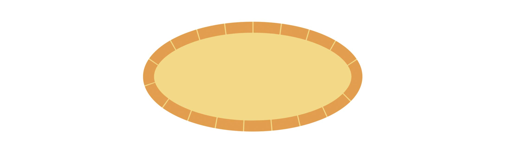
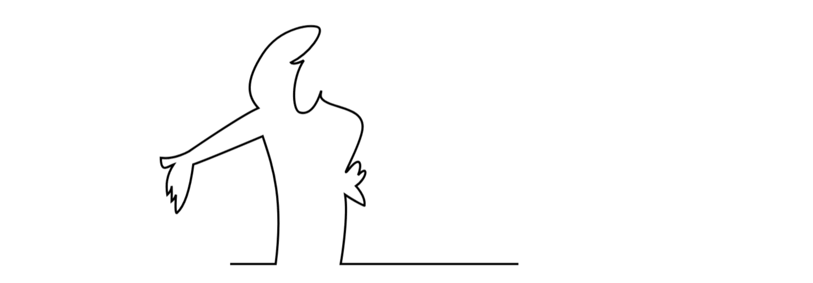
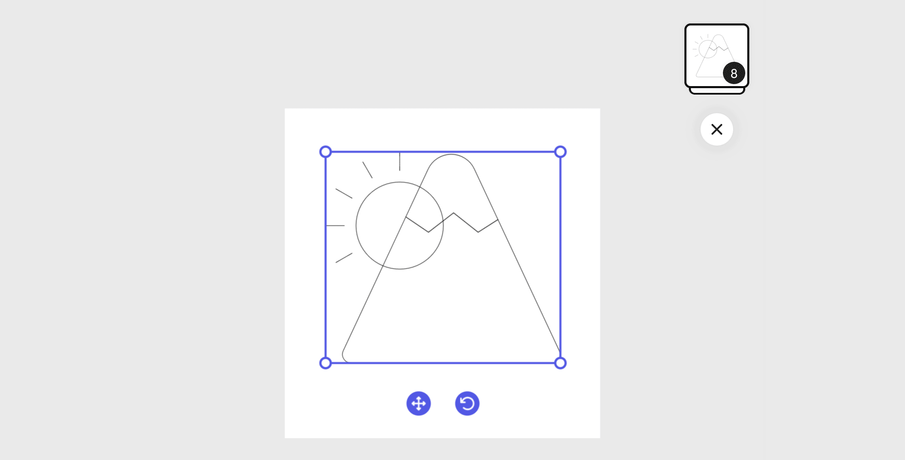
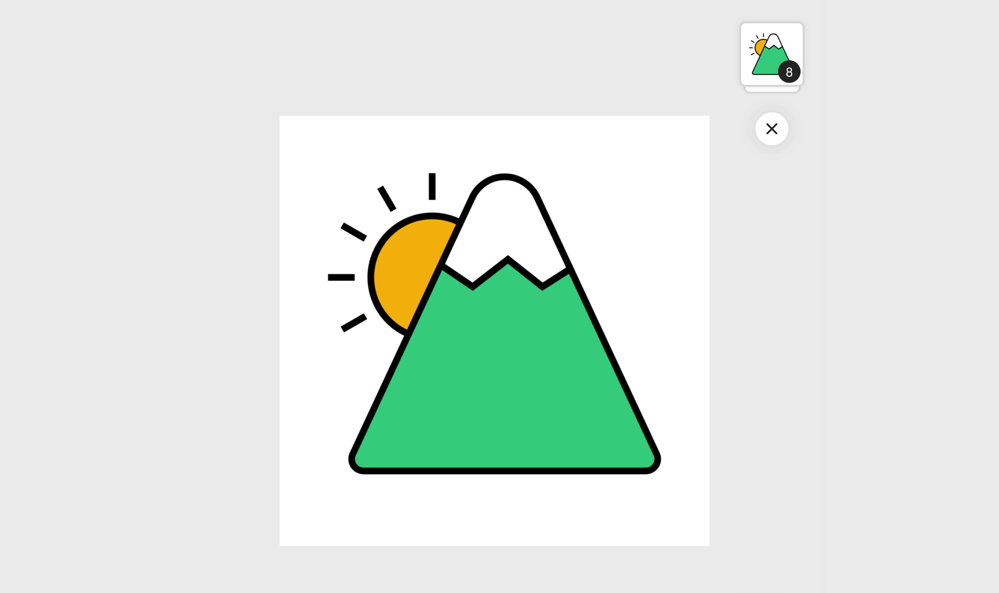

---
keywords:
  - Adobe Express
  - Express Add-on SDK
  - Express Editor
  - Adobe Express
  - Add-on SDK
  - SDK
  - JavaScript
  - Extend
  - Extensibility
  - API
  - Shapes
  - Geometry
  - Rectangle
  - Ellipse
  - Path
title: Use Geometry
description: Use Geometry.
contributors:
  - https://github.com/undavide
---

# Use Geometry

## Create Shapes

Adobe Express provides a set of geometric shapes that you can create and style programmatically. These shapes are instances of the [`RectangleNode`](../../../references/document-sandbox/document-apis/classes/rectangle-node.md) and [`EllipseNode`](../../../references/document-sandbox/document-apis/classes/ellipse-node.md) classes, and you can draw them using the [`editor.createRectangle()`](../../../references/document-sandbox/document-apis/classes/editor.md#createrectangle) and [`editor.createEllipse()`](../../../references/document-sandbox/document-apis/classes/editor.md#createellipse) methods, respectively.

### Example: Add a Rectangle

```js
// sandbox/code.js
import { editor } from "express-document-sdk";

const rect = editor.createRectangle();

// Define rectangle dimensions.
rect.width = 100;
rect.height = 100;

// The current page, where the rectangle will be placed
const currentPage = editor.context.currentPage;

// Append the rectangle to the page.
currentPage.artboards.first.children.append(rect);
```

<InlineAlert slots="header, text, text1" variant="warning"/>

**Create vs. Add to the page**

Factory methods such as `createRectangle()` and `createEllipse()` don't automatically add the shape to the page; while is exists and you can manipulate its properties, it won't be visible until you append it to **a container** like an [Artboard](../../../references/document-sandbox/document-apis/classes/artboard-node.md), a [Group](./group-elements.md), or any other instance of a class that implements the [`ContainerNode`](../../../references/document-sandbox/document-apis/interfaces/container-node.md) interface.

You usually reference the container using [`editor.context`](../../../references/document-sandbox/document-apis/classes/context.md), which provides access to the current page, selection, and other useful properties.

Please note that you can append multiple shapes at once with the `append()` method:

```js
const s1 = editor.createRectangle();
const s2 = editor.createEllipse();
// ... set all properties ...

editor.context.currentPage.artboards.first.children.append(s1, s2); // 👈
```

### Example: Add an Ellipse

Ellipses don't have a `width` and `height` properties, but a [`rx`](../../../references/document-sandbox/document-apis/classes/ellipse-node.md#rx) and [`ry`](../../../references/document-sandbox/document-apis/classes/ellipse-node.md#ry) (radius x, radius y) instead.

<InlineAlert slots="text" variant="warning"/>

An ellipse with a radius of 200 on the x-axis and 100 on the y-axis will result in a shape with 400 wide (`rx` times two) and a 200 tall (`ry` times two)!

```js
// sandbox/code.js
import { editor } from "express-document-sdk";

const ellipse = editor.createEllipse();
ellipse.rx = 200; // radius x 👈
ellipse.ry = 100; // radius y 👈

console.log(ellipse.boundsLocal);
// { x: 0, y: 0, width: 400, height: 200 } 👈 mind the actual bounds!

// The current page, where the rectangle will be placed
const currentPage = editor.context.currentPage;

// Append the rectangle to the page.
currentPage.artboards.first.children.append(rect);
```

### Example: Style Shapes

Shapes have `fill` and `stroke` properties that you can use to style them. The following example demonstrates how to create a rectangle with a fill and a stroke.

```js
// sandbox/code.js
import { editor, colorUtils, constants } from "express-document-sdk";

// Create the shape
const ellipse = editor.createEllipse();
ellipse.rx = 200;
ellipse.ry = 100;

// 👇 Apply the fill color
ellipse.fill = editor.makeColorFill(colorUtils.fromHex("#F3D988"));

// 👇 Create the stroke
const stroke = editor.makeStroke({
  color: colorUtils.fromHex("#E29E4E"),
  width: 20,
  position: constants.StrokePosition.inside,
  dashPattern: [50, 2],
});

// 👇 Apply the stroke
ellipse.stroke = stroke;

// Add the shape to the document
editor.context.insertionParent.children.append(ellipse);
```



<InlineAlert slots="text" variant="info"/>

If you need a refresher on how to create and apply colors, check out [Using Colors](./use-color.md).

## Create Paths

Paths are a versatile tool to create complex shapes in Adobe Express. The [`editor.createPath()`](../../../references/document-sandbox/document-apis/classes/editor.md#createpath) method returns an instance of the [`PathNode`](../../../references/document-sandbox/document-apis/classes/path-node.md) class, and accepts one [SVG string](https://developer.mozilla.org/en-US/docs/Web/SVG/Tutorial/Paths) as the input.

### Example: Single path

```js
// sandbox/code.js
import { editor } from "express-document-sdk";

const p1 = editor.createPath(
  `M224,151L142,151C142,151 145.69,129.772 144,119C147.578,121.515 153.324,124.558 153,124C153.551,119.627 149,115 149,115C154.041,111.701 155.245,104.477 150,110C151.775,105.754 151.55,100.222 146,107C140.45,113.778 150.733,97.726 152,89C153.267,80.274 143.163,79.42 137,77C130.837,74.58 133.264,72.337 133,71C130.052,80.34 126.261,82.078 123,81C119.567,79.866 119.164,65.513 125,57C120.007,59.519 119,58 119,58C128.157,53.412 134.031,44.13 132,42C129.969,39.87 114.451,41.06 106,54C97.549,66.94 99.126,73.868 104,79C96.435,82.127 72,99 72,99C72,99 65.521,102.836 59,102C59.031,109.474 62.37,105.88 65,105C61.399,110.264 61.382,114.8 62,119C64.225,116.9 64,115 64,115C64,115 64.124,118.136 64,122C65.53,120.78 66,119 66,119C66,119 65.324,128.405 66.474,127.387C69.247,124.933 72.234,118.577 74,105C78.171,103.746 106,92 106,92C109.996,104.248 115.941,119.738 112,151L91,151`
);

editor.context.insertionParent.children.append(p1);
```



### Example: Multiple paths

Combining and grouping multiple paths, you can create complex shapes, like in the following example:

```js
// sandbox/code.js
import { editor } from "express-document-sdk";

const p1 = editor.createPath(
  `M310,222 A92,92 0 1,0 126,222 A92,92 0 1,0 310,222 Z`
);
const p2 = editor.createPath(
  `M425.096,209.235 
    C425.096,209.235 520.492,413.969 554.392,486.722 
    C556.956,492.226 556.533,498.659 553.270,503.779 
    C550.007,508.900 544.355,512.000 538.283,512.000 
    C453.556,512.000 199.784,512.000 115.057,512.000 
    C108.985,512.000 103.333,508.900 100.070,503.779 
    C96.807,498.659 96.384,492.226 98.948,486.722 
    C133.289,413.023 230.896,203.545 230.896,203.545 
    L278.678,236.000 L331.559,195.000 L383.266,236.000 L425.096,209.235 Z`
);
const p3 = editor.createPath(
  `M230.896,203.545 
    L278.041,102.365 
    C286.849,83.461 305.815,71.375 326.670,71.375 
    C347.525,71.375 366.491,83.461 375.299,102.365 
    L425.096,209.235 L383.266,236.000 L331.559,195.000 
    L278.678,236.000 L230.896,203.545 Z`
);
const p4 = editor.createPath(`M218,106 L218,66`);
const p5 = editor.createPath(`M160.074,121.590 L140.074,87.150`);
const p6 = editor.createPath(`M117.878,164.193 L83.138,144.193`);
const p7 = editor.createPath(`M101.831,222.119 L61.831,222.119`);
const p8 = editor.createPath(`M118.076,280.194 L83.336,300.194`);

const g = editor.createGroup();
g.children.append(p1, p2, p3, p4, p5, p6, p7, p8);

editor.context.insertionParent.children.append(g);
```



### Example: Add Fills and Strokes

`PathNode` instances have `fill` and `stroke` properties that you can use to style the path, very much like, say, a [`RectangleNode`](../../../references/document-sandbox/document-apis/classes/rectangle-node.md). In the code snippet below, we're going to add some life to the path from the previous example.

```js
// sandbox/code.js
import { editor } from "express-document-sdk";

const p1 = editor.createPath(/* same as before... */);
const p2 = editor.createPath(/* same as before... */);
const p3 = editor.createPath(/* same as before... */);
const p4 = editor.createPath(/* same as before... */);
const p5 = editor.createPath(/* same as before... */);
const p6 = editor.createPath(/* same as before... */);
const p7 = editor.createPath(/* same as before... */);
const p8 = editor.createPath(/* same as before... */);

const g = editor.createGroup();
g.children.append(p1, p2, p3, p4, p5, p6, p7, p8);

// Create a black stroke to apply to all paths
const blackStroke = editor.makeStroke({
  color: colorUtils.fromRGB(0, 0, 0, 1),
  width: 10,
});

// Apply the stroke to all paths in the group
for (const path of g.children) {
  path.stroke = blackStroke;
}

// Apply different fills to the paths
p1.fill = editor.makeColorFill(colorUtils.fromHex("#f2af0d"));
p2.fill = editor.makeColorFill(colorUtils.fromHex("#33cc7b"));
p3.fill = editor.makeColorFill(colorUtils.fromHex("#ffffff"));

editor.context.insertionParent.children.append(g);
```


