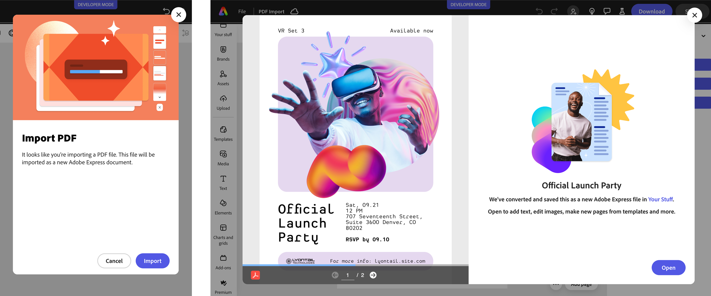

---
keywords:
  - Adobe Express
  - Express Add-on SDK
  - Express Editor
  - Adobe Express
  - Add-on SDK
  - SDK
  - JavaScript
  - Extend
  - Extensibility
  - API
  - PDF Import
  - PowerPoint Import
  - importPdf
  - importPresentation
title: Use PDF and PowerPoint
description: Use PDF and PowerPoint.
contributors:
  - https://github.com/undavide
  - https://github.com/hollyschinsky
faq:
  questions:
    - question: "How do I import PDF files?"
      answer: 'Call `addOnUISdk.app.document.importPdf(blob, attributes)` with PDF blob and MediaAttribute object.'

    - question: "How do I import PowerPoint files?"
      answer: 'Call `addOnUISdk.app.document.importPresentation(blob, attributes)` with PowerPoint blob and MediaAttribute.'

    - question: "What PowerPoint formats are supported?"
      answer: "Only the `.pptx` format is supported. The legacy `.ppt` format is not supported."

    - question: "Are MediaAttributes required for PDF/PowerPoint?"
      answer: "Yes, title is mandatory and author is optional in the MediaAttribute object."

    - question: "What is the sourceMimeType parameter for?"
      answer: 'Use `sourceMimeType` in MediaAttributes to improve UX when importing converted documents. It shows "Import a document" instead of "Import a PDF" in the consent dialog.'

    - question: "When should I use sourceMimeType?"
      answer: "Use it when importing PDFs that were converted from other document types like Word (`.docx`) or Google Docs (`.gdoc`) to provide clearer messaging to users."

    - question: "What values does sourceMimeType accept?"
      answer: 'Common values include "docx" for Word documents and "gdoc" for Google Docs. Use the original document format before PDF conversion.'

    - question: "Will users see a consent dialog?"
      answer: "Yes, PDF and PowerPoint imports trigger consent dialogs that users must confirm."

    - question: "Can I bypass the consent dialog?"
      answer: "No, the consent dialog cannot be bypassed for PDF and PowerPoint imports."

    - question: "Are vector elements preserved?"
      answer: "Yes, supported vector elements like shapes and text remain editable after import."

    - question: "How many pages are imported?"
      answer: "All pages from PDF and PowerPoint files are imported into the document."

    - question: "What are the file size limits for importing PDFs and PowerPoint files?"
      answer: "For current file size limits and detailed import requirements, see [Import files from other apps](https://helpx.adobe.com/express/web/bring-in-assets-from-other-apps/import-files-from-other-apps/import-files.html) in the Express help documentation."

    - question: "Why did animations, audio, or video get lost after importing a presentation?"
      answer: "During conversion to Express format, advanced animations and embedded media may not be supported. Simplify the source file before import and re-add media directly in Adobe Express for better compatibility. See [Presentation import limitations and tips](#presentation-import-limitations-and-tips)."
---

# Use PDF and PowerPoint

## Import PDF into the page

You can add PDFs to the page using the [`importPdf()`](../../../references/addonsdk/app-document.md#importpdf) method of the `addOnUISdk.app.document` object, which expects a `Blob` object as an argument and a [`MediaAttribute`](../../../references/addonsdk/app-document.md#mediaattributes) object with a title (mandatory) and author (optional) as the second.

PDF and PowerPoint imports will trigger a consent dialog that asks the user to confirm the process; it's not possible to bypass it. As soon as the process starts, another dialog will preview the PDF and track the operation progress.

<InlineAlert slots="text" variant="info"/>

The SDK shows a built-in progress dialog; there is no progress callback exposed.



Supported vector elements will be kept editable (e.g., shapes with rounded corners, text, etc.), and all pages will be imported.

### Example

```js
import addOnUISdk from "https://express.adobe.com/static/add-on-sdk/sdk.js";

addOnUISdk.ready.then(async () => {
  try {
    const pdfUrl = "https://url/to/your/file.pdf";

    const pdf = await fetch(pdfUrl);
    const pdfBlob = await pdf.blob();

    await addOnUISdk.app.document.importPdf(
      pdfBlob, // 👈 Blob object
      {
        title: "Official Launch Party",
        author: "Adobe",
      }
    );
  } catch (e) {
    console.error("Failed to add the PDF", e);
  }
});
```

Please note that you can use `fetch()` also to get PDFs that are local to the add-on; in this case, you can use paths relative to the add-on's root.

```js
import addOnUISdk from "https://express.adobe.com/static/add-on-sdk/sdk.js";

addOnUISdk.ready.then(async () => {
  try {
    // 👇 Local PDF
     const pdfUrl = "./OfficialLaunchParty.pdf";
    const pdf = await fetch(pdfUrl);
    // ... same as before
```

### Importing converted documents

If your add-on converts Word documents (`.docx`) or Google Docs (`.gdoc`) to PDF before importing, you can use the `sourceMimeType` parameter to improve the user experience. When specified, the import consent dialog displays the message "Import a document" rather than the default "Import a PDF".

```js
// Import a PDF that was converted from a Word document
await addOnUISdk.app.document.importPdf(convertedPdfBlob, {
  title: "Converted Document",
  sourceMimeType: "docx" // Shows "Import a document" in the dialog
});
```

## Import presentation into the page

For PowerPoint files, the process is similar to the one for PDFs, but use the [`importPresentation()`](../../../references/addonsdk/app-document.md#importpresentation) method instead. Express supports only the `.pptx` format; the legacy `.ppt` format is not supported. The method shows the same consent and progress dialog as for PDF import.

```js
import addOnUISdk from "https://express.adobe.com/static/add-on-sdk/sdk.js";

addOnUISdk.ready.then(async () => {
  try {
    const powerPointUrl = "https://url/to/your/file.pptx";
    // Or for local files: const powerPointUrl = "./OfficialLaunchParty.pptx";
    // Note: Only .pptx is supported; .ppt is not supported.

    const powerPoint = await fetch(powerPointUrl);
    const powerPointBlob = await powerPoint.blob();

    await addOnUISdk.app.document.importPresentation(
      powerPointBlob, // 👈 Blob object
      {
        title: "Official Launch Party",
        author: "Adobe",
      }
    );
  } catch (e) {
    console.error("Failed to add the presentation", e);
  }
});
```

### Presentation import limitations and tips

When importing presentations (such as PowerPoint `.pptx` files) into Adobe Express, the file is converted into an editable Express format. During conversion, complex elements may be removed, flattened, or converted to static content.

#### Limitations on imported content

- **Animations:** Advanced PowerPoint animations, triggers, and custom entrance/exit effects are generally not supported. Basic transitions may be lost or simplified.
- **Audio and Video:** Embedded audio and video in the original presentation may fail to import or play.
- **Formatting and Fonts:** Custom fonts, specialized shapes, and complex layouts may render differently after import.

#### Tips for successful import

- **Convert to PDF first:** For stronger visual fidelity, save the presentation as a PDF before importing. Keep in mind this approach can make content less editable.
- **Simplify before import:** Remove complex animations and embedded media in the source presentation to reduce conversion issues.
- **Re-add media in Express:** After import, upload audio/video directly in Adobe Express for better compatibility.
- **Prefer H.264 video:** If video imports, H.264-encoded media is typically more stable.

If import fails entirely, check file size and unsupported elements. For current size limits and supported import details, see [Import files from other apps](https://helpx.adobe.com/express/web/bring-in-assets-from-other-apps/import-files-from-other-apps/import-files.html).

## FAQs

#### Q: How do I import PDF files?

**A:** Call `addOnUISdk.app.document.importPdf(blob, attributes)` with PDF blob and MediaAttribute object.

#### Q: How do I import PowerPoint files?

**A:** Call `addOnUISdk.app.document.importPresentation(blob, attributes)` with PowerPoint blob and MediaAttribute.

#### Q: What PowerPoint formats are supported?

**A:** Only the `.pptx` format is supported. The legacy `.ppt` format is not supported.

#### Q: Are MediaAttributes required for PDF/PowerPoint?

**A:** Yes, title is mandatory and author is optional in the MediaAttribute object.

#### Q: What is the sourceMimeType parameter for?

**A:** Use `sourceMimeType` in MediaAttributes to improve UX when importing converted documents. It shows "Import a document" instead of "Import a PDF" in the consent dialog.

#### Q: When should I use sourceMimeType?

**A:** Use it when importing PDFs that were converted from other document types like Word (`.docx`) or Google Docs (`.gdoc`) to provide clearer messaging to users.

#### Q: What values does sourceMimeType accept?

**A:** Common values include "docx" for Word documents and "gdoc" for Google Docs. Use the original document format before PDF conversion.

#### Q: Will users see a consent dialog?

**A:** Yes, PDF and PowerPoint imports trigger consent dialogs that users must confirm.

#### Q: Can I bypass the consent dialog?

**A:** No, the consent dialog cannot be bypassed for PDF and PowerPoint imports.

#### Q: Are vector elements preserved?

**A:** Yes, supported vector elements like shapes and text remain editable after import.

#### Q: How many pages are imported?

**A:** All pages from PDF and PowerPoint files are imported into the document.

#### Q: What are the file size limits for importing PDFs and PowerPoint files?

**A:** For current file size limits and detailed import requirements, see [Import files from other apps](https://helpx.adobe.com/express/web/bring-in-assets-from-other-apps/import-files-from-other-apps/import-files.html) in the Express help documentation.

#### Q: Why did animations, audio, or video get lost after importing a presentation?

**A:** During conversion to Express format, advanced animations and embedded media may not be supported. Simplify the source file before import and re-add media directly in Adobe Express for better compatibility. See [Presentation import limitations and tips](#presentation-import-limitations-and-tips).
