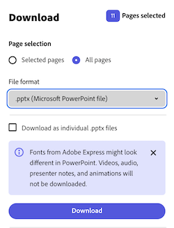

---
keywords:
  - Adobe Express Add-on SDK
  - JavaScript
  - createRenditions
  - RenditionFormat
  - RenditionIntent
  - RenditionOptions
  - exportAllowed
  - file download
  - export
  - preview
  - print
  - addOnUISdk
  - app.document
  - exporting
  - output
  - PNG
  - PDF
  - PPTX
  - MP4
  - document publishing
title: Create Renditions
description: Learn how to export Adobe Express documents in different formats like JPG, PNG, PDF, and PPTX using the createRenditions API.
contributors:
  - https://github.com/undavide
  - https://github.com/hollyschinsky
faq:
  questions:
    - question: "How do I create a rendition?"
      answer: "Call `addOnUISdk.app.document.createRenditions(options, intent)` to export pages in different formats."

    - question: "What file formats are supported?"
      answer: "JPG, PNG, MP4, PDF, and PPTX formats via `addOnUISdk.constants.RenditionFormat`."

    - question: "How do I export content for download?"
      answer: "Create rendition, convert blob to URL with `URL.createObjectURL()`, then use anchor element to trigger download."

    - question: "What permissions are needed for downloads?"
      answer: 'Add `"allow-downloads"` to the `"sandbox"` array in manifest permissions.'

    - question: "Should I check export permissions before creating renditions?"
      answer: "Yes, always call `await addOnUISdk.app.document.exportAllowed()` before using `RenditionIntent.export` or `RenditionIntent.print` to avoid approval error dialogs."

    - question: "When do I need to check exportAllowed()?"
      answer: "Check before creating renditions with `RenditionIntent.export` or `RenditionIntent.print`. Preview renditions with `RenditionIntent.preview` are always allowed."

    - question: "What happens if I don't check export permissions first?"
      answer: 'Users may see error dialogs like "Request approval" and "Get approval from your viewers before sharing this file" in collaborative workflows.'

    - question: "What should I do when export is not allowed?"
      answer: "Create preview renditions instead using `RenditionIntent.preview`, show informational messages, and display content in UI only without download options."

    - question: "What is the preview intent for?"
      answer: "Preview intent creates renditions for processing or display only, not for download or sharing."

    - question: "How do I set JPG quality?"
      answer: "Use `quality` property (0-1 range) in `JpgRenditionOptions`."

    - question: "What's required for preview intent?"
      answer: 'Set `"renditionPreview": true` in manifest requirements section.'

    - question: "How do I export the current page only?"
      answer: "Use `range: addOnUISdk.constants.Range.currentPage` in rendition options."
---

# Create Renditions

Renditions are different output versions of a document made for specific purposes; for example, a high-quality PDF for printing or a smaller JPG for sharing online.

## What Are Renditions Used For?

- Download and sharing
- Preview and processing
- Print preparation
- Document publishing
- Cross-platform compatibility

## Quick Start

The following snippet shows the basic API call to create a rendition for download (export intent) of the current page in PNG format. This is the core method - see the [complete example](#example) below for a full implementation with permissions, error handling, and file download.

```js
// Basic rendition creation - core API call
const rendition = await addOnUISdk.app.document.createRenditions(
  // renditionOptions
  {
    range: addOnUISdk.constants.Range.currentPage,
    format: addOnUISdk.constants.RenditionFormat.png,
  },
  // renditionIntent
  addOnUISdk.constants.RenditionIntent.export
);

// rendition[0].blob contains the generated file data
console.log("Generated:", rendition[0].blob.type); // "image/png"
```

## Basic Usage

The `createRenditions` method is used to create renditions of the current page or the entire document in different formats. The method accepts two parameters:

1. [`renditionOptions`](../../../references/addonsdk/app-document.md#renditionoptions): controls the page range that is meant to be exported and the file format (`jpg`, `png`, `mp4`, `pdf`, and `pptx`).
2. [`renditionIntent`](../../../references/addonsdk/addonsdk-constants.md) constant (optional): controls the intent of the exported content (`preview`, `export`, `print`).

### Supported Formats

Export your designs as:

- JPG - Optimized for photos and social media
- PNG - Perfect for graphics with transparency
- MP4 - For video content
- PDF - Professional documents and printing
- PPTX - PowerPoint presentations

### Page Ranges

Target specific content:

- `currentPage` - Export just the current page
- `entireDocument` - Export all pages

### Rendition Intents

Control how the content is used:

- `preview` - For display only (no download)
- `export` - For download and sharing
- `print` - For printing workflows

## Export Permissions and Collaborative Workflows

The `exportAllowed()` method determines whether the current document can be exported based on its review status in collaborative workflows. This applies mainly to [enterprise customers using Adobe Express's review and approval features](https://business.adobe.com/products/workfront/integrations/express.html), where documents may be restricted from export until approved by designated reviewers.

Before creating renditions for export or print purposes, you can check that it's permitted first using the [`exportAllowed()`](../../../references/addonsdk/app-document.md#exportallowed) method:

```js
// Check export permissions before creating non-preview renditions
const canExport = await addOnUISdk.app.document.exportAllowed();

if (!canExport) {
  // Export/print not allowed, but preview renditions are still permitted
  console.log("Export restricted - only preview available");

  // Create preview rendition (always allowed)
  const previewRendition = await addOnUISdk.app.document.createRenditions(
    { range: addOnUISdk.constants.Range.currentPage, format: addOnUISdk.constants.RenditionFormat.png },
    addOnUISdk.constants.RenditionIntent.preview
  );
  // ... show in UI only, don't allow download
  return;
}

// Proceed with export renditions if allowed
```

<InlineAlert slots="text" variant="info"/>

**Important:** This check is only necessary for `RenditionIntent.export` and `RenditionIntent.print`. Renditions created with `RenditionIntent.preview` are always allowed, regardless of the document's review status.

**Why check export permissions first?** If you skip this check and attempt to create export/print renditions when the document doesn't allow exports, users may see an error message such as "Request approval" and "Get approval from your viewers before sharing this file". Checking `exportAllowed()` first lets you provide a better user experience by either offering preview-only options or explaining why export is restricted.

<InlineAlert slots="text" variant="info"/>

To allow the user to download the rendition, the **"permissions"** section should include `"allow-downloads"` in the `"sandbox"` array.

```json
{
  "testId": "cbe48204-578d-47cc-9ad4-a9aaa81dc3d3",
  "name": "Hello World", "version": "1.0.0", "manifestVersion": 2,
  "requirements": {
    "apps": [ { "name": "Express", "apiVersion": 1 } ],
  },
  "entryPoints": [
    {
      "type": "panel", "id": "panel1", "main": "index.html",
      "documentSandbox": "sandbox/code.js",
      "permissions": {
        "sandbox": [
          "allow-popups-to-escape-sandbox",
          "allow-popups",
          "allow-downloads" 👈 👀
        ]
      }
    }
  ]
}
```

## The Preview Intent

When the `renditionIntent` is set to `RenditionIntent.preview`, the output is created for **preview purposes only**. This means that the rendition is not meant to be downloaded or shared; for example, because the user is not on a paid Adobe Express plan and the design contains Premium content.

In this case, preview renditions are used either for processing purposes (e.g., if the add-on needs to perform data analysis on the design), or to be displayed in the add-on's panel or in a new window—making sure users cannot extract the content. Please see [this page](./premium_content.md#allow-only-the-preview-of-premium-content) for more detail on handling such scenarios.

<InlineAlert slots="text" variant="info"/>

When the `renditionIntent` is set to `RenditionIntent.preview`, you must add to the `manifest.json` a `"renditionPreview"` flag set to `true` in the **"requirements"** section.

```json
{
  "testId": "cbe48204-578d-47cc-9ad4-a9aaa81dc3d3",
  "name": "Hello World", "version": "1.0.0", "manifestVersion": 2,
  "requirements": {
    "apps": [ { "name": "Express", "apiVersion": 1 } ],
    "renditionPreview": true 👈 👀
  },
  "entryPoints": [
    // ...
  ]
}
```

## Export and Download Workflow

Use the `createRenditions` method to allow users to download or share your content in different formats. This is a multi-step process that involves:

1. **Creating a new rendition** based on specific export configuration options via the [`createRendition()`](../../../references/addonsdk/app-document.md#createrenditions) method of the `addOnUISdk.app.document` object.
2. **Converting** the returned `blob` object into a URL via the `URL.createObjectURL()` method.
3. **Creating a downloadable link** for the user to download the rendition, e.g., using the URL string from the previous step as the `href` attribute of an `<a>` element.

### Example

This complete example builds on the [Quick Start](#quick-start) above by adding production-ready features: permission checks, error handling, [export restrictions](#export-permissions-and-collaborative-workflows), and file downloads. The example creates a PNG rendition of the current page when the user clicks a button.

```js
import addOnUISdk from "https://express.adobe.com/static/add-on-sdk/sdk.js";

addOnUISdk.ready.then(async () => {
  // Attach the rendition creation to a button click event
  document
    .querySelector("#download-button")
    .addEventListener("click", async () => {
      // Check if export is allowed (prevents "Request approval" error dialog)
      const canExport = await addOnUISdk.app.document.exportAllowed();

      if (!canExport) {
        try {
            // Show informational message for preview
            let dialogOptions = {
              variant: "information",
              title: "Requires approval",
              description:
                "Content export/download is restricted while the document is under review and requires approval. Showing preview instead.",
              buttonLabels: { primary: "Ok", cancel: "Cancel" },
            };
            const result = await addOnUISdk.app.showModalDialog(dialogOptions);
            console.log("Button type clicked " + result.buttonType);
        } catch (error) {
            console.log("Error showing modal dialog:", error);
        }

        // Create preview rendition (always allowed). You will need to add the `"renditionPreview"` flag to the `manifest.json` file in order to create preview renditions.
        const previewRendition = await addOnUISdk.app.document.createRenditions(
          {
            range: addOnUISdk.constants.Range.currentPage,
            format: addOnUISdk.constants.RenditionFormat.png,
          },
          addOnUISdk.constants.RenditionIntent.preview
        );

        // Display preview in UI only (don't trigger download)
        const previewUrl = URL.createObjectURL(previewRendition[0].blob);
        const img = document.createElement("img");
        img.src = previewUrl;
        document.body.appendChild(img);
        return;
      }

      // Create a rendition for download (export intent)
      const rendition = await addOnUISdk.app.document.createRenditions(
        // renditionOptions
        {
          range: addOnUISdk.constants.Range.currentPage,
          format: addOnUISdk.constants.RenditionFormat.png,
        },
        // renditionIntent
        addOnUISdk.constants.RenditionIntent.export
      );

      console.log("Renditions created: ", rendition);
      // [{
      //   type: "page",
      //   blob: { size: 16195, type: "image/png" },
      //   title: "",
      //   metadata: { ... },
      // }];

      // Convert the blob into a URL to be consumed by an anchor element
      const downloadUrl = URL.createObjectURL(rendition[0].blob);

      // Create a temp/disposable anchor element to trigger the download
      const a = document.createElement("a");
      a.href = downloadUrl; // Set the URL
      a.download = "Preview_rendition.png"; // Set the desired file name
      document.body.appendChild(a); // Add the anchor to the DOM
      a.click(); // Trigger the download
      document.body.removeChild(a); // Clean up
      URL.revokeObjectURL(downloadUrl); // Release the object URL
    });
});
```

<InlineAlert slots="text" variant="info"/>

For more details and example code, see the [`createRenditions()`](../../../references/addonsdk/app-document.md#createrenditions) API References.

## Advanced Rendition Options

The Adobe Express Add-on SDK provides **specialized rendition options** for different file formats, such as [`JpgRenditionOptions`](../../../references/addonsdk/app-document.md#jpgrenditionoptions), [`PngRenditionOptions`](../../../references/addonsdk/app-document.md#pngrenditionoptions), [`PdfRenditionOptions`](../../../references/addonsdk/app-document.md#pdfrenditionoptions), and [`PptxRenditionOptions`](../../../references/addonsdk/app-document.md#pptxrenditionoptions). Each format has specific properties that can be set to control the output of the rendition.

<InlineAlert slots="text" variant="info"/>

**Note:** When `renditionIntent` is not specified in the examples below, it defaults to `RenditionIntent.export`. This means the renditions are created for download and sharing purposes.

### JPG Quality and Size Options

The following example shows how to create a rendition of the current page in JPG format with a quality of 85% and a requested size of 600x600 pixels.

```js
const jpgRendition = await addOnUISdk.app.document.createRenditions(
  // JpgRenditionOptions
  {
    range: addOnUISdk.constants.Range.currentPage,
    format: addOnUISdk.constants.RenditionFormat.jpg,
    // number in the range [0, 1]
    quality: 0.85,
    // no upscaling, result depends on the original image size/ratio
    requestedSize: { width: 600, height: 600 },
  }
);
```

### PNG Transparency and File Size Limits

The example below shows how to create a rendition of the current page in PNG format with a transparent background, a strict file size limit of 500KB, and a requested size of 800x600 pixels.

```js
const pngRendition = await addOnUISdk.app.document.createRenditions(
  // PngRenditionOptions
  {
    range: addOnUISdk.constants.Range.currentPage,
    format: addOnUISdk.constants.RenditionFormat.png,
    // Transparent background for web overlays
    backgroundColor: 0x00000000,
    // Strict file size limit for fast web loading
    fileSizeLimit: 500,
    fileSizeLimitUnit: addOnUISdk.constants.FileSizeLimitUnit.KB,
    // Web-friendly dimensions
    requestedSize: { width: 800, height: 600 },
  }
);
```

### PDF Bleed Settings

Use the `bleed` and `margin` properties from the `PdfRenditionOptions` interface to control the bleed and margin of the PDF rendition, as shown in the example below.

```js
const pdfRendition = await addOnUISdk.app.document.createRenditions(
  // PdfRenditionOptions
  {
    range: addOnUISdk.constants.Range.currentPage,
    format: addOnUISdk.constants.RenditionFormat.pdf,
    bleed: { amount: 5, unit: addOnUISdk.constants.BleedUnit.mm },
  }
);
```

### PPTX Multi-Page Export

The following example shows how to create a rendition of the entire document in PPTX format.

```js
const pptxRenditions = await addOnUISdk.app.document.createRenditions(
  // PptxRenditionOptions
  {
    range: addOnUISdk.constants.Range.entireDocument,
    format: addOnUISdk.constants.RenditionFormat.pptx,
  }
);
```

<InlineAlert slots="text1, text2" variant="info"/>

**PPTX Export Considerations:** PPTX export is only available for presentation-type documents in Adobe Express. When implementing PPTX export in your add-on, consider informing users that fonts from Adobe Express might look different in PowerPoint, and that videos, audio, presenter notes, and animations will not be included in the exported file. Adobe Express displays a similar disclaimer when users download PPTX files directly from the app, shown below:



Please also check out the [export-sample add-on](../samples.md#export-sample) for a comple add-on sample using `createRenditions()`.

## FAQs

#### Q: How do I create a rendition?

**A:** Call `addOnUISdk.app.document.createRenditions(options, intent)` to export pages in different formats.

#### Q: What file formats are supported?

**A:** JPG, PNG, MP4, PDF, and PPTX formats via `addOnUISdk.constants.RenditionFormat`.

#### Q: How do I export content for download?

**A:** Create rendition, convert blob to URL with `URL.createObjectURL()`, then use anchor element to trigger download.

#### Q: What permissions are needed for downloads?

**A:** Add `"allow-downloads"` to the `"sandbox"` array in manifest permissions.

#### Q: Should I check export permissions before creating renditions?

**A:** Yes, always call `await addOnUISdk.app.document.exportAllowed()` before using `RenditionIntent.export` or `RenditionIntent.print` to avoid approval error dialogs.

#### Q: When do I need to check exportAllowed()?

**A:** Check before creating renditions with `RenditionIntent.export` or `RenditionIntent.print`. Preview renditions with `RenditionIntent.preview` are always allowed.

#### Q: What happens if I don't check export permissions first?

**A:** Users may see error dialogs like "Request approval" and "Get approval from your viewers before sharing this file" in collaborative workflows.

#### Q: What should I do when export is not allowed?

**A:** Create preview renditions instead using `RenditionIntent.preview`, show informational messages, and display content in UI only without download options.

#### Q: What is the preview intent for?

**A:** Preview intent creates renditions for processing or display only, not for download or sharing.

#### Q: How do I set JPG quality?

**A:** Use `quality` property (0-1 range) in `JpgRenditionOptions`.

#### Q: What's required for preview intent?

**A:** Set `"renditionPreview": true` in manifest requirements section.

#### Q: How do I export the current page only?

**A:** Use `range: addOnUISdk.constants.Range.currentPage` in rendition options.

#### Q: What is the default rendition intent if I don't specify one?

**A:** The default `renditionIntent` is `RenditionIntent.export`, which creates renditions for download and sharing purposes.
