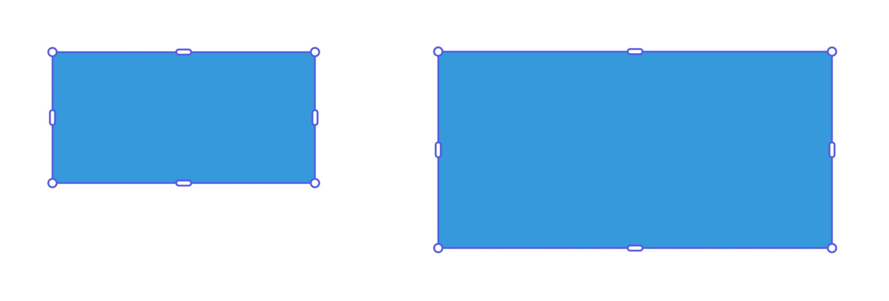
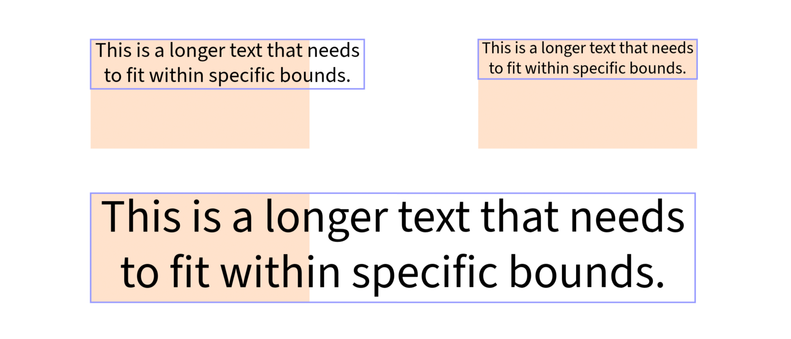

---
keywords:
  - Adobe Express
  - Express Add-on SDK
  - Express Editor
  - Adobe Express
  - Add-on SDK
  - SDK
  - JavaScript
  - Extend
  - Extensibility
  - API
  - Resize
  - ResizeBehavior
  - Proportional
  - Contain
  - Cover
  - Dimensions
  - Aspect Ratio
  - Visual Details
  - Stroke Width
title: Resize Elements
description: Resize Elements with the unified resize API.
contributors:
  - https://github.com/undavide
  - https://github.com/hollyschinsky
faq:
  questions:
    - question: "How do I resize an element?"
      answer: 'Use `node.resize()` with options specifying width/height, behavior, and visual detail preferences.'

    - question: "How do I resize proportionally by width?"
      answer: 'Call `node.resize({ width, behavior: ResizeBehavior.proportional, avoidScalingVisualDetailsIfPossible })` to maintain aspect ratio.'

    - question: "What's the difference between contain and cover behavior?"
      answer: 'Contain fits the element within bounds; cover ensures the element completely covers the specified area.'

    - question: "What does avoidScalingVisualDetailsIfPossible do?"
      answer: 'When true, tries to preserve stroke widths, corner radii, and font sizes at their original values.'

    - question: "Can I resize with only one dimension?"
      answer: 'Yes, use `proportional` behavior (which requires only one dimension) or `contain` behavior with just width or height specified.'

    - question: "How do I resize pages?"
      answer: 'Set `page.width` and `page.height` properties directly on the PageNode.'
---

# Resize Elements

Adobe Express provides a powerful unified API for resizing elements. The [`resize()`](../../../references/document-sandbox/document-apis/classes/Node.md#resize) method gives you fine-grained control over how elements change size, whether they maintain aspect ratios, and how visual details like strokes and fonts are affected.

<InlineAlert slots="text" variant="warning"/>

**IMPORTANT:** This API is currently **_experimental only_** and should not be used in any add-ons you will be distributing until it has been declared stable. To use it, you will first need to set the `experimentalApis` flag to `true` in the [`requirements`](../../../references/manifest/index.md#requirements) section of the `manifest.json`.

## Understanding Resize Behavior

The `resize()` method accepts a [`ResizeOptions`](../../../references/document-sandbox/document-apis/type-aliases/ResizeOptions.md) object with three mandatory components:

1. **Dimensions**: Specify `width`, `height`, or both.
2. **Behavior**: Controls aspect ratio handling via [`ResizeBehavior`](../../../references/document-sandbox/document-apis/enumerations/ResizeBehavior.md) enumeration.
3. **Visual Details**: Choose whether to scale strokes, corners detailing, etc.

### Resize Behaviors

Defined in the [`ResizeBehavior`](../../../references/document-sandbox/document-apis/enumerations/ResizeBehavior.md) enumeration.

- **`ResizeBehavior.contain`**: Fits the element entirely within the specified dimensions.
- **`ResizeBehavior.cover`**: Ensures the element completely covers the specified area.
- **`ResizeBehavior.proportional`**: Maintains the element's aspect ratio.

### Visual Details Flag

The `avoidScalingVisualDetailsIfPossible` flag determines how visual styling is handled:

- **`true`**: Preserves stroke widths, corner radii, etc.
- **`false`**: Scales all visual properties proportionally with the element.

## Proportional Resizing

Proportional resizing maintains the element's aspect ratio while changing its size. Specify either `width` or `height` (never both) and the other dimension will adjust automatically.

### Example: Resize by Width

```js
// sandbox/code.js
import { editor, colorUtils, constants } from "express-document-sdk";

// Create a rectangle
const rect = editor.createRectangle();
rect.width = 200;
rect.height = 100;
rect.translation = { x: 100, y: 100 };
rect.fill = editor.makeColorFill(colorUtils.fromHex("#3498db"));

editor.context.insertionParent.children.append(rect);

// Resize proportionally by width, scaling all visual details
rect.resize({
  width: 300,
  behavior: constants.ResizeBehavior.proportional,
  avoidScalingVisualDetailsIfPossible: false
});

console.log(`New dimensions: ${rect.width} x ${rect.height}`);
// New dimensions: 300 x 150
```



### Example: Resize by Height

```js
// sandbox/code.js
import { editor, colorUtils, constants } from "express-document-sdk";

const ellipse = editor.createEllipse();
ellipse.rx = 100; // radius x = 100 (width = 200)
ellipse.ry = 50;  // radius y = 50 (height = 100)
ellipse.translation = { x: 150, y: 100 };
ellipse.fill = editor.makeColorFill(colorUtils.fromHex("#F0B76C"));

editor.context.insertionParent.children.append(ellipse);

// Resize proportionally by height, scaling all visual details
ellipse.resize({
  height: 150,
  behavior: constants.ResizeBehavior.proportional,
  avoidScalingVisualDetailsIfPossible: false
});

console.log(`New bounds: ${ellipse.boundsLocal.width} x ${ellipse.boundsLocal.height}`);
// New bounds: 300 x 150
```


### Example: Preserve Visual Details

When `avoidScalingVisualDetailsIfPossible` is set to `true`, strokes and other visual details maintain their original size:

```js
// sandbox/code.js
import { editor, colorUtils, constants } from "express-document-sdk";

const rect = editor.createRectangle();
rect.width = 100;
rect.height = 100;
rect.translation = { x: 100, y: 100 };
rect.fill = editor.makeColorFill(colorUtils.fromHex("#3498db"));

// Add a 5px stroke
const stroke = editor.makeStroke({
  color: colorUtils.fromHex("#2c3e50"),
  width: 5,
  position: constants.StrokePosition.inside
});
rect.stroke = stroke;

editor.context.insertionParent.children.append(rect);

// Resize proportionally while preserving stroke width
rect.resize({
  width: 200,
  behavior: constants.ResizeBehavior.proportional,
  avoidScalingVisualDetailsIfPossible: true     // preserves stroke width
  // avoidScalingVisualDetailsIfPossible: false // scales stroke width
});

console.log(`Stroke width after resize: ${rect.stroke.width}px`);
// Stroke width after resize: 5px (unchanged)
```


## Contain Behavior

The `contain` behavior fits an element entirely within specified dimensions, similar to CSS `object-fit: contain`. Elements with fixed aspect ratios may leave unused space on one axis.

### Example: Contain Within Bounds (Shapes)

```js
// sandbox/code.js
import { editor, colorUtils, constants } from "express-document-sdk";

const ellipse = editor.createEllipse();
ellipse.rx = 100; // radius x = 100 (width = 200)
ellipse.ry = 50;  // radius y = 50 (height = 100)
ellipse.translation = { x: 150, y: 100 };
ellipse.fill = editor.makeColorFill(colorUtils.fromHex("#F0B76C"));

editor.context.insertionParent.children.append(ellipse);
// Fit within a 150x150 box
ellipse.resize({
  width: 150,
  height: 150,
  behavior: constants.ResizeBehavior.contain,
  avoidScalingVisualDetailsIfPossible: true
});

console.log(`Resized dimensions: ${ellipse.width} x ${ellipse.height}`);
// Resized dimensions: 150 x 150
```


<InlineAlert slots="header, text" variant="warning"/>

Shapes and Aspect Ratio

Please note that shapes are resized to fit within a bounding box **disregarding their aspect ratio**; they are free to extend or shrink on both axes.

### Example: Contain with One Dimension (Shapes)

You can specify only one dimension with `contain` behavior to adjust that dimension while ideally keeping the other fixed:

```js
// sandbox/code.js
import { editor, colorUtils, constants } from "express-document-sdk";

const ellipse = editor.createEllipse();
ellipse.rx = 100;
ellipse.ry = 75;
ellipse.translation = { x: 150, y: 150 };
ellipse.fill = editor.makeColorFill(colorUtils.fromHex("#e74c3c"));

editor.context.insertionParent.children.append(ellipse);

// Adjust width while attempting to preserve height
ellipse.resize({
  width: 300,
  behavior: constants.ResizeBehavior.contain,
  avoidScalingVisualDetailsIfPossible: true
});

console.log(`New bounds: ${ellipse.boundsLocal.width} x ${ellipse.boundsLocal.height}`);
```


### Example: Contain Within Bounds (Media)

Media elements (images, videos) maintain their aspect ratio; cropping may happen when the aspect ratio of the media does not match the aspect ratio of the container.

```js
// sandbox/code.js
import { editor, constants } from "express-document-sdk";

// Assuming the user has selected an Image node
const imageNode = editor.context.selection[0];

console.log(
  "Initial dimensions: " +
    imageNode.boundsLocal.width +
    " x " +
    imageNode.boundsLocal.height
);
// Initial dimensions: 300 x 200

imageNode.resize({
  width: 150,
  height: 150,
  behavior: constants.ResizeBehavior.contain,
  avoidScalingVisualDetailsIfPossible: true
});
console.log(
  "Resized dimensions: " +
    imageNode.boundsLocal.width +
    " x " +
    imageNode.boundsLocal.height
);
// Resized dimensions: 150 x 150
```


<InlineAlert slots="text, text1" variant="warning"/>

Note that the resize behavior for **media elements** can differ significantly from shapes, especially when **cropping** is involved.

This is because the **container** is resized to fit within the bounding box, while the **media** inside the container also needs to be adjusted to avoid blank space between the two.

For instance, in the next example we’ll start with the 150x150 image we resized earlier, trying to fit it within a 300x150 box. The results can be counterintuitive, since resize, under the hood, uses a combination of steps to achieve the final dimensions — but it lacks the contextual understanding that Adobe Express has when users interact with the UI. This means that API-based resize calls should always be validated afterward to ensure they produce the expected outcome.

```js
// sandbox/code.js
import { editor, constants } from "express-document-sdk";

// Assuming the user has selected an Image node
const imageNode = editor.context.selection[0];

console.log(
  "Initial dimensions: " +
    imageNode.boundsLocal.width +
    " x " +
    imageNode.boundsLocal.height
);
// Initial dimensions: 150 x 150

// Resize to fit within a 300x150 box
imageNode.resize({
  width: 300,
  height: 150,
  behavior: constants.ResizeBehavior.contain,
  avoidScalingVisualDetailsIfPossible: true
});

console.log(
  "Resized dimensions: " +
    imageNode.boundsLocal.width +
    " x " +
    imageNode.boundsLocal.height
);
// Resized dimensions: 300 x 150
```


## Cover Behavior

The `cover` behavior ensures an element completely covers the specified area, similar to CSS `object-fit: cover`. Elements with fixed aspect ratios may extend beyond the target bounds on one axis.

### Example: Cover an Area

```js
// sandbox/code.js
import { editor, colorUtils, constants } from "express-document-sdk";

// Assuming the user has selected an Image node
const imageNode = editor.context.selection[0];

console.log(
  "Initial dimensions: " +
    imageNode.boundsLocal.width +
    " x " +
    imageNode.boundsLocal.height
);
// Initial dimensions: 150 x 100

// Resize to cover a 120x120 area
imageNode.resize({
  width: 120,
  height: 120,
  behavior: constants.ResizeBehavior.cover,
  avoidScalingVisualDetailsIfPossible: true
});

console.log(
  "Covered dimensions: " +
    imageNode.boundsLocal.width +
    " x " +
    imageNode.boundsLocal.height
);
// Covered dimensions: 120 x 120
```


In this example, the image is resized to cover a 120x120 area; the image is enlarged maintaining its aspect ratio, while the crop is adjusted to fit within the bounding box.

<InlineAlert slots="text" variant="info"/>

With nodes that can resize irrespective of their aspect ratio, like shapes, the `ResizeBehavior.cover` and `ResizeBehavior.contain` methods yield the same result.

## Working with Text Elements

Text elements adjust their font size when resized. Both proportional and contain/cover behaviors produce similar results:

### Example: Resize Text Proportionally

```js
// sandbox/code.js
import { editor, constants } from "express-document-sdk";

const textNode = editor.createText("Hello, World!");

const insertionParent = editor.context.insertionParent;
textNode.setPositionInParent(
  { x: insertionParent.width / 2, y: insertionParent.height / 2 },
  { x: 0, y: 0 }
);

insertionParent.children.append(textNode);

// Resize text proportionally - font size scales accordingly
textNode.resize({
  width: 300,
  behavior: constants.ResizeBehavior.proportional,
  avoidScalingVisualDetailsIfPossible: false
});
```


### Example: Equivalent Resize Behaviors for Text

As we've seen, when resizing text the font size is adjusted to fit within the specified bounds. Different combinations of `ResizeBehavior` parameters can produce equivalent results, as shown below.

```js
// sandbox/code.js
// import { editor } from "express-document-sdk";

// Assuming the user has selected a text frame
const textNode = editor.context.selection[0];

// Both will result in a 200px wide text
textNode.resize({
   width: 200, height: 100,
   behavior: constants.ResizeBehavior.contain,
   avoidScalingVisualDetailsIfPossible: true
})
textNode.resize({
   width: 200,
   behavior: constants.ResizeBehavior.proportional,
   avoidScalingVisualDetailsIfPossible: true
})

// Both will result in a 100px tall text
textNode.resize({
   width: 200, height: 100,
   behavior: constants.ResizeBehavior.cover,
   avoidScalingVisualDetailsIfPossible: true
})
textNode.resize({
   height: 100,
   behavior: constants.ResizeBehavior.proportional,
   avoidScalingVisualDetailsIfPossible: true
})
```



In the screenshot above, the original text is top-left; top-right, the result of both `resize()` with `contain` and `proportional` behavior (width-only); bottom, the result of both `resize()` with `cover` and `proportional` behavior (height-only).

## Working with Pages

Page resizing uses a simpler approach; simply set the `width` and `height` properties:

```js
// sandbox/code.js
import { editor } from "express-document-sdk";

const page = editor.documentRoot.pages.first;
console.log(`Page dimensions before: ${page.width} x ${page.height}`);

page.width  = 300;
page.height = 300;

console.log(`Page dimensions after: ${page.width} x ${page.height}`);
// Page dimensions before: 400 x 600
// Page dimensions after: 300 x 300
```

## Common Patterns

### Resize to Exact Dimensions (Shapes)

For shapes without aspect ratio constraints:

```js
rect.resize({
  width: 300,
  height: 200,
  behavior: constants.ResizeBehavior.contain,
  avoidScalingVisualDetailsIfPossible: true
});
```

### Scale Everything Proportionally

To scale an element like a zoom operation:

```js
element.resize({
  width: newWidth,
  behavior: constants.ResizeBehavior.proportional,
  avoidScalingVisualDetailsIfPossible: false
});
```

### Maintain Stroke Appearance

To resize while keeping strokes crisp:

```js
element.resize({
  width: newWidth,
  height: newHeight,
  behavior: constants.ResizeBehavior.contain,
  avoidScalingVisualDetailsIfPossible: true
});
```

### Thumbnail Generation

To create thumbnails that fit within bounds:

```js
image.resize({
  width: 150,
  height: 150,
  behavior: constants.ResizeBehavior.contain,
  avoidScalingVisualDetailsIfPossible: true
});
```

## Migration from Deprecated APIs

If you're updating code that uses the old resize and rescale methods, here are the conversions:

```js
// OLD: rescaleProportionalToWidth
element.rescaleProportionalToWidth(300);

// NEW:
element.resize({
  width: 300,
  behavior: constants.ResizeBehavior.proportional,
  avoidScalingVisualDetailsIfPossible: false
});

// OLD: rescaleProportionalToHeight
element.rescaleProportionalToHeight(200);

// NEW:
element.resize({
  height: 200,
  behavior: constants.ResizeBehavior.proportional,
  avoidScalingVisualDetailsIfPossible: false
});

// OLD: resizeToFitWithin
element.resizeToFitWithin(300, 200);

// NEW:
element.resize({
  width: 300,
  height: 200,
  behavior: constants.ResizeBehavior.contain,
  avoidScalingVisualDetailsIfPossible: true
});

// OLD: resizeToCover
element.resizeToCover(300, 200);

// NEW:
element.resize({
  width: 300,
  height: 200,
  behavior: constants.ResizeBehavior.cover,
  avoidScalingVisualDetailsIfPossible: true
});
```

## FAQs

#### Q: How do I resize an element?

**A:** Use `node.resize()` with options specifying width/height, behavior, and visual detail preferences.

#### Q: How do I resize proportionally by width?

**A:** Call `node.resize({ width, behavior: ResizeBehavior.proportional, avoidScalingVisualDetailsIfPossible })` to maintain aspect ratio.

#### Q: What's the difference between contain and cover behavior?

**A:** Contain fits the element within bounds; cover ensures the element completely covers the specified area.

#### Q: What does avoidScalingVisualDetailsIfPossible do?

**A:** When true, tries to preserve stroke widths, corner radii, and font sizes at their original values.

#### Q: Can I resize with only one dimension?

**A:** Yes, use `proportional` behavior (which requires only one dimension) or `contain` behavior with just width or height specified.

#### Q: How do I resize pages?

**A:** Set `page.width` and `page.height` properties directly on the PageNode.
