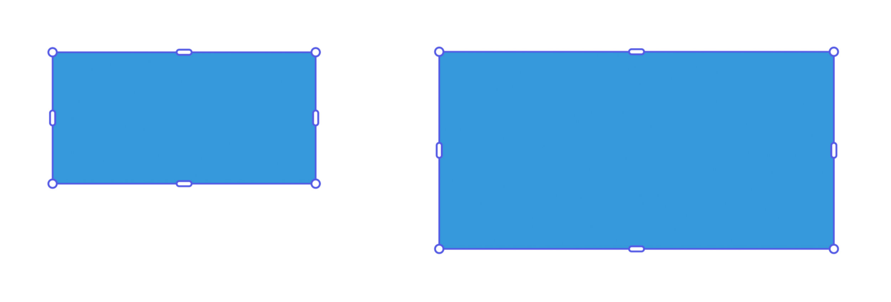
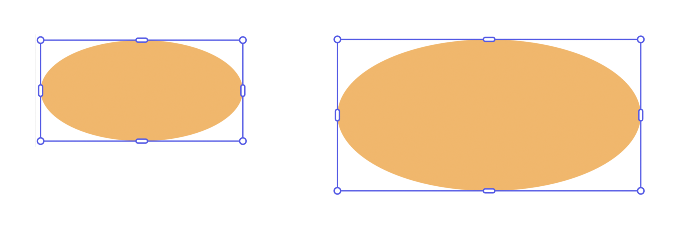
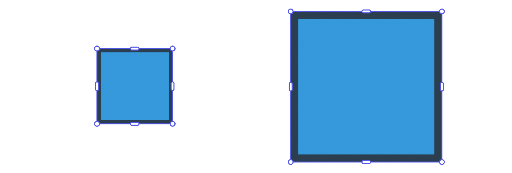
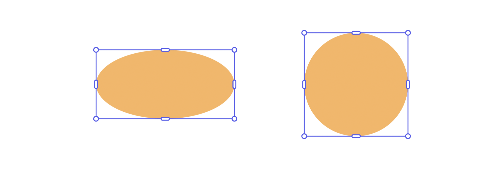
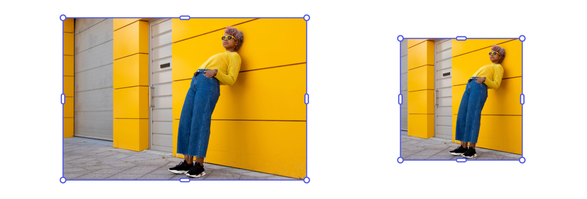
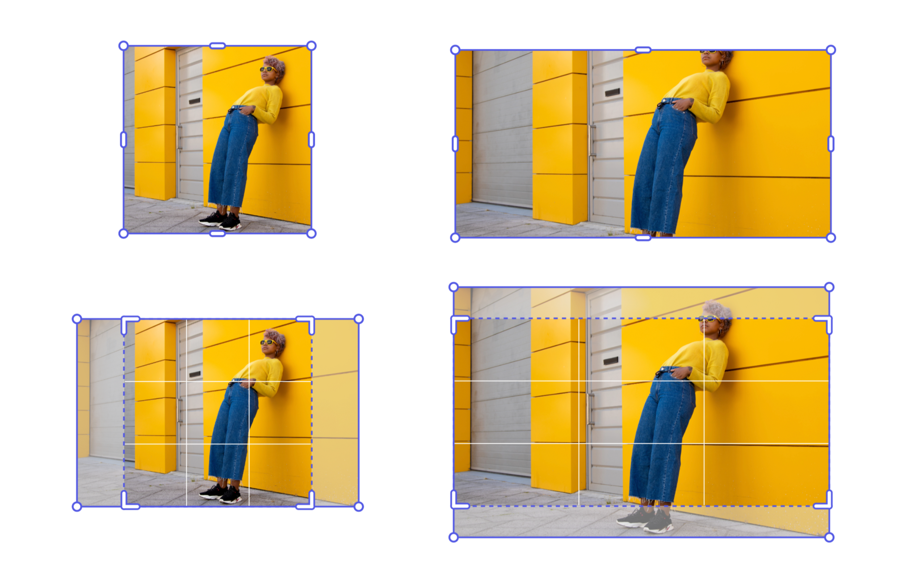
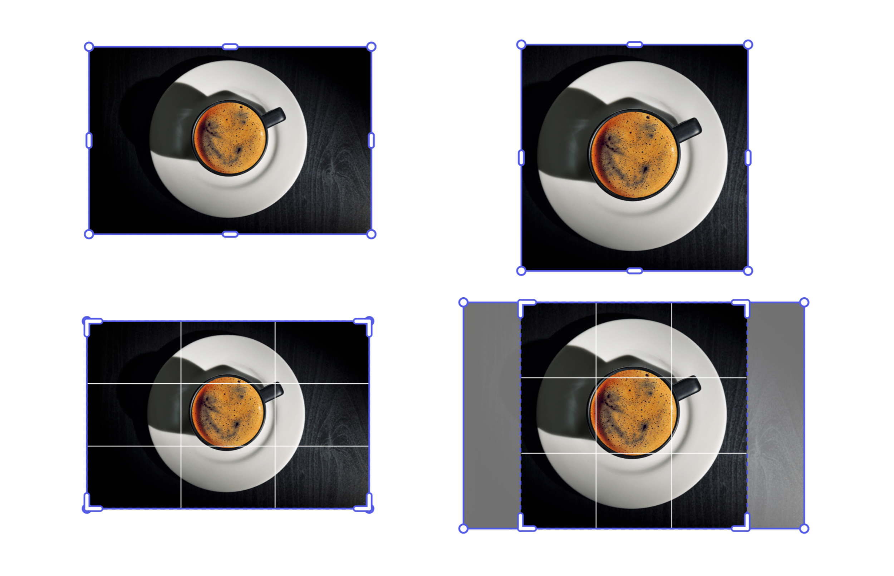
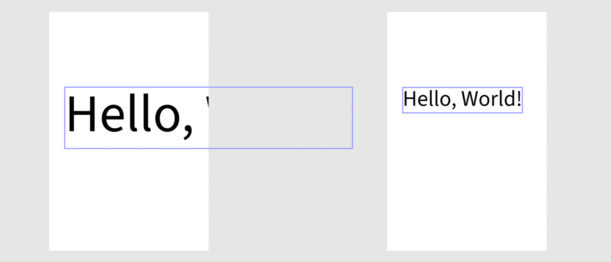
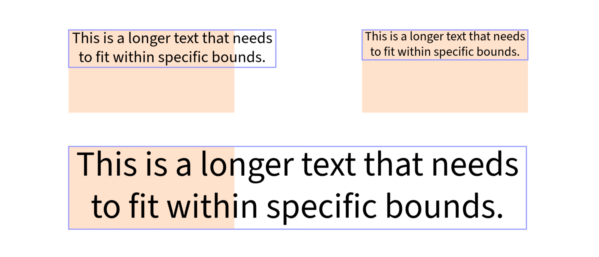

---
keywords:
  - Adobe Express
  - Express Add-on SDK
  - Express Editor
  - Adobe Express
  - Add-on SDK
  - SDK
  - JavaScript
  - Extend
  - Extensibility
  - API
  - Resize
  - Rescale
  - Proportional
  - Fit Within
  - Cover
  - Dimensions
  - Aspect Ratio
title: Resize and Rescale Elements
description: Resize and Rescale Elements.
contributors:
  - https://github.com/undavide
  - https://github.com/hollyschinsky
---

# Resize and Rescale Elements

Adobe Express offers robust APIs for resizing and rescaling elements, ensuring different behaviors for aspect ratios and visual styling. It's essential to understand the difference between _resizing_ and _rescaling_ to achieve the desired visual results.

## Resize vs. Rescale

**Resizing** adjusts the bounding box of an element while trying to preserve the existing size of visual detailing such as strokes, corners, and fonts.

**Rescaling** visually scales the entire content larger or smaller, which changes the size of visual styling elements such as stroke width, corner detailing, and font size proportionally.

<InlineAlert slots="text" variant="warning"/>

**IMPORTANT:** These APIs are currently **_experimental only_** and should not be used in any add-ons you will be distributing until they have been declared stable. To use them, you will first need to set the `experimentalApis` flag to `true` in the [`requirements`](../../../references/manifest/index.md#requirements) section of the `manifest.json`.

## Rescale Elements Proportionally

Rescaling operations maintain the aspect ratio of elements while changing their overall size. The visual styling elements (strokes, fonts, etc.) scale proportionally with the content.

### Example: Rescale by Width

Use `rescaleProportionalToWidth()` to adjust an element's width while maintaining its aspect ratio. The height will automatically adjust proportionally.

```js
// sandbox/code.js
import { editor } from "express-document-sdk";

// Create a rectangle with specific dimensions
const rect = editor.createRectangle();
rect.width = 200;
rect.height = 100;
rect.fill = editor.makeColorFill(colorUtils.fromHex("#3498db"));
// Add it to the page
editor.context.insertionParent.children.append(rect);

// Rescale to 300px width - height becomes 150px automatically
rect.rescaleProportionalToWidth(300);

console.log(`New dimensions: ${rect.width} x ${rect.height}`);
// New dimensions: 300 x 150
```



### Example: Rescale by Height

Similarly, use `rescaleProportionalToHeight()` to adjust an element's height while maintaining its aspect ratio. The width will automatically adjust proportionally.

```js
// sandbox/code.js
// import { editor } from "express-document-sdk";

const ellipse = editor.createEllipse();
ellipse.rx = 100; // radius x = 100 (width = 200)
ellipse.ry = 50; // radius y = 50 (height = 100)
ellipse.fill = editor.makeColorFill(colorUtils.fromHex("#F0B76C"));

editor.context.insertionParent.children.append(ellipse);

// Rescale to 150px height - width becomes 300px automatically
ellipse.rescaleProportionalToHeight(150);

console.log(
  `New bounds: ${ellipse.boundsLocal.width} x ${ellipse.boundsLocal.height}`
);
// New bounds: 300 x 150
```



### Example: Rescaling with Styled Elements

When rescaling elements with strokes and fills, all visual properties adjust proportionally:

```js
// sandbox/code.js
// import { editor, colorUtils, constants } from "express-document-sdk";

const rect = editor.createRectangle();
rect.width = 100;
rect.height = 100;

// Apply styling
rect.fill = editor.makeColorFill(colorUtils.fromHex("#3498db"));
const stroke = editor.makeStroke({
  color: colorUtils.fromHex("#2c3e50"),
  width: 5,
  position: constants.StrokePosition.inside,
});
rect.stroke = stroke;

editor.context.insertionParent.children.append(rect);

// Rescale proportionally - stroke width scales from 5px to 10px
rect.rescaleProportionalToWidth(200);
```



## Resize Elements to Fit Constraints

Resizing operations focus on fitting elements within specific dimensional constraints while trying to preserve visual styling elements at their original sizes.

### Example: Resize to Fit Within Bounds (Shapes)

Use `resizeToFitWithin()` to ensure an element fits entirely within specified dimensions. Elements with fixed aspect ratios may leave unused space on one axis.

```js
// sandbox/code.js
import { editor } from "express-document-sdk";

const rect = editor.createRectangle();
rect.width = 300;
rect.height = 200;

editor.context.insertionParent.children.append(rect);

// Resize to fit within a 150x150 box
rect.resizeToFitWithin(150, 150);

console.log(`Resized dimensions: ${rect.width} x ${rect.height}`);
// Resized dimensions: 150 x 100
```



<InlineAlert slots="text" variant="warning"/>

Please note that shapes are resized to fit within a bounding box **disregarding their aspect ratio**; they are free to extend or shrink on both axes.

### Example: Resize to Fit Within Bounds (Media)

Media elements, such as images and videos follow the same rules as shapes.

```js
// sandbox/code.js
import { editor } from "express-document-sdk";

// Assuming the user has selected an Image node
const imageNode = editor.context.selection[0];

console.log(
  "Initial dimensions: " +
    imageNode.boundsLocal.width +
    " x " +
    imageNode.boundsLocal.height
);
// Initial dimensions: 300 x 200

// Resize to fit within a 150x150 box
imageNode.resizeToFitWithin(150, 150);

console.log(
  "Resized dimensions: " +
    imageNode.boundsLocal.width +
    " x " +
    imageNode.boundsLocal.height
);
// Resized dimensions: 150 x 150
```



<InlineAlert slots="text, text1" variant="warning"/>

Note that the resize behavior for media elements can differ significantly from shapes, especially when cropping is involved.

This is because the container is resized to fit within the bounding box, while the media inside the container also needs to be adjusted to avoid blank space between the two.

For instance, in the next example we’ll start with the 150x150 image we resized earlier, trying to fit it within a 300x150 box. The results can be counterintuitive, since resize, under the hood, uses a combination of steps to achieve the final dimensions — but it lacks the contextual understanding that Adobe Express has when users interact with the UI. This means that API-based resize calls should always be validated afterward to ensure they produce the expected outcome.

```js
// sandbox/code.js
import { editor } from "express-document-sdk";

// Assuming the user has selected an Image node
const imageNode = editor.context.selection[0];

console.log(
  "Initial dimensions: " +
    imageNode.boundsLocal.width +
    " x " +
    imageNode.boundsLocal.height
);
// Initial dimensions: 150 x 150

// Resize to fit within a 300x150 box
imageNode.resizeToFitWithin(300, 150);

console.log(
  "Resized dimensions: " +
    imageNode.boundsLocal.width +
    " x " +
    imageNode.boundsLocal.height
);
// Resized dimensions: 300 x 150
```



### Example: Resize to Cover Area

Use `resizeToCover()` to ensure an element completely covers the specified dimensions. Elements with fixed aspect ratios may extend outside the target bounds on one axis.

```js
// sandbox/code.js
import { editor } from "express-document-sdk";

// Assuming the user has selected an Image node
const imageNode = editor.context.selection[0];

console.log(
  "Initial dimensions: " +
    imageNode.boundsLocal.width +
    " x " +
    imageNode.boundsLocal.height
);
// Initial dimensions: 150 x 100

// Resize to cover a 120x120 area
imageNode.resizeToCover(120, 120);

console.log(
  "Covered dimensions: " +
    imageNode.boundsLocal.width +
    " x " +
    imageNode.boundsLocal.height
);
// Covered dimensions: 120 x 120
```



In this example, the image is resized to cover a 120x120 area; the image is enlarged maintaining its aspect ratio, while the crop is adjusted to fit within the bounding box.

<InlineAlert slots="text" variant="info"/>

With nodes that can resize irrespective of their aspect ratio, like shapes, the `resizeToCover()` and `resizeToFitWithin()` methods yield the same result.

## Working with Text Elements

Text elements require special considerations when resizing and rescaling, as font sizes and text flow can be affected differently.

### Example: Rescaling Text Proportionally

```js
// sandbox/code.js
import { editor } from "express-document-sdk";

const textNode = editor.createText("Hello, World!");

// Center the text
const insertionParent = editor.context.insertionParent;
textNode.setPositionInParent(
  { x: insertionParent.width, y: insertionParent.height / 2 },
  { x: 0, y: 0 }
);

insertionParent.children.append(textNode);

// Rescale the text proportionally: the font size scales accordingly!
textNode.rescaleProportionalToWidth(300);
```



### Example: Similarities between Resizing and Rescaling Text

As we’ve seen, when rescaling text, the font size is adjusted to fit within the specified bounds. The same applies when resizing, which means the four available methods produce pairs of equivalent results then the parameters are set appropriately.

```js
// sandbox/code.js
// import { editor } from "express-document-sdk";

// Assuming the user has selected a text frame
const textNode = editor.context.selection[0];

// Both will result in a 200px wide text
textNode.resizeToFitWithin(200, 100);
textNode.rescaleProportionalToWidth(200);

// Both will result in a 100px tall text
textNode.resizeToCover(200, 100);
textNode.rescaleProportionalToHeight(100);
```



In the screenshot above, the original text is top-left; top-right, the result of both `resizeToFitWithin()` and `rescaleProportionalToWidth()`; bottom, `resizeToCover()`
`rescaleProportionalToHeight()`.
