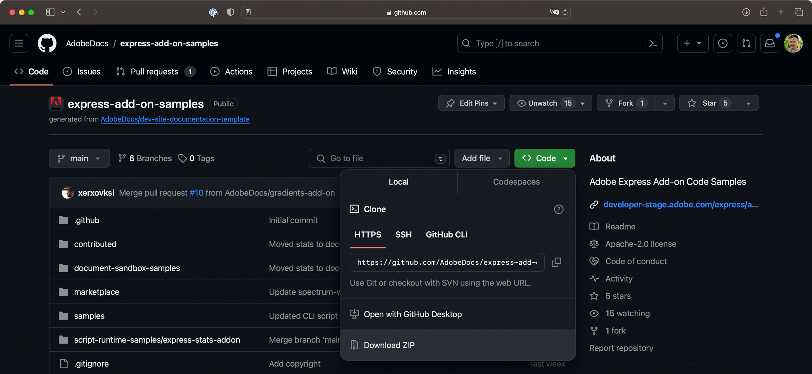
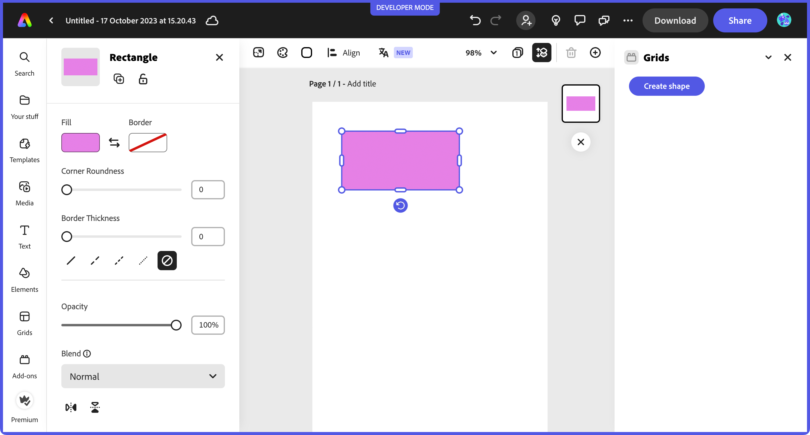
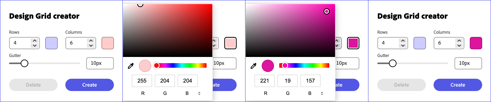
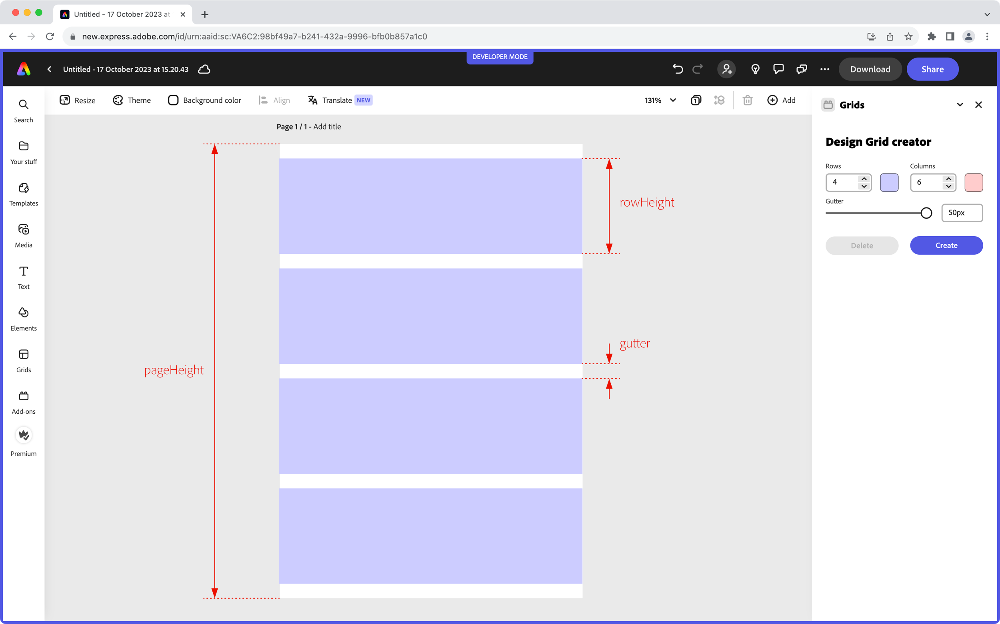

---
keywords:
  - Adobe Express
  - Express Add-on SDK
  - Express Document API
  - Document Model Sandbox
  - Adobe Express
  - Add-on SDK
  - SDK
  - JavaScript
  - Extend
  - Extensibility
  - API
title: Building your first add-on with the Document API
description: This is an in-depth tutorial that will guide you in the creation of a Grids add-on for Adobe Express using the Document API
contributors:
  - https://github.com/undavide
---

# Building your first add-on with the Document API

This tutorial will guide you through the creation of your first Adobe Express add-on based on the Adobe Express Document API.

## Introduction

Hello, and welcome to this Adobe Express Document API tutorial, where we'll build together a **fully functional Grid System add-on** from scratch. Grid systems are widely used in the design world to bring structure and consistency to all visual content, from flyers to web pages or social media posts.

<Media slots="video"/>

<https://www.youtube.com/watch?v=SQMYA660gII>


Your add-on will allow users to create a variable number of rows and columns, control the spacing between them (known as the _gutter_), and apply color overlays.

### Changelog

This tutorial has been written by [Davide Barranca](https://www.davidebarranca.com), software developer and author from Italy; revision history as follows.

**January 9th, 2024**

- Added additional information on the project's setup.
- Renamed `createStroke()` to `makeStroke()`: according to the new naming convention, `make*` is used for plain objects and helper utilities, whereas `create*` is reserved to live document objects, e.g., `createEllipse()`.
- Improved explanations for importing Spectrum Web Components.

**December 3rd, 2023**

- Removed the experimental warning from the document model sandbox APIs.
- Importing `colorUtils` instead of `utils` from `"express-document-sdk"`; the built-in `colorUtils.fromHex()` method replaces the custom `hexToColor()`.
- In the new API, nodes don't have the `fills` property (and it's `append()` method) anymore; instead, they use `fill`, to which a `ColorFill` is assigned.

**November 29th, 2023**

- `apiProxy()` now accepts `"documentSandbox"` as a parameter, instead of `"script"`.
- `manifest.json` now accepts `"documentSandbox"` in lieu of the `"script"` property for the document sandbox entry point. This requires the `"@adobe/ccweb-add-on-scripts"` dependency to be updated to version `"^1.1.0"` or newer in the `package.json` file.
- `addOnSandboxSdk` is now imported from `"add-on-sdk-document-sandbox"` (it used to be `"AddOnScriptSdk"`).
- `editor` and other modules are now imported from `"express-document-sdk"` (it used to be `"express"`).
- The `webpack.config.js` file has been updated to reflect the new imports (see the `externals` object) in both the `express-grids-addon` and `express-addon-document-api-template` projects.
- `Constants` are now `constants` (lowercase), and their enumerations have changed (e.g., `BlendModeValue` is now `BlendMode`).
- `translateX` and `translateY` have conflated in the new `translation` property.
- The group's warning about the operations order (create, append, fill) has been removed; groups can now be created, filled and appended.

**November 21st, 2023**

- Editor API are now called the Document API, which are part of the Document Model Sandbox.
- Update the add-on folders to reflect the new naming convention (`script` is now `documentSandbox`).
- Update Reference Documentation links and screenshots.

**November 6th, 2023**

- First publication.

### Prerequisites

- Familiarity with HTML, CSS, JavaScript.
- Familiarity with the Adobe Express add-ons environment; if you need a refresher, follow the [quickstart](../../../getting_started/hello-world.md) guide.
- An Adobe Express account; use your existing Adobe ID or create one for free.
- Node.js version 16 or newer.

### Topics Covered

<!-- List block here -->
<ListBlock slots="text1, text2" repeat="4" iconColor="#2ac3a2" icon="disc" variant="fullWidth" />

[iframe and Document Model Sandbox communication](#the-communication-api)

[Spectrum Web Components](#designing-the-ui-with-spectrum-web-components)

[Adobe Express Document API](#the-document-api)

[Color Pickers](#designing-the-ui-with-spectrum-web-components)

[Nodes insertion point](#creating-the-first-shape)

[Creating and manipulating shapes](#creating-the-first-shape)

[Grouping elements](#organizing-the-code)

[Context permanence](#deleting-grids)


### Getting Started with the Document API

As part of the [Document Model Sandbox](/references/document-sandbox/index.md), the Adobe Express Document API (from now on, Document API) is a powerful tool that extends the capabilities of Adobe Express add-ons, offering direct interaction with the open document. Let's take a moment to review the difference between the two core components of the architecture of an add-on.

- The **iframe** hosts the add-on User Interface and runs its internal logic. You can think about it as a web application operating in a sandboxed environment: it needs to be separate from the rest of the Adobe Express content for security reasons, which is precisely why the add-on is hosted within an `<iframe>` element (a detailed technical description is found [here](../../platform_concepts/context.md#iframe-sandbox)). If you come from a CEP/UXP background, it's akin to developing the panel of an extension or plugin.
- The **Document Model Sandbox**: allows you to operate on the document. It's a sandboxed JavaScript environment that communicates with the iframe (thanks to the [Communication API](/references/document-sandbox/communication/)), providing access to the [Document API](/references/document-sandbox/document-apis/). Drawing the parallel with CEP and UXP again, it represents scripting; that is, the possibility to drive Adobe Express programmatically and, for example, add pages or artboards, create new shapes, rotate or group them, etc.

This is a high-level overview of the overall structure; while the implementation has more technical nuances, there's no need to dive deeper now.


### The Project Structure

The complete code for the Grids System add-on can be found [here](https://github.com/AdobeDocs/express-add-on-samples/tree/main/document-sandbox-samples/express-grids-addon/): it is provided as a [complete project](https://github.com/AdobeDocs/express-add-on-samples/tree/main/document-sandbox-samples/express-grids-addon/grids-design-end), although it would be best if you followed along from [this starting point](https://github.com/AdobeDocs/express-add-on-samples/tree/main/document-sandbox-samples/express-grids-addon/grids-design-start), which sets up a JavaScript/Webpack environment with everything needed.[^1]

You can either clone the entire repository:

```bash
git clone https://github.com/AdobeDocs/express-add-on-samples.git
```

Or download it as a `.zip` file (click the green "Code" button and then "Download ZIP").



Then `cd` in the project folder (either the `grids-design-start` or `grids-design-end` one) and run the following commands:

```bash
cd express-add-on-samples/document-sandbox-samples/express-grids-addon/grids-design-end

npm install
npm run build
npm run start
```

This will install the required dependencies, build the project, and then serve it locally on port 5241; if you need more clarification about how to load an add-on in Adobe Express, please refer to the [quickstart](../../../getting_started/hello-world.md) guide for a step-by-step walkthrough.

Before jumping into the code, let's look at how the project is structured. At the time of this writing, the CLI provides a few templates, but Only ReactJS-based ones include the Document Sandbox while also having a Webpack configuration, which is preferable when using Spectrum Web Components (SWC). This project provides support for both of them.


As usual, we'll work in the `src` folder while Webpack outputs the result in `dist`. The add-on entry point is `index.html`, which relies on `ui/index.js` for the iframe logic code (UI element handlers, etc.). The Document API entry point is instead `documentSandbox/code.js`, as defined in the `manifest.json`:

```json
{
  // ...
  "entryPoints": [
    {
      "type": "panel",
      "id": "panel1",
      "main": "index.html",
      "documentSandbox": "code.js" // 👈 here
    }
  ]
}
```

If you're wondering about `documentSandbox/shapeUtils.js`, it is an auxiliary file containing private code consumed by `code.js` that doesn't need to be exposed to the iframe in this specific project. The code of the blank template is as follows.

<!-- Code below -->
<CodeBlock slots="heading, code" repeat="4" languages="index.html, index.js, code.js, shapeUtils.js"/>

#### iframe

```html
<!DOCTYPE html>
<html lang="en">
  <head>
    <meta charset="UTF-8" />
    <meta
      name="description"
      content="Adobe Express Add-on tutorial using JavaScript and the Document Sandbox"
    />
    <meta
      name="keywords"
      content="Adobe, Express, Add-On, JavaScript, Document Sandbox, Document API"
    />
    <meta
      name="viewport"
      content="width=device-width, initial-scale=1.0"
    />
    <title>Grids add-on</title>
    <link
      rel="stylesheet"
      href="styles.css"
    />
  </head>

  <body>
    <sp-theme
      scale="medium"
      color="light"
      theme="express"
    >
      <sp-button id="createShape">Create shape</sp-button>
    </sp-theme>
  </body>
</html>
```

#### iframe

```js
// Spectrum imports
import "@spectrum-web-components/styles/typography.css";
import "@spectrum-web-components/theme/src/themes.js";
import "@spectrum-web-components/theme/theme-light.js";
import "@spectrum-web-components/theme/express/theme-light.js";
import "@spectrum-web-components/theme/express/scale-medium.js";
import "@spectrum-web-components/theme/sp-theme.js";
import "@spectrum-web-components/button/sp-button.js";

import addOnUISdk from "https://express.adobe.com/static/add-on-sdk/sdk.js";

addOnUISdk.ready.then(async () => {
  console.log("addOnUISdk is ready for use.");
  const createShapeButton = document.getElementById("createShape");

  // Get the UI runtime.
  const { runtime } = addOnUISdk.instance;
  const sandboxProxy = await runtime.apiProxy("documentSandbox");
  sandboxProxy.log("Document Sandbox up and running.");

  // Enabling CTA elements only when the addOnUISdk is ready
  createShapeButton.disabled = false;
});
```

#### Document API

```js
import addOnSandboxSdk from "add-on-sdk-document-sandbox";
const { runtime } = addOnSandboxSdk.instance;

function start() {
  runtime.exposeApi({
    log: (...args) => {
      console.log(...args);
    },
    // other properties will go here...
  });
}

start();
```

#### Document API

```js
// empty
```

<InlineAlert variant="info" slots="text1" />

Please use the iframe and Document API tabs above to switch between the two domains and find a dropdown in the top-right corner to select which file to show.

The `index.html` contains a `<sp-theme>` wrapper, whose role is explained [here](../../../build/design/implementation-guide.md#spectrum-web-components-with-express-theme), and just a button. There's already something going on in `index.js` and `code.js` instead, which we must understand.

## The Communication API

A crucial component of any add-on that consumes the Document API is the communication bridge with the iframe. As we've seen earlier, it's precisely the role of the **Communication API**.

The mechanism is straightforward: through the `runtime` object (`code.js`, line 2), you can invoke the `exposeApi()` method, which grants the iframe access to the object literal that is passed as a parameter. The iframe must get to the `runtime`, too, and use its `apiProxy()` method passing `"documentSandbox"`. This asynchronous call results in the same object whose `log()` can now be invoked.


It would not be uncommon to define an object literal first and pass it to the `exposeAPI` later.

<!-- code below -->
<!-- please note, the heading won't render anyway -->
<InlineAlert variant="warning" slots="heading, text1, text2, text3, text4" />

**Syntax**

Mind the syntax if you need the functions to call each other: for instance, the following won't work, as arrow functions' `this` is inherited from the enclosing scope, and there's none provided.

```js
runtime.exposeApi({
  log: (...args) => {
    console.log(...args);
  },
  createShape: (shape) => {
    // ...
    this.log("Shape created."); // ❌
  },
});
```

The _method shorthand syntax_ provides a proper `this` reference instead.

```js
runtime.exposeApi({
  log(...args) {
    console.log(...args);
  },
  createShape(shape) {
    // ...
    this.log("Shape created."); // ✅
  },
});
```

It's also possible to expose iframe methods to the Document Sandbox, i.e., using `apiProxy()` passing `"panel"`, but it's outside the scope of this tutorial—please refer to [this sample](../../samples.md#communication-iframe-documentsandbox) to see it in action.

## The Document API

### Using the Reference Documentation

The Document API is rapidly expanding: to keep track of its progress, you must get accustomed to consulting the [Reference Documentation](/references/document-sandbox/document-apis).


In the left-navbar, you can browse through all the Classes (which Adobe Express elements are instantiated from), Interfaces and constants. It's a hierarchical representation of the Document API data structures: for instance, you can see that a [`RectangleNode`](/references/document-sandbox/document-apis/classes/RectangleNode/) is a subclass of the [`FillableNode`](/references/document-sandbox/document-apis/classes/FillableNode/), which in turn subclasses the [`StrokableNode`](/references/document-sandbox/document-apis/classes/StrokableNode/), which eventually is just a particular kind of [`Node`](/references/document-sandbox/document-apis/classes/Node/)—the base class.

Some properties are shared among the `RectangleNode` and, say, other `StrokableNode` subclasses such as the `EllipseNode`: for instance, the `opacity`, or `blendMode`. Other ones are unique, like the `topLeftRadius`, which, in the context of an `EllipseNode`, wouldn't make sense.

### Creating the first Shape

It's finally time to start laying down some elements. Let's hook the only iframe button currently available to a function exposed by the Document API. Type the following into the source files (`index.html`, `index.js`, and `code.js` have been edited), then run the add-on.

<!-- Code below -->
<CodeBlock slots="heading, code" repeat="4" languages="index.html, index.js, code.js, shapeUtils.js"/>

#### iframe

```html
<body>
  <sp-theme
    scale="medium"
    color="light"
    theme="express"
  >
    <sp-button
      id="createShape"
      disabled
      >Create shape</sp-button
    >
  </sp-theme>
</body>
```

#### iframe

```js
// ... usual imports

// Adding the sp-button import
import "@spectrum-web-components/button/sp-button.js";

addOnUISdk.ready.then(async () => {
  console.log("addOnUISdk is ready for use.");
  const createShapeButton = document.getElementById("createShape");

  const { runtime } = addOnUISdk.instance;
  const sandboxProxy = await runtime.apiProxy("documentSandbox");

  createShapeButton.addEventListener("click", async () => {
    sandboxProxy.createShape({ width: 200, height: 100 }); // 👈
  });

  createShapeButton.disabled = false;
});
```

#### Document API

```js
import addOnSandboxSdk from "add-on-sdk-document-sandbox";
const { runtime } = addOnSandboxSdk.instance;
import { editor, colorUtils, constants } from "express-document-sdk";

function start() {
  runtime.exposeApi({
    createShape({ width, height }) {
      // 👈
      const rect = editor.createRectangle();
      rect.width = width;
      rect.height = height;
      rect.translation = { x: 50, y: 50 };

      const col = colorUtils.fromRGB(0.9, 0.5, 0.9);
      const fillColor = editor.makeColorFill(col);
      rect.fill = fillColor;

      editor.context.insertionParent.children.append(rect);
    },
  });
}

start();
```

#### Document API

```js
// empty
```

Please note that it's considered good practice to initially **disable all interactive elements** that need to communicate with the Document API. In this case, there's only one CTA (Call To Action) `<sp-button>`, but generally any other elements that can make changes to the document should be treated similarly. You should enable them only when the `addOnUISdk` and `addOnSandboxSdk` are initialized, and event listeners are properly set (see `index.js` line 13).

The `createShapeButton` invokes the `createShape()` method defined and exposed in `code.js` (lines 7-19), passing an option object with arbitrary `width` and `height` properties. The function reveals key insights about the Document API—let's have a deeper look at the code.

According to the Reference, `createRectangle()` is a method of the [`Editor`](/references/document-sandbox/document-apis/classes/Editor/) class, which must be imported from `"express-document-sdk"` with the following statement.

```js
import { editor, colorUtils, constants } from "express-document-sdk";
```

We'll also make use of `colorUtils` and `constants`—they are named imports from `"express-document-sdk"`, too. The `createRectangle()` function doesn't need any parameter, either required or optional; hence, the properties of this new element must be set after its creation.

```js
const rect = editor.createRectangle();
rect.width = width;
rect.height = height;
rect.translation = { x: 50, y: 50 };
```

Dimensions and positions are straightforward while assigning a fill color is a two-step process.

```js
const col = colorUtils.fromRGB(0.9, 0.5, 0.9);
const fillColor = editor.makeColorFill(col);
rect.fill = fillColor;
```

First, you make use of the `fromRGB()` method from the `colorUtils` class, which expects four parameters in the (0..1) range: R, G, B and an optional Alpha, and returns a [Color](/references/document-sandbox/document-apis/classes/Color/) instance. Then, you use such color to create either a fill or stroke—here, we're using `makeColorFill()`. Finally, you set it to the shape by assigning it to the `fill` property.

<!-- code here -->
<InlineAlert variant="info" slots="text1" />

Strokes are created with the `editor.makeStroke()` method, which accepts more parameters (all optional). It's documented [here](/references/document-sandbox/document-apis/classes/Editor.md#makestroke).

The `rect` object now exists as a `RectangleNode` instance with a width of 200 pixels, a height of 100, the top-left corner at the coordinate (50, 50) and a pastel pink fill color. But **it still needs to be rendered on the page!**

```js
// appending the rect object to the scene
editor.context.insertionParent.children.append(rect);
```

Let's unpack this line. As it usually happens with any DOM (Document Object Model), it's easier if read _backwards_—from the end to the beginning. We are appending the `rect` object to the `children` list of the `insertionParent` (which is "the _preferred parent_ to insert newly added content into") of the `context` (the "User's current selection context"), a property of the `editor` class.[^2]

In other words, we're adding `rect` as a sibling of whatever happens to be active at the moment: this is what the `context.insertionParent.children` dance does. If you try to add `rect` while a shape nested inside a group is selected, then `rect` will also belong to that group. Please note that Adobe Express documents are based on data structures where instances are _appended_ to collections: you `append()` a rectangle to a container's `children` collection.[^3]



Alternatively, you can target the insertion point specifically rather than relying on what happens to be selected at the time of execution. For instance, the following code uses the first [Artboard](/references/document-sandbox/document-apis/classes/ArtboardNode/) of the first [Page](/references/document-sandbox/document-apis/classes/PageNode/).

```js
// ...
const doc = editor.documentRoot; // document
const currentPage = doc.pages.first; // page
const currentArtboard = currentPage.artboards.first; // artboard
currentArtboard.children.append(rect); // children
// or
editor.documentRoot.pages.first.artboards.first.children.append(rect);
```

Quoting a revealing bit of the Page reference:

> A PageNode represents a page in the document. A page contains one or more artboards, representing "scenes" in a linear timeline sequence. Those artboards, in turn, contain all the visual content of the document.

You now understand the fundamentals of the Adobe Express DOM and the hierarchical relations between nodes. You have all the necessary tools to begin coding the Grids add-on; you can always refer to the documentation when needed.

## Coding the Grids add-on

### Designing the UI with Spectrum Web Components

Although the main subject of this tutorial is the Document API, let's spend a moment discussing the Grid add-on's User Interface. It's built mainly with **Spectrum Web Components** (see [this guide](../../../build/design/implementation-guide.md) for a refresher on Adobe's UX Guidelines and the use of the Spectrum Design System), in particular:

- `<sp-number-field>` for the Rows and Columns inputs;
- `<sp-slider>` for the Gutter;[^4]
- `<sp-swatch>` for the color picker;
- `<sp-button-group>` and `<sp-button>` for the CTA buttons.

The layout is based on nested FlexBox CSS classes, such as `row` and `column`. Because of the fixed width, margins are tight; the design has also been compacted along the Y-axis for consistency.


Please remember that any Spectrum Web Component you use must be installed and imported into the project first—refer to the instructions on [their official site](https://opensource.adobe.com/spectrum-web-components/) and [this guide](../../../build/design/implementation-guide.md#spectrum-web-components-with-express-theme). In a nutshell, find the package name in each component's documentation, and then `npm install` the ones you need.

```bash
npm install @spectrum-web-components/button
npm install @spectrum-web-components/action-button
npm install @spectrum-web-components/button-group
npm install @spectrum-web-components/field-label
npm install @spectrum-web-components/number-field
npm install @spectrum-web-components/slider
npm install @spectrum-web-components/swatch
npm install @spectrum-web-components/theme
```

Finally, import them in the `ui/index.js` file.

```js
import "@spectrum-web-components/styles/typography.css";

import "@spectrum-web-components/theme/src/themes.js";
import "@spectrum-web-components/theme/theme-light.js";
import "@spectrum-web-components/theme/express/theme-light.js";
import "@spectrum-web-components/theme/express/scale-medium.js";
import "@spectrum-web-components/theme/sp-theme.js";

import "@spectrum-web-components/button/sp-button.js";
import "@spectrum-web-components/button-group/sp-button-group.js";
import "@spectrum-web-components/field-label/sp-field-label.js";
import "@spectrum-web-components/number-field/sp-number-field.js";
import "@spectrum-web-components/slider/sp-slider.js";
import "@spectrum-web-components/swatch/sp-swatch.js";
```

<InlineAlert variant="warning" slots="text1" />

Mind the import names: for example, you install a `@spectrum-web-components/button`, but you import it as `@spectrum-web-components/button/sp-button.js` (with the `sp-` prefix).

The only tricky UI bit worth mentioning here is relative to the **color pickers**. SWC features a variety of color-related components (Color Area, Color Handle, Color Loupe, Color Slider) but not an actual picker. This add-on implements it via a `<sp-swatch>` for the UI and a hidden native `<input>` element behind it.

<!-- Code below -->
<CodeBlock slots="heading, code" repeat="2" languages="index.html, ui/index.js"/>

#### index.html

```html
<div class="row">
  <!-- ... -->
  <sp-swatch
    id="rowsColorSwatch"
    class="color-well"
  ></sp-swatch>
  <input
    type="color"
    id="rowsColorPicker"
    style="display: none;"
  />
</div>
```

#### ui/index.js

```js
// Ref to the <sp-input type="color">
const rowsColorPicker = document.getElementById("rowsColorPicker");
// Ref to the <sp-swatch>
const rowsColorSwatch = document.getElementById("rowsColorSwatch");

// Initializing the colors for both of them
rowsColorPicker.value = "#ccccff";
rowsColorSwatch.color = "#ccccff";

// The <sp-swatch> click triggers the <input> click
rowsColorSwatch.addEventListener("click", function () {
  rowsColorPicker.click();
});

// The <input> click changes the <sp-swatch> fill with the picked color.
rowsColorPicker.addEventListener("input", function (event) {
  const selectedColor = event.target.value;
  rowsColorSwatch.setAttribute("color", selectedColor);
});
```

The `<sp-swatch>` click handler programmatically triggers the `<input>` click, which, although hidden, can still display the browser's native color picker. On `input` (i.e., when the user selects a different color within the picker), the `color` attribute of the `<sp-swatch>` controlling its fill is changed accordingly to keep both of them in sync. Please note that their values are initialized in `ui/index.js` for convenience—setting them in `index.html` would be equally fine.



Please refer to the source code for other details on the HTML structure, which are not discussed here for brevity's sake.

### Collecting values from the UI

Let's finish the UI, completing the code for `ui/index.js`. As you can see, it is all standard JavaScript: besides the color pickers we've just discussed, Rows, Columns and Gutter values are initialized (lines 17-19); the Document Sandbox is retrieved, and everything the Document API exposes is stored in the `sandboxProxy` constant (lines 9-10).

<!-- Code below -->
<CodeBlock slots="heading, code" repeat="2" languages="index.html, ui/index.js"/>

#### index.html

```html
<body>
  <sp-theme
    scale="medium"
    color="light"
    theme="express"
  >
    <h2>Design Grid creator</h2>
    <div class="row gap-20">
      <div class="row">
        <div class="column">
          <sp-field-label
            for="rows"
            size="m"
            >Rows</sp-field-label
          >
          <sp-number-field
            id="rows"
            min="1"
            max="20"
          >
          </sp-number-field>
        </div>
        <sp-swatch
          id="rowsColorSwatch"
          class="color-well"
        ></sp-swatch>
        <input
          type="color"
          id="rowsColorPicker"
          style="display: none;"
        />
      </div>
      <div class="row">
        <div class="column">
          <sp-field-label
            for="cols"
            size="m"
            >Columns</sp-field-label
          >
          <sp-number-field
            id="cols"
            min="1"
            max="20"
          >
          </sp-number-field>
        </div>
        <sp-swatch
          id="colsColorSwatch"
          class="color-well"
        ></sp-swatch>
        <input
          type="color"
          id="colsColorPicker"
          style="display: none;"
        />
      </div>
    </div>
    <div class="row">
      <sp-slider
        label="Gutter"
        id="gutter"
        variant="filled"
        editable
        hide-stepper
        min="1"
        max="50"
        format-options='{"style": "unit", "unit": "px"}'
        step="1"
      ></sp-slider>
    </div>
    <sp-button-group horizontal>
      <sp-button
        id="deleteGrid"
        variant="secondary"
        disabled
        >Delete</sp-button
      >
      <sp-button
        id="createGrid"
        disabled
        >Create</sp-button
      >
    </sp-button-group>
  </sp-theme>
</body>
```

#### ui/index.js

```js
// All the SWC imports...

import addOnUISdk from "https://express.adobe.com/static/add-on-sdk/sdk.js";

addOnUISdk.ready.then(async () => {
  console.log("addOnUISdk is ready for use.");

  // Get the Document Sandbox.
  const { runtime } = addOnUISdk.instance;
  const sandboxProxy = await runtime.apiProxy("documentSandbox");

  // Input fields -------------------------------------------

  const rowsInput = document.getElementById("rows");
  const colsInput = document.getElementById("cols");
  const gutterInput = document.getElementById("gutter");

  rowsInput.value = 4;
  colsInput.value = 6;
  gutterInput.value = 10;

  // Color pickers ------------------------------------------

  const colsColorPicker = document.getElementById("colsColorPicker");
  const colsColorSwatch = document.getElementById("colsColorSwatch");
  const rowsColorPicker = document.getElementById("rowsColorPicker");
  const rowsColorSwatch = document.getElementById("rowsColorSwatch");

  colsColorPicker.value = "#ffcccc";
  colsColorSwatch.color = "#ffcccc";
  rowsColorPicker.value = "#ccccff";
  rowsColorSwatch.color = "#ccccff";

  colsColorSwatch.addEventListener("click", function () {
    colsColorPicker.click();
  });
  colsColorPicker.addEventListener("input", function (event) {
    const selectedColor = event.target.value;
    colsColorSwatch.setAttribute("color", selectedColor);
  });

  rowsColorSwatch.addEventListener("click", function () {
    rowsColorPicker.click();
  });
  rowsColorPicker.addEventListener("input", function (event) {
    const selectedColor = event.target.value;
    rowsColorSwatch.setAttribute("color", selectedColor);
  });

  // CTA Buttons --------------------------------------------

  const createGridBtn = document.getElementById("createGrid");
  const deleteGridBtn = document.getElementById("deleteGrid");

  deleteGridBtn.onclick = async (event) => {
    const res = await sandboxProxy.deleteGrid();
    if (res) {
      // When there's been an error deleting the grid, you may want to handle it here
    }
    deleteGridBtn.disabled = true;
  };

  createGridBtn.onclick = async (event) => {
    await sandboxProxy.addGrid({
      columns: colsInput.value,
      rows: rowsInput.value,
      gutter: gutterInput.value,
      columnColor: colsColorPicker.value,
      rowColor: rowsColorPicker.value,
    });
    deleteGridBtn.disabled = false;
  };

  // Only now it is safe to enable the button
  createGridBtn.disabled = false;
});
```

Eventually, the two buttons (Delete and Create) invoke methods exposed by the Document API, respectively `deleteGrid()` and `createGrid()`. The latter expects an options object with `rows`, `columns`, `gutter`, `columnColor`, and `rowColor` properties.

### Validation and Error Handling

It's worth taking a moment to discuss good validation and error-handling practices at this stage. Just as the QA engineer walking into a bar in the [famous joke](https://twitter.com/brenankeller/status/1068615953989087232), you must ensure that user input aligns with what the grid algorithm expects; for example, that it receives unsigned integers.

For this tutorial, we'll limit ourselves to setting `min` and `max` values for the Rows, Columns, and Gutter ranges. This will prevent scenarios like creating a negative number of columns. In a typical implementation, you'd want to insert a validation routine before invoking the primary function. Depending on the algorithm's and the UI's complexity, this routine might belong to the iframe, the Document Sandbox, or both. Additionally, apart from validating value type and range, you may want to ensure that the Gutter size is compatible with the chosen number of Rows and Columns to prevent them from overflowing the page dimensions.[^5]

Another crucial notion is to avoid silent failures: every action should either succeed or provide the user with a notification if it doesn't. That's why, for instance, the Delete button is left disabled until a set of grids is created; instead of handling the removal of a non-existent grid, it's preferable to prevent it in the first place.

### Creating Rows and Columns

It makes sense to approach this grid business with some caution, as we're just starting with the Document API. Let's set up `documentSandbox/code.js` to expose this `addGrid()` method and manage the argument provided.

<!-- Code below -->
<CodeBlock slots="heading, code" repeat="1" languages="documentSandbox/code.js"/>

#### documentSandbox/code.js

```js
import addOnSandboxSdk from "add-on-sdk-document-sandbox";
const { runtime } = addOnSandboxSdk.instance;
import { editor, colorUtils, constants } from "express-document-sdk";

function start() {
  runtime.exposeApi({
    addGrid({ columns, rows, gutter, columnColor, rowColor }) {
      console.log("addGrid", columns, rows, gutter, columnColor, rowColor);
    },
  });
}

start();
```

When the user clicks the Create button, the parameters from the UI are properly collected, passed to `addGrid()` in the Document Sandbox, and logged. So far, so good, the Communication API does its job.


To begin with, we'll create rows: rectangles that must be as wide as the page. To calculate their height, first, subtract the total number of gutters (which is equal to the number of rows plus one) from the page height. Then, divide the resulting value by the number of rows.

```text
rowHeight = (pageHeight - (rowsNumber + 1) * gutter) / rowsNumber;
```

This is because we're using gutters as page margins, too, as the following illustration shows.



We must get hold of the [Document](/references/document-sandbox/document-apis/classes/Editor.md#documentroot) (as `documentRoot`, from the Editor class) and [Page](/references/document-sandbox/document-apis/classes/PageNode/)—the first one from the `pages` list will be OK for our purposes. Page properties like `width` and `height` will be used to compute the attributes of each "row" Rectangle.

```js
// ...
runtime.exposeApi({
  addGrid({ columns, rows, gutter, columnColor, rowColor }) {
    const doc = editor.documentRoot;
    const page = doc.pages.first;
    const rowWidth = page.width;
    const rowHeight = (page.height - (rowsNumber + 1) * gutter) / rowsNumber;
  },
});
```

In case you want to use the currently active Page instead, you have to traverse back to it using the `insertionParent` property of the `context` we've seen earlier as a starting point, and its `parent` property until you reach a node whose `type` is equal to the string `"Page"`. Adobe Express documents must have at least one page, so this is a safe operation. Modify the `addGrid()` function as follows.

```js
addGrid({ columns, rows, gutter, columnColor, rowColor }) {
  // Using the current page.
  let currentNode = editor.context.insertionParent;
  let page = null;

  while (currentNode) {
    if (currentNode.type === "Page") {
      page = currentNode;
      break;
    }
    currentNode = currentNode.parent;
  }
// ... rest of the code
}
```

To draw all four (or any number coming from the UI) rectangles at once, a loop is in order.

```js
// ...
var rowsRect = [];
for (let i = 0; i < rows; i++) {
  let r = editor.createRectangle();
  r.width = page.width;
  r.height = rowHeight;
  // moving the row in place
  r.translation = { x: 0, y: gutter + (gutter + rowHeight) * i };
  rowsRect.push(r);
}
// adding the rows to the page
rowsRect.forEach((rect) => page.artboards.first.children.append(rect));
```

We've created all the needed rectangles, shifting them on the Y-axis according to their number and gutter, collecting them in a `rowsRect` array; which, in turn, we've looped through to append them all to the first `artboard` in the page.

<!-- code below -->
<InlineAlert variant="info" slots="text1" />

Please remember that you must always `append()` elements to their container's `children` property.

Using the same principles, we can create columns: rectangles as tall as the page and whose width we can compute.

```js
const doc = editor.documentRoot;
const page = doc.pages.first;
var colsRect = [];
const colWidth = (page.width - (cols + 1) * gutter) / cols;
for (let i = 0; i < cols; i++) {
  let r = editor.createRectangle();
  r.width = colWidth;
  r.height = page.height;
  r.translation = { x: gutter + (gutter + colWidth) * i, y: 0 };
  cols.push(r);
}
cols.forEach((rect) => page.artboards.first.children.append(rect));
```

We now have most of what is needed to complete the Grids add-on; we're in dire need of a better structure, though.

### Organizing the code

The Grid creation process can be split into **smaller, separate steps**—we can take this chance to think about how to structure the entire project.

- Creating a rectangle is best handled using a dedicated `createRect()` function.
- Rows and Columns can be separate processes, too.
- `code.js` doesn't need to expose anything else but the `addGrid()` and `deleteGrid()` methods.
- `addRows()` and `addColumns()` can belong to the `shapeUtils.js` module and imported in `documentSandbox/code.js`, while `createRect()` will be kept as private.

<!-- Code below -->
<CodeBlock slots="heading, code" repeat="2" languages="documentSandbox/code.js, documentSandbox/shapeUtils.js" />

#### documentSandbox/code.js

```js
import addOnSandboxSdk from "add-on-sdk-document-sandbox";
import { editor } from "express-document-sdk";
import { addColumns, addRows } from "./shapeUtils";

// Get the Document Sandbox.
const { runtime } = addOnSandboxSdk.instance;

function start() {
  const sandboxProxy = {
    addGrid({ columns, rows, gutter, columnColor, rowColor }) {
      addRows(rows, gutter, rowColor);
      addColumns(columns, gutter, columnColor);
      // ...
    },
    deleteGrid() {
      // ...
    },
  };
  runtime.exposeApi(sandboxProxy);
}
start();
```

#### documentSandbox/shapeUtils.js

```js
import { editor, colorUtils, constants } from "express-document-sdk";

// Utility to create a rectangle and fill it with a color.
const createRect = (width, height, color) => {
  const rect = editor.createRectangle();
  rect.width = width;
  rect.height = height;
  // Fill the rectangle with the color.
  const rectangleFill = editor.makeColorFill(colorUtils.fromHex(color));
  rect.fill = rectangleFill;
  return rect;
};

const addRows = (rowsNumber, gutter, color) => {
  const page = editor.documentRoot.pages.first;
  var rows = [];
  const rowHeight = (page.height - (rowsNumber + 1) * gutter) / rowsNumber;
  for (let i = 0; i < rowsNumber; i++) {
    let r = createRect(page.width, rowHeight, color);
    r.translation = { x: 0, y: gutter + (gutter + rowHeight) * i };
    rows.push(r);
  }
  rows.forEach((row) => page.artboards.first.children.append(row));
};

const addColumns = (columNumber, gutter, color) => {
  const page = editor.documentRoot.pages.first;
  var cols = [];
  const colWidth = (page.width - (columNumber + 1) * gutter) / columNumber;
  for (let i = 0; i < columNumber; i++) {
    let r = createRect(colWidth, page.height, color);
    r.translation = { x: gutter + (gutter + colWidth) * i, y: 0 };
    cols.push(r);
  }
  cols.forEach((col) => page.artboards.first.children.append(col));
};

export { addColumns, addRows };
```

As planned, `createRect()` conveniently acts as a rectangles factory function, consumed by `addRows()` and `addColumns()`. Since the color is received as a Hex string (like `"#ffcccc"`), we make use of the `colorUtil.fromHex()` method to convert into a Color instance—see `shapeUtils.js`, line 9.

It'd be nice to group rows and columns. The Editor class provides a [`createGroup()`](/references/document-sandbox/document-apis/classes/Editor.md#creategroup) method returning a [`GroupNode`](/references/document-sandbox/document-apis/classes/GroupNode/). Like all `ContainerNode` classes, it has a `children` property, which we can append rectangles to.

```js
const addRows = (rowsNumber, gutter, color) => {
  // ...
  var rows = [];
  // ...

  const rowsGroup = editor.createGroup(); // creating a group
  page.artboards.first.children.append(rowsGroup); // appending to the page
  rowsGroup.children.append(...rows); // appending rectangles
};
// 👆 same in addColumns()
```


To complete the project, we can add some finishing touches. Groups can be locked: preventing accidental shifts and transformations would be nice indeed. The Reference documentation comes in handy again with the boolean [`locked`](/references/document-sandbox/document-apis/classes/GroupNode.md#locked) property, which we can easily set after populating the group.

```js
// ...
rowsGroup.children.append(...rows);
rowsGroup.locked = true;
```

The Reference also shows an interesting [`blendMode`](/references/document-sandbox/document-apis/classes/GroupNode.md#blendmode): setting it to [`multiply`](/references/document-sandbox/document-apis/enumerations/BlendMode/#multiply) will produce a visually nicer overlay effect ([opacity](/references/document-sandbox/document-apis/classes/GroupNode.md#opacity) can be an alternative).

```js
// ...
rowsGroup.blendMode = constants.BlendMode.multiply;
rowsGroup.locked = true;
```

At present, the Reference includes only a few enumerations, such as `BlendMode`. As the Document API expands, more enumerations will be added. They provide sets of named constants, making the code more readable by replacing direct numeric values with descriptive names.

<InlineAlert variant="warning" slots="text1" />

For example, the Multiply blend mode corresponds to the number 3. Although, developers should avoid hard-coding enum's values, as they are for internal use and subject to change.

It would be preferable if a single group contained Rows and Columns; we must edit both `addRows()` and `addColumns()` first to return their group in order to reference them in the parent one.

```js
const addRows = (rowsNumber, gutter, color) => {
  // ...
  rowsGroup.locked = true;
  return rowsGroup; // 👈 returning the group
};

const addColumns = (columNumber, gutter, color) => {
  // ...
  columnsGroup.locked = true;
  return columnsGroup; // 👈
};
```

They can be referenced in `addGrid()`, appending them as children of this new group.

```js
addGrid({ columns, rows, gutter, columnColor, rowColor }) {
	// ...

	const rowGroup = addRows(rows, gutter, rowColor);
	const columnGroup = addColumns(columns, gutter, columnColor);

	// create a parent group
	const gridGroup = editor.createGroup();
	page.artboards.first.children.append(gridGroup);
	gridGroup.children.append(rowGroup, columnGroup); // filling with Rows and Columns
	gridGroup.locked = true;
}
```

### Deleting Grids

From the users' perspective, it would speed up the testing process of new grid designs if they could clear the current one and experiment with different combinations—that is, a Delete button. You can both add and remove elements to a container object's `children` list: most Node elements have a `removeFromParent()` method, which detaches them from their parent container.

```js
gridGroup.removeFromParent(); // voilà
```

Curb your enthusiasm: if you think about it, there might be an issue lurking here. The process of removing a group is performed at a later time, with respect to its creation: how can we be sure to target the correct container? Groups don't have names or IDs, at least for the time being. Luckily, the `code.js` file provides **an environment that persists in between iframe calls**: in other words, you can store the group in a variable and retrieve it later.

```js
let gridRef = null; // 👈 Grids group reference

function start() {
  runtime.exposeApi({
    addGrid({ columns, rows, gutter, columnColor, rowColor }) {
      // ...
      const gridGroup = editor.createGroup();
      // ...
      gridRef = gridGroup; // 👈 storing the group for later
    },
    deleteGrid() {
      if (gridRef) {
        try {
          gridRef.removeFromParent(); // 👈 removing from the document
          gridRef = null; //    clearing the reference
        } catch (error) {
          console.error(error);
          return "Error: the Grid could not be deleted.";
        }
      }
    },
  });
}
start();
```

Although not exposed through the Communication API, the `gridRef` variable is private to `code.js`, and exists within the closure of the functions defined inside and exposed by `runtime.exposeApi()`.[^6]

## Next Steps

Congratulations! You've coded from scratch the Grids Design System add-on. This proof-of-concept may be extended to make it even more useful as a product; you may implement the following features as an exercise.

- **Page margins**: we're using the gutter for this purpose, but a proper `<sp-number-field>` can be added to allow users to set margins.
- **Visibility toggle**: Use a `<sp-slider>`to control the grid's opacity, or add a `<sp-switch>` to toggle them on and off.
- **Presets**: a dropdown menu might store commonly used grid sets—use a `<sp-picker>` and the [Client Storage API](/references/addonsdk/instance-clientStorage/).

## Lessons Learned

Let's review the concepts covered in this tutorial and how they've been implemented in the Grids add-on.

- The **iframe** and the **Document Sandbox** are two distinct entities able to share contexts via the Communication API. We've used the `exposeApi()` method of the `runtime` object to allow the iframe to invoke functions in the Document API domain.
- The **Document API** provides access to Adobe Express' Document Object Model, which defines containment structures and inheritance hierarchies. We've retrieved the document, its pages, and artboards; created, moved and assigned blending modes to shapes; created, populated and locked groups.
- Nodes (elements) in Adobe Express documents can be added to the document in a position relative to the currently active selection or targeting a container as the **insertion point**; we've seen how `ContainerNode` elements have a `children` collection to `append()` elements to.
- The Document API **context is permanent** in between iframe calls. We've seen that it's possible to store a reference to a Node within the exposed methods' closure and act upon it after its creation.
- **Spectrum Web Components** are crucial to UI building, but sometimes they require customization; in this project, we've linked a `<sp-swatch>` to a traditional `<input>` element to create an Adobe Express' native-looking color picker.

## Final Project

The code for this project can be downloaded [here](https://github.com/AdobeDocs/express-add-on-samples/tree/main/document-sandbox-samples/express-grids-addon). It's available in two states: the starting point (one Create Shape button in the UI and the respective Document API function) if you want to follow along with the tutorial and type in the code—the best way to learn—and the final state, which code is also found below for convenience.

<!-- Code below -->
<CodeBlock slots="heading, code" repeat="5" languages="index.html, index.js, styles.css, code.js, shapeUtils.js" />

#### iframe

```html
<!DOCTYPE html>
<html lang="en">
  <head>
    <meta charset="UTF-8" />
    <meta
      name="description"
      content="Adobe Express Add-on tutorial using JavaScript and the Document Sandbox"
    />
    <meta
      name="keywords"
      content="Adobe, Express, Add-On, JavaScript, Document Sandbox, Adobe Express Document API"
    />
    <meta
      name="viewport"
      content="width=device-width, initial-scale=1.0"
    />
    <title>Grids add-on</title>
    <link
      rel="stylesheet"
      href="styles.css"
    />
  </head>

  <body>
    <sp-theme
      scale="medium"
      color="light"
      theme="express"
    >
      <h2>Design Grid creator</h2>
      <div class="row gap-20">
        <div class="row">
          <div class="column">
            <sp-field-label
              for="rows"
              size="m"
              >Rows</sp-field-label
            >
            <sp-number-field
              id="rows"
              min="1"
              max="20"
            >
            </sp-number-field>
          </div>
          <sp-swatch
            id="rowsColorSwatch"
            class="color-well"
          ></sp-swatch>
          <input
            type="color"
            id="rowsColorPicker"
            style="display: none;"
          />
        </div>
        <div class="row">
          <div class="column">
            <sp-field-label
              for="cols"
              size="m"
              >Columns</sp-field-label
            >
            <sp-number-field
              id="cols"
              min="1"
              max="20"
            >
            </sp-number-field>
          </div>
          <sp-swatch
            id="colsColorSwatch"
            class="color-well"
          ></sp-swatch>
          <input
            type="color"
            id="colsColorPicker"
            style="display: none;"
          />
        </div>
      </div>
      <div class="row">
        <sp-slider
          label="Gutter"
          id="gutter"
          variant="filled"
          editable
          hide-stepper
          min="1"
          max="50"
          format-options='{"style": "unit", "unit": "px"}'
          step="1"
        ></sp-slider>
      </div>
      <sp-button-group horizontal>
        <sp-button
          id="deleteGrid"
          variant="secondary"
          disabled
          >Delete</sp-button
        >
        <sp-button
          id="createGrid"
          disabled
          >Create</sp-button
        >
      </sp-button-group>
    </sp-theme>
  </body>
</html>
```

#### iframe

```js
import "@spectrum-web-components/styles/typography.css";

import "@spectrum-web-components/theme/src/themes.js";
import "@spectrum-web-components/theme/theme-light.js";
import "@spectrum-web-components/theme/express/theme-light.js";
import "@spectrum-web-components/theme/express/scale-medium.js";
import "@spectrum-web-components/theme/sp-theme.js";

import "@spectrum-web-components/button/sp-button.js";
import "@spectrum-web-components/button-group/sp-button-group.js";
import "@spectrum-web-components/field-label/sp-field-label.js";
import "@spectrum-web-components/number-field/sp-number-field.js";
import "@spectrum-web-components/slider/sp-slider.js";
import "@spectrum-web-components/swatch/sp-swatch.js";

import addOnUISdk from "https://express.adobe.com/static/add-on-sdk/sdk.js";

addOnUISdk.ready.then(async () => {
  console.log("addOnUISdk is ready for use.");

  // Get the Document Sandbox.
  const { runtime } = addOnUISdk.instance;
  const sandboxProxy = await runtime.apiProxy("documentSandbox");

  // Input fields -------------------------------------------

  const rowsInput = document.getElementById("rows");
  const colsInput = document.getElementById("cols");
  const gutterInput = document.getElementById("gutter");

  rowsInput.value = 4;
  colsInput.value = 6;
  gutterInput.value = 10;

  // Color pickers ------------------------------------------

  const colsColorPicker = document.getElementById("colsColorPicker");
  const colsColorSwatch = document.getElementById("colsColorSwatch");
  const rowsColorPicker = document.getElementById("rowsColorPicker");
  const rowsColorSwatch = document.getElementById("rowsColorSwatch");

  colsColorPicker.value = "#ffcccc";
  colsColorSwatch.color = "#ffcccc";
  rowsColorPicker.value = "#ccccff";
  rowsColorSwatch.color = "#ccccff";

  colsColorSwatch.addEventListener("click", function () {
    colsColorPicker.click();
  });
  colsColorPicker.addEventListener("input", function (event) {
    const selectedColor = event.target.value;
    colsColorSwatch.setAttribute("color", selectedColor);
  });

  rowsColorSwatch.addEventListener("click", function () {
    rowsColorPicker.click();
  });
  rowsColorPicker.addEventListener("input", function (event) {
    const selectedColor = event.target.value;
    rowsColorSwatch.setAttribute("color", selectedColor);
  });

  // CTA Buttons --------------------------------------------

  const createGridBtn = document.getElementById("createGrid");
  const deleteGridBtn = document.getElementById("deleteGrid");

  deleteGridBtn.onclick = async (event) => {
    const res = await sandboxProxy.deleteGrid();
    if (res) {
      // When there's been an error deleting the grid, you may want to handle it here
    }
    deleteGridBtn.disabled = true;
  };

  createGridBtn.onclick = async (event) => {
    await sandboxProxy.addGrid({
      columns: colsInput.value,
      rows: rowsInput.value,
      gutter: gutterInput.value,
      columnColor: colsColorPicker.value,
      rowColor: rowsColorPicker.value,
    });
    deleteGridBtn.disabled = false;
  };

  // Only now it is safe to enable the button
  createGridBtn.disabled = false;
});
```

#### iframe

```css
body {
  margin: 0;
  padding: 0;
  overflow-x: hidden;
}

sp-theme {
  margin: 0 var(--spectrum-global-dimension-static-size-300);
  display: grid;
}

.row {
  display: flex;
  flex-direction: row;
  justify-content: space-between;
  width: 100%;
  align-items: flex-end;
}

.gap-20 {
  gap: var(--spectrum-global-dimension-static-size-250);
}

.gutter-row {
  display: flex;
  flex-direction: row;
  justify-content: flex-end;
  width: 100%;
  align-items: flex-start;
  border: 1px solid black;
  margin-bottom: var(--spectrum-global-dimension-static-size-150);
}

.column {
  display: flex;
  flex-direction: column;
  padding-right: var(--spectrum-global-dimension-static-size-100);
  width: var(--spectrum-global-dimension-static-size-1000);
}

h2 {
  font-weight: var(--spectrum-global-font-weight-black);
}

sp-swatch {
  width: var(--spectrum-swatch-size-medium);
}

.color-well {
  cursor: pointer;
  --mod-swatch-border-thickness: var(--spectrum-divider-thickness-small);
  --mod-swatch-border-color: var(--spectrum-transparent-black-500);
}

sp-button {
  flex: 1;
  max-width: calc(
    (100% - var(--spectrum-global-dimension-static-size-250)) / 2
  );
}

sp-number-field,
sp-slider {
  width: 100%;
}

sp-button-group {
  margin-top: var(--spectrum-global-dimension-static-size-300);
  width: 100%;
  display: flex;
  justify-content: space-between;
}
```

#### Document API

```js
import addOnSandboxSdk from "add-on-sdk-document-sandbox";
import { editor } from "express-document-sdk";
import { addColumns, addRows } from "./shapeUtils";

// Get the Document Sandbox.
const { runtime } = addOnSandboxSdk.instance;

let gridRef = null;

function start() {
  // APIs to be exposed to the UI runtime
  runtime.exposeApi({
    /**
     * Add a grid to the document.
     *
     * @param {Object} options - The options for the grid.
     * @param {number} options.columns - The number of columns in the grid.
     * @param {number} options.rows - The number of rows in the grid.
     * @param {number} options.gutter - The size of the gutter between columns and rows.
     * @param {string} options.columnColor - The color of the columns.
     * @param {string} options.rowColor - The color of the rows.
     * @returns {Group} The group containing the grid.
     */
    addGrid({ columns, rows, gutter, columnColor, rowColor }) {
      // Get the document and page.
      const doc = editor.documentRoot;
      const page = doc.pages.first;
      // Create the grid.
      const rowGroup = addRows(rows, gutter, rowColor);
      const columnGroup = addColumns(columns, gutter, columnColor);

      // Create the grid's group.
      const gridGroup = editor.createGroup();
      page.artboards.first.children.append(gridGroup);
      gridGroup.children.append(rowGroup, columnGroup);
      gridGroup.locked = true;

      // Save the grid reference.
      gridRef = gridGroup;
    },

    /**
     * Delete the grid from the document.
     * @returns {void}
     */
    deleteGrid() {
      if (gridRef) {
        try {
          gridRef.removeFromParent();
          gridRef = null;
        } catch (error) {
          console.error(error);
          return "Error: the Grid could not be deleted.";
        }
      }
    },
  });
}

start();
```

#### Document API

```js
import { editor, colorUtils, constants } from "express-document-sdk";

/**
 * Create a rectangle with the specified width, height, and color.
 * Private utility of the shapeUtils module.
 *
 * @param {number} width - The width of the rectangle.
 * @param {number} height - The height of the rectangle.
 * @param {string} color - The color of the rectangle in hex format.
 * @returns {RectangleNode} The created rectangle.
 */
const createRect = (width, height, color) => {
  const rect = editor.createRectangle();
  rect.width = width;
  rect.height = height;
  const rectangleFill = editor.makeColorFill(colorUtils.fromHex(color));
  rect.fill = rectangleFill;
  return rect;
};

/**
 * Add rows of rectangles to the document.
 *
 * @param {number} rowsNumber - The number of rows to add.
 * @param {number} gutter - The size of the gutter between rows.
 * @param {string} color - The color of the rows in hex format.
 * @returns {GroupNode} A group containing the created rows.
 */
const addRows = (rowsNumber, gutter, color) => {
  const doc = editor.documentRoot;
  const page = doc.pages.first;

  var rows = [];
  const rowHeight = (page.height - (rowsNumber + 1) * gutter) / rowsNumber;
  // Create the rectangles
  for (let i = 0; i < rowsNumber; i++) {
    let r = createRect(page.width, rowHeight, color);
    r.translation = { x: 0, y: gutter + (gutter + rowHeight) * i };
    rows.push(r);
  }
  // Append the rectangles to the document
  rows.forEach((row) => page.artboards.first.children.append(row));
  // Create the group
  const rowsGroup = editor.createGroup();
  // Append the group to the document
  page.artboards.first.children.append(rowsGroup);
  // Populate the group with the rectangles
  rowsGroup.children.append(...rows);
  // Edit the group's properties
  rowsGroup.blendMode = constants.BlendMode.multiply;
  rowsGroup.locked = true;
  return rowsGroup;
};

/**
 * Add columns of rectangles to the document.
 *
 * @param {number} columsNumber - The number of columns to add.
 * @param {number} gutter - The size of the gutter between columns.
 * @param {string} color - The color of the columns in hex format.
 * @returns {GroupNode} A group containing the created columns.
 */
const addColumns = (columsNumber, gutter, color) => {
  const doc = editor.documentRoot;
  const page = doc.pages.first;
  var cols = [];
  const colWidth = (page.width - (columsNumber + 1) * gutter) / columsNumber;
  // Create the rectangles
  for (let i = 0; i < columsNumber; i++) {
    let r = createRect(colWidth, page.height, color);
    r.translation = { x: gutter + (gutter + colWidth) * i, y: 0 };
    cols.push(r);
  }
  // Append the rectangles to the document
  cols.forEach((col) => page.artboards.first.children.append(col));
  // Create the group
  const columnsGroup = editor.createGroup();
  // Append the group to the document
  page.artboards.first.children.append(columnsGroup);
  // Populate the group with the rectangles
  columnsGroup.children.append(...cols);
  // Edit the group's properties
  columnsGroup.blendMode = constants.BlendMode.multiply;
  columnsGroup.locked = true;
  return columnsGroup;
};

export { addColumns, addRows };
```

<!-- Footnotes -->

[^1]: Alternatively, you can use this [blank template](https://github.com/AdobeDocs/express-add-on-samples/tree/main/document-sandbox-samples/express-addon-document-api-template) and start from scratch, but you'd need to manually add the `documentSandbox/shapeUtils.js` file and the various Spectrum imports.
[^2]: The quotes are from the Documentation Reference of each element.
[^3]: The terms "list" is used in the Adobe Express reference documentation, while "collection" may be more familiar to CEP/UXP developers; they are used interchangeably here.
[^4]: It could have been another `<sp-number-field>`, but a slider played well with the overall design.
[^5]: For example, you may want to retrieve the page's `width` and `height` properties at the beginning, and use them in the rest of the code.
[^6]: Future versions of the Document API may provide more deliberate ways to refer to elements.
