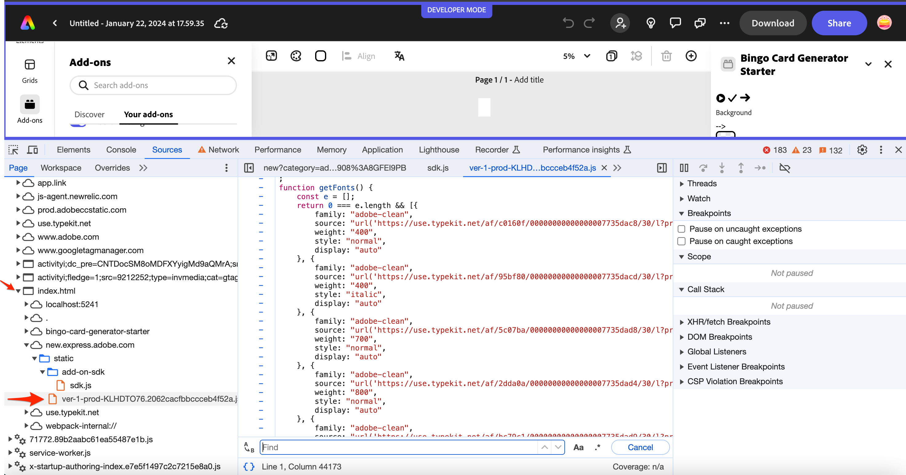

---
keywords:
  - Adobe Express
  - Express Add-on SDK
  - Express Document API
  - Document Model Sandbox
  - Add-on SDK
  - Spectrum Design System
  - Spectrum Web Components
  - swc-react
  - UI Components
  - Tutorial
  - Troubleshooting
  - Tips
  - SDK
  - JavaScript
  - React
  - Extend
  - Extensibility
  - API
  - Debugging
title: Spectrum Workshop - Tips & Troubleshooting
description: Tips, troubleshooting, and debugging guidance for using Adobe's Spectrum Design System in Adobe Express add-ons.
contributors:
  - https://github.com/hollyschinsky
---

# Spectrum Workshop - Tips & Troubleshooting

Useful information to use while developing your add-on UI's with Spectrum.

## Tips

### Using icons

You can import and use an [icon from the Spectrum icon libraries](https://spectrum.adobe.com/page/icons/) provided in the [`icons-workflow`](https://opensource.adobe.com/spectrum-web-components/components/icons-workflow/) and [`icons-ui`](https://opensource.adobe.com/spectrum-web-components/components/icons-ui/) libraries.

- [**icons-workflow**](https://opensource.adobe.com/spectrum-web-components/components/icons-workflow/) - icons representing graphical metaphors such as a document, share symbol, trash can, etc.
- [**icons-ui**](https://opensource.adobe.com/spectrum-web-components/components/icons-ui/) - icons that are parts of a component definition like an X, magnifying glass or checkmark.

To use these icons, first add the associated library to your project by installing them from the command line, or via the `package.json`, then import them into your JS. For example:

```json
"@spectrum-web-components/icons-ui": "1.7.0",
"@spectrum-web-components/icons-workflow": "1.7.0",
```

Then import and use them; for instance:

```js
import "@spectrum-web-components/icons-workflow/icons/sp-icon-play-circle.js;";
import "@spectrum-web-components/icons-ui/icons/sp-icon-arrow75.js";
```

```html
<sp-icon-play-circle size="s"></sp-icon-play-circle>
<sp-icon-arrow75 size="m"></sp-icon-arrow75>
```

**NOTE:** Icons adhere to the [Spectrum Design t-shirt sizing](https://spectrum.adobe.com/page/design-tokens/#Size-tokens), with a default of `size="m"` (for medium).

You can also use the [`[sp-icon]` package](https://opensource.adobe.com/spectrum-web-components/components/icon/) and specify an image directly via the `src` attribute, either with the image reference, or a data URL. Both are shown below for an example:

```html
<sp-icon src="icon-144x144.png" />

<sp-icon
  size="l"
  label="Previous"
  src="data:image/svg+xml;base64,PHN2ZyB4bWxucz0iaHR0cDovL3d3dy53My5vcmcvMjAwMC9zdmciIHZpZXdCb3g9Ii0yOTU3Ljk5NSAtNTUzMC4wMzIgNiAxMCI+PGRlZnM+PHN0eWxlPi5he2ZpbGw6bm9uZTtzdHJva2U6IzE0NzNlNjtzdHJva2UtbGluZWNhcDpyb3VuZDtzdHJva2UtbGluZWpvaW46cm91bmQ7c3Ryb2tlLW1pdGVybGltaXQ6MTA7c3Ryb2tlLXdpZHRoOjJweDt9PC9zdHlsZT48L2RlZnM+PHBhdGggY2xhc3M9ImEiIGQ9Ik0yNTEuMywzMzNsNC00LTQtNCIgdHJhbnNmb3JtPSJ0cmFuc2xhdGUoLTI3MDEuNjk1IC01MTk2LjAzMikgcm90YXRlKDE4MCkiLz48L3N2Zz4="
/>
```

You can also supply an `svg` to the `<sp-icon>` component, as shown below:

```html
<sp-icon>
  <svg
    xmlns="http://www.w3.org/2000/svg"
    viewBox="0 0 22 22"
    role="img"
    fill="currentColor"
    height="18"
    width="18"
    aria-hidden="true"
  >
    <path
      d="M19.75,10.04h-15l5.97-5.97a.483.483,0,0,0,0-.7l-.35-.36a.513.513,0,0,0-.71,0L2.24,10.44a.513.513,0,0,0,0,.71l7.39,7.84a.513.513,0,0,0,.71,0l.35-.35a.513.513,0,0,0,0-.71L4.76,11.5H19.75a.25.25,0,0,0,.25-.25v-.96A.25.25,0,0,0,19.75,10.04Z"
    ></path>
  </svg>
</sp-icon>
```

<InlineAlert slots="text" variant="warning"/>

Using an iconset reference from one of the `icons-workflow` or `icons-ui` packages in the `name` on an `sp-icon` should no longer be used (ie: `<sp-icon name="ui:Arrow100"></sp-icon>`), since it's deprecated. Use the specific named import mentioned in the first bullet above, instead.

### Spectrum sizing

In Spectrum, there are two main sizing concepts to understand:

- [**scale**](https://spectrum.adobe.com/page/platform-scale/) - the overall size of all of the components on the page, ie: medium for desktop, or large for touch, for instance.
- [**t-shirt sizes**](https://spectrum.adobe.com/page/design-tokens/#Size-tokens) - the size of a specific component, set as a variant or modifier to that component (ie: `size="m"`). **Note:** a component with a t-shirt sizing is still affected by `scale`.

### Fonts

There are a set of [Adobe Clean fonts](https://spectrum.adobe.com/page/fonts/) automatically injected by the [Add-on UI SDK](https://developer.adobe.com/express/add-ons/docs/references/addonsdk/#importing-the-addonuisdk-for-use) for use in your add-ons. You can see which are available by checking [the documentation](https://developer.adobe.com/express/add-ons/docs/guides/design/user_interface/#using-fonts). You can also see them while running an add-on via the browser developer tools, as shown in the following:



### Debugging

- Use the browser developer tools to inspect the HTML, and search for the `add-on-iframe-slot` element to find the add-on specific code container.
- From the developer tools, click into the variables in the stylesheets to see their values.
- Dig into the `node_modules/@spectrum-web-components` folder and view the component details to help better understand why an issue might be happening.
- Use the [API tab in the component reference](https://opensource.adobe.com/spectrum-web-components/components/slider/api/) or [the Storybook](https://opensource.adobe.com/spectrum-web-components/storybook) to locate the details around the supported events.

### Styling with Spectrum CSS

Use Spectrum CSS variables for padding, gaps between controls, and general layout. In addition, since Spectrum Web Components do not include any specific components for typography, you can also use variables to style the typography.

Some benefits to using Spectrum CSS variables to style your components over absolute values:

- By using Spectrum CSS global variables, you can ensure your UI aligns with the Spectrum design system, and if the design system changes, your UI will automatically update to the new design system.
- Using Spectrum CSS variables to style your UI allows you to easily update the styles across your entire application by simply updating the value of the variable. If you decide to change a color used throught your app, for example, you can update the value of a single Spectrum CSS variable, and all the elements that use that variable will be updated automatically.

#### Layout and typography styling

- [Layout](https://spectrum.adobe.com/page/design-tokens/#Layout-tokens) - the layout of your add-on can be adjusted by using global variables defined in the `@spectrum-web-components/styles/express/spectrum-core-global.css` folder in the `node_modules` of your add-on.

  **Some general guidelines** <br/>

  - `--spectrum-global-dimension-static-size-*` variables should be used when the dimension needs to be consistent across different elements or components, such as a uniform padding or margin throughout the application. It should also be used when a dimension needs to be adjusted based on a specific context, such as a container element or viewport size.

  - `--spectrum-global-static-size-*` variables should be used for values that are not necessarily consistent across the application, but need to be adjusted based on the content or use case. In general, these variables are typically used for text-related styles that may vary based on content or context.

  To summarize:

  - Use `--spectrum-global-dimension-static-size` variables for for dimensions such as `width`, `height`, `padding`, `margin`, or general spacing variables.
  - Use `--spectrum-global-static-size` variables for things like `font-size`, `line-height`, `border-radius`, etc.

- [Color variables](https://spectrum.adobe.com/page/color-fundamentals/) are provided as part of the `theme` imports. The color value’s contrast with the background increases as the value increases, so colors progressively get darker in a light theme, and lighter in a dark theme (ie: `--spectrum-global-color-purple-600` is _lighter_ than `--spectrum-global-color-purple-900` in a `light` theme but _darker_ in a `dark` theme). [Preview the color palette](https://spectrum.adobe.com/page/color-palette/) in the reference for more details.

  **TIP:** Use theme-specific color variables, such as those defined in the light theme for Express, located in the CSS files in your `@spectrum-web-components/styles/express/*` folder, for general uses of color in your add-on. For example, when the color will be applied to text, icons, or the borders of a component. Use _static_ color variables defined in the overall `theme.js` when the color should be fixed and not dependent on the theme. The typical naming scheme is: `--spectrum-global-color-purple-600` and
  `--spectrum-global-color-static-purple-600`, respectively.

- [Typography](https://opensource.adobe.com/spectrum-css/typography.html) classes can be used to control your typography elements by importing the `typography.css`. For instance:

  ```html
  import "@spectrum-web-components/styles/typography.css";

   <div className="spectrum-Typography">
      <p className="spectrum-Heading spectrum-Heading--sizeL">This is a custom large header text</p>
  </div>
  </h3>
  ```

  **Note:** by default, typography components do not include any outer margins, but adding the [`spectrum-Typography` class to your container](https://opensource.adobe.com/spectrum-css/typography.html#:~:text=Applying%20margins,will%20have%20the%20correct%20margins) will provide margins to the typography components within it. You can try out [this codepen](https://codepen.io/hollyschinsky/pen/eYXKpmj) to see an example of this, by removing the `spectrum-Typography` from the `div` and adding it back to see the difference in the margins. It also illustrates some of the typography classes for example usage.

- **Overriding variables:** you can override the Spectrum CSS variables as needed in your add-on as well, by setting the name of the spectrum variable to a new value, for instance:

  ```css
  --spectrum-global-dimension-font-size-150: 16px;
  ```

### Component modifier variables

Components have a set of variables defined to use for modifying properties specific to that particular component. They are prefixed with `--mod-*`, and should be used when you want to customize the styling of a specific component.

These variables are particularly useful in cases where you want to use a component in multiple places with different styles. By using custom variables, you can easily adjust the styling of a component in one place, and have those changes apply to all instances of the component throughout your application.

In the sample app, you used custom modifiers for a few of the components, including to modify the Slider font size, some Swatch border properties and to adjust the Switch component, for reference.

A list of the prefixed custom properties for each UI component can be found in the Spectrum CSS repo's `mods.md` file for each component. For instance [the swatch component modifiers are listed here](https://github.com/adobe/spectrum-css/blob/main/components/swatch/metadata/mods.md), [and the slider component modifiers here](https://github.com/adobe/spectrum-css/tree/main/components/slider).

An example of their usage to modify the Slider is provided below for a reminder of what they look like:

```css
.color-well {
  cursor: pointer;
  --mod-swatch-border-thickness: var(--spectrum-divider-thickness-small);
  --mod-swatch-border-color: var(--spectrum-global-color-gray-200);
}
```

## Troubleshooting

### Known issues

- [Spectrum Web Component version conflicts](https://opensource.adobe.com/spectrum-web-components/registry-conflicts/)

  You _must_ use **matching component versions for all Spectrum Web Components (or swc-react components)** in your `package.json` or you will receive errors that are often not clear to determine the cause, so save yourself time and double check this if you're having issues running your add-on.

  This is mentioned in this tutorial a couple of times, but there is a known issue seen when using `@spectrum-web-components` (or `@swc-react`) packages with version `0.40.3`. At the moment `1.7.0` is a stable version that should work if you suspect a component version issue.

- [Picker](https://opensource.adobe.com/spectrum-web-components/components/picker/) flicker

  Currently there's a known issue with the `swc-react` **Picker** component in versions `0.36.*-0.40.*` where you will see the UI flicker when clicking it.

### FAQ & Troubleshooting

This section provides answers to common questions and helps troubleshoot errors you may encounter while following this tutorial.

#### Q: What's the difference between `--spectrum-global-dimension-static-size` and `--spectrum-global-static-size` variables?

**A:** Use `--spectrum-global-dimension-static-size` for layout dimensions like width, height, padding, margin, and spacing. Use `--spectrum-global-static-size` for content-related styles like font-size, line-height, and border-radius. The dimension variables are for consistent layout, while static-size variables are for content that may vary based on context.

#### Q: How do I find available Spectrum CSS variables?

**A:** Check the `/node_modules/@spectrum-web-components/styles/express/spectrum-core-global.css` file in your project for available global variables. For component-specific modifiers, look at the Spectrum CSS repo's `mods.md` files for each component.

#### Q: Can I override Spectrum CSS variables?

**A:** Yes! You can override any Spectrum CSS variable by setting it to a new value in your CSS:
```css
--spectrum-global-dimension-font-size-150: 16px;
```
This ensures your customizations remain consistent with the design system.

#### Q: What's the best way to debug Spectrum Web Component issues?

**A:** Use browser developer tools to:

- Inspect the `add-on-iframe-slot` element to find your add-on code
- Click into CSS variables in stylesheets to see their values  
- Check the `node_modules/@spectrum-web-components` folder for component details
- Use the API tab in component documentation or Storybook for event details

#### Q: Should I use theme-specific or static color variables?

**A:** Use theme-specific variables (like `--spectrum-global-color-purple-600`) for text, icons, and component borders that should adapt to light/dark themes. Use static variables (like `--spectrum-global-color-static-purple-600`) when the color should remain fixed regardless of theme.

- Why do I see registry errors in the console when running my add-on, for instance: `Uncaught DOMException: Failed to execute 'define' on 'CustomElementRegistry': the name "sp-icon-chevron100" has already been used with this registry` and `Base.dev.js:164 Attempted to redefine <sp-icon-chevron100>. This usually indicates that multiple versions of the same web component were loaded onto a single page. https://opensource.adobe.com/spectrum-web-components/registry-conflicts`

  This is probably due to mismatched versions of the `@spectrum-web-components` (or `@swc-react`) packages being used in your `package.json`. Don't forget to run `npm install` after updating your `package.json` to match the versions.

  **Solution:** open your `package.json` file and set all of the versions to the same one (ie: `1.7.0`). You can always reference [the sample projects](https://github.com/hollyschinsky/bingo-card-generator-js) as needed.

- Why do I see the following error when trying to build or start my add-on with the CLI? `ERROR in ./node_modules/@spectrum-web-components/button/src/Button.dev.js 145:6-78 Module not found: Error: Can't resolve '@spectrum-web-components/progress-circle/sp-progress-circle.js' in '/Users/hollyschinsky/spectrum-workshop-2023/workshop-projects/bingo-card-addon-react-start/node_modules/@spectrum-web-components/button/src' ... Field 'browser' doesn't contain a valid alias configuration resolve as module`

  **Solution:** there's a known issue seen when using `@spectrum-web-components` (or `@swc-react`) packages with version `0.40.3`, which is the latest version that are installed at the time of writing this tutorial, unfortunately. The solution is to update the versions of all components used in your `package.json` file to a known stable one like `1.7.0`. Don't forget to run `npm install` after updating to ensure the stable versions are installed before trying to build and run your add-on again.

- Is there a general solution to try when something doesn't work right with the CLI?

  **Solution:** try running `npx clear-npx-cache` to ensure the latest CLI version is installed, then run the CLI commands again.

- Why isn't the CLI building the output to the `dist` folder as I would expect? Did I forget to include a `webpack.config.js` file in the root of my project?

  **Solution:** make sure your [`webpack.config.js`](./part1.md#create-and-configure-your-add-on) is in the root of your project and not the `src` folder. You could also double check to ensure your project has the dependencies needed to use webpack. You could also try to replace your `package.json` file with the one from the [provided project](https://github.com/hollyschinsky/bingo-card-generator-react-js).

- I'm building a react-based add-on and it's not building correctly. Does the `scripts` object in the `package.json` of my add-on ensure the `--use webpack` parameter is used?

  **Solution:** ensure your `package.json` has the following `scripts` block. If it doesn't, it will not use webpack to build and start, package etc.

  ```json
  "scripts": {
      "clean": "ccweb-add-on-scripts clean",
      "build": "ccweb-add-on-scripts build --use webpack",
      "start": "ccweb-add-on-scripts start --use webpack",
      "package": "ccweb-add-on-scripts package --use webpack"
  }
  ```

- Are all of my components wrapped within an opening and closing `<sp-theme>` or `<Theme>` tag?

  **Solution:** make sure all your UI components are surrounded by the corresponding opening and closing theme tags for either Spectrum Web Components or `swc-react`, or you will not see the components rendered properly.

Still having issues? Message our team on [discord](https://discord.com/invite/nc3QDyFeb4) for help.

## Resources

The following list of resources can be used to learn more about using Adobe's Spectrum Design System:

- Example codepens

  - [Simple button using Spectrum Web Components](https://codepen.io/hollyschinsky/pen/xxBweyV)
  - [Bingo Card Generator](https://codepen.io/hollyschinsky/pen/wvOyrLm)
  - [Spectrum Typography](https://codepen.io/hollyschinsky/pen/eYXKpmj)
  - [Spectrum CSS](https://codepen.io/lazd/pen/Exevvey)

- [Adobe Express UX Guidelines](https://xd.adobe.com/view/urn:aaid:sc:US:fd638450-1af8-49c3-ad29-0e76c2a2136f/)
- [Adobe Spectrum Storybook Web Components Storybook](https://opensource.adobe.com/spectrum-web-components/storybook/)
- [Adobe Spectrum Tokens Visualizer](https://opensource.adobe.com/spectrum-tokens/visualizer/)
- [Adobe Spectrum XD Plugin](https://spectrum.adobe.com/page/spectrum-xd-plugin/)
- [Adobe Spectrum Figma plugin](https://www.figma.com/community/file/1211274196563394418/adobe-spectrum-design-system)
- [Adobe Spectrum CDN Bundle](https://jspm.dev/@spectrum-web-components/bundle/elements.js)

  - **Reminder:** you should only use this option for quick testing, but note that it will default to the Spectrum base theme unless you include the Express theme bundles specifically. See the [example codepens](https://codepen.io/hollyschinsky/pen/xxBweyV) for details.
- [Add-on Code Samples](https://developer.adobe.com/express/add-ons/docs/samples/)
- [Color Wheel](https://color.adobe.com/create/color-wheel)
