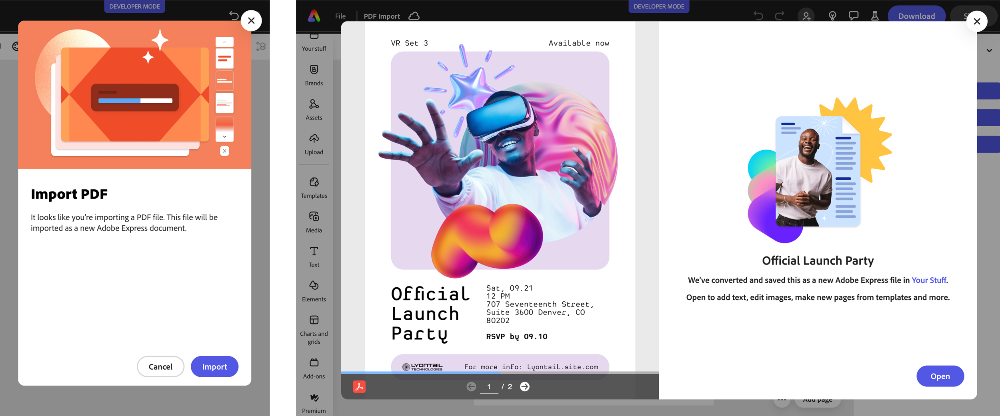

---
keywords:
  - Adobe Express
  - Express Add-on SDK
  - Express Editor
  - Adobe Express
  - Add-on SDK
  - SDK
  - JavaScript
  - Extend
  - Extensibility
  - API
  - PDF Import
  - PowerPoint Import
  - importPdf
  - importPowerPoint
title: Use PDF and PowerPoint
description: Use PDF and PowerPoint.
contributors:
  - https://github.com/undavide
  - https://github.com/hollyschinsky
faq:
  questions:
    - question: "How do I import PDF files?"
      answer: 'Call `addOnUISdk.app.document.importPdf(blob, attributes)` with PDF blob and MediaAttribute object.'

    - question: "How do I import PowerPoint files?"
      answer: 'Call `addOnUISdk.app.document.importPowerPoint(blob, attributes)` with PowerPoint blob and MediaAttribute.'

    - question: "What PowerPoint formats are supported?"
      answer: "Both .pptx and .ppt file formats are supported."

    - question: "Are MediaAttributes required for PDF/PowerPoint?"
      answer: "Yes, title is mandatory and author is optional in the MediaAttribute object."

    - question: "Will users see a consent dialogue?"
      answer: "Yes, PDF and PowerPoint imports trigger consent dialogues that users must confirm."

    - question: "Can I bypass the consent dialogue?"
      answer: "No, the consent dialogue cannot be bypassed for PDF and PowerPoint imports."

    - question: "Are vector elements preserved?"
      answer: "Yes, supported vector elements like shapes and text remain editable after import."

    - question: "How many pages are imported?"
      answer: "All pages from PDF and PowerPoint files are imported into the document."
---

# Use PDF and PowerPoint

## Import PDF into the page

You can add PDFs to the page using the [`importPdf()`](../../../references/addonsdk/app-document.md#importpdf) method of the `addOnUISdk.app.document` object, which expects a `Blob` object as an argument and a [`MediaAttribute`](../../../references/addonsdk/app-document.md#mediaattributes) object with a title (mandatory) and author (optional) as the second.

PDF and PowerPoint imports will trigger a consent dialogue that asks the user to confirm the process; it's not possible to bypass it. As soon as the process starts, another dialogue will preview the PDF and track the operation progress.



Supported vector elements will be kept editable (e.g., shapes with rounded corners, text, etc.), and all pages will be imported.

### Example

```js
import addOnUISdk from "https://express.adobe.com/static/add-on-sdk/sdk.js";

addOnUISdk.ready.then(async () => {
  try {
    const pdfUrl = "https://url/to/your/file.pdf";

    const pdf = await fetch(pdfUrl);
    const pdfBlob = await pdf.blob();

    await addOnUISdk.app.document.importPdf(
      pdfBlob, // 👈 Blob object
      {
        title: "Official Launch Party",
        author: "Adobe",
      }
    );
  } catch (e) {
    console.error("Failed to add the PDF", e);
  }
});
```

Please note that you can use `fetch()` also to get PDFs that are local to the add-on; in this case, you can use paths relative to the add-on's root.

```js
import addOnUISdk from "https://express.adobe.com/static/add-on-sdk/sdk.js";

addOnUISdk.ready.then(async () => {
  try {
    // 👇 Local PDF
     const pdfUrl = "./OfficialLaunchParty.pdf";
    const pdf = await fetch(pdfUrl);
    // ... same as before
```

## Import PowerPoint into the page

For PowerPoint files, the process is similar to the one for PDFs, but you need to use the [`importPowerPoint()`](../../../references/addonsdk/app-document.md#importpresentation) method instead. The method supports both `.pptx` and `.ppt` files, and shows the same consent and progress dialogues as seen above.

```js
import addOnUISdk from "https://express.adobe.com/static/add-on-sdk/sdk.js";

addOnUISdk.ready.then(async () => {
  try {
    const powerPointUrl = "https://url/to/your/file.pptx";
    // Or
    // const powerPointUrl = "./OfficialLaunchParty.pptx";

    const powerPoint = await fetch(powerPointUrl);
    const powerPointBlob = await powerPoint.blob();

    await addOnUISdk.app.document.importPowerPoint(
      powerPointBlob, // 👈 Blob object
      {
        title: "Official Launch Party",
        author: "Adobe",
      }
    );
  } catch (e) {
    console.error("Failed to add the PDF", e);
  }
});
```

## FAQs

#### Q: How do I import PDF files?

**A:** Call `addOnUISdk.app.document.importPdf(blob, attributes)` with PDF blob and MediaAttribute object.

#### Q: How do I import PowerPoint files?

**A:** Call `addOnUISdk.app.document.importPowerPoint(blob, attributes)` with PowerPoint blob and MediaAttribute.

#### Q: What PowerPoint formats are supported?

**A:** Both .pptx and .ppt file formats are supported.

#### Q: Are MediaAttributes required for PDF/PowerPoint?

**A:** Yes, title is mandatory and author is optional in the MediaAttribute object.

#### Q: Will users see a consent dialogue?

**A:** Yes, PDF and PowerPoint imports trigger consent dialogues that users must confirm.

#### Q: Can I bypass the consent dialogue?

**A:** No, the consent dialogue cannot be bypassed for PDF and PowerPoint imports.

#### Q: Are vector elements preserved?

**A:** Yes, supported vector elements like shapes and text remain editable after import.

#### Q: How many pages are imported?

**A:** All pages from PDF and PowerPoint files are imported into the document.
