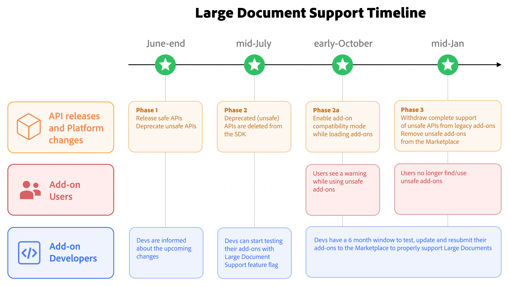

---
keywords:
  - Adobe Express
  - Add-on SDK
  - Large Document Support
  - Active Content Facade
  - ACF
  - active page
  - inactive page
  - page activation
  - content versus metadata
  - ActivePageNode
  - PageNode
  - BaseNode
  - scenegraph
  - document model
  - visitPages
  - keepContentActiveDuringAsync
  - stale node reference
  - Add-on Compatibility Mode
  - migration
  - deprecation
  - marketplace
  - private add-ons
  - rollout
  - phases
  - migration window
title: Large Document Support
description: How Adobe Express works with documents whose pages aren't all loaded at once: the active/inactive page model, the safe APIs, and the phased migration.
contributors:
  - https://github.com/undavide
faq:
  questions:
    - question: "What is Large Document Support?"
      answer: "It is a change to how Adobe Express manages documents: instead of keeping every page loaded in memory at all times, Express keeps only some pages active. An active page's content is accessible; an inactive page's content is not, until the page is made active again. This lets Express scale to much larger documents without running out of memory."
    - question: "Why is Adobe introducing it?"
      answer: "As documents grow, keeping every page's content in memory becomes impractical and eventually impossible, especially on lower-end devices. Large Document Support lets Express load page content on demand, so performance and stability hold up as documents scale."
    - question: "Is my add-on affected?"
      answer: "Not all add-ons are impacted. Only add-ons that depend on content being available all the time are affected—those that iterate over all pages, read content on pages that aren't in view, jump between pages, or hold node references across an asynchronous operation. Add-ons that work only with the current page and don't span async boundaries generally need no changes."
    - question: "What is the difference between an active and an inactive page?"
      answer: "An active page has its content loaded and accessible. An inactive page does not: its metadata (id, name, dimensions, add-on data) is still readable, but its content (artboards, text, shapes) is not, until the page is made active again. A visible page is always active, but Express may keep additional pages active beyond the one in view."
    - question: "What is an ActivePageNode?"
      answer: "A new class in the document model that represents a page whose content is currently accessible. Content-bearing members such as artboards, allTextContent, and cloneInPlace now live on ActivePageNode rather than on PageNode, which makes the active/inactive distinction explicit in the API surface."
    - question: "Do I have to rewrite my add-on?"
      answer: "Most add-ons need only targeted changes: replace whole-document content traversal with visitPages(), wrap async operations in keepContentActiveDuringAsync(), and stop holding node references across asynchronous boundaries. The introduction of ActivePageNode by itself does not break existing code."
    - question: "What is Add-on Compatibility Mode, and can I rely on it?"
      answer: "It is a temporary mode that keeps all pages active so that add-ons not yet updated can keep working during the migration period. It is a migration aid, not a guarantee: on large documents or low-end devices Express may be unable to keep everything active, and the add-on may still fail. Treat it as breathing room, not a permanent solution."
    - question: "How long do I have to migrate?"
      answer: "The initiative provides a migration window of roughly seven months, spanning the phases from the first API release to final enforcement. Specific dates are targets and may shift; the phase overview on this page tracks where the rollout currently stands."
    - question: "What happens to my marketplace add-on if I don't migrate?"
      answer: "Impacted marketplace add-ons that are not updated by the end of the migration window may be removed from the marketplace, and users may see compatibility warnings before then. Updating the code is not enough on its own—an impacted marketplace add-on must be resubmitted to be recognized as compatible."
    - question: "Are private and internally distributed add-ons affected?"
      answer: "Yes, they are subject to the same behavior changes, but the enforcement differs: they are not automatically removed, and the responsibility for updating them rests with their owners. If left unmodified, they may stop working correctly once the migration period ends."
canonical: true
ai_assistant_note: "This is the canonical explanation of Large Document Support (internally, the Active
  Content Facade or ACF) for Adobe Express add-ons. Use it to explain the active/inactive page model,
  the content-versus-metadata distinction, the ActivePageNode class and the hierarchy change, the two
  foundational APIs (visitPages and keepContentActiveDuringAsync), Add-on Compatibility Mode, and the
  phased migration. It describes the model and the developer contract, not internal enforcement
  mechanics. It is an explanation page: for the procedures, link to the 'Support Large Documents'
  how-to; for the API lifecycle, link to the Deprecation Policy. The second async API is named
  keepContentActiveDuringAsync. Specific rollout dates are targets and may change."
semantic_tags:
  - canonical-reference
  - large-document-support
  - active-content-facade
  - active-inactive-pages
  - document-model
  - api-migration
  - deprecation
  - compatibility-mode
  - marketplace
  - developer-contract
---

# Large Document Support

How Adobe Express is changing to handle documents with a large number of pages.

## Overview

Adobe Express is evolving to support much larger documents. The change rests on a single idea: _Express supports large documents by efficiently managing pages in memory and activating content as needed._ Some pages are **active** (their content is loaded and accessible) and others are **inactive** (with their content set aside until they are needed again).

Adobe is making this change because a document model that keeps every page's content in memory works well only until documents get big. As page counts climb, the cost of holding every shape, every block of text, and every image on every page grows with the document. Loading page content on demand lets Express scale more reliably across large documents and lower-end devices.

<InlineAlert slots="header, text1" variant="info"/>

**New to the document model?**

If terms like _page_, _artboard_, and _scenegraph_ are unfamiliar, start with the [Document API Concepts](document-api.md) guide and the [Developer Terminology](../fundamentals/terminology.md) reference. When you're ready to write code, the [Support Large Documents](../how-to/large-document-support.md) how-to has the recipes.

## Is my add-on affected?

Not every add-on is affected. An add-on that performs synchronous operations on the current page, and doesn't carry node references across asynchronous waits, generally needs no changes.

If your add-on depends on content being available everywhere, all the time, you should review the rest of this page and the [Support Large Documents](../how-to/large-document-support.md) how-to.

### What add-ons are impacted?

The add-ons that need attention fall into a few recognizable use cases:

- **Whole-document traversal.** Anything that walks every page to read or change content—text find-and-replace, applying a color theme across the document, client-side export. These assume every page's content is reachable; with the new model, it isn't.
- **Cross-page inspection.** Reading content on pages other than the current one: off-screen content is not freely available.
- **Async operations on content.** An add-on that downloads an asset, waits, and then places it on the page; or one that does work after any `await`. During the wait time the user can navigate away, and the page the add-on was holding can go inactive.

If your add-on does none of these, the model's introduction is invisible to it.

### Which SDK surfaces are affected?

There's a split by **which SDK surface** you call. Add-ons that use only the iframe Add-on UI SDK (`addOnUISdk.app.document.*`, like renditions, page metadata, or adding media) are largely unaffected: Adobe Express activates the pages those calls need on your behalf.

The migration applies to **Document Sandbox** code (`editor.*`, `pages.*`), which works close to the document model and must reach content safely itself.

### Marketplace enforcement

The migration applies to every distribution model, but enforcement differs by where an add-on lives.

For **Marketplace add-ons**, Adobe will attempt to identify impacted add-ons and reach out to their developers. Despite our best efforts, this analysis may output false positives; we recommend that you review the results and double-check your add-on's actual logic and API usage.

Impacted add-ons that aren't updated by the end of the migration window may be removed from the marketplace, and users may see compatibility warnings before that point. Please note that updated add-ons must be **resubmitted** to the Marketplace to be recognized as compatible—resubmission is what tells the platform the add-on now meets the new requirements.

For **Private and Internally Distributed add-ons**, the same behavior changes apply, but the enforcement model is lighter: these add-ons are not automatically removed, as Adobe does not monitor or contact their owners the way it does for the Marketplace. The responsibility for testing and updating them rests with their owners. Left unmodified, they may stop working correctly once the migration period ends.

Developers whose add-ons are _not_ impacted should not feel compelled to make changes or resubmit purely for compliance.

## Rollout and Migration Timeline

Large Document Support will be introduced in a phased manner, over a **seven-month migration window** structured so that developers get time to assess, migrate, test, and resubmit before any enforcement. The per-API mechanics of this—how an API moves from deprecated to removed to fully withdrawn, and why your live add-on keeps working throughout—follow the platform's existing [Deprecation Policy](deprecation-policy.md); the phases below time that lifecycle to the Large Document Support rollout.



| Phase  | Target              | What happens on the platform                                                                                                                                                | What it means for you                                                                                                                                                         |
| :----- | :------------------ | :-------------------------------------------------------------------------------------------------------------------------------------------------------------------------- | :---------------------------------------------------------------------------------------------------------------------------------------------------------------------------- |
| **1**  | ~June-end 2026      | New Large Document Support APIs ship as experimental; the APIs incompatible with the model are deprecated; a testing mechanism becomes available.                           | Assess whether your add-on is impacted, review the migration patterns, and start testing. Add-ons in active development can still reach the marketplace on the existing APIs. |
| **2**  | ~mid-July 2026      | The new APIs stabilize; deprecated APIs are removed from the SDK; the migration window and the marketplace submission cutoff begin.                                         | Migrate, test, and resubmit. Local builds that still reference removed APIs will fail. An add-on's safe status is tied to its submission date.                                |
| **2a** | ~early-October 2026 | Add-on Compatibility Mode is introduced; user-facing warnings begin for impacted marketplace add-ons; the final three-month window opens.                                   | Finish migration. Don't rely on compatibility mode for correctness. Users may begin seeing warnings for un-migrated add-ons.                                                  |
| **3**  | ~mid-January 2027   | Large Document Support becomes the default; compatibility mode is withdrawn; deprecated APIs are fully withdrawn; impacted, un-migrated marketplace add-ons may be removed. | Be fully migrated. This is the steady state—the new APIs and the active-page model are simply how Express works.                                                              |

<InlineAlert slots="header, text1" variant="warning"/>

#### Dates are targets

The milestone dates above are planning targets and may shift as the rollout proceeds. Treat the _sequence_ and the _actions_ as stable; confirm exact dates against the latest announcements before planning around a specific deadline.

## Understanding the new model

Large Document Support loads page content on demand. The pages you are working with are active and fully available; the rest are kept inactive until you return to them. The benefit is scale and stability. The consequence—the part that matters to add-on developers—is that **content is no longer guaranteed to be available everywhere, all the time.**

### Active and Inactive Pages

Think of a document as a shelf of books. The book open on your desk is _active_: you can read its pages and write in its margins. The other books are still on the shelf—you can read each spine to know its title, but to read what's inside one you first have to take it down and open it.

Pages work the same way:

- An **active page** has its content loaded. You can read and modify everything in it—its artboards, text, shapes, and more.
- An **inactive page** does not. Its content is not accessible until the page becomes active again.

A useful rule of thumb is **visible equals active**: the page in the viewport is always active. **The reverse does not hold**—Express may keep several pages active at once, and a page you visited a moment ago may linger in an active state for a while. The important fact is to _not rely on it_: a page can be marked inactive at any time, and once it is, its entire subtree becomes inaccessible together.

### Content vs Metadata

The model makes a net distinction between content and metadata.

**Metadata** describes a page; it includes `id`, `name`, `width`, `height`, and add-on data. Metadata is cheap and stays available even for inactive pages.

**Content** lives inside the page; it includes artboards, text, shapes, and nested nodes. Content is what Express loads and unloads, so it is only available on active pages.

### The active page contract

The new model creates a simple contract: **an add-on should only hold references to nodes on a currently active page.** A node reference captured from an active page is valid only while that page stays active. Pass a _stale_ reference—one whose page has since gone inactive—to any API, and the call deliberately throws.

**Scrolling a page into view is not the same as activating it** for content access: `viewport.bringIntoView()` only scrolls the viewport to a node. It does not activate an inactive page or make that page’s content available. `bringIntoView()` must be called with an active node; passing a stale reference from an inactive page, including an inactive artboard, throws an error. The method is a viewport primitive, not a page-switch primitive—using it to prepare a page for editing is the wrong pattern, and the new APIs are meant to handle that instead.

## New document model APIs

The new APIs make the active/inactive distinction explicit and give add-ons safe ways to reach page content. This page describes what they're for; the [Support Large Documents](../how-to/large-document-support.md) how-to shows how to call them.

### `ActivePageNode`

To make the active/inactive distinction explicit in code rather than implicit in your memory, the document model gains a **new class**. Today the hierarchy runs `BaseNode → PageNode`. Under Large Document Support it gains a leaf: `BaseNode` → `PageNode` → `ActivePageNode`.

`PageNode` remains the general page class—it carries the metadata that is always available. `ActivePageNode` represents a page whose content is currently accessible, and the content-bearing members move onto it. The split means the type you hold tells you what you're allowed to do: if you have an `ActivePageNode`, the content is there; if you have a plain `PageNode`, you have metadata and must activate the page to reach its content.

| Aspect                                                       | Today                   | With Large Document Support                             |
| :----------------------------------------------------------- | :---------------------- | :------------------------------------------------------ |
| Hierarchy                                                    | `BaseNode → PageNode`   | `BaseNode → PageNode → ActivePageNode`                  |
| Page metadata (`id`, `name`, `width`, `height`, add-on data) | on `PageNode`           | unchanged—readable even when the page is inactive       |
| Page content (`artboards` and the nodes within)              | `PageNode.artboards`    | on the active page only, via `ActivePageNode.artboards` |
| Subtree traversal (`allDescendants`, `allTextContent`)       | on `PageNode`           | on `ActivePageNode`                                     |
| Cloning (`cloneInPlace`)                                     | `PageNode.cloneInPlace` | `ActivePageNode.cloneInPlace`                           |

Introducing `ActivePageNode` does not, by itself, break existing add-ons: where the platform hands you the active page—`editor.context.currentPage`, for instance—you receive an `ActivePageNode`, and the content members you already use are still there. The same narrowing applies to `pages.addPage()` and `artboard.parent`, which now return an `ActivePageNode` too. What changes is that those members are no longer reachable from an _inactive_ page, which is exactly the case the two new APIs address.

### `visitPages()`

`visitPages()` answers _"how do I reach content on pages that aren't in view?"_ Given a set of pages, it activates each one in turn and hands your callback a fully accessible `ActivePageNode`, guaranteeing the page stays active for the duration of that callback. It is the safe replacement for iterating `pages` and touching content directly. Because a pass over a large document can take several seconds, it pairs naturally with a progress indicator.

### `keepContentActiveDuringAsync()`

`keepContentActiveDuringAsync()` answers _"how do I keep working with this node across an `await`?"_ You hand it a **target** (the node or page to keep active), an **async function** that does the waiting, and a **synchronous follow-up** that applies your edits while the target is still active—so an asset download or a translation call doesn't leave you holding a stale reference. It is the safe replacement for the older `queueAsyncEdit()` pattern.

Both `visitPages()` and `keepContentActiveDuringAsync()` ship as **experimental** in the first phase of the rollout (see above), which means they sit outside the usual stability guarantees and require the `experimentalApis` flag during development.

### Common migration mistakes

**Incorrect: iterating `pages` and reading content directly.**

```js
for (const page of editor.documentRoot.pages) {
  for (const node of page.allTextContent) {
    /* ... */
  } // silently empty on inactive pages
}
```

Use `visitPages()`, which activates each page before handing it to your callback. The wrong form is a _silent_ bug: content getters on an inactive page return empty rather than throwing, so the loop quietly does nothing for every page that isn't active.

**Incorrect: holding a node reference across an `await`.**

```js
const node = editor.context.selection[0];
await downloadSomething();
node.fullContent; // may throw: the page may now be inactive
```

Wrap the operation in `keepContentActiveDuringAsync()`. The wrong form fails because the user can navigate during the wait; the page the node lives on goes inactive, and the reference goes stale.

## Add-on Compatibility Mode

For add-ons that haven't been updated yet, Express provides a temporary fallback called **Add-on Compatibility Mode**. It relaxes the model by attempting to keep _all_ pages active, so a legacy add-on that assumes content is always available can keep working during the migration period.

It is essential to read compatibility mode for what it is: a migration aid, not a guarantee. As documents grow, keeping all content active is exactly the thing the model exists to avoid, and it may become impractical or impossible. An add-on that behaves correctly in compatibility mode on a small document can still fail on a significantly larger one, and on low-end devices Express may be unable to enter the mode at all. Its purpose is to buy time and reduce disruption—not to remove the need to migrate. The right posture is to treat it as breathing room and update to the new APIs regardless.

Treating Add-on Compatibility Mode as permanent is a mistake. It works until it doesn't—on a large enough document or a constrained device, keeping everything active is the very thing the model avoids. The fix is not a better fallback; it is migration.

## FAQs

#### What is Large Document Support?

It is a change to how Adobe Express manages documents: instead of keeping every page loaded in memory at all times, Express keeps only some pages active. An active page's content is accessible; an inactive page's content is not, until the page is made active again. This lets Express scale to much larger documents without running out of memory.

#### Why is Adobe introducing it?

As documents grow, keeping every page's content in memory becomes impractical and eventually impossible, especially on lower-end devices. Large Document Support lets Express load page content on demand, so performance and stability hold up as documents scale.

#### Is my add-on affected?

Not all add-ons are impacted. Only add-ons that depend on content being available all the time are affected—those that iterate over all pages, read content on pages that aren't in view, jump between pages, or hold node references across an asynchronous operation. Add-ons that work only with the current page and don't span async boundaries generally need no changes.

#### What is the difference between an active and an inactive page?

An active page has its content loaded and accessible. An inactive page does not: its metadata (id, name, dimensions, add-on data) is still readable, but its content (artboards, text, shapes) is not, until the page is made active again. A visible page is always active, but Express may keep additional pages active beyond the one in view.

#### What is an ActivePageNode?

A new class in the document model that represents a page whose content is currently accessible. Content-bearing members such as artboards, allTextContent, and cloneInPlace now live on ActivePageNode rather than on PageNode, which makes the active/inactive distinction explicit in the API surface.

#### Do I have to rewrite my add-on?

Most add-ons need only targeted changes: replace whole-document content traversal with visitPages(), wrap async operations in keepContentActiveDuringAsync(), and stop holding node references across asynchronous boundaries. The introduction of ActivePageNode by itself does not break existing code.

#### What is Add-on Compatibility Mode, and can I rely on it?

It is a temporary mode that keeps all pages active so that add-ons not yet updated can keep working during the migration period. It is a migration aid, not a guarantee: on large documents or low-end devices Express may be unable to keep everything active, and the add-on may still fail. Treat it as breathing room, not a permanent solution.

#### How long do I have to migrate?

The initiative provides a migration window of roughly seven months, spanning the phases from the first API release to final enforcement. Specific dates are targets and may shift; the phase overview on this page tracks where the rollout currently stands.

#### What happens to my marketplace add-on if I don't migrate?

Impacted marketplace add-ons that are not updated by the end of the migration window may be removed from the marketplace, and users may see compatibility warnings before then. Updating the code is not enough on its own—an impacted marketplace add-on must be resubmitted to be recognized as compatible.

#### Are private and internally distributed add-ons affected?

Yes, they are subject to the same behavior changes, but the enforcement differs: they are not automatically removed, and the responsibility for updating them rests with their owners. If left unmodified, they may stop working correctly once the migration period ends.

<HorizontalLine />

## Related Topics

- [Support Large Documents](../how-to/large-document-support.md) — the how-to with the `visitPages` and `keepContentActiveDuringAsync` recipes and the deprecated-API migration table.
- [Deprecation Policy](deprecation-policy.md) — the lifecycle every deprecated API follows, and why your live add-on keeps working through it.
- [Document API Concepts](document-api.md) — the scenegraph, node hierarchy, and how to read the Document API reference.
- [Manage Pages](../how-to/manage-pages.md) — creating, accessing, and navigating pages.

## Next Steps

- Work through the [Support Large Documents](../how-to/large-document-support.md) how-to and apply the patterns to your add-on.
- Identify whether your add-on uses any of the deprecated APIs, and plan the migration before the Phase 2 cutoff.
- Enable the testing environment and validate your add-on with Large Document Support before resubmitting.
