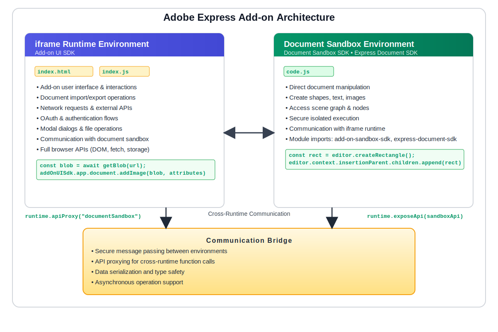

---
keywords:
  - Adobe Express
  - Add-on SDK
  - Adobe Express Editor
  - SDK (Software Development Kit)
  - JavaScript
  - TypeScript
  - Extend
  - Extensibility
  - API
  - Runtime
  - Communication
  - Document Sandbox
  - Document Sandbox SDK
  - Document API
  - UI Runtime
  - Iframe Runtime
  - Architecture
  - Two-Runtime System
  - Cross-Runtime Communication
  - API Proxy
  - Expose API
  - Runtime Bridge
  - Sandbox Environment
  - Security
  - Performance
  - Debugging
  - Error Handling
  - Best Practices
  - Manifest Configuration
  - Web APIs
  - Console APIs
  - Blob API
  - QuickJS
  - Isolated Environment
  - Express Document SDK
  - Add-on UI SDK
  - Communication APIs
  - Runtime Types
  - Panel Runtime
  - Script Runtime
  - Document Manipulation
  - Content Creation
  - UI Components
  - Event Handling
  - Asynchronous Operations
  - Editor Context
  - Insertion Parent
  - Document Root
  - Scenegraph
  - Node Creation
  - File Organization
  - Import Patterns
  - SDK Imports
  - Development Workflow
  - Singleton Pattern
  - Three SDKs
  - Add-on scope vs application scope
title: Add-on Architecture
description: A comprehensive deep-dive guide to Adobe Express add-on architecture, explaining the two-runtime system, communication patterns, SDK imports, debugging techniques, and best practices for building secure and performant add-ons.
contributors:
  - https://github.com/hollyschinsky
faq:
  questions:
    - question: "Why are there two different runtime objects?"
      answer: "Each environment has its own runtime object that acts as a communication phone. The iframe runtime calls the document sandbox, and the document sandbox calls the iframe runtime. This separation ensures security and proper isolation."

    - question: "When do I use addOnUISdk.instance.runtime vs addOnSandboxSdk.instance.runtime?"
      answer: "Use the runtime object from the environment you're currently in. In index.js (iframe runtime): Use addOnUISdk.instance.runtime (from Add-on UI SDK). In code.js (document sandbox): Use addOnSandboxSdk.instance.runtime (from Document Sandbox SDK)."

    - question: "What does await runtime.apiProxy('documentSandbox') actually do?"
      answer: "It creates a proxy object that lets you call functions you've exposed in the document sandbox from your iframe runtime code. Think of it as getting a remote control for the other environment."

    - question: "What's the difference between 'documentSandbox' and 'panel' in apiProxy?"
      answer: "These specify which environment you want to communicate with. Use 'documentSandbox' to call from iframe runtime to document sandbox. Use 'panel' to call from document sandbox to iframe runtime."

    - question: "Can I access Document APIs directly from the iframe runtime?"
      answer: "No, Document APIs (Express Document SDK) are only available in the document sandbox for security reasons. You must use the communication system (Document Sandbox SDK) to bridge between environments."

    - question: "How do I know which environment my code is running in?"
      answer: "Check your file structure and imports. If you're importing addOnUISdk (Add-on UI SDK) you're in the iframe runtime. If you're importing addOnSandboxSdk (Document Sandbox SDK) you're in the document sandbox."

    - question: "Do I always need both imports in my code.js file?"
      answer: "No! It depends on what your add-on does. Use just Document Sandbox SDK for processing data without document changes. Use both SDKs (Document Sandbox SDK + Express Document SDK) for creating/modifying document content - the most common pattern."

    - question: "When does my document sandbox code (code.js) actually execute?"
      answer: "Your code.js only executes when your add-on's panel is opened by the user. If you have a panel entrypoint with documentSandbox: code.js in your manifest, the code.js file loads when the user opens your add-on panel."

    - question: "What else is available in the Document Sandbox SDK package?"
      answer: "Besides runtime, the Document Sandbox SDK provides Web APIs (limited browser APIs like console and Blob), automatic global injections, secure execution environment, and communication infrastructure."

    - question: "Can I use fetch() or other network APIs in the document sandbox?"
      answer: "No, network APIs like fetch() are not available in the document sandbox for security reasons. If you need to make network requests, do them in the iframe runtime and pass the data to the document sandbox via communication APIs."

    - question: "Can my code.js file run without a UI panel?"
      answer: "No, for third-party add-ons, the document sandbox (code.js) only runs in the context of a panel entrypoint. Your add-on must have a UI that users interact with."

    - question: "Why does my add-on feel slower in the document sandbox?"
      answer: "The document sandbox runs in an isolated environment (QuickJS) which is inherently slower than the native browser JavaScript engine. This is by design for security. Minimize complex operations and data transfer between environments."

    - question: "What is the singleton pattern and which SDKs use it?"
      answer: "All three Adobe Express add-on SDKs use the singleton pattern - Add-on UI SDK (addOnUISdk), Document Sandbox SDK (addOnSandboxSdk), and Express Document SDK (editor, colorUtils, constants, fonts, viewport). They provide pre-instantiated objects you import and use directly. You never create new instances yourself. This ensures consistent state and prevents conflicts."
---

# Add-on Architecture Guide

Learn about the dual-runtime architecture, communication patterns, and development workflow essentials for building Adobe Express add-ons.

## Overview

This guide explains Adobe Express's dual-runtime architecture, cross-runtime communication, SDK usage, and development best practices for building secure and performant add-ons.

**Key Concept**: Add-ons run as iframes within Adobe Express, with isolated runtime environments communicating through a secure proxy layer.

<InlineAlert variant="info" slots="header, text1"/>

**New to add-on terminology?**

If you're unfamiliar with terms like "iframe runtime," "Document Sandbox SDK," or "Express Document SDK," check out the [Add-on Development Terminology Guide](../fundamentals/terminology.md) for clear definitions and quick reference charts. This architecture guide assumes familiarity with those core concepts.

## Dual-Runtime Architecture

Adobe Express add-ons run in **two separate JavaScript execution environments** that work together:

1. **iframe runtime** - Your add-on's user interface environment (uses Add-on UI SDK)
2. **document sandbox** - Secure environment for document manipulation (uses Document Sandbox SDK)



### How it works

Your add-on is bundled and loaded as an iframe within Adobe Express. Both runtime environments are isolated from each other and from the host application for security. They communicate exclusively through a proxy-based message passing system, which ensures that:

- The UI cannot directly access or manipulate the document
- The document sandbox cannot directly access the DOM or browser APIs
- All cross-runtime communication is type-safe and validated
- Security boundaries are maintained while enabling powerful functionality

This isolation is fundamental to Adobe Express's security model, allowing third-party add-ons to extend functionality without compromising user data or application stability.

## The Two Environments

### iframe Runtime

The browser environment where your add-on's user interface runs. It has full browser access and handles all user interactions.

**File:** `index.js` or `index.html`  
**SDK Used:** Add-on UI SDK

**Key Capabilities:**
- **UI components**: Render HTML, CSS, JavaScript frameworks
- **Full browser access**: DOM manipulation, fetch, localStorage, etc.
- **Add-on UI SDK features** (via `addOnUISdk`): 
  - `addOnUISdk.app.document.addImage()` - Import media
  - `addOnUISdk.app.document.createRenditions()` - Export document
  - `addOnUISdk.app.showModalDialog()` - Display dialogs
  - `addOnUISdk.app.oauth` - Authentication flows
  - `addOnUISdk.instance.clientStorage` - Persistent storage
- **Communication**: Use `runtime.apiProxy("documentSandbox")` to call sandbox functions

**Import Pattern:**

```js
import addOnUISdk from "https://express.adobe.com/static/add-on-sdk/sdk.js";

// Always wait for SDK to be ready
addOnUISdk.ready.then(() => {
  const { runtime } = addOnUISdk.instance;
  const { app } = addOnUISdk;
  
  // runtime - for communication with document sandbox
  // app - for UI SDK features (dialogs, OAuth, renditions, etc.)
});
```

<InlineAlert slots="header, text1, text2, text3, text4" variant="info"/>

When do I need document sandbox communication?

**✅ YES** - You need `runtime.apiProxy("documentSandbox")` if:

 - Creating/modifying document elements (text, shapes, etc.)
 - Reading document properties not available in UI SDK
 - Performing complex document operations

**❌ NO** - You don't need it if:

 - Only using Add-on UI SDK features (e.g., `app.document.addImage()`, `app.document.createRenditions()`)
 - Building a pure UI add-on (settings, external integrations)
 - Only displaying information fetched from external APIs

### Document Sandbox

The secure isolated environment for document manipulation with limited browser APIs but direct document access.

**File:** `code.js`  
**SDKs Used:** Document Sandbox SDK (for communication) + Express Document SDK (for Document APIs)

**Key Capabilities:**
- **Direct document manipulation**: Create/modify shapes, text, images using `editor`
- **Scenegraph access**: Read and traverse the document structure
- **Express Document SDK features**:
  - `editor.createRectangle()`, `editor.createText()` - Create content
  - `editor.context.selection` - Access selected elements
  - `editor.context.insertionParent` - Add content to document
  - `colorUtils` - Create and convert colors
  - `fonts` - Manage and load fonts
  - `viewport` - Control canvas navigation
- **Limited Web APIs**: Only `console` and `Blob` (see [Web APIs Reference](../../../references/document-sandbox/web/index.md))
- **Communication**: Use `runtime.exposeApi()` to expose functions to iframe runtime

**Import Patterns:**

**Option 1: Communication Only**

```js
import addOnSandboxSdk from "add-on-sdk-document-sandbox";
const { runtime } = addOnSandboxSdk.instance;

runtime.exposeApi({ 
  processData: function(data) {
    // Process data without touching document
    return data.map(item => item.toUpperCase());
  }
});
```

**Option 2: Communication + Document Manipulation (Most Common)**

```js
import addOnSandboxSdk from "add-on-sdk-document-sandbox";
import { editor, colorUtils, constants, fonts, viewport } from "express-document-sdk";

const { runtime } = addOnSandboxSdk.instance;

runtime.exposeApi({
  createShape: function() {
    const rectangle = editor.createRectangle();
    rectangle.width = 100;
    rectangle.height = 100;
    editor.context.insertionParent.children.append(rectangle);
  }
});
```

<InlineAlert slots="header, text1, text2, text3, text4" variant="success"/>

**Which SDKs do I need to import?**

**Document Sandbox SDK (`addOnSandboxSdk`):**

 - ✅ YES if your `code.js` needs to communicate with the iframe runtime
 - ✅ YES if iframe runtime triggers document operations
 - ❌ NO if you don't have a `documentSandbox` entry in your manifest

**Express Document SDK (`express-document-sdk`):**

 - ✅ YES if creating/modifying document content
 - ✅ YES if accessing document properties
 - ❌ NO if only processing data or communicating

<InlineAlert variant="info" slots="header, text1"/>

**Code Playground Note**

The Adobe Express [Code Playground](../../getting_started/code_playground.md) has special behavior where `express-document-sdk` is automatically injected in Script mode. In production add-ons, you must always use explicit import statements as shown above.

**What's Available Without Import:**

The document sandbox automatically provides limited Web APIs. For complete details, see [Web APIs Reference](../../../references/document-sandbox/web/index.md).

```js
// Console APIs - for debugging
console.log("Debugging output");
console.error("Error logging");
console.warn("Warnings");
console.assert(condition, "Assertion message");

// Blob interface - for binary data handling
const blob = new Blob(['data'], { type: 'text/plain' });
blob.text().then(text => console.log(text));
```

**Environment Characteristics:**
- **Isolated JavaScript context**: Secure sandbox execution
- **Limited browser APIs**: Only essential APIs like `console` and `Blob`
- **Performance**: Slower than iframe runtime but secure
- **No DOM access**: Must communicate through iframe runtime for UI updates

**Debugging Tips:**

```js
// View variable values
console.log("Variable:", myVariable);

// Object inspection - serialize to see structure
console.log("Object:", JSON.stringify(myObject, null, 2));

// Error tracking
try {
    const result = editor.createText("Hello");
    console.log("Success:", result);
} catch (error) {
    console.error("Failed:", error.message);
}

// Performance debugging
const start = performance.now();
// ... your code ...
console.log(`Took ${performance.now() - start}ms`);
```

### The Runtime Object

The `runtime` object provides **communication APIs** that enable the two environments to talk to each other. Each environment has its own runtime object for secure message passing.

**Where to Access:**
- **iframe runtime**: `addOnUISdk.instance.runtime` (from Add-on UI SDK)
- **document sandbox**: `addOnSandboxSdk.instance.runtime` (from Document Sandbox SDK)

**Think of it like a phone** - each side has their own phone with two key methods:
- **`exposeApi()`** - Makes your functions callable from the other side (like publishing your phone number)
- **`apiProxy()`** - Gets a proxy to call functions on the other side (like dialing the other phone)

This abstraction ensures:
- Type-safe cross-runtime communication
- Security boundaries are maintained
- Both environments can initiate communication
- No direct access between environments

## Communication Flow

### From iframe Runtime to Document Sandbox

When you want to manipulate the document from your UI:

#### iframe Runtime (index.js)

```js
/**
 * ENVIRONMENT: iframe Runtime (UI)
 * FILE: src/ui/index.js
 * PURPOSE: Handle user interactions and trigger document operations
 * SDK: Add-on UI SDK
 */

import addOnUISdk from "https://express.adobe.com/static/add-on-sdk/sdk.js";

// Wait for SDK to be ready before accessing runtime
addOnUISdk.ready.then(async () => {
  const { runtime } = addOnUISdk.instance;
  
  // Button click handler - responds to user action
  document.getElementById("createText").addEventListener("click", async () => {
    // Step 1: Get a proxy to call document sandbox functions
    const sandboxProxy = await runtime.apiProxy("documentSandbox");
    
    // Step 2: Call the function exposed in code.js
    await sandboxProxy.createTextElement("Hello World!");
  });
});
```

#### Document Sandbox (code.js)

```js
/**
 * ENVIRONMENT: Document Sandbox (Isolated)
 * FILE: src/sandbox/code.js
 * PURPOSE: Perform document manipulation operations
 * SDKs: Document Sandbox SDK (communication) + Express Document SDK (document APIs)
 */

import addOnSandboxSdk from "add-on-sdk-document-sandbox";  // For communication
import { editor } from "express-document-sdk";              // For document manipulation

const { runtime } = addOnSandboxSdk.instance;

// Expose functions that iframe runtime can call
runtime.exposeApi({
  createTextElement: function(text) {
    const textNode = editor.createText(text);
    editor.context.insertionParent.children.append(textNode);
  }
});
```

### From Document Sandbox to iframe Runtime

When you want to update the UI from document operations:

#### Document Sandbox (code.js)

```js
/**
 * ENVIRONMENT: Document Sandbox (Isolated)
 * FILE: src/sandbox/code.js
 * PURPOSE: Process document and send updates to UI
 * SDK: Document Sandbox SDK (for communication back to UI)
 */

import addOnSandboxSdk from "add-on-sdk-document-sandbox";

const { runtime } = addOnSandboxSdk.instance;

async function processDocument() {
  // Step 1: Get a proxy to call UI functions
  const uiProxy = await runtime.apiProxy("panel");
  
  // Step 2: Update UI with progress
  await uiProxy.updateProgress(50);
  
  // Step 3: Perform document manipulation here...
  
  // Step 4: Notify UI when complete
  await uiProxy.updateProgress(100);
}
```

#### iframe Runtime (index.js)

```js
/**
 * ENVIRONMENT: iframe Runtime (UI)
 * FILE: src/ui/index.js
 * PURPOSE: Expose UI update functions that document sandbox can call
 * SDK: Add-on UI SDK
 */

import addOnUISdk from "https://express.adobe.com/static/add-on-sdk/sdk.js";

addOnUISdk.ready.then(() => {
  const { runtime } = addOnUISdk.instance;
  
  // Expose functions that document sandbox can call
  runtime.exposeApi({
    updateProgress: function(percentage) {
      // Update the DOM directly (iframe has full browser access)
      const progressBar = document.getElementById("progress");
      progressBar.style.width = percentage + "%";
    }
  });
});
```

### Manifest Configuration

Your add-on's `manifest.json` defines the runtime structure and enables communication between environments.

```json
/**
 * FILE: manifest.json
 * PURPOSE: Define add-on structure and entrypoints
 */
{
  "entryPoints": [
    {
      "type": "panel",              // Creates a panel in the Adobe Express UI
      "id": "panel1",                // Unique panel identifier
      "main": "index.html",          // UI entry point (iframe runtime)
      "documentSandbox": "code.js"   // Document sandbox code (optional)
    }
  ]
}
```

**Understanding runtime.apiProxy() Strings:**

The string you pass to `runtime.apiProxy()` specifies **which runtime you want to call**:

- **From iframe runtime**: Use `runtime.apiProxy("documentSandbox")` to call the document sandbox
  - The string `"documentSandbox"` is a fixed constant, not from your manifest
  - This works when you have `"documentSandbox": "code.js"` in your manifest
  
- **From document sandbox**: Use `runtime.apiProxy("panel")` to call back to the iframe runtime
  - The string `"panel"` matches the `"type": "panel"` from your manifest
  - This lets your sandbox code communicate with the UI

**Using RuntimeType Constants (Recommended):**

Instead of string literals, you can import `RuntimeType` constants to avoid typos:

```js
// In iframe runtime (index.js)
import addOnUISdk, { RuntimeType } from "https://express.adobe.com/static/add-on-sdk/sdk.js";

const sandboxProxy = await runtime.apiProxy(RuntimeType.documentSandbox);
// Instead of: runtime.apiProxy("documentSandbox")
```

```js
// In document sandbox (code.js)
import addOnSandboxSdk from "add-on-sdk-document-sandbox";
import { RuntimeType } from "express-document-sdk";

const uiProxy = await runtime.apiProxy(RuntimeType.panel);
// Instead of: runtime.apiProxy("panel")
```

**Key Points:**
- `"documentSandbox": "code.js"` in manifest enables the document sandbox runtime
- If `documentSandbox` is omitted, only the iframe runtime runs (UI-only add-on)
- Use `RuntimeType` constants for type safety and to avoid string typos

### Common Communication Patterns

Now that you understand the communication flow, here are the most common patterns you'll use:

#### Pattern 1: UI-Triggered Document Operations

**Most common** - User clicks button in UI → Create/modify document elements.

```js
/**
 * PATTERN: UI-Triggered Document Operations
 * FLOW: User Action (iframe) → API Call → Document Change (sandbox)
 * FILES: index.js + code.js
 */

// index.js (iframe Runtime)
import addOnUISdk from "https://express.adobe.com/static/add-on-sdk/sdk.js";

addOnUISdk.ready.then(async () => {
  const { runtime } = addOnUISdk.instance;
  const sandboxProxy = await runtime.apiProxy("documentSandbox");
  
  document.getElementById("createBtn").onclick = async () => {
    await sandboxProxy.createTextElement("Hello!");
  };
});

// code.js (Document Sandbox)
import addOnSandboxSdk from "add-on-sdk-document-sandbox";
import { editor } from "express-document-sdk";

const { runtime } = addOnSandboxSdk.instance;

runtime.exposeApi({
  createTextElement: function(text) {
    const textNode = editor.createText(text);
    editor.context.insertionParent.children.append(textNode);
  }
});
```

#### Pattern 2: Document-Driven UI Updates

Read document properties → Display in UI.

```js
/**
 * PATTERN: Document-Driven UI Updates
 * FLOW: Document Read (sandbox) → Send Data → UI Update (iframe)
 * FILES: index.js + code.js
 */

// index.js (iframe Runtime)
addOnUISdk.ready.then(async () => {
  const { runtime } = addOnUISdk.instance;
  const sandboxProxy = await runtime.apiProxy("documentSandbox");
  
  const stats = await sandboxProxy.getDocumentStats();
  document.getElementById("stats").textContent = 
    `Pages: ${stats.pageCount}, Elements: ${stats.elementCount}`;
});

// code.js (Document Sandbox)
runtime.exposeApi({
  getDocumentStats: function() {
    return {
      pageCount: editor.documentRoot.pages.length,
      elementCount: editor.context.insertionParent.children.length
    };
  }
});
```

#### Pattern 3: Bi-directional Communication

Document sandbox calls back to UI to show progress.

```js
/**
 * PATTERN: Bi-directional Communication
 * FLOW: UI → Sandbox → Document + Sandbox → UI (progress updates)
 * FILES: index.js + code.js
 */

// index.js (iframe Runtime)
addOnUISdk.ready.then(async () => {
  const { runtime } = addOnUISdk.instance;
  
  // Expose progress handler
  runtime.exposeApi({
    updateProgress: (percent) => {
      document.getElementById("progress").style.width = percent + "%";
    }
  });
  
  const sandboxProxy = await runtime.apiProxy("documentSandbox");
  await sandboxProxy.processLargeOperation();
});

// code.js (Document Sandbox)
runtime.exposeApi({
  processLargeOperation: async function() {
    const uiProxy = await runtime.apiProxy("panel");
    
    await uiProxy.updateProgress(25);
    // ... do work ...
    await uiProxy.updateProgress(50);
    // ... more work ...
    await uiProxy.updateProgress(100);
  }
});
```

## SDK Singleton Pattern

<InlineAlert variant="warning" slots="header, text1"/>

**Important Concept**

All Adobe Express add-on SDKs use the **singleton pattern** - you work with pre-instantiated objects, never creating new instances yourself. Understanding this pattern is essential for correct usage.

### All Three SDKs Use Singletons

**Add-on UI SDK Singletons:**
- `addOnUISdk.instance` - Add-on-specific features
- `addOnUISdk.app` - Adobe Express application interface
- `addOnUISdk.instance.runtime` - Communication between environments
- `addOnUISdk.app.document` - Document import/export

**Document Sandbox SDK Singletons:**
- `addOnSandboxSdk.instance` - Add-on instance in sandbox
- `addOnSandboxSdk.instance.runtime` - Communication from sandbox

**Express Document SDK Singletons:**
- `editor` - Document editing and manipulation
- `colorUtils` - Color creation and conversion
- `constants` - Document constants for type safety
- `fonts` - Font management
- `viewport` - Viewport control

You never call `new` on any of these - they're ready to use when you import them.

### The Complete Runtime Hierarchy

When a user opens your add-on, one running instance is created with all SDK singletons:

```
Your Add-on Instance (when user opens your panel)
├── Iframe Runtime Environment
│   └── addOnUISdk.instance (SDK singleton for this iframe)
│       ├── runtime (communication APIs)
│       └── app (UI SDK features)
└── Document Sandbox Environment (if configured)
    ├── addOnSandboxSdk.instance (SDK singleton for this sandbox)
    │   └── runtime (communication APIs)
    └── Express Document SDK instances
        ├── editor (document manipulation)
        ├── colorUtils (color utilities)
        ├── constants (document constants)
        ├── fonts (font management)
        └── viewport (viewport control)
```

**Key Concept:** One user session = one add-on instance = one complete runtime environment with all its SDK instances. When the user opens your panel, your add-on instance starts. When they close it, the instance ends. Re-opening creates a fresh instance with new state.

### SDK Export Patterns & Naming

The three Adobe Express add-on SDKs use different export patterns:

**Add-on UI SDK & Document Sandbox SDK:**
- **Default export** of SDK object: `import addOnUISdk from "..."`
- Access singletons via properties: `addOnUISdk.instance`, `addOnUISdk.app`

**Express Document SDK (Different!):**
- **Named exports** of singleton instances: `import { editor, colorUtils } from "..."`
- Lowercase names are the singletons you use
- Uppercase names (`Editor`, `ColorUtils`) are TypeScript types - not directly usable

This naming difference is important to understand:

| SDK | Import Style | What You Get | Example |
|-----|-------------|--------------|---------|
| **Add-on UI SDK** | Default export | SDK object with properties | `addOnUISdk.instance.runtime` |
| **Document Sandbox SDK** | Default export | SDK object with properties | `addOnSandboxSdk.instance.runtime` |
| **Express Document SDK** | Named exports | Direct singleton instances | `editor`, `colorUtils`, `fonts` |

### Why Singletons?

Each singleton represents a unique aspect of Adobe Express:

- **`editor`** - The ONE document being edited
- **`colorUtils`** - The ONE set of color utilities
- **`constants`** - The ONE set of document constants
- **`fonts`** - The ONE font management system
- **`viewport`** - The ONE viewport control

Multiple instances would cause conflicts and inconsistent document state.

### Common Mistakes

```javascript
// ❌ Mistake 1: Trying to import TypeScript classes
import { Editor } from "express-document-sdk";
const myEditor = new Editor();  // Error! Cannot instantiate

// ❌ Mistake 2: Wrong import style for Express Document SDK
import express from "express-document-sdk";
const { editor } = express;  // Wrong! Use named imports

// ✅ Correct: Import the singleton instances directly
import { editor, colorUtils } from "express-document-sdk";
editor.createRectangle();  // Works!
colorUtils.fromHex("#FF0000");  // Works!
```

### Complete Import Pattern

```javascript
// Document sandbox (code.js) - Import all singletons you need
import { editor, colorUtils, constants, fonts, viewport } from "express-document-sdk";

// Use the singletons directly
const rectangle = editor.createRectangle();
rectangle.fill = {
  type: constants.FillType.color,
  color: colorUtils.fromHex("#0066CC")
};

editor.context.insertionParent.children.append(rectangle);

// Use viewport to navigate to the new content
viewport.bringIntoView(rectangle);
```

## Best Practices

### 1. Clear File Organization

- Keep UI logic in `index.js`
- Keep document logic in `code.js`
- Use consistent naming for exposed APIs
- Separate concerns clearly between environments

### 2. Error Handling

Always handle errors gracefully in both environments:

```js
/**
 * BEST PRACTICE: Error Handling
 * APPLIES TO: Both iframe runtime and document sandbox
 * WHY: Graceful failures improve user experience and aid debugging
 */

// iframe Runtime: Wait for SDK ready state
addOnUISdk.ready.then(() => {
  const { runtime } = addOnUISdk.instance;
  // Safe to use runtime now
}).catch(error => {
  console.error("SDK initialization failed:", error);
});

// Document Sandbox: Wrap API calls in try-catch
runtime.exposeApi({
  createText: function(text) {
    try {
      // Direct document editing
      const textNode = editor.createText(text);
      editor.context.insertionParent.children.append(textNode);
      return { success: true };
    } catch (error) {
      // Log error for debugging
      console.error("Text creation failed:", error.message);
      // Return error info to caller
      return { success: false, error: error.message };
    }
  }
});
```

**Key practices:**
- Always wrap API calls in try-catch blocks
- Provide meaningful error messages to users
- Handle communication failures gracefully
- Use `console.error()` for debugging in sandbox
- Validate inputs before processing

### 3. Performance

- Minimize data transfer between environments
- Batch multiple operations when possible
- Use appropriate data types (see [Communication APIs](../../../references/document-sandbox/communication/index.md#data-types))
- Remember document sandbox runs slower than iframe runtime
- Avoid frequent cross-runtime communication in loops

### 4. Debugging

- Use `console.log` in both environments
- Check browser dev tools for iframe runtime
- Use sandbox console for document sandbox debugging
- Use `console.assert()` for validation checks
- Test communication flows thoroughly

### 5. Security

- Never expose sensitive data through communication APIs
- Validate all data received from the UI
- Use the sandbox's isolation as intended
- Don't attempt to bypass security restrictions

---

## FAQs

#### Q: Why are there two different runtime objects?

**A:** Each environment has its own runtime object that acts as a "communication phone." The **iframe runtime** calls the document sandbox, and the **document sandbox** calls the iframe runtime. This separation ensures security and proper isolation.

#### Q: When do I use `addOnUISdk.instance.runtime` vs `addOnSandboxSdk.instance.runtime`?

**A:** Use the runtime object from the environment you're currently in:

- In `index.js` (iframe runtime): Use `addOnUISdk.instance.runtime` (from Add-on UI SDK)
- In `code.js` (document sandbox): Use `addOnSandboxSdk.instance.runtime` (from Document Sandbox SDK)

#### Q: What does `await runtime.apiProxy("documentSandbox")` actually do?

**A:** It creates a proxy object that lets you call functions you've exposed in the document sandbox from your iframe runtime code. Think of it as getting a "remote control" for the other environment.

#### Q: What's the difference between `"documentSandbox"` and `"panel"` in apiProxy?

**A:** These specify which environment you want to communicate with:

- `"documentSandbox"` - Call from iframe runtime to document sandbox
- `"panel"` - Call from document sandbox to iframe runtime

#### Q: Can I access Document APIs directly from the iframe runtime?

**A:** No, Document APIs (Express Document SDK) are only available in the document sandbox for security reasons. You must use the communication system (Document Sandbox SDK) to bridge between environments.

#### Q: How do I know which environment my code is running in?

**A:** Check your file structure and imports:

- If you're importing `addOnUISdk` (Add-on UI SDK) → You're in the iframe runtime
- If you're importing `addOnSandboxSdk` (Document Sandbox SDK) → You're in the document sandbox

#### Q: Do I always need both imports in my code.js file?

**A:** No! It depends on what your add-on does:

- **Communication only**: Just Document Sandbox SDK (`addOnSandboxSdk`) - processing data without document changes
- **Communication AND document manipulation**: Both SDKs (Document Sandbox SDK + Express Document SDK) - most common pattern
- You typically need both if you're creating/modifying document content based on UI interactions

#### Q: When does my document sandbox code (code.js) actually execute?

**A:** Your `code.js` only executes when your add-on's panel is opened by the user. Specifically:

- **If you have a panel entrypoint with `documentSandbox: "code.js"`** in your manifest, the code.js file loads when the user opens your add-on panel
- The code doesn't run automatically on document load or in the background
- It only executes in the context of your add-on being actively used
- This ensures security and performance by only running code when needed

#### Q: What else is available in the Document Sandbox SDK package?

**A:** Besides `runtime`, the Document Sandbox SDK provides:

- **Web APIs**: Limited browser APIs like `console` and `Blob` for debugging and data handling
- **Automatic global injections**: No need to import basic APIs like `console`
- **Secure execution environment**: Isolated JavaScript context with performance monitoring
- **Communication infrastructure**: Handles the complex proxy system between environments

#### Q: Can I use fetch() or other network APIs in the document sandbox?

**A:** No, network APIs like `fetch()` are not available in the document sandbox for security reasons. If you need to make network requests, do them in the iframe runtime and pass the data to the document sandbox via communication APIs (Document Sandbox SDK).

#### Q: Can my code.js file run without a UI panel?

**A:** No, for third-party add-ons, the document sandbox (`code.js`) only runs in the context of a panel entrypoint. Your add-on must have a UI (panel) that users interact with, and the document sandbox code executes to support that UI's document manipulation needs.

#### Q: Why does my add-on feel slower in the document sandbox?

**A:** The document sandbox runs in an isolated environment (QuickJS) which is inherently slower than the native browser JavaScript engine. This is by design for security. Minimize complex operations and data transfer between environments.

#### Q: What is the singleton pattern and which SDKs use it?

**A:** **All three** Adobe Express add-on SDKs use the **singleton pattern**:

1. **Add-on UI SDK** (`addOnUISdk`) - Pre-instantiated SDK with `.instance` and `.app` properties
2. **Document Sandbox SDK** (`addOnSandboxSdk`) - Pre-instantiated SDK with `.instance` property
3. **Express Document SDK** - Multiple singleton exports: `editor`, `colorUtils`, `constants`, `fonts`, `viewport`

These are pre-instantiated objects you import and use directly. You **never create new instances yourself** (no `new` keyword). This ensures:
- All your code works with the same SDK instances
- Consistent state across your add-on
- No conflicts from multiple instances

See the [SDK Singleton Pattern](#sdk-singleton-pattern) section for complete details and common mistakes to avoid.

---

## Related Topics

- [Communication APIs Reference](../../../references/document-sandbox/communication/index.md)
- [UI SDK Reference](../../../references/addonsdk/index.md)
- [Document API Concepts](./document-api.md)

## Next Steps

Now that you understand the architecture, explore these guides and tutorials:

- [Document API deep dive](./document-api.md): Learn how to use the Document API to create and modify document content.
- [Building your first add-on](../how_to/tutorials/grids-addon.md): Use the Document API to create a simple add-on that adds a grid to the document.
- [Using the Communication APIs](../how_to/tutorials/stats-addon.md): Build an add-on to gather statistics on the active document using the Communication APIs.
