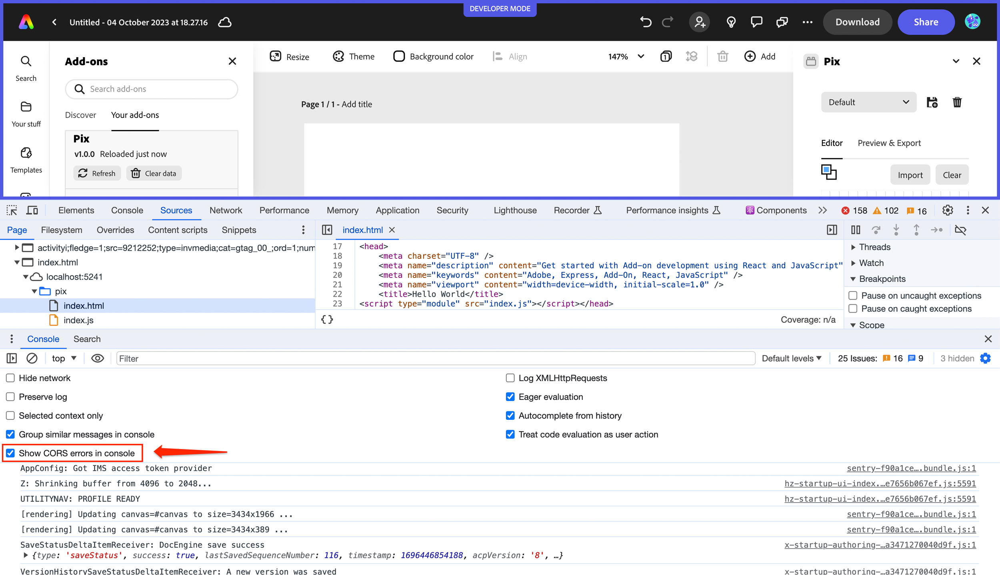
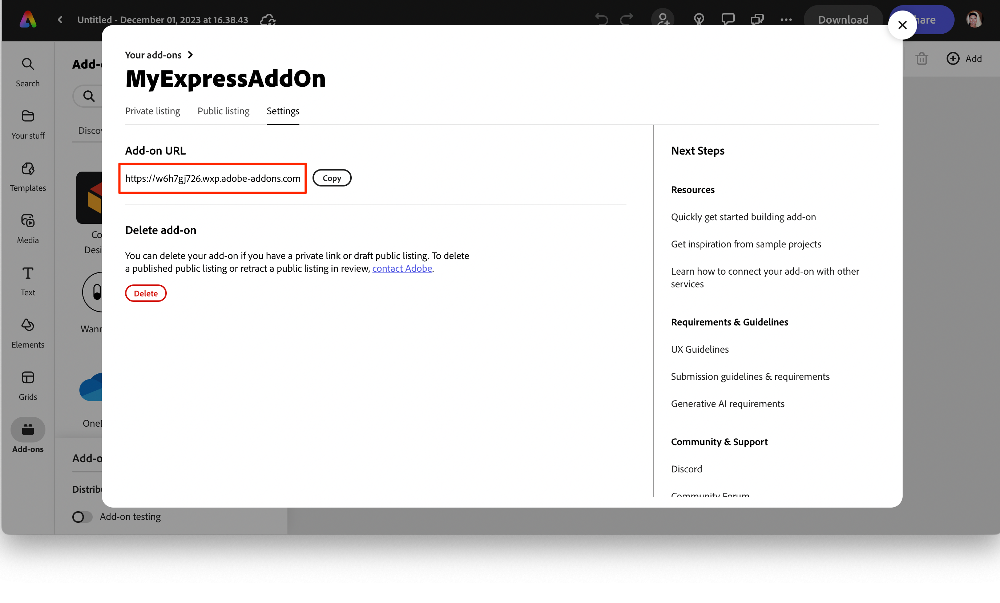
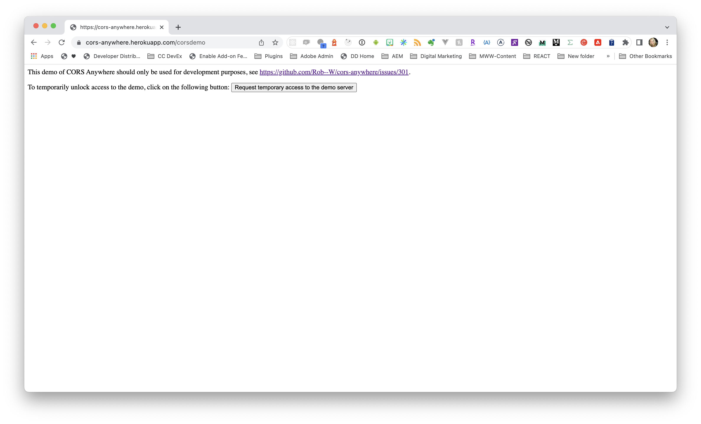

---
keywords:
  - Adobe Express
  - Add-on SDK
  - iframe
  - Iframe Runtime
  - Sandbox
  - Security
  - Permissions
  - CORS
  - Cross-Origin Resource Sharing
  - Subdomain
  - Manifest
  - Sandbox Permissions
  - OAuth
  - Clipboard
  - Microphone
  - Camera
  - Premium Content
  - CORS Proxy
  - Cross-Origin-Embedder-Policy
  - COEP
  - CORP
  - Access Control
  - Origin
  - Domain
  - Add-on Context
  - Browser Security
  - Web Security
title: Iframe Runtime Context & Security
description: Essential guide to Adobe Express add-on iframe context, sandbox permissions, CORS handling, security boundaries, and subdomain management for secure add-on development.
contributors:
  - https://github.com/hollyschinsky
faq:
  questions:
    - question: "Why does my add-on run in an iframe sandbox?"
      answer: "Add-ons run in a sandboxed iframe for security. This isolates your add-on from the host application and other add-ons, protecting user data while still allowing your add-on to function."

    - question: "How do I get my add-on's unique subdomain for CORS?"
      answer: "Create a private sharing link through the distribution workflow (even during development). Your unique subdomain is assigned and displayed in the Settings panel as the Add-on URL."

    - question: "What sandbox permissions can I use in my add-on?"
      answer: "Currently supported: allow-downloads, allow-popups, allow-popups-to-escape-sandbox, and allow-presentation. The allow-scripts and allow-same-origin permissions are automatically included."

    - question: "How do I handle CORS errors in my add-on?"
      answer: "Options: 1) Add your add-on's subdomain to the service's allowed origins list, 2) Set Access-Control-Allow-Origin headers on your server, or 3) Use a CORS proxy server."

    - question: "Can I use camera and microphone in my add-on?"
      answer: "Yes, you can request camera and microphone permissions in your manifest using the permissions object with camera and microphone fields."
---

# Iframe Runtime Context & Security

Essential information about your add-on's execution context, including iframe sandbox security, permissions, CORS handling, and subdomain management.

## Overview

Adobe Express add-ons run in a secure iframe runtime environment with specific permissions and restrictions. Understanding these security boundaries, sandbox permissions, and CORS requirements is crucial for building robust add-ons that interact with external services while maintaining user security.

<InlineAlert slots="text" variant="info"/>

**Architecture Context**: This guide covers the security aspects of the iframe runtime. For a comprehensive understanding of how the iframe runtime fits into the overall add-on architecture, see the [Add-on Architecture Guide](./architecture.md).

## Iframe Runtime Environment

Your add-on's user interface runs in a [sandboxed iframe](https://developer.mozilla.org/en-US/docs/Web/HTML/Element/iframe#sandbox) within Adobe Express. This sandboxed environment provides security isolation, running your add-on in a low-privileged environment with a restricted set of capabilities. Understanding these restrictions and how to work within them is essential for successful add-on development.

### Restrictions

The following set of restrictions are enabled when the `sandbox` attribute is applied to the `<iframe>` tag (ie: `<iframe sandbox=""`):

- The add-on bundle is served from a unique subdomain.
- Form submission is blocked.
- The Pointer Lock API (capturing mouse movement) is blocked.
- New windows or tabs cannot be opened from the add-on, unless overridden in the manifest.
- Add-ons can't use `<embed>`, `<object>`, `<applet>`, or similar.
- Add-ons cannot change the navigation of the top-level browsing context
  Media can't be autoplayed.

### Permissions

The value of the `sandbox` attribute can either be empty (in which case all restrictions are applied), or a space-separated list of pre-defined permissions that remove a particular restriction. By default, **the `allow-scripts` and the `allow-same-origin` sandbox permissions are automatically set for all add-ons** (ie: `sandbox="allow-scripts allow-same-origin"`). The table below describes the rest of the permissions that can be applied to your add-on. These permissions can be applied by setting their values in the [manifest sandbox permissions](../../../references/manifest/index.md#entrypointspermissionssandbox).

| Permission                       |                                                                                       Description |
| -------------------------------- | ------------------------------------------------------------------------------------------------: |
| `allow-downloads`                | Allow downloading files through an &lt;a&gt; or &lt;area&gt; element with the download attribute. |
| `allow-popups`                   |                                                         Allows the add-on to `window.open` popups |
| `allow-popups-to-escape-sandbox` |   Allows a sandboxed document to open new windows without forcing the sandboxing flags upon them. |
| `allow-presentation`             |                                                Allows the add-on to start a presentation session. |

**IMPORTANT:** Please note that these are currently the _only_ sandbox permissions that are currently supported from [the set of sandbox permissions available](https://developer.mozilla.org/en-US/docs/Web/HTML/Element/iframe). Any other sandbox attributes are not supported or allowed in the manifest for your add-ons.

### Additional Permissions

Beyond sandbox permissions, your add-on can also request additional permissions in the manifest for specific functionality:

| Permission Type | Values | Description |
| --------------- | ------ | ----------- |
| `oauth` | `string[]` | List of 3rd party auth server domains for which OAuth workflow may be requested (e.g., `["www.dropbox.com"]`). |
| `clipboard` | `string[]` | Clipboard access permissions. Currently supports `"clipboard-write"` to allow writing arbitrary data to the clipboard. |
| `microphone` | `string` | Microphone access permission using [allowlists](https://developer.mozilla.org/en-US/docs/Web/HTTP/Permissions_Policy#allowlists) syntax (e.g., `"*"` for all origins). |
| `camera` | `string` | Camera access permission using [allowlists](https://developer.mozilla.org/en-US/docs/Web/HTTP/Permissions_Policy#allowlists) syntax (e.g., `"*"` for all origins). |

**Example manifest permissions:**

```json
"permissions": {
    "sandbox": ["allow-popups", "allow-downloads"],
    "oauth": ["www.dropbox.com", "api.example.com"],
    "clipboard": ["clipboard-write"],
    "microphone": "*",
    "camera": "*"
}
```

<InlineAlert slots="text" variant="info"/>

**Premium Content Permissions:** When implementing premium content flows where you present a dialog or option to allow the user to upgrade, you must include specific sandbox permissions to allow the Adobe Express pricing page to load properly: `["allow-popups-to-escape-sandbox", "allow-popups", "allow-downloads"]`. See the [premium content guide](../how_to/premium_content.md) for more details.

## CORS

In order to provide security to the users of your add-on, browsers implement a [CORS (Cross-Origin Resource Sharing)](https://developer.mozilla.org/en-US/docs/Web/HTTP/CORS) mechanism. This allows a service to control whether to allow JavaScript code to make requests from a different [origin](#origin). Many services decide to restrict access to specific [origins](#origin) (or [domains](#domain)), but many also allow developers to customize the [allowed list of origins](#allowed-list-of-origins) that can make requests to their service when creating an integration. When developing and testing your add-ons, it's important to understand where your add-on is being hosted, and what is being sent in the requests it's making specifically, to manage this security measure, and in the event you run into [CORS errors](../../support/faq.md#why-do-i-receive-a-no-access-control-allow-origin-header-is-present-on-the-requested-resource-error).

<InlineAlert slots="text" variant="success"/>

Be sure to set your browser devtools option to "**Show CORS errors in console**". For example, in Chrome it looks like the screenshot shown below.



### Add-on Subdomain

To help enable a smoother experience for developers dealing with CORS, each add-on receives a unique [subdomain](#subdomain) that can be added to the list of [allowed origins](https://developer.mozilla.org/en-US/docs/Web/HTTP/Headers/Access-Control-Allow-Origin) for external services.

Your add-on is assigned a unique ID during the distribution process (for both private and public sharing). This ID is permanent and won't change across [future distributions](../../build/distribute/index.md), so we recommend creating a private sharing link early in development to obtain your subdomain. The subdomain format includes your unique add-on ID as a prefix, followed by `.wxp.adobe-addons.com`, for example: `https://w906hhl6k.wxp.adobe-addons.com/`.

#### Retrieving a subdomain

You can get a subdomain URL for your add-on during the development process by following the [add-on distribution steps](../../build/distribute/private-dist.md) through [step 2](../../build/distribute/private-dist.md#step-2-add-on-listing-settings), where your own unique subdomain URL is provided for your add-on. This step creates the container for your add-on and assigns a unique subdomain for where it will be hosted, so you can use it to set up CORS in advance. You can stop at the creation of the container if all you need is the subdomain at this point, and come back to create a listing on it later when you've finished your development. An example of what the settings panel with this URL looks like is shown below for reference. We provide a **Copy** button as well to allow you to easily copy your unique **Add-on URL**.



For existing add-ons, simply choose one in the distribution workflow and navigate to the new **Settings** tab and copy the **Add-on URL** field.

### Using the subdomain

There are multiple situations where you may run into a CORS issue and need to use the unique subdomain provided with your add-on to get past it. One way was described above, where you can just include it in the allowed list for a service integration. Another is to manage it by setting a server-side header, if you have access to that server. A third option is to use a [CORS proxy server](#cors-proxy-server). These options are described in the next sections below.

### Server-side CORS Handling

If you have access to the endpoint server your add-on is fetching from, you can set an [`Access-Control-Allow-Origin`](#allowed-list-of-origins) header with the value set to the subdomain of your add-on in the server's response object. Handling the headers on the server side is the ideal solution, but often times the issue occurs with services outside your control. In that case, your best bet is to use a CORS Proxy Server.

### CORS Proxy Server

Typically, the origin responsible for serving resources is also responsible for setting the access headers for those resources. However, in instances where you don't have access to the server, a proxy server can be set up to bypass the issue by acting as the intermediate server that makes the request for you, and returns the [`Access-Control-Allow-Origin`](#allowed-list-of-origins) header in the response with the the value of your subdomain.

#### Hosted CORS Proxy Server

One of the fastest ways to unblock your requests while testing in the event of CORS issues, is to use a hosted proxy server. For instance, `cors-anywhere` is a [NodeJS pakage](https://www.npmjs.com/package/cors-anywhere) which also has a free hosted demo server with it set up that you can use for quick testing. Open your browser to [https://cors-anywhere.herokuapp.com/](https://cors-anywhere.herokuapp.com/) and request temporary access to the demo server with the button shown in the screenshot:



Then, simply prefix the URLs you're fetching with the `cors-anywhere` demo server URL of [https://cors-anywhere.herokuapp.com/](https://cors-anywhere.herokuapp.com/). For instance:

```js
let cors_anywhere = "https://cors-anywhere.herokuapp.com/";
let myUrl = "https://example.com/";
let url = cors_anywhere + myUrl;

fetch(url).then(function (response) {
  console.log(response);
});
```

The response should be a successful response including that prefixed URL call:

`Response {type: 'cors', url: 'https://cors-anywhere.herokuapp.com/https://example.com/', redirected: false, status: 200, ok: true, …}`

<InlineAlert slots="text" variant="success"/>

Hosting your proxy server code in an online service like Cloudinary or Heroku is also a good option for handling CORS issues in your add-on development. These services provide a platform for deploying your code and can handle cross-origin requests for you. Additionally, using Cloudinary's [URL prefix feature](https://cloudinary.com/documentation/fetch_remote_images) can be a quick solution for handling CORS issues with remote images in your add-on development.

#### Locally Hosted CORS Proxy Server

You can also use the `cors-anywhere` node package to create and run your own proxy server locally for testing for instance, with a few easy steps. This can be useful if you want to modify the default settings or use different functions provided by the library. Follow the steps below to install and use it. Also be sure to run it on it's own port separate from where your add-on is running. Once you have it working as desired, you can modify the settings to host it externally to suit your needs.

1. Install the `cors-anywhere` node package:

   `npm install -g cors-anywhere` (or `npm i cors-anywhere` to install it in your current directory)

2. Create a file called `server.js` in your favorite editor and add the following to it:

   ```js
   // Listen on a specific host via the HOST environment variable
   var host = process.env.HOST || "0.0.0.0";
   // Listen on a specific port via the PORT environment variable
   var port = process.env.PORT || 8080;

   var cors_proxy = require("cors-anywhere");
   cors_proxy
     .createServer({
       originWhitelist: ["https://w906hhl6k.wxp.adobe-addons.com/"], // Your add-on subdomain
       requireHeader: ["origin", "x-requested-with"],
       removeHeaders: ["cookie", "cookie2"],
     })
     .listen(port, host, function () {
       console.log("Running CORS Anywhere on " + host + ":" + port);
     });
   ```

3. Run the server:
   `node server.js`

   or optionally pass in a host and port when you run it:
   `HOST=0.0.0.0 PORT=8080 node proxy-server.js`

#### CORS / COEP Handling

The value of the [**Cross-Origin-Embedder-Policy** (COEP)](https://developer.mozilla.org/en-US/docs/Web/HTTP/Headers/Cross-Origin-Embedder-Policy) header for add-on resources is set to `credentialless`, but you should be aware that it will be changing to use `require-corp` sometime in the future, so you should plan for that by ensuring resources loaded from within the document have CORP / CORS enabled. If you see any issues with fetch or using images, you can try implementing one of the following solutions.

1. For http requests, make sure that the resource server responds with the `Cross-Origin-Resource-Policy: cross-origin` header. See [this link](https://developer.mozilla.org/en-US/docs/Web/HTTP/Cross-Origin_Resource_Policy) for reference.

2. If you're using the `` tag and your resource is being served with CORS, add the `crossorigin` attribute to the HTML tag loading it, for example: ``. See [this link](https://developer.mozilla.org/en-US/docs/Web/HTML/Attributes/crossorigin) for more details.

## Terms

### origin

A combination of a protocol (for example HTTP or HTTPS), hostname, and port (if specified). For example, in the URL `https://www.adobe.com:443/foo`, the "origin" is `https://www.adobe.com:443`.

### domain

A website's address on the Internet that is used in URLs to identify which server a specific webpage belongs to. A domain name consists of a sequence of names separated by periods and ending with an extension (ie: `wxp.adobe-addons.com`).

### subdomain

Subdomains are unique URLs that include an additional part to identify them in front of the main domain where it lives (ie: https://w906hhl6k.wxp.adobe-addons.com).

### allowed list of origins

A list of external domains that the server allows to request resources. This is typically enforced with a header defined on servers who enforce CORS, with the [`Access-Control-Allow-Origin`](https://developer.mozilla.org/en-US/docs/Web/HTTP/Headers/Access-Control-Allow-Origin) header. This server-side header is returned to a [preflight request](https://developer.mozilla.org/en-US/docs/Glossary/Preflight_request), (dispatched transparently by the browser, before the request from your add-on itself), in order to determine if it's safe to send it when a cross-origin request is allowed.

---

## Related Topics

- [Add-on Architecture Guide](./architecture.md) - Understanding the dual-runtime system and how the iframe runtime fits into the overall architecture
- [Add-on Development Terminology](../fundamentals/terminology.md) - Key terms and concepts including iframe runtime, sandbox, and security model
- [Manifest Reference](../../../references/manifest/index.md) - Complete manifest configuration including permissions
- [Premium Content Guide](../how_to/premium_content.md) - Implementing premium content flows with required permissions
- [FAQ - CORS Errors](../../support/faq.md#why-do-i-receive-a-no-access-control-allow-origin-header-is-present-on-the-requested-resource-error) - Common CORS troubleshooting
