---
keywords:
  - Adobe Express
  - Express Add-on SDK
  - Express Document API
  - Express Communication API
  - Document Model Sandbox
  - Adobe Express
  - JavaScript
  - Extensibility
  - API
title: Exploring the Adobe Document API Concepts
description: In this article, you'll learn about the structures that make up the Adobe Express Document Object Model, their features, and how they're reflected in the Reference documentation.
contributors:
  - https://github.com/undavide
---

# Adobe Express Document API Concepts

The structures that make up the Adobe Express Document Object Model, their features, and how they're reflected in the Reference documentation.

## Overview

In this article, you'll dive deep into the architecture and key elements of the Adobe Express Document Object Model (DOM) and why the Reference Documentation is the primary tool to explore it. Understanding the structures at play, hierarchy, and inheritance system will help you develop add-ons that exploit their full potential.

### Getting started with the DOM

The notion of **Document Object Model** (DOM) is key to any scripting environment; developers refer to _scripting_ when their programs use tools primarily available through the application's User Interface (UI) but programmatically, with code. For example, the [Grids tutorial](/resources/tutorials/grids-addon.md) add-on creates a grid system while operating with built-in elements like shapes and editing their dimensions, positions, fills, and blending modes. If you were to implement an unsupported object type, you'd need to go beyond the combination of existing tools—i.e., outside the scripting realm.[^1]

It is essential to hierarchically organize the features that are surfaced[^2] to the scripting layer. For example, a shape is not just contained within a document: it may be included in a particular Group in a certain Artboard, which belongs to a specific Page of a Document. Additionally, Ellipses and Rectangles, as shapes, share some properties, such as the ability to be filled or stroked with a solid color; in that respect, though, they differ from a bitmap image, which can be stroked but not filled.

More formally stated, any scripting environment must expose information about the **Containment Structures** (parent/child relations, like groups nesting shapes) and **Inheritance Hierarchies** (shared attributes like the opacity property available to both) of any element it deals with. Such a collection of organized information is called the Document Object Model, or DOM.

Developers with a front-end background may instinctively associate the notion of DOM with HTML and the Browser. Although it has been the most common case for decades, all applications supporting scripting rely on their own Document Object Model—as those working with desktop versions of the Creative Cloud know very well. The Adobe Express add-on system is technically different from CEP extensions in Adobe After Effects or UXP plugins in Adobe Photoshop; still, the concept of the DOM is equally valid.

<InlineAlert variant="warning" slots="heading, text1, text2, text3w" />

**Warning** <!-- 👈 won't be rendered -->

Some confusion may arise regarding the meaning of the following terms—let me clarify.

- **Document Model Sandbox**: the sandboxed JavaScript environment that makes the Document API available to add-on developers. It's usually juxtaposed with the iframe UI: both reciprocally share APIs via proxy, as described in [this tutorial](/resources/tutorials/stats-addon.md).
- **Document Object Model**: it represents Adobe Express documents' structure, the hierarchies between each element, and their inheritance.

You may think about the Document API as operating in the context of the DOM—while the Document Model Sandbox provides a secure and isolated environment for such code to run.

### Coding along

You are encouraged to try the code snippets discussed here; please use [this boilerplate](https://github.com/AdobeDocs/express-add-on-samples/tree/main/document-sandbox-samples/express-dimensions-addon) to follow along. It contains a demo add-on in two states: the complete version (in the `express-dimensions-end` folder, whose code is also found in the [Final Project](#final-project) section at the bottom of this page) and a starting point (`express-dimensions-start`) that you can also use to test your assumptions and inspect the Console. The Document API code belongs to the `src/documentSandbox/code.js` file.

```js
// ...
import { editor, colorUtils } from "express-document-sdk";
function start() {
  runtime.exposeApi({
    log: () => {
      const selectedNode = editor.context.selection[0];
      console.log("Currently selected node", selectedNode);
    },
    // ...
  });
}
```

Run the add-on, select any object in the UI, and click the "Log selected node" button: it'll be logged in the Console.

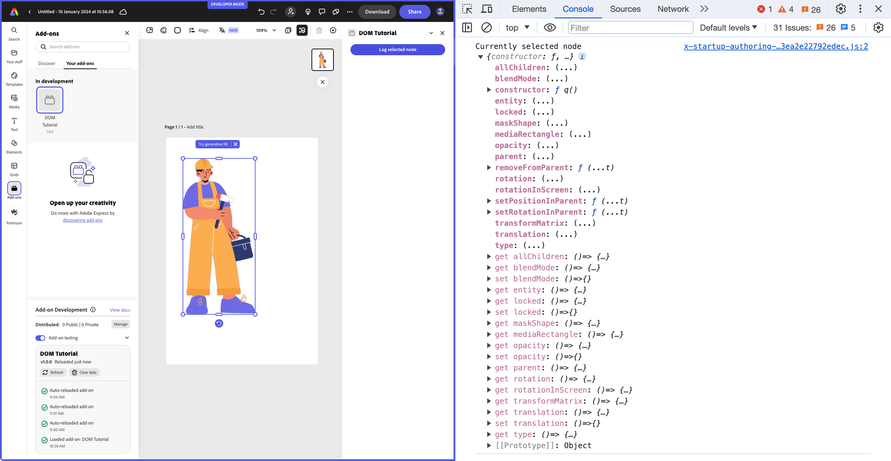

## The Adobe Express DOM

An Adobe Express document is internally represented as a hierarchical tree of **nodes**. Some of them may branch: in other words, contain other nodes, host children—like an Artboard or a Group with some shapes or media in them. Other ones are so-called leaf nodes: the tree's endpoints, for example, a text or a line.

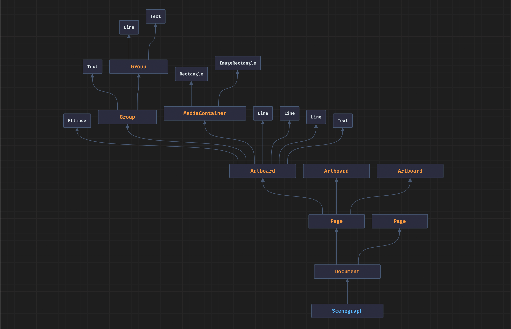

Such a structure is referred to as the **Scenegraph**, and it allows for efficient rendering, manipulation, and traversal of all scene elements.

### Object-Oriented programming concepts

Understanding the hierarchical tree of nodes in the Adobe Express DOM requires a firm grasp of a handful of key concepts in object-oriented programming (OOP).

- **Classes**: the blueprint for creating objects. They define a set of properties and methods the created objects (known as _instances_ of that class) will have. For example, when users add a page to an Adobe Express document, a new `PageNode` class is _instantiated_. Such a Page instance comes by default with a peculiar set of accessors (properties) like `width`, `height`, and `artboards` and methods like `removeFromParent()`.
- **Inheritance**: classes can inherit properties and methods from an existing class. The `LineNode` inherits from the `StrokableNode`, which in turn inherits from the `Node` class, establishing a parent/child relation.
- **Class Extension**: this concept is closely related to Inheritance. A child class inherits the methods and properties from its parent and extends them with its additional ones. `TextNode` extends `Node`, adding, among others, the `text` property and the `setPositionInParent()` method.
- **Interfaces**: define a _contract_ for classes without implementing any behavior themselves. They specify a set of methods and properties a class must have but do not define how they work internally. For example, the `ContainerNode` interface mandates the implementation of `allChildren`, `children`, `parent`, and `type` properties. Classes implementing this interface, such as `ArtboardNode` and `GroupNode`, are responsible for providing these properties' actual implementation. By doing so, these classes conform to the structure and requirements defined by the `ContainerNode` interface. Interfaces can be extended, too: the `ColorFill` inherits the `type` property from the `Fill` interface and extends it with an additional `color`.

Compared to other Adobe desktop applications, the Adobe Express DOM features a remarkably clean class hierarchy, where every element has a well-defined lineage that traces back to a minimal set of root classes.

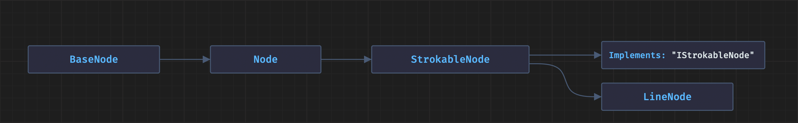

### How to read the Reference

With this knowledge, you can use the [Document APIs](/references/document-sandbox/document-apis/) reference as the primary tool to study and learn about the Adobe Express DOM.

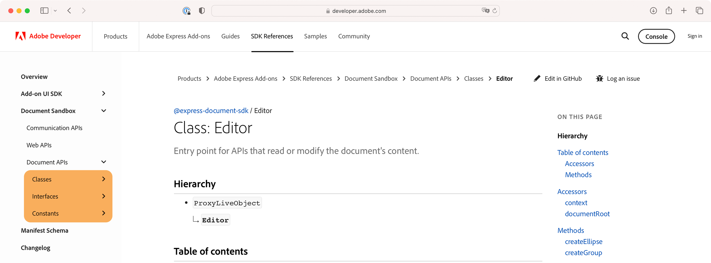

There is a comprehensive list of Classes (_blueprints_), Interfaces (_contracts_), and Constants in the left navigation bar. Familiarize yourself with this content and learn how to read it.

Using the `EllipseNode` as an example, you can find:

- The **class name**, always PascalCase.
- A short **description** of what it represents and its role in the scenegraph.
- The **inheritance tree**: in this case, `EllipseNode` is a subclass of `FillableNode`; following the chain, you'll find that, in turn, this inherits from `StrokableNode`, which eventually comes from the `Node` root class.
- A list of **accessors** (properties), like `stroke`, `opacity`, etc.
- A list of **methods**, like `removeFromParent()` and `setPositionInParent()`.

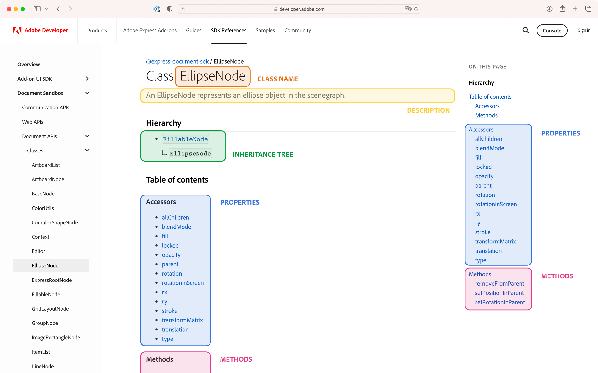

Some accessors are read-only, for instance, parent or rotation; some have **getters** and **setters**, like `locked` or `fill`. Properties can support a range of value kinds, from primitive values to objects, class instances, or collections. Let's break down the `translation` property as an example.

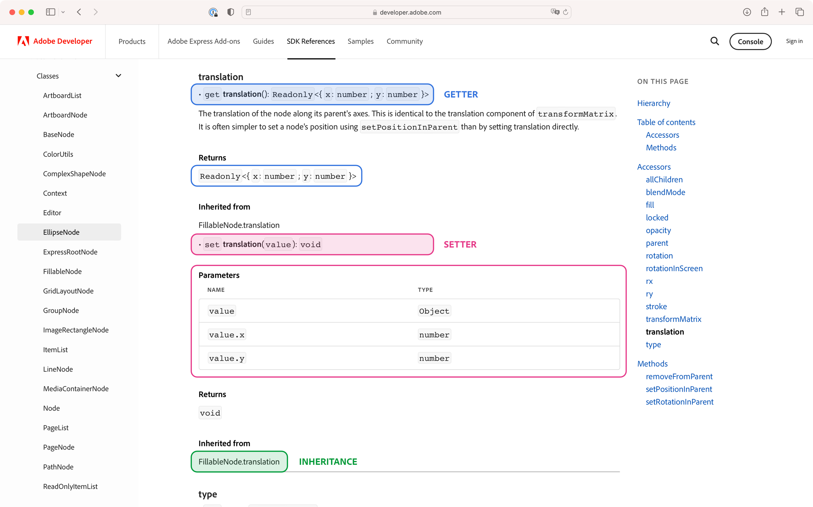

It's split into two parts: `get` (the getter, when you read the property) and `set` (the setter, when you write it). From the description, you see that it's a way to find out about the node's coordinates relative to its parent. The return type for the getter (wrapped with `< >` angle brackets) is `{ x: number, y: number}`, i.e. an object with numeric `x` and `y` properties. You also read that this property is inherited from the `FillableNode` class that `EllipseNode` extends. The setter expects a `value`, which the Parameters table describes as of type `Object`, with the same numeric `x` and `y` properties; it returns `void` (i.e., nothing). Given all this, it's possible to confidently write something along these lines.

```js
const ellipse = editor.createEllipse();
editor.context.insertionParent.children.append(ellipse); // attach to the scenegraph
console.log(ellipse.translation); // { x: 0, y: 0 }
ellipse.translation = { x: 100, y: 50 };
```

Some properties rely on interfaces to define their type. The ellipse's `stroke` happens to be of type `Stroke`, an interface whose _contract_ mandates the implementation of five different properties: `color`, `width`, `position`, `dashPattern`, and `dashOffset`.

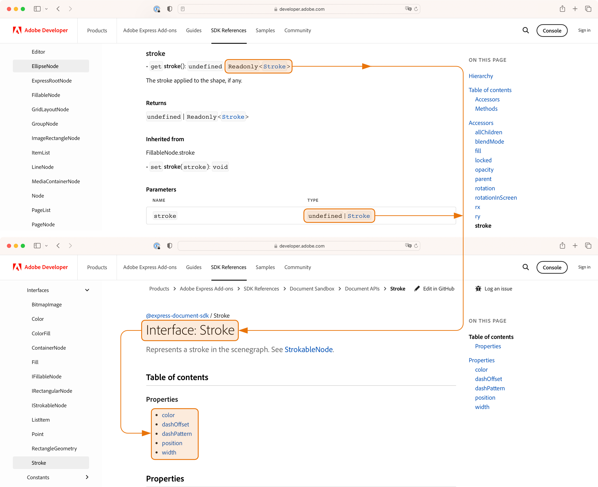

### The importance of Constants

Let's use the `stroke` to demonstrate the use of Constants in the DOM. They are a named import—mind the lowercase spelling.

```js
import { editor, colorUtils, constants } from "express-document-sdk";
```

They represent a safe, user-friendly way to refer to internal values (subject to change) that developers should not directly manipulate. For example, the stroke's `position` property is of type `StrokePosition`, which happens to be enumerable—a fixed set of pre-defined values.

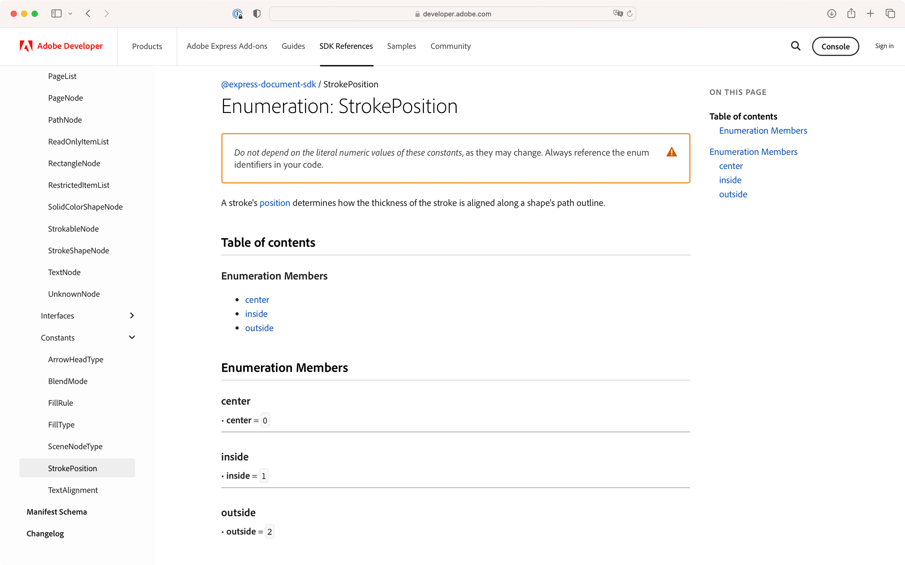

Internally, the center, inside, and outside positions are represented with the integers `0`, `1`, and `2`. You should instead use the `StrokePosition` constant and its available members:

- `StrokePosition.center`
- `StrokePosition.inside`
- `StrokePosition.outside`

Using constants will ensure expected outcomes, in case Adobe Express engineers remap values in the future. This is the code needed to conclude the `stroke` example.

```js
const ellipse = editor.createEllipse();
editor.context.insertionParent.children.append(ellipse);
ellipse.stroke = {
  color: { red: 0.7, green: 0.6, blue: 1, alpha: 1 },
  dashOffset: 0,
  dashPattern: [4, 2],
  // position: 1 ❌
  position: constants.StrokePosition.inside, // ✅
  width: 3,
};
```

The [Document Stats tutorial](/resources/tutorials/stats-addon.md) features an add-on that goes through all elements in the scenegraph and groups them by `type`, providing a count of each: `ComplexShape`, `Group`, etc.


To log the `type` property is acceptable in this specific case, although the proper way to check against node types involves constants; the `type` itself is an internal string value mapped to the `SceneNodeType` enumerable.

```js
❌ if (someNode.type === "ab:Artboard") { /* ... */ }
✅ if (someNode.type === constants.SceneNodeType.artboard) { /* ... */ }
```

### Helper functions

Let's return to strokes and fills: they are expressed as plain objects; in fact, all the properties the `Stroke` interface requires, like `dashPattern`, were previously provided. The `editor.makeStroke()` utility will fill in the default values when you don't provide them.

```js
const ellipse = editor.createEllipse();
editor.context.insertionParent.children.append(ellipse);
ellipse.stroke = editor.makeStroke({
  color: { red: 0.7, green: 0.6, blue: 1, alpha: 1 },
});
```

Here, you get a 1-pixel, solid stroke of the provided color, the only property you've explicitly supplied. There's a similar helper function for the `ColorFill` interface.

```js
ellipse.fill = editor.makeColorFill({
  red: 0.6,
  green: 0.9,
  blue: 0.6,
  alpha: 1,
});
```

If you wonder where all the help is since you've to type the entire color object manually anyway, let me remind you that the `fill` property is of type `ColorFill`: such an interface expects a `color` property (the one provided above) as well as a `type` expressed by the `FillType.color` constants. Without the `makeColorFill()` method, you must write the following.

```js
ellipse.fill = {
  color: { red: 0.6, green: 0.9, blue: 0.6, alpha: 1 },
  type: constants.FillType.color, // 👈
};
```

<InlineAlert variant="info" slots="text1, text2" />

A specific **naming convention** exists for methods used in the Adobe Express DOM.

- `make*`: used for plain objects and helper utilities, e.g.,`makeColorFill()`.
- `create*`: used for live document objects, like `createEllipse()`
- `add*`: reserved to create complex structures like Pages and Artboards, adding them to the parent list automatically in a way that may also update the insertion point. Found in `addPage()` and `addArtboard()`.

Speaking of colors, the `ColorUtils` module can output a proper `Color` from either a partial RGB object (where the `alpha` property is optional, defaulting to `1`) or a Hex string with or without alpha, providing the reverse function as well.

```js
const gecko = colorUtils.fromHex("#9de19a"); // alpha is optional
// or
const gecko = colorUtils.fromRGB(157, 225, 154); // alpha is optional
ellipse.fill = editor.makeColorFill(gecko);
const geckoHex = colorUtils.toHex(gecko); // "#9de19aff" 👈 alpha is included
```

### Types matter

CLI versions from `"1.1.1"` onwards now scaffold add-ons with **type definitions** for JavaScript and TypeScript projects. If you're unfamiliar with TypeScript, these additional `.d.ts` and `tsconfig.json` files offer significant benefits. The `.d.ts` files, or _TypeScript declarations_, contain type information about the APIs. They describe the shape of JavaScript objects, providing TypeScript type-checking and autocompletion capabilities (in the form of IntelliSense in VSCode). The `tsconfig.json` files, on the other hand, are configuration files necessary to provide type information for global types in the sandbox runtime. For instance, the sandbox' Console only exposes a subset of the available methods: the `tsconfig.json` file (via `typeRoots`) informs the IntelliSense engine only to show the methods that are actually available.

The bottom line is that `.d.ts` and `tsconfig.json` files in your JavaScript (and TypeScript) projects give code editors knowledge about the Adobe Express document sandbox APIs: it's used to provide code completion and type checking, which can help you avoid errors and write code faster.

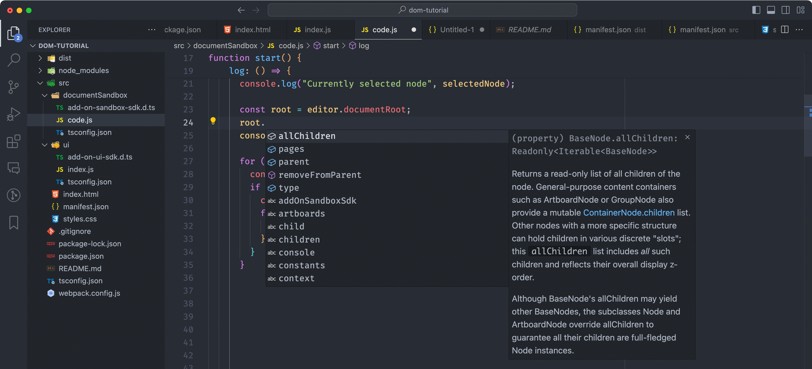

<InlineAlert variant="info" slots="text1, text2, text3" />

To use TypeScript declarations in existing projects, install the `@adobe/ccweb-add-on-sdk-types` package.

```sh
npm install @adobe/ccweb-add-on-sdk-types --saveDev
```

The `.d.ts` files can be found in the `node_modules/@adobe/ccweb-add-on-sdk-types` folder.

While IntelliSense is undoubtedly handy, type safety can prevent errors that are otherwise difficult to foresee. Let me show you a revealing example.

Several classes in the Adobe Express DOM have a `children` property, like `GroupNode` or `ArtboardNode`—both implementing the `ContainerNode` interface. Intuitively, their `children` are the contained elements: a group can hold bitmap images, shapes, and whatnot. `ContainerNode` also mandates the implementation of an `allChildren` property, which, apparently, serves the same purpose (we'll get to the difference in a moment).

The type for `children` and `allChildren` is defined as `Iterable<Node>`, where the `Iterable` is basically a collection that supports a `for...of` loop.

```js
for (const node of someIterable) {
  console.log(node.type);
}
```

In _previous versions_ of Adobe Express, the Console would log `allChildren` as an actual _Array_ of Nodes.

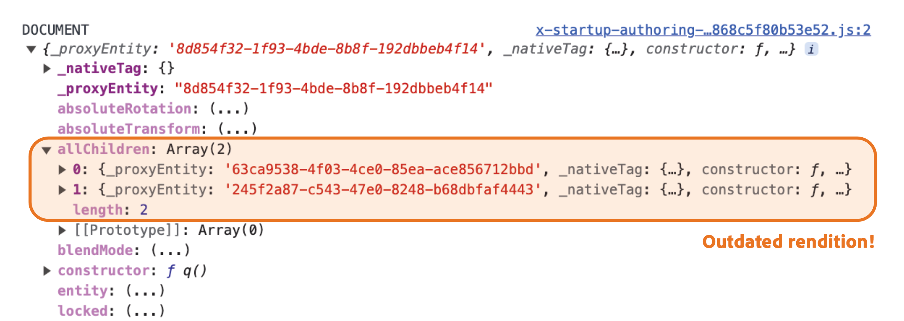

If `allChildren` is an Array, the following code will work just fine, won't it?

```js
const selectedNode = editor.context.selection[0];
// If we have a group
if (selectedNode.type === constants.SceneNodeType.group) {
  // Filtering the ellipse shapes
  const ellipses = selectedNode.allChildren.filter(
    // 👈 danger! ❌
    (node) => node.type === constants.SceneNodeType.ellipse
  );
  console.log(`Number of ellipses in this group: ${ellipses.length}`);
}
```

In fact, it _used to work_, but it doesn't anymore; however, it's not Adobe Express' fault. Why, then?

The `allChildren` property is defined in its _contract_ to be of type `Iterable`. The key point here is **the nature of the contract** itself rather than the specific implementation. For instance, when `allChildren` was internally implemented as an Array, this was in line with the contract since Arrays are indeed iterable and support the `for...of` loop. However, Arrays offer additional functionalities _beyond_ the requirements of the `allChildren` contract. Developers should focus on using features that the contract explicitly supports rather than relying on capabilities that might be available in the current implementation of the property but are _outside the contract's scope_. This approach ensures compatibility and reliability, irrespective of the property's underlying implementation changes. If you must use Array methods, convert the iterable with the static method `Array.from()` first.

```js
const ellipses = Array.from(selectedNode.allChildren) // 👈
  .filter((node) => node.type === constants.SceneNodeType.ellipse);
```

To finally unravel the `allChildren` purpose mystery, let's see what the documentation says about it.

> \[...] nodes with a more specific structure can hold children in various discrete "slots"; this `allChildren` list includes _all_ such children and reflects their overall display z-order.

If you inspect a `MediaContainerNode` class, which is instantiated every time you place an image, it has two peculiar properties: `maskShape` and `mediaRectangle`. They hold the shape that masks the bitmap (in UI terms, the Crop—by default, a rectangle with the same image dimensions) and the `ImageRectangleNode` itself. They are the "structures" the documentation refers to; therefore, you'll find them in its `allChildren` property. Other notable examples are `maskShape` in Groups and `artboards` in Pages.

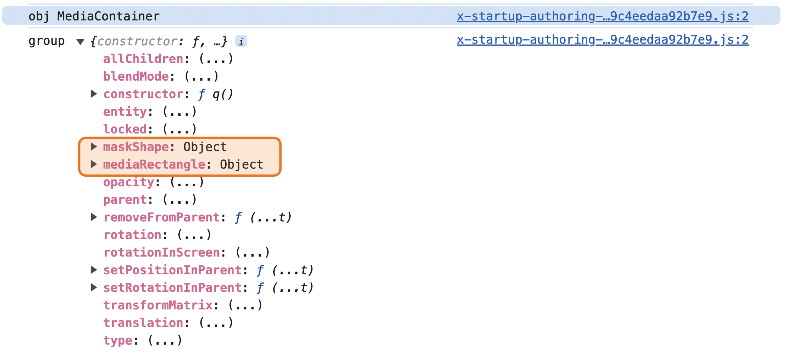

## Classes and Interfaces

The Reference documentation does a good job listing all the classes and interfaces that make up the Adobe Express DOM, but there are classification differences worth knowing.

### Live Object classes

Concrete classes like [`RectangleNode`](/references/document-sandbox/document-apis/classes/RectangleNode.md") and [`GroupNode`](/references/document-sandbox/document-apis/classes/GroupNode.md") represent the DOM's **object elements with live setters**. Some of these classes can be instantiated and used directly through factory methods.

```js
import { editor } from "express-document-sdk";

const rect = editor.createRectangle();
const group = editor.createGroup();
group.children.append(rect);
editor.context.insertionParent.children.append(group);
```

Currently, only some classes of this kind have their equivalent `create*` method (for example, `PathNode` lacks it), but it's fair to expect that most of them will, eventually. Live Object classes are the ones whose instances make up the Adobe Express scenegraph: `PageNode`, `ArtboardNode`, `StrokeShapeNode`, `LineNode`, and so on.
A particular case is represented by the `UnknownNode`, which acts as a safety placeholder when dealing with actual DOM objects that don't yet have a corresponding class.

### Collection classes

In Adobe Express, most collections (`children` is a notable example) are expressed as **Lists**: groups of homogeneous elements with properties such as `first`, `last`, and `length`, and dedicated methods like `append()`, `clear()`, etc. They are iterable with `for...of` loops.

Some of these collections are Generic, like `ItemList<T>`, `ReadOnlyItemList<T>`, and `RestrictedItemList<T>`, where the `<T>` means they are designed to be type-agnostic and can work with various data types. The `<T>` acts as a placeholder for the type of objects that the collection will hold or manage.

An implementation of such generic classes is the `ArtboardList` (which subclasses `RestrictedItemList<Artboard>`) and `PageList` (subclassing `RestrictedItemList<Page>`), found respectively in the `PageNode.artboards` and `ExpressRootNode.pages` properties.

### Abstract classes

These are classes that serve as a **base for other classes**. Used by Adobe to rationalize the DOM structure, they provide a common set of properties and methods, but typically cannot be instantiated themselves nor manipulated by add-on developers. Instead, they are meant to be inherited and extended by other subclasses. These subclasses can then implement the abstract class's methods. In the Reference, you can identify abstract classes such as `FillableNode`, `Node`, and `BaseNode`.

### Static classes

`Editor` and `ColorUtils` are special **Singleton classes** that aren't meant to be instantiated or extended; the former acts as the entry point for APIs that read or modify the document's content, whereas the latter provides static utility methods for color manipulation. They are brought into the scope as lowercase named imports from the `"express-document-sdk"`.

```js
import { editor, colorUtils } from "express-document-sdk";
```

### Object (POJO) Interfaces

Such interfaces define the properties of **actual JavaScript objects** that must be created and used, for example, to set a shape's `fill` and `stroke` (respectively, the [`ColorFill`](/references/document-sandbox/document-apis/interfaces/ColorFill.md) or [`Stroke`](/references/document-sandbox/document-apis/interfaces/Stroke.md) interfaces) or fed to utility functions like `colorUtils.fromRGB()` that expect a parameter that implements the [`Color`](/references/document-sandbox/document-apis/interfaces/Color.md) interface. They are the _contracts_ that establish the shape of actual JavaScript objects that developers use in their code. POJO is an acronym that stands for "Plain Old Java Object", which in this context refers to a plain JavaScript object.

### Implementable Interfaces

Implementable interfaces like [`IFillableNode`](/references/document-sandbox/document-apis/interfaces/IFillableNode.md") are only meant to be implemented by classes: they define a contract of properties and methods to which a class must adhere.

In summary, the distinction between all the listed categories lies in their _purpose and usage_: "concrete" classes and object interfaces are used to create actual objects (either JavaScript objects, node instances, or collections), while abstract classes and implementable interfaces provide structure and behaviors that other classes can inherit or implement.

## From theory to practice

Experimenting with newly acquired knowledge is one of the most effective methods to test it. Let's say you have an idea for an add-on that traces the dimensions of the selected object in the style of technical drawings.

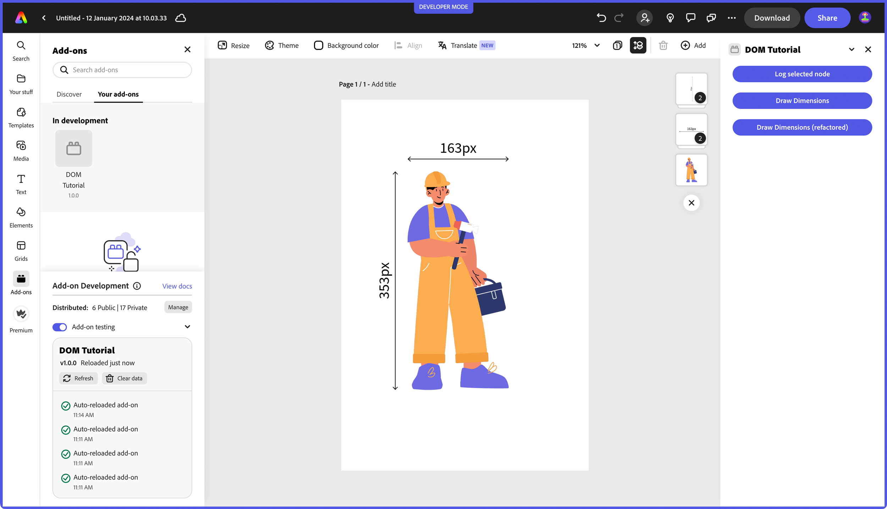

The production of such an add-on would require a number of stages, starting from the MVP (Minimum Viable Product) feature set to the UI. Here, you'll focus exclusively on the DOM prototyping; that is to say, you'll try to figure out the code building blocks by navigating the documentation reference alone—it will be an excellent exercise to get accustomed to it. Every step will be carefully described here; for simplicity, the add-on will be restricted to drawing dimensions on `MediaContainer` objects, assuming no crop has been applied.

To follow along, add one button to the `index.html` file and attach a `drawDimensions()` function to it in `code.js`.

<CodeBlock slots="heading, code" repeat="3" languages="index.html, ui/index.js, documentSandbox/code.js" />

#### UI iframe

```html
<body>
  <sp-theme
    scale="medium"
    color="light"
    theme="express"
  >
    <sp-button id="logNode">Log selected node</sp-button>
    <sp-button id="drawDimensions">Draw Dimensions</sp-button>
  </sp-theme>
</body>
```

#### UI iframe

```js
// ...
addOnUISdk.ready.then(async () => {
  console.log("addOnUISdk is ready for use.");

  // Get the Authoring Sandbox.
  const { runtime } = addOnUISdk.instance;
  const sandboxProxy = await runtime.apiProxy("documentSandbox");

  const buttonIds = ["logNode", "drawDimensions"];
  buttonIds.forEach((id) => {
    const button = document.getElementById(id);
    button.addEventListener("click", () => {
      sandboxProxy[id](); // 👈 attach the function to the button, like:
    }); // sandboxProxy.logNode() or sandboxProxy.drawDimensions()
    button.disabled = false;
  });
});
```

#### Document Sandbox

```js
// ...
function start() {
  runtime.exposeApi({
    logNode: () => {
      /* ... */
    },
    drawDimensions: () => {
      // ...
    },
  });
}
```

### Getting the context

The first part is to get and validate the selected node. There's a promising [`Context`](/references/document-sandbox/document-apis/classes/Context.md) class in the reference documentation that _"contains the user's current selection state, indicating the content they are focused on"_. Excellent! But how can you access it, though? The [`Editor`](/references/document-sandbox/document-apis/classes/Editor.md) class is the Document API entry point; it may be worth paying a visit to its page. Lo and behold, it exposes a context property, which returns a context instance: you can use it to check if there's a selection and whether it's of the right type—`hasSelection` and `selection` will do the job.

```js
import { editor, constants, colorUtils } from "express-document-sdk";

runtime.exposeApi({
  drawDimensions: () => {
    if (
      editor.context.hasSelection &&
      editor.context.selection[0].type ===
        constants.SceneNodeType.mediaContainer
    ) {
      // ...
    }
  },
});
```

Please note the use of the [`SceneNodeType`](/references/document-sandbox/document-apis/enumerations/SceneNodeType.md) constant, as discussed earlier, instead of the `"MediaContainer"` string literal.

### Getting the dimensions

Now that you've made sure only the right kind of node is handled, let's get its dimensions; since you'll need to draw a line, it may be helpful to have its coordinates in space (relative to its parent container) as well. According to the reference, the [`MediaContainerNode`](/references/document-sandbox/document-apis/classes/MediaContainerNode.md) class provides a [`translation`](/references/document-sandbox/document-apis/classes/MediaContainerNode.md#translation) property that returns an object with `x` and `y` properties, which you need. There are no `width` and `height`, though; where to look? `MediaContainerNode` also features a [`mediaRectangle`](/references/document-sandbox/document-apis/classes/MediaContainerNode.md#mediarectangle) property, which, upon inspection, is of type [`ImageRectangleNode`](/references/document-sandbox/document-apis/classes/ImageRectangleNode.md): this holds the actual media and offers both `width` and `height` properties. In future versions, Adobe Express will make available a proper `bounds` object for this purpose.

```js
if ( /* ... */ ) {
  // grabbing the selected node
  const selectedNode = editor.context.selection[0];
  // getting its coordinates
  const nodeTranslation = selectedNode.translation;
  // getting its dimensions from the mediaRectangle, destucturing and renaming them on the fly
  const { width: nodeWidth, height: nodeHeight } = selectedNode.mediaRectangle;
}
```

### Drawing a line

Time to draw the line. The [`Editor`](/references/document-sandbox/document-apis/classes/Editor.md) class includes a [`createLine()`](/references/document-sandbox/document-apis/classes/Editor.md#createline) factory method, which returns a [`LineNode`](/references/document-sandbox/document-apis/classes/LineNode.md) instance. The `LineNode` class, you learn from the reference, has `startX`, `startY`, `endX`, and `endY` properties: they only implement the getter, though—hence, are read-only. Scrolling through the methods, you find [`setEndPoints()`](/references/document-sandbox/document-apis/classes/LineNode.md#setendpoints), which expects the same parameters and is used as a setter for them.

```js
// ...
const hLine = editor.createLine();
hLine.setEndPoints(
  nodeTranslation.x,
  nodeTranslation.y - 20,
  nodeTranslation.x + nodeWidth,
  nodeTranslation.y - 20
);
```

Here, an arbitrary 20px margin is added between the horizontal line and the selected node; this could very well be a parameter chosen by the user from a UI control you can add later. The line is extended to a `nodeWidth` length, i.e., the `mediaRectangle`'s. You can finally add it to the scenegraph.

```js
editor.context.insertionParent.children.append(hLine);
```

<InlineAlert variant="info" slots="text1, text2" />

Please note that, according to the documentation, `translation` is **relative to the node's parent container**: in other words, you're capturing the position of the `MediaContainerNode` with respect to its parent. How can you be sure, then, that the line will be drawn in the right place?

The answer is that the `insertionParent` property of the `Editor` class—that you use to append the `hLine`—is a special node that always points to the current insertion point in the scenegraph. In this case, you're adding the line to the same parent container of the selected node, so `hLine` will be positioned correctly with respect to the object it measures: both the `MediaContainerNode` and the `LineNode` will be `children` of _the same parent_, therefore sharing _the same relative coordinate space_.

The line is there, but it lacks the proper endpoints. The reference helps us out again: the `LineNode` has a [`startArrowHeadType`](/references/document-sandbox/document-apis/classes/LineNode.md#startarrowheadtype) and [`endArrowHeadType`](/references/document-sandbox/document-apis/classes/LineNode.md#endarrowheadtype) properties, whose value is an enumerable provided by the [`ArrowHeadType`](/references/document-sandbox/document-apis/enumerations/ArrowHeadType.md) constant.[^3] There are several options available: let's pick `triangularFilled`.

```js
// ...
hLine.startArrowHeadType = hLine.endArrowHeadType =
  constants.ArrowHeadType.triangularFilled;
```

As live objects, setting all the properties before or after appending the line to the scenegraph doesn't really matter; the result is the same.

### Adding the text

Next up, you need to add the text. The `Editor` class provides a [`createText()`](/references/document-sandbox/document-apis/classes/Editor.md#createtext) method, which returns a [`TextNode`](/references/document-sandbox/document-apis/classes/TextNode.md) instance. The `TextNode` class has a [`text`](/references/document-sandbox/document-apis/classes/TextNode.md#text) property, which expects a string. Mind you, the setter implements parameter validation; if you were to assign a number, it would throw an error.

```js
// ...
const hText = editor.createText();
hText.fullContent.text = `${Math.trunc(nodeWidth).toString()}px`;
editor.context.insertionParent.children.append(hText);
```

The text appears on the top-left corner of the document, which is the default insertion point. `setPositionInParent()` would be perfect to move it to the right spot, just above the line. At the time of this writing, a `TextNode` doesn't feature `width` and `height` properties, which would be helpful to set an appropriate `localRegistrationPoint`; hence, you'll have to do with `translation`.

```js
// ...
hText.translation = {
  x: nodeTranslation.x + nodeWidth / 2,
  y: nodeTranslation.y - 30,
};
```

An extra 10 pixels padding from the line has been added, but this could also be a parameter. Let's group the line and the text together to move them around as a single entity. The `Editor` class provides a [`createGroup()`](/references/document-sandbox/document-apis/classes/Editor.md#creategroup) method, which returns a [`GroupNode`](/references/document-sandbox/document-apis/classes/GroupNode.md) instance. The `GroupNode` class provides a `children` property: you can `append()` both the line and the text to it.

```js
// ...
const hGroup = editor.createGroup();
editor.context.insertionParent.children.append(hGroup);
hGroup.children.append(hLine, hText);
```

### Repeating the process

From this point, creating the vertical line and the text is a matter of copying/pasting and changing a few parameters. The only new element may be text rotation: the `TextNode` class has a [`setRotationInParent()`](/references/document-sandbox/document-apis/classes/TextNode.md#setrotationinparent) method. It expects a number in degrees (-90, in our case) and a `localRotationPoint` object (implementing the [`Point`](/references/document-sandbox/document-apis/interfaces/Point/) interface), which is the point to rotate around in the node's local coordinates. In this case, `{x: 0, y: 0}` will do.

```js
const vText = editor.createText();
vText.fullContent.text = `${Math.trunc(nodeHeight).toString()}px`;
editor.context.insertionParent.children.append(vText);

vText.translation = {
  x: nodeTranslation.x - 30,
  y: nodeTranslation.y + nodeHeight / 2,
};
vText.setRotationInParent(-90, { x: 0, y: 0 }); // 👈
```

### Refactoring and optimizing the code

In the final add-on code, there are three buttons: one logs the selected node, one draws the dimensions as you've just seen, and the last one is a refactored version that also draws dashed lines (red and thinner) connecting the dimensions to the object's corners.

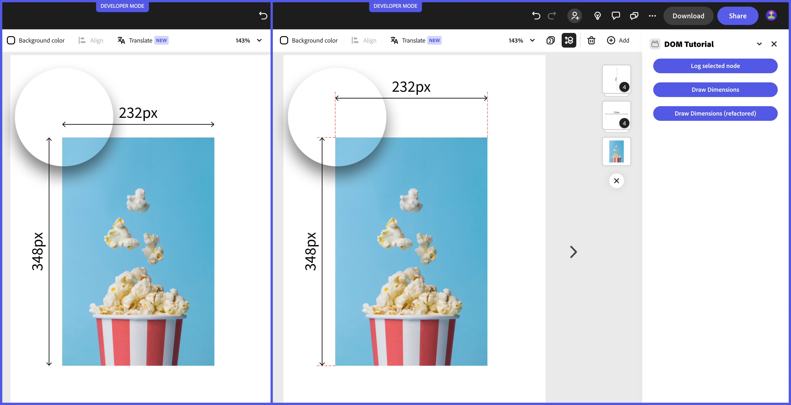

For brevity's sake, only a few relevant additions to the code will be mentioned below—please refer to the [full sample](#final-project) for the complete picture.

The code for drawing the dimensions is moved to a separate `dimensions.js` file. This update includes exporting `drawDimensions()` and `drawDimensionsRefactored()` alongside the implementation of a private `createDimensionLine()`. This function abstracts the creation of a line and its accompanying text by accepting `width`, `height`, `translation`, `orientation`, and `margin` within an options object.

<CodeBlock slots="heading, code" repeat="1" languages="documentSandbox/dimensions.js" />

#### documentSandbox/dimensions.js

```js
// ...
const createDimensionLine = ({
  width,
  height,
  translation,
  orientation,
  margin,
}) => {
  /* ... */
};

// ...
const drawDimensions = () => {
  /* ... */
};
const drawDimensionsRefactored = () => {
  // ...
  createDimensionLine({
    /* ... */
  }); // 👈
  createDimensionLine({
    /* ... */
  }); // 👈
  // ...
};

export { drawDimensions, drawDimensionsRefactored };
```

A rather unorthodox warning system is implemented to alert the user when selecting an unsupported node type. Through the Communication API outlined in [this tutorial](/resources/tutorials/stats-addon.md), a `flashWrongElement()` function, defined in the iframe UI, is available to the Document Sandbox.

<CodeBlock slots="heading, code" repeat="2" languages="ui/index.js, documentSandbox/dimensions.js" />

#### ui/index.js

```js
addOnUISdk.ready.then(async () => {
  // ...
  runtime.exposeApi({
    flashWrongElement(id) {
      const button = document.getElementById(id);
      const oldText = button.textContent;
      const oldColor = button.style.backgroundColor;

      button.textContent = "WRONG NODE";
      button.style.backgroundColor = "#ff0000";

      setTimeout(() => {
        button.textContent = oldText;
        button.style.backgroundColor = oldColor;
      }, 1000);
    },
  });
});
```

#### documentSandbox/dimensions.js

```js
const drawDimensionsRefactored = () => {
  if (
    editor.context.hasSelection &&
    editor.context.selection[0].type === constants.SceneNodeType.mediaContainer
  ) {
    // ...
  } else {
    panelUIProxy.flashWrongElement("drawDimensionsRefactored"); // 👈
  }
};
```

When the Document Sandbox code detects an unsupported node type, it reaches out to the iframe UI `flashWrongElement()` method (exposed via proxy), sending the button `id` as a parameter. As a result, the button blinks red for a second, as its CSS and `textContent` property are temporarily changed.

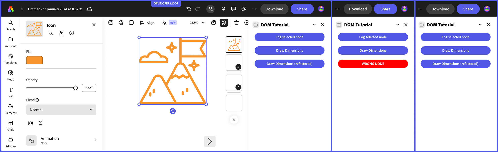

### Next Steps

As an exercise, you use the code sample found below and expand it to build a more complete Dimensions add-on; for example, you can:

- support **more node types**;
- add **UI elements**:
  - a slider to control the dimensions' distance from the object;
  - dropdowns to choose the line's style (solid, dashed, dotted), and the arrowhead type;
  - a checkbox to toggle the extra dashed lines;
  - a color picker to change the line's color—see the [Grids add-on](/resources/tutorials/grids-addon.md) for an example.

## Lessons Learned

Let's review the key concepts discussed in this article.

- **DOM Structure**: the DOM is a hierarchical tree of nodes with parent/child relationships and well-defined inheritance.
- **OOP principles**: classes, inheritance, class extension, and interfaces are crucial Object Oriented programming notions.
- **Constants**: represent a safe way to refer to internal values and check against enumerable properties.
- **Reference documentation**: the Adobe Express Document API reference is a key resource: it provides comprehensive information on available classes, interfaces, and their properties and methods.
- **Classes and Interfaces**: you can differentiate between live object classes, collection classes, abstract classes, static classes, object interfaces, and implementable interfaces.
- **Types and IntelliSense**: using `.d.ts` and `tsconfig.json` files in your projects can enhance code completion and type checking, leading to faster and error-free coding.
- You've also learned how to **prototype an add-on** by navigating the Reference documentation alone.

## Final Project

The code for this project can be found below, as well as in the [`express-add-on-samples`](https://github.com/AdobeDocs/express-add-on-samples) repository.

<InlineAlert variant="info" slots="text1" />

Please use the **iframe UI** and **Document Sandbox** tabs to switch between the two domains and find a dropdown in the top-right corner to select which file to show.

<CodeBlock slots="heading, code" repeat="4" languages="index.html, ui/index.js, documentSandbox/code.js, documentSandbox/dimensions.js" />

#### iframe UI

```html
<body>
  <sp-theme
    scale="medium"
    color="light"
    theme="express"
  >
    <sp-button id="logNode">Log selected node</sp-button>
    <sp-button id="drawDimensions">Draw Dimensions</sp-button>
    <sp-button id="drawDimensionsRefactored"
      >Draw Dimensions (refactored)</sp-button
    >
  </sp-theme>
</body>
```

#### iframe UI

```js
import "@spectrum-web-components/styles/typography.css";
import "@spectrum-web-components/theme/src/themes.js";
import "@spectrum-web-components/theme/theme-light.js";
import "@spectrum-web-components/theme/express/theme-light.js";
import "@spectrum-web-components/theme/express/scale-medium.js";
import "@spectrum-web-components/theme/sp-theme.js";

import "@spectrum-web-components/button/sp-button.js";

import addOnUISdk from "https://express.adobe.com/static/add-on-sdk/sdk.js";

addOnUISdk.ready.then(async () => {
  console.log("addOnUISdk is ready for use.");

  // Get the Authoring Sandbox.
  const { runtime } = addOnUISdk.instance;
  const sandboxProxy = await runtime.apiProxy("documentSandbox");

  const buttonIds = ["logNode", "drawDimensions", "drawDimensionsRefactored"];

  buttonIds.forEach((id) => {
    const button = document.getElementById(id);
    button.addEventListener("click", () => {
      sandboxProxy[id]();
    });
    button.disabled = false;
  });

  runtime.exposeApi({
    flashWrongElement(id) {
      const button = document.getElementById(id);
      const oldText = button.textContent;
      const oldColor = button.style.backgroundColor;

      button.textContent = "WRONG NODE";
      button.style.backgroundColor = "#ff0000";

      setTimeout(() => {
        button.textContent = oldText;
        button.style.backgroundColor = oldColor;
      }, 1000);
    },
  });
});
```

#### Document Sandbox

```js
import addOnSandboxSdk from "add-on-sdk-document-sandbox";
const { runtime } = addOnSandboxSdk.instance;
import { editor } from "express-document-sdk";
import { drawDimensions, drawDimensionsRefactored } from "./dimensions.js";

function start() {
  runtime.exposeApi({
    drawDimensions,
    drawDimensionsRefactored,
    logNode: () => {
      const selectedNode = editor.context.selection[0];
      console.log("Currently selected node", selectedNode);
    },
  });
}

start();
```

#### Document Sandbox

```js
import addOnSandboxSdk from "add-on-sdk-document-sandbox";
const { runtime } = addOnSandboxSdk.instance;
const panelUIProxy = await runtime.apiProxy("panel");

import { editor, constants } from "express-document-sdk";

const createDimensionLine = ({
  width,
  height,
  translation,
  orientation,
  margin,
}) => {
  const isVertical = orientation === "vertical";

  // Adjust line start and end points based on orientation and margin
  const lineStart = isVertical
    ? { x: translation.x - margin, y: translation.y }
    : { x: translation.x, y: translation.y - margin };
  const lineEnd = isVertical
    ? { x: translation.x - margin, y: translation.y + height }
    : { x: translation.x + width, y: translation.y - margin };

  const textValue = isVertical ? height : width;
  const textPos = isVertical
    ? { x: translation.x - margin - 10, y: translation.y + height / 2 }
    : { x: translation.x + width / 2, y: translation.y - margin - 10 };

  const line = editor.createLine();
  line.setEndPoints(lineStart.x, lineStart.y, lineEnd.x, lineEnd.y);
  line.startArrowHeadType = line.endArrowHeadType =
    constants.ArrowHeadType.openTriangular;
  editor.context.insertionParent.children.append(line);

  const text = editor.createText();
  text.fullContent.text = `${Math.trunc(textValue).toString()}px`;
  editor.context.insertionParent.children.append(text);
  text.translation = textPos;

  if (isVertical) {
    text.setRotationInParent(-90, { x: 0, y: 0 });
  }

  const group = editor.createGroup();
  editor.context.insertionParent.children.append(group);
  group.children.append(line, text);

  // Create and append extra lines at the extremities
  for (let i = 0; i < 2; i++) {
    const extraLine = editor.createLine();
    const extraLineStart = isVertical
      ? {
          x: translation.x,
          y: i === 0 ? translation.y : translation.y + height,
        }
      : {
          x: i === 0 ? translation.x : translation.x + width,
          y: translation.y,
        };
    const extraLineEnd = isVertical
      ? {
          x: translation.x - margin - 10,
          y: i === 0 ? translation.y : translation.y + height,
        }
      : {
          x: i === 0 ? translation.x : translation.x + width,
          y: translation.y - margin - 10,
        };

    extraLine.setEndPoints(
      extraLineStart.x,
      extraLineStart.y,
      extraLineEnd.x,
      extraLineEnd.y
    );
    extraLine.stroke = editor.makeStroke({
      color: { red: 1, green: 0, blue: 0, alpha: 1 },
      dashPattern: [4, 2],
      width: 0.5,
    });
    group.children.append(extraLine);
    // editor.context.insertionParent.children.append(extraLine);
  }

  return group;
};

const drawDimensions = () => {
  if (
    editor.context.hasSelection &&
    editor.context.selection[0].type === constants.SceneNodeType.mediaContainer
  ) {
    const selectedNode = editor.context.selection[0];
    console.log(selectedNode);
    const { translation: nodeTranslation } = selectedNode;
    const { width: nodeWidth, height: nodeHeight } =
      selectedNode.mediaRectangle;

    const hLine = editor.createLine();
    hLine.setEndPoints(
      nodeTranslation.x,
      nodeTranslation.y - 20,
      nodeTranslation.x + nodeWidth,
      nodeTranslation.y - 20
    );

    // translation is relative to the parent!!
    editor.context.insertionParent.children.append(hLine);
    hLine.startArrowHeadType = hLine.endArrowHeadType =
      constants.ArrowHeadType.openTriangular;

    const hText = editor.createText();
    hText.fullContent.text = `${Math.trunc(nodeWidth).toString()}px`;
    editor.context.insertionParent.children.append(hText);

    hText.translation = {
      x: nodeTranslation.x + nodeWidth / 2,
      y: nodeTranslation.y - 30,
    };

    const hGroup = editor.createGroup();
    editor.context.insertionParent.children.append(hGroup);
    hGroup.children.append(hLine, hText);

    // Same for the vertical line
    const vLine = editor.createLine();
    vLine.setEndPoints(
      nodeTranslation.x - 20,
      nodeTranslation.y,
      nodeTranslation.x - 20,
      nodeTranslation.y + nodeHeight
    );
    vLine.startArrowHeadType = vLine.endArrowHeadType =
      constants.ArrowHeadType.openTriangular;

    editor.context.insertionParent.children.append(vLine);

    const vText = editor.createText();
    vText.fullContent.text = `${Math.trunc(nodeHeight).toString()}px`;
    editor.context.insertionParent.children.append(vText);

    vText.translation = {
      x: nodeTranslation.x - 30,
      y: nodeTranslation.y + nodeHeight / 2,
    };
    vText.setRotationInParent(-90, { x: 0, y: 0 });

    const vGroup = editor.createGroup();
    editor.context.insertionParent.children.append(vGroup);
    vGroup.children.append(vLine, vText);
  } else {
    panelUIProxy.flashWrongElement("drawDimensions");
  }
};

const drawDimensionsRefactored = () => {
  if (
    editor.context.hasSelection &&
    editor.context.selection[0].type === constants.SceneNodeType.mediaContainer
  ) {
    const selectedNode = editor.context.selection[0];
    const { translation: nodeTranslation } = selectedNode;
    const { width: nodeWidth, height: nodeHeight } =
      selectedNode.mediaRectangle;

    // Create horizontal dimension line
    createDimensionLine({
      width: nodeWidth,
      height: nodeHeight,
      translation: nodeTranslation,
      orientation: "horizontal",
      margin: 60,
    });

    // Create vertical dimension line
    createDimensionLine({
      width: nodeWidth,
      height: nodeHeight,
      translation: nodeTranslation,
      orientation: "vertical",
      margin: 20,
    });
  } else {
    panelUIProxy.flashWrongElement("drawDimensionsRefactored");
  }
};

export { drawDimensions, drawDimensionsRefactored };
```

---

[^1]: Creating entirely novel features for desktop applications typically involves using SDKs and low-level languages such as C++. Adobe Express doesn't allow for this kind of customization.
[^2]: Typically, not every feature available in an application is by default surfaced to Scripting—it's not uncommon for it to be a smaller subset of the UI, features-wise.
[^3]: At the time of this writing, these properties are _not yet_ available for selection in the Adobe Express user interface. It's one of those rare cases where scripting is mightier than the UI!
