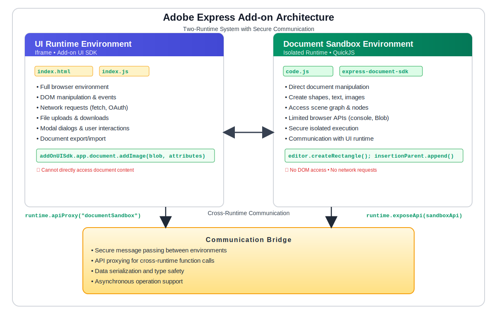

---
keywords:
  - Adobe Express
  - Add-on SDK
  - Adobe Express Editor
  - SDK (Software Development Kit)
  - JavaScript
  - TypeScript
  - Extend
  - Extensibility
  - API
  - Runtime
  - Communication
  - Document Sandbox
  - Document Sandbox SDK
  - Document API
  - UI Runtime
  - Iframe Runtime
  - Architecture
  - Two-Runtime System
  - Cross-Runtime Communication
  - API Proxy
  - Expose API
  - Runtime Bridge
  - Sandbox Environment
  - Security
  - Performance
  - Debugging
  - Error Handling
  - Best Practices
  - Manifest Configuration
  - Web APIs
  - Console APIs
  - Blob API
  - QuickJS
  - Isolated Environment
  - Express Document SDK
  - Add-on UI SDK
  - Communication APIs
  - Runtime Types
  - Panel Runtime
  - Script Runtime
  - Document Manipulation
  - Content Creation
  - UI Components
  - Event Handling
  - Asynchronous Operations
  - queueAsyncEdit
  - Editor Context
  - Insertion Parent
  - Document Root
  - Scene Graph
  - Node Creation
  - File Organization
  - Import Patterns
  - SDK Imports
  - Development Workflow
title: Runtime Architecture & Communication
description: A comprehensive deep-dive guide to Adobe Express add-on architecture, explaining the two-runtime system, communication patterns, SDK imports, debugging techniques, and best practices for building secure and performant add-ons.
contributors:
  - https://github.com/hollyschinsky
---

# Add-on Architecture Guide

Learn about the dual-runtime architecture, communication patterns, and development workflow essential for building Adobe Express add-ons.

## Overview

Understanding the Adobe Express add-on architecture is crucial for building effective add-ons. This comprehensive deep-dive guide covers the dual-runtime system, cross-runtime communication patterns, SDK imports and usage, debugging techniques, security considerations, performance optimization, and development best practices. Whether you're new to add-on development or looking to master advanced concepts, this guide provides the foundational knowledge needed to build robust, secure, and performant add-ons.

## Dual-Runtime Architecture

Adobe Express add-ons run in **two separate JavaScript execution environments** that work together:

1. **UI Runtime** - Your add-on's user interface (aka: iframe runtime)
2. **Document Sandbox** - Secure environment for document manipulation

## Architecture Diagram



## What is the Runtime Object?

The `runtime` object acts as a **communication bridge** between the two environments. Each environment has its own runtime object:

- **UI Runtime**: `addOnUISdk.instance.runtime`
- **Document Sandbox**: `addOnSandboxSdk.instance.runtime`

The communication bridge can be thought of like a phone line - each side has their own phone to call the other side.

## The Two Environments Explained

### UI Runtime Environment (Iframe)

**File:** `index.js` or `index.html`  
**Purpose:** User interface and browser interactions  
**SDK Import:**

```js
import addOnUISdk from "https://express.adobe.com/static/add-on-sdk/sdk.js";
```

**Capabilities:**

- Render your add-on's user interface
- Handle user interactions (clicks, form inputs)
- Access browser APIs (fetch, localStorage)
- OAuth authentication
- Modal dialogs
- File uploads/downloads

### Document Sandbox Environment

**File:** `code.js`  
**Purpose:** Document manipulation and content creation  
**SDK Import:**

```js
import addOnSandboxSdk from "add-on-sdk-document-sandbox";
```

**Capabilities:**

- Access Adobe Express Document API
- Create and modify document elements
- Export renditions
- Secure, isolated execution
- Limited browser API access

## Communication Flow

### From UI to Document Sandbox

When you want to manipulate the document from your UI:

#### UI Runtime (index.js)

```js
// ui/index.js - Your add-on's interface
import addOnUISdk from "https://express.adobe.com/static/add-on-sdk/sdk.js";

addOnUISdk.ready.then(async () => {
  const { runtime } = addOnUISdk.instance;
  
  // Button click handler
  document.getElementById("createText").addEventListener("click", async () => {
    // Get a proxy to call document sandbox functions
    const sandboxProxy = await runtime.apiProxy("documentSandbox");
    
    // Call function exposed in code.js
    await sandboxProxy.createTextElement("Hello World!");
  });
});
```

#### Document Sandbox (code.js)

```js
// sandbox/code.js - Document manipulation
import addOnSandboxSdk from "add-on-sdk-document-sandbox";
import { editor } from "express-document-sdk";

const { runtime } = addOnSandboxSdk.instance;

// Expose functions that UI can call
runtime.exposeApi({
  createTextElement: async function(text) {
    await editor.queueAsyncEdit(() => {
      const textNode = editor.createText(text);
      editor.context.insertionParent.children.append(textNode);
    });
  }
});
```

### From Document Sandbox to UI

When you want to update the UI from document operations:

#### Document Sandbox (code.js)

```js
// sandbox/code.js - Document manipulation
import addOnSandboxSdk from "add-on-sdk-document-sandbox";

const { runtime } = addOnSandboxSdk.instance;

async function processDocument() {
  // Get a proxy to call UI functions
  const uiProxy = await runtime.apiProxy("panel");
  
  // Update UI with progress
  await uiProxy.updateProgress(50);
  
  // Document manipulation here...
  await uiProxy.updateProgress(100);
}
```

#### UI Runtime (index.js)

```js
// ui/index.js - Your add-on's interface
import addOnUISdk from "https://express.adobe.com/static/add-on-sdk/sdk.js";

addOnUISdk.ready.then(() => {
  const { runtime } = addOnUISdk.instance;
  
  // Expose functions that document sandbox can call
  runtime.exposeApi({
    updateProgress: function(percentage) {
      const progressBar = document.getElementById("progress");
      progressBar.style.width = percentage + "%";
    }
  });
});
```

### Runtime Type Detection

#### UI Runtime (index.js)

```js
// ui/index.js - Your add-on's interface
import addOnUISdk from "https://express.adobe.com/static/add-on-sdk/sdk.js";

addOnUISdk.ready.then(() => {
  const { runtime } = addOnUISdk.instance;
  // Check what type of runtime you're in
  console.log(runtime.type); // "panel"
});
```

#### Document Sandbox (code.js)

```js
import addOnSandboxSdk from "add-on-sdk-document-sandbox";

const { runtime } = addOnSandboxSdk.instance;

// Check what type of runtime you're in
console.log(runtime.type); // "documentSandbox"
```

## Understanding the Document Sandbox SDK Imports

### When do I need both SDK imports in `code.js`?

This is a common source of confusion. In your `code.js` file, you may need one or both imports depending on what your add-on does:

#### Option 1: Communication Only

```js
// sandbox/code.js - Only communication, no document manipulation
import addOnSandboxSdk from "add-on-sdk-document-sandbox";

const { runtime } = addOnSandboxSdk.instance;

// Only exposing APIs, not creating document content
runtime.exposeApi({
  processData: function(data) {
    // Process data, return results
    return data.map(item => item.toUpperCase());
  }
});
```

#### Option 2: Document Manipulation Only

```js
// sandbox/code.js - Only document creation, no communication
import { editor } from "express-document-sdk";

// Directly manipulate document without UI communication
editor.queueAsyncEdit(() => {
  const text = editor.createText("Auto-generated content");
  editor.context.insertionParent.children.append(text);
});
```

#### Option 3: Both Communication AND Document Manipulation

```js
// sandbox/code.js - Most common pattern
import addOnSandboxSdk from "add-on-sdk-document-sandbox";  // For communication
import { editor } from "express-document-sdk";              // For document manipulation

const { runtime } = addOnSandboxSdk.instance;

// Expose APIs that manipulate the document
runtime.exposeApi({
  createTextElement: async function(text) {
    await editor.queueAsyncEdit(() => {
      const textNode = editor.createText(text);
      editor.context.insertionParent.children.append(textNode);
    });
  }
});
```

### Quick Decision Guide

<InlineNestedAlert header="true" variant="success" iconPosition="right">

  **Do I need `addOnSandboxSdk`?**

  - ✅ YES if your `code.js` needs to communicate with the UI
  - ✅ YES if UI triggers document operations
  - ❌ NO if `code.js` runs independently

  **Do I need `express-document-sdk`?**

  - ✅ YES if creating/modifying document content
  - ✅ YES if accessing document properties
  - ❌ NO if only processing data or communicating

</InlineNestedAlert>

### Examples

#### Example 1: Text Generator Add-on

```js
// sandbox/code.js - Needs BOTH imports
import addOnSandboxSdk from "add-on-sdk-document-sandbox";  // UI sends text data
import { editor } from "express-document-sdk";              // Create text elements

const { runtime } = addOnSandboxSdk.instance;

runtime.exposeApi({
  generateText: async function(userInput) {
    await editor.queueAsyncEdit(() => {
      const text = editor.createText(userInput);
      editor.context.insertionParent.children.append(text);
    });
  }
});
```

#### Example 2: Document Analytics Add-on

```js
// sandbox/code.js - Needs BOTH imports  
import addOnSandboxSdk from "add-on-sdk-document-sandbox";  // Send results to UI
import { editor } from "express-document-sdk";              // Analyze document

const { runtime } = addOnSandboxSdk.instance;

runtime.exposeApi({
  analyzeDocument: function() {
    const pageCount = editor.documentRoot.pages.length;
    return { pageCount, elements: pageCount * 5 }; // Send data back to UI
  }
});
```

#### Example 3: Document Analysis Utility

```js
// sandbox/code.js - Only needs express-document-sdk
import { editor } from "express-document-sdk";

// Analyze current document structure (no UI communication needed)
function analyzeDocument() {
  const pages = editor.documentRoot.pages;
  const elementCount = pages.length;
  
  console.log(`Document analysis: ${elementCount} elements found`);
  
  // Could save analysis results to document metadata or
  // trigger other document operations based on analysis
  return { elementCount, timestamp: new Date().toISOString() };
}

// Execute analysis
const results = analyzeDocument();
```

## Common Patterns

### Pattern 1: UI-Triggered Document Operations (Most Common)

User interactions in the UI trigger document changes:

```js
// UI: User clicks button → Document: Create content
// Requires BOTH imports in code.js
```

### Pattern 2: Document-Driven UI Updates

Document analysis sends results to update the UI:

```js
// Document: Analyze content → UI: Show results
// Requires BOTH imports in code.js
```

### Pattern 3: Independent Document Operations

Document analysis or operations that run without UI interaction:

```js
// Document: Analyze/process content
// Only requires express-document-sdk
```

## Document Sandbox Overview

The document sandbox environment provides a secure, isolated execution context for document manipulation. Here's what's available:

### Core Features

#### 1. Communication System (`addOnSandboxSdk.instance.runtime`)

```js
import addOnSandboxSdk from "add-on-sdk-document-sandbox";

const { runtime } = addOnSandboxSdk.instance;

// Expose APIs to UI
runtime.exposeApi({ /* your functions */ });

// Get proxy to UI APIs
const uiProxy = await runtime.apiProxy("panel");
```

#### 2. Injected Web APIs (Global - No Import Needed)

The document sandbox automatically injects limited browser APIs for common tasks. See the complete [Web APIs Reference](../../../references/document-sandbox/web/index.md) for details.

```js
// These are automatically available in your code.js
console.log("Debugging output");
console.error("Something went wrong");
console.warn("Be careful here");
console.clear(); // Clear console
```

#### 3. Document APIs (`express-document-sdk`)

```js
import { editor, colorUtils, constants, fonts } from "express-document-sdk";

// Create and manipulate document content
const textNode = editor.createText("Hello World");
const rectangle = editor.createRectangle();

// Access document structure
const currentPage = editor.context.currentPage;
const selection = editor.context.selection;
```

#### 4. Secure Execution Environment

- **Isolated JavaScript context**: Your code runs in a secure sandbox
- **Limited browser APIs**: Only essential APIs like `console` and `Blob` are available
- **Performance considerations**: Slower than UI runtime but secure
- **No direct DOM access**: Must communicate through UI runtime

### What You DON'T Need to Import

These are automatically injected and available globally in the document sandbox. For complete details, see [Web APIs Reference](../../../references/document-sandbox/web/index.md).

```js
// ✅ Available automatically - no import needed

// Console APIs for debugging
console.log("This works!");
console.error("Error logging works!");
console.warn("Warning logging works!");
console.info("Info logging works!");
console.debug("Debug logging works!");
console.clear(); // Clear console
console.assert(condition, "Assertion message");

// Blob interface for binary data handling
const blob = new Blob(['data'], { type: 'text/plain' });
blob.text().then(text => console.log(text));
blob.arrayBuffer().then(buffer => console.log(buffer));
blob.size; // Get blob size
blob.type; // Get MIME type

// Basic JavaScript globals
setTimeout; // Available but limited
clearTimeout; // Available but limited
```

### What You DO Need to Import

#### For Communication:

```js
import addOnSandboxSdk from "add-on-sdk-document-sandbox";
const { runtime } = addOnSandboxSdk.instance;
```

#### For Document Manipulation:

```js
import { editor, colorUtils, constants, fonts } from "express-document-sdk";
```

### Debugging Capabilities

Since the document sandbox has limited debugging, use these patterns:

```js
// Basic debugging with console
console.log("Variable value:", myVariable);

// Object inspection (be careful with large objects)
console.log("Full object:", JSON.stringify(myObject, null, 2));

// Error tracking
try {
    // Risky operation
    const result = editor.createText("Hello");
    console.log("Success:", result);
} catch (error) {
    console.error("Operation failed:", error.message);
    console.error("Stack trace:", error.stack);
}

// Assertion testing
console.assert(myVariable !== undefined, "Variable should be defined");

// Performance debugging
const startTime = performance.now();
// ... your code ...
const endTime = performance.now();
console.log(`Operation took ${endTime - startTime} milliseconds`);
```

### Quick Reference: All SDK Imports

| Feature | UI Runtime | Document Sandbox Runtime| Document APIs |
|---------|------------|------------------|-----------------|
| **Import Statement** | `import addOnUISdk from "https://express.adobe.com/static/add-on-sdk/sdk.js"` | `import addOnSandboxSdk from "add-on-sdk-document-sandbox"` | `import { editor } from "express-document-sdk"` |
| **File Location** | `index.js/index.html` | `code.js` | `code.js` |
| **Primary Purpose** | User interface & browser interactions | Communication between environments | Document manipulation |
| **Runtime Communication** | ✅ `instance.runtime` | ✅ `instance.runtime` | ❌ No communication |
| **Document Creation** | ❌ No direct access | ❌ No direct access | ✅ `editor.createText()`, etc. |
| **Document Reading** | ❌ No direct access | ❌ No direct access | ✅ `editor.context` |
| **Export Renditions** | ✅ `app.document.createRenditions()` | ❌ No direct access | ❌ No direct access |
| **Modal Dialogs** | ✅ `app.showModalDialog()` | ❌ No direct access | ❌ No direct access |
| **OAuth** | ✅ `app.oauth` | ❌ No direct access | ❌ No direct access |
| **File Upload/Download** | ✅ Full browser APIs | ❌ No direct access | ❌ No direct access |
| **DOM Manipulation** | ✅ Full DOM access | ❌ No DOM access | ❌ No DOM access |
| **Browser APIs** | ✅ All browser APIs | ❌ Limited (console, Blob) | ❌ Limited (console, Blob) |
| **Platform Detection** | ✅ `app.getCurrentPlatform()` | ❌ No direct access | ❌ No direct access |
| **Client Storage** | ✅ `instance.clientStorage` | ❌ No direct access | ❌ No direct access |
| **Constants** | ✅ `constants.*` | ❌ No constants | ✅ Document constants |

### Manifest Configuration

The sandbox requires proper manifest setup:

```json
{
  "entryPoints": [
    {
      "type": "panel",
      "id": "panel1", 
      "main": "index.html",
      "documentSandbox": "code.js"
    }
  ]
}
```

### SDK Import Decision Matrix

| Your Add-on Needs | UI Runtime | Document Sandbox | Required Imports | Notes |
|-------------------|------------|------------------|------------------|-------|
| **UI only** (no document changes) | ✅ | ❌ | `addOnUISdk` | Settings panels, external integrations |
| **Document manipulation** | ✅ | ✅ | `addOnUISdk` + `express-document-sdk` + `addOnSandboxSdk` | UI triggers document operations |
| **UI + Document communication** | ✅ | ✅ | `addOnUISdk` + `addOnSandboxSdk` | Cross-runtime communication |
| **Document creation/editing** | ✅ | ✅ | `addOnUISdk` + `addOnSandboxSdk` + `express-document-sdk` | Full document workflow |
| **Data processing in sandbox** | ✅ | ✅ | `addOnUISdk` + `addOnSandboxSdk` | UI needed to trigger processing |
| **Export/Import workflows** | ✅ | ❌ | `addOnUISdk` | Document operations via UI SDK |

### Common Import Patterns

```js
// Pattern 1: UI-only add-on (no document changes)
// index.js
import addOnUISdk from "https://express.adobe.com/static/add-on-sdk/sdk.js";
// No code.js file needed

// Pattern 2: Document manipulation only
// code.js
import { editor } from "express-document-sdk";
// No index.js communication needed

// Pattern 3: Full communication + document manipulation (most common)
// index.js
import addOnUISdk from "https://express.adobe.com/static/add-on-sdk/sdk.js";

// code.js
import addOnSandboxSdk from "add-on-sdk-document-sandbox";  // For communication
import { editor } from "express-document-sdk";              // For document APIs
```

## Best Practices

1. **Clear File Organization**
   - Keep UI logic in `index.js`
   - Keep document logic in `code.js`
   - Use consistent naming for exposed APIs
   - Separate concerns clearly between environments

2. **Error Handling**
   - Always wrap API calls in try-catch blocks
   - Provide meaningful error messages to users
   - Handle communication failures gracefully
   - Use `console.error()` for debugging in sandbox
   - Validate inputs before processing

3. **Performance**
   - Minimize data transfer between environments
   - Batch multiple operations when possible
   - Use appropriate data types (see [Communication APIs](../../../references/document-sandbox/communication/index.md#data-types))
   - Remember sandbox runs slower than UI runtime
   - Avoid frequent cross-runtime communication in loops

4. **Debugging**
   - Use `console.log` in both environments
   - Check browser dev tools for UI runtime
   - Use sandbox console for document sandbox debugging
   - Use `console.assert()` for validation checks
   - Test communication flows thoroughly

5. **Security**
   - Never expose sensitive data through communication APIs
   - Validate all data received from the UI
   - Use the sandbox's isolation as intended
   - Don't attempt to bypass security restrictions

## Error Handling

### Common Error: "Runtime is undefined"

❌ **Wrong:** Trying to use runtime before SDK is ready

```js
const { runtime } = addOnUISdk.instance; // Error! SDK not ready yet
```

✅ **Correct:** Wait for SDK ready state

```js
addOnUISdk.ready.then(() => {
  const { runtime } = addOnUISdk.instance; // Now it's safe
});
```

### Common Error: "Cannot read property 'apiProxy' of undefined"

❌ **Wrong:** Using wrong SDK in wrong environment

```js
// In code.js (Document Sandbox)
import addOnUISdk from "https://express.adobe.com/static/add-on-sdk/sdk.js";
const { runtime } = addOnUISdk.instance; // Wrong SDK!
```

✅ **Correct:** Use appropriate SDK for each environment

```js
// In code.js (Document Sandbox)
import addOnSandboxSdk from "add-on-sdk-document-sandbox";
const { runtime } = addOnSandboxSdk.instance; // Correct SDK!
```

## Frequently Asked Questions

### Q: Why are there two different runtime objects?

**A:** Each environment has its own runtime object that acts as a "communication phone." The UI runtime calls the document sandbox, and the document sandbox runtime calls the UI. This separation ensures security and proper isolation.

### Q: When do I use `addOnUISdk.instance.runtime` vs `addOnSandboxSdk.instance.runtime`?

**A:** Use the runtime object from the environment you're currently in:

- In `index.js` (UI): Use `addOnUISdk.instance.runtime`
- In `code.js` (Sandbox): Use `addOnSandboxSdk.instance.runtime`

### Q: What does `await runtime.apiProxy("documentSandbox")` actually do?

**A:** It creates a proxy object that lets you call functions you've exposed in the document sandbox from your UI code. Think of it as getting a "remote control" for the other environment.

### Q: What's the difference between `"documentSandbox"` and `"panel"` in apiProxy?

**A:** These specify which environment you want to communicate with:

- `"documentSandbox"` - Call from UI to document sandbox
- `"panel"` - Call from document sandbox to UI

### Q: Can I access document APIs directly from the UI?

**A:** No, document APIs are only available in the document sandbox for security reasons. You must use the communication system to bridge between environments.

### Q: How do I know which environment my code is running in?

**A:** Check your file structure and imports:

- If you're importing `addOnUISdk` → You're in the UI runtime
- If you're importing `addOnSandboxSdk` → You're in the document sandbox

### Q: Do I always need both imports in my code.js file?

**A:** No! It depends on what your add-on does:

- **Communication only**: Just `addOnSandboxSdk` (no document changes)
- **Document only**: Just `express-document-sdk` (no UI communication)  
- **Both**: Most add-ons need both for UI-triggered document operations

### Q: Why do some examples show one import and others show both?

**A:** Different add-on types have different needs:

- Simple document manipulation → One import
- UI-controlled document changes → Both imports
- The example context determines which imports are shown

### Q: What else is available in the add-on-sdk-document-sandbox package?

**A:** Besides `runtime`, the sandbox SDK provides:

- **Web APIs**: Limited browser APIs like `console` and `Blob` for debugging and data handling
- **Automatic global injections**: No need to import basic APIs like `console`
- **Secure execution environment**: Isolated JavaScript context with performance monitoring
- **Communication infrastructure**: Handles the complex proxy system between environments

### Q: Can I use fetch() or other network APIs in the document sandbox?

**A:** No, network APIs like `fetch()` are not available in the document sandbox for security reasons. If you need to make network requests, do them in the UI runtime and pass the data to the document sandbox via communication APIs.

### Q: Why does my add-on feel slower in the document sandbox?

**A:** The document sandbox runs in an isolated environment (QuickJS) which is inherently slower than the native browser JavaScript engine. This is by design for security. Minimize complex operations and data transfer between environments.

## Related Topics

- [Communication APIs Reference](../../../references/document-sandbox/communication/index.md)
- [UI SDK Reference](../../../references/addonsdk/index.md)
- [Document API Concepts](./document-api.md)

## Next Steps

Now that you understand the architecture, explore these guides and tutorials:

- [Document API deep dive](./document-api.md): Learn how to use the Document API to create and modify document content.
- [Building your first add-on](../how_to/tutorials/grids-addon.md): Use the Document API to create a simple add-on that adds a grid to the document.
- [Using the Communication APIs](../how_to/tutorials/stats-addon.md): Build an add-on to gather statistics on the active document using the Communication APIs.
