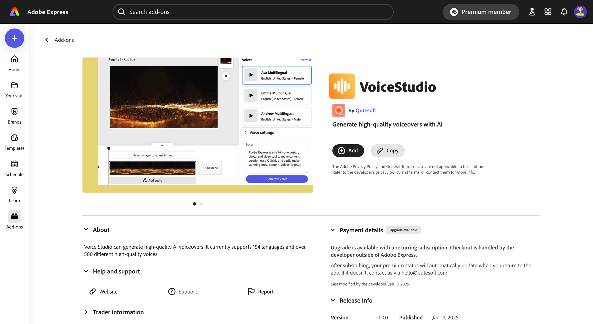
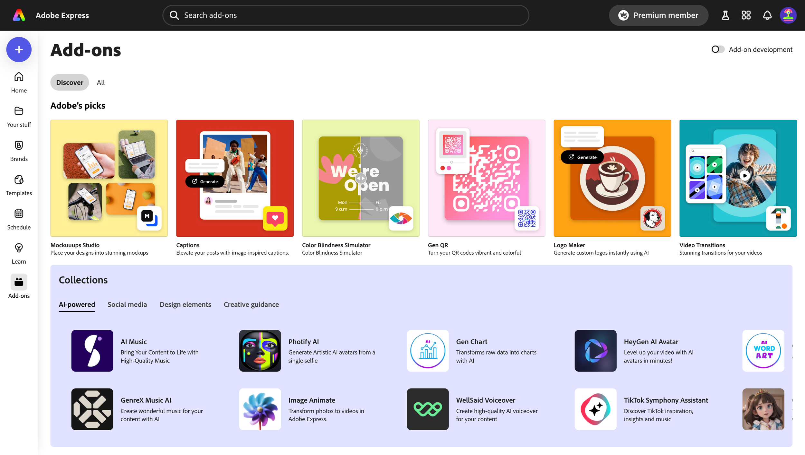

---
keywords:
  - Adobe Express
  - Express Add-on SDK
  - Express Editor
  - Adobe Express
  - Add-on SDK
  - SDK
  - JavaScript
  - Extend
  - Extensibility
  - API
  - Learning Paths
title: "Beginner Path: Getting started with Adobe Express Add-ons"
description: Adobe Express Add-ons Beginner Learning Path
contributors:
  - https://github.com/hollyschinsky
  - https://github.com/undavide
---

# Beginner Path: Getting started with Adobe Express add-ons

If you're new to software development and don't know very well what Adobe Express can offer, this path is for you. We'll start with the basics and give you a sense of what you can create with add-ons.

## 1. Introduction to the Adobe Express ecosystem

[Adobe Express](https://www.adobe.com/express/) is an AI-first, all-in-one, web-based app to easily create and share content for free. It's a powerful tool that can be used by everyone, from designers to marketers, to create stunning content in minutes.

### What are add-ons?

[Add-ons](https://new.express.adobe.com/add-ons) are extensions that enhance the functionality of Adobe Express, allowing users to be more productive and creative.

The add-on's use cases are endless, but some real-world examples are:

- Generate **AI avatars** from a selfie.
- Browse and insert **voiceover** and **music** to your project.
- Create **stylish product mockups**.
- Integrate with **Google Drive** and **Google Photos** to manage your files.
- And much more!

### How to develop add-ons

Add-ons are lightweight programs that run in their own panel within the Adobe Express user interface; you can build add-ons with standard web technologies like **HTML**, **CSS**, and **JavaScript**. Ideally, they provide a seamless experience for the user—they should feel like they are part of the Adobe Express app!

Once you have your add-on ready, you can distribute it through the [Adobe Express Marketplace](https://new.express.adobe.com/add-ons). With a few clicks, it'll be made available to **millions of Adobe Express users**.

### Monetize add-ons

Add-ons can be either **free** or **paid**, and anything in between like _freemium_ or _credit-based_.

<InlineAlert slots="text1" variant="info" />

You're allowed to implement your payment processor of choice, the Adobe Express Marketplace _does not take_ a cut of your revenue, so **you keep 100% of your earnings**.

Adobe sponsors the development of selected use cases through the [Adobe Fund for Design](https://developer.adobe.com/fund-for-design); check it out, and get paid to develop your add-on!

### Resources

You now have a basic understanding of the Adobe Express ecosystem; if you want to dive deeper into the different parts of the ecosystem, check out the following resources:

- [Introducing Adobe Express add-ons](https://www.youtube.com/watch?v=CHBiTTN1neE) (Youtube video)
- [Adobe Express add-ons overview](https://developer.adobe.com/express/add-ons/)
- [Adobe Express Office Hours](https://developer.adobe.com/developers-live)
- [Adobe Fund for Design](https://developer.adobe.com/fund-for-design)

## 2. The Code Playground

The best way to learn is by doing! Adobe Express integrates a [Playground](../getting_started/code_playground.md) environment that allows you tinker with the code directly in the application, without the need to set up a local development environment.

  

 <iframe width="779" height="438" src="https://www.youtube.com/embed/j6KS6CXZmKo?si=j4kX8gItWbm1ZDVz" title="YouTube video player" frameborder="0" allow="accelerometer; clipboard-write; encrypted-media; gyroscope; picture-in-picture; web-share" allowfullscreen></iframe>

 

Read the [Code Playground](../getting_started/code_playground.md) guide now to get started! Come back here when you're familiar with it, there's just one more thing before completing the Beginner Path.

## 3. Hello World

Placeholder for a pointer to the Hello World guide (which is not yet written...)

## 4. Explore the How-to Guides

Now that you've got the hang of the Code Playground, it's time to try your hand at some real-world use cases. Head to the [How-tos](../develop/how_to.md) section: you'll find a collection of short guides and accompanying snippets that you can plug and play in the Playground editor. As a starter, we recommend the following:

- [Creating Text](../develop/how_to/use_text.md#create-text)
- [Creating Geometry](../develop/how_to/use_geometry.md)
- [Grouping Elements](../develop/how_to/group_elements.md)

When you feel more comfortable, you can try to play with the following use cases:

- [Using Colors](../develop/how_to/use_color.md)
- [Exporting Renditions](../develop/how_to/create_renditions.md)
- [Document](../develop/how_to/document_metadata.md) and [Element Metadata](../develop/how_to/document_metadata.md)

## Next steps

Congratulations 🎉 you've completed the Beginner Path! You should now have a good understanding of the Adobe Express ecosystem and how add-ons work.

Feel free to explore the rest of the [How-to Guides](../develop/how_to.md) to get more comfortable with the different features and use cases, or jump straight into the [Intermediate Path](../learning-paths/intermediate.md). You'll learn how to scaffold a local development environment with the CLI, and build a more complex add-on from the ground up.
