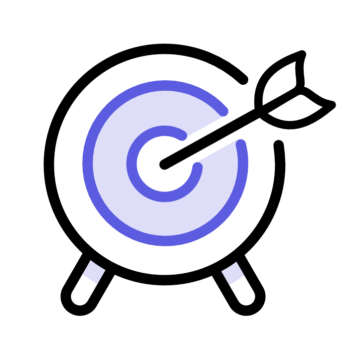

---
keywords:
  - Adobe Express
  - Express Add-on SDK
  - Express Editor
  - Adobe Express
  - Add-on SDK
  - SDK
  - JavaScript
  - Extend
  - Extensibility
  - API
  - Learning Paths
title: Adobe Express Add-ons Learning Paths
description: Choose your learning path based on your experience level and get started with Adobe Express add-on development.
contributors:
  - https://github.com/hollyschinsky
  - https://github.com/undavide
---

import '/src/styles.css'

# Adobe Express Add-ons Learning Paths

Skill tracks designed around your experience and goals.

## Skill Level-Based Learning Paths

These paths are designed to progressively build your skills from beginner to advanced levels. They focus on specific aspects of add-on development—what you need to know and what you can skip for when you're ready.

<TextBlock slots="image, heading, text" width="33%" />

### Beginner

I'm new to add-on development and Adobe Express, I'd like to learn the basics.

<TextBlock slots="image, heading, text" width="33%" />

### Intermediate

I'm familiar with the Code Playground, and I'm ready to build my first add-on.  

<TextBlock slots="image, heading, text" width="33%" />

### Advanced

I've built add-ons before, now I would like to up my game!  

<!-- # Learning Paths for Adobe Express Add-on Development -->

## Beginner Path: Getting started with Adobe Express add-ons

If you're new to software development or don't know very well what Adobe Express can offer, this path is for you. We'll start with the basics and give you a sense of what you can create with add-ons. This path includes:

1. **Introduction** to Add-ons.
2. Explore the Adobe Express **Marketplace**.
3. Learn by doing with the **Code Playground**.
4. Experiment with snippets from the **How-to guides**.

**[Start the Beginner Path →](./beginner.md)**

## Intermediate Path: Build your first add-on

If you have completed the beginner path, or have some software development experience with Adobe Express or other platforms, we can cover more specific concepts and set you up with a practical example to build. You will learn how to:

1. Scaffold a new add-on project with the **CLI**.
2. Follow a complete **Tutorial** to build your first add-on.
3. Learn how to **Debug** and troubleshoot your add-on.
4. Explore the Adobe Express add-on **APIs**.

**[Start the Intermediate Path →](./intermediate.md)**

## Advanced Path: Mastering add-on Development

You've built a few add-ons, and you're ready to take your skills to the next level. This path is for you!

1. Discover our **UX Guidelines** and **Spectrum Web Components**.
2. Master the **Document Sandbox API**.
3. **Distribute** your add-on to the Marketplace.
4. Improve your add-on's sales with our **Monetization Guide**.

**[Start the Advanced Path →](./advanced.md)**

## Next Steps

If you've completed all the paths, you know more than most developers; congratulations! Feel free to explore the rest of the documentation website and samples. For additional resources, check out:

- [Adobe Express add-on Documentation](../getting_started/index.md)
- [API Reference](../../references/index.md)
- [Sample Add-ons](../samples.md)
- [Adobe Express Developer Community](https://developer.adobe.com/express/community)
