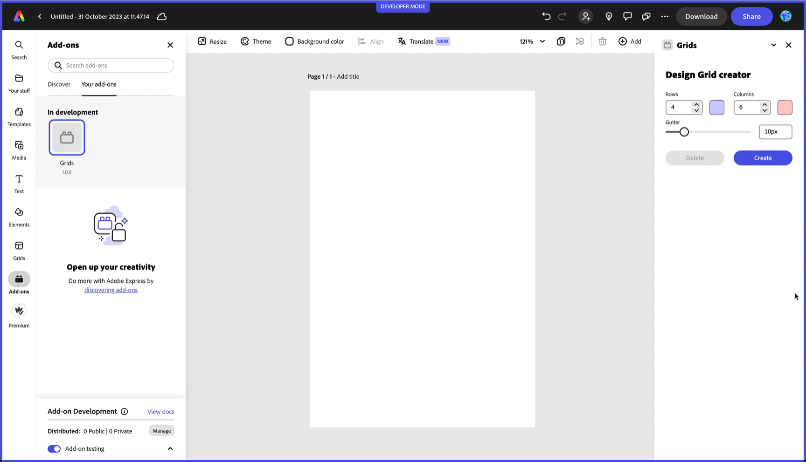

---
keywords:
  - Adobe Express
  - Express Add-on SDK
  - Express Editor
  - Adobe Express
  - Add-on SDK
  - SDK
  - JavaScript
  - Extend
  - Extensibility
  - API
  - Learning Paths
title: "Intermediate Path: Build your first add-on"
description: Adobe Express Add-ons Intermediate Learning Path
contributors:
  - https://github.com/hollyschinsky
  - https://github.com/undavide
---

# Intermediate Path: Build your first add-on

If you've completed the [Beginner Path](./beginner.md), or are otherwise familiar with the Adobe Express ecosystem, how add-ons work, and the [Code Playground](../getting_started/code_playground.md), this path will guide you through building a more complex add-on from the ground up.

## 1. Scaffold a new add-on with the CLI

In-app prototyping with the Code Playground is a great way to get started with add-on development, but to build a production-ready add-on, you'll need to scaffold a **local development environment**.

Luckily, Adobe Express provides a Command Line Interface (CLI) that makes it easy to set up a new project. Read the [Development Tools](../getting_started/dev_tooling.md) guide to learn how to use the CLI and:

- Scaffold new add-ons based on a variety of templates (JavaScript, TypeScript, React, etc.)
- Set up a hot-reloading local server for testing purposes
- Package the add-on for distribution

<InlineAlert variant="info" slots="header, text1, text2, text3"/>

#### Loading an add-on during development

The CLI, among the rest, builds the add-on from the source code on your local machine and spins a local server that serves it. Adobe Express side loads the add-on from this server while you're developing locally.

Follow the [CLI's instructions](../getting_started/dev_tooling.md) and make sure you've [enabled the add-on Development Mode](../getting_started/quickstart.md#step-3-enable-add-on-development-mode-first-time-only) in Adobe Express.

## 2. Follow a tutorial to build a full add-on from scratch

Now that you have all the tools you need, you can follow a tutorial to build a full add-on from scratch. Among the [available ones](../tutorials/index.md), we suggest starting with the [Document API Tutorial](../tutorials/grids-addon.md), which guides you through building an add-on that adds a grid layout to any document.

The add-on you're building in this tutorial is production-ready, and is an excellent starting point. It covers the following topics:

- **Creating and manipulating shapes**.
- **Grouping elements** and insertion points.
- **Spectrum Web Components** to build the User Interface.
- **The Document API** to manipulate the document and its elements.
- Iframe and Document Model Sandbox **communication**.

Alongside with a more complex usage of the various APIs and the creation of a structured UI, you'll be introduced to the [Communication API](../tutorials/grids-addon/#the-communication-api), which is the main way for an add-on to interact with Adobe Express Documents.

## 3. Learn how to Debug and troubleshoot your add-on

Now that you've built your first add-on, the next crucial skill to learn is how to debug it and troubleshoot any issues that may arise.

  

    <iframe width="779" height="438" src="https://www.youtube.com/embed/XefQbfVOqto?si=VSxAEXYo-X2_pXMi" title="Testing and Debugging" frameborder="0" allow="accelerometer; autoplay; clipboard-write; encrypted-media; gyroscope; picture-in-picture; web-share" allowfullscreen></iframe>

The most effective way to debug your add-on is by using the [Browser Developer Tools](../debug/browser.md), although you can also use the built-in [VS Code debugger](../debug/vs-code.md). If you find yourself in any trouble, worry not—we have a [Troubleshooting Guide](../faq.md) to help you out!

## 4. Explore the Adobe Express add-on APIs

The next step is to familiarize yourself with the Adobe Express [SDK References](../../references/index.md). They're split into three main sections:

- [Add-on UI SDK Reference](../../references/addonsdk/): the APIs for the UI of your add-on, which belongs to the iframe environment.
- [Document Sandbox Reference](../../references/document-sandbox/): the Document APIs, which deal with elements on the document, the communication system between the iframe and the main Document Sandbox, and the some basic Web API utilities for debugging purposes.
- [Manifest Schema Reference](../../references/manifest/): the reference for the add-on's `manifest.json` configuration file.

You should then read the [The Adobe Express DOM](../../references/document-sandbox/document-apis/concepts/index.md#the-adobe-express-dom) section of the [Concepts](../../references/document-sandbox/document-apis/concepts/index.md) guide to deepen your understanding of the key principles underlying the Document API.

## Next steps

Congratulations 🎉 you've completed the Intermediate Path!

You've now all it takes to have fun exploring from the [Code Samples](../../samples.md); you'll find plenty of add-ons to draw inspiration and learning from. You can check our [Community page](https://developer.adobe.com/express/community/), and start engaging with other fellow developers on the [Adobe Express add-on's Discord channel](http://discord.gg/nc3QDyFeb4). Don't forget to join the monthly [Adobe Express Office Hours](https://developer.adobe.com/developers-live) to get the latest news and ask questions to the team!

Feel free to explore the rest of our documentation, or jump straight into the [Advanced Path](../learning-paths/advanced.md).

  
