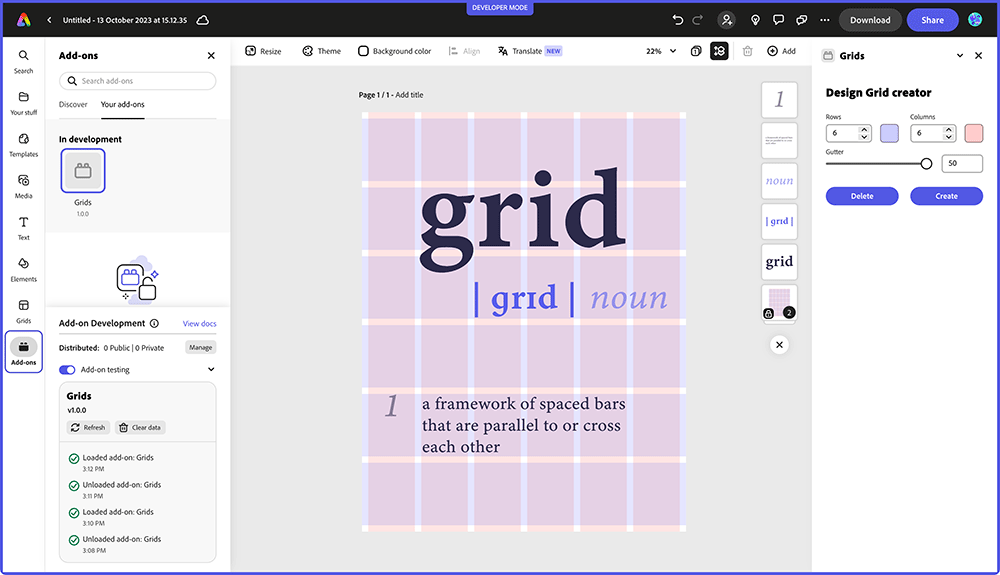

---
keywords:
  - Adobe Express
  - Express Add-on SDK
  - Adobe Express
  - Add-on SDK
  - SDK
  - JavaScript
  - Extensibility
  - API
title: Adobe Express Add-on Tutorials
description: Adobe Express Add-on Tutorials covering the Adobe Express Add-on SDK and Document API
contributors:
  - https://github.com/hollyschinsky  
  - https://github.com/undavide
---

# Tutorials

In this page, you'll find a variety of tutorials covering the Adobe Express Add-on UI SDK and Document Sandbox APIs.

<Resource-Card slots="link, image, heading, text" width="50%"/>

[Express Document API](grids-addon.md)

### Creating a Grid System add-on with the Adobe Express Document API

Davide Barranca - November 6th, 2023

<Resource-Card slots="link, image, heading, text" width="50%"/>

[Coming Soon...](stats-addon.md)

### Creating a Stats add-on with the Adobe Express Communication API

Davide Barranca - December 14th, 2023

<Resource-Card slots="link, image, heading, text" width="80%"/>

[Express Document API](spectrum-workshop/index.md)

### Building UIs using Adobe's Spectrum Design System

Holly Schinsky - January 25th, 2024
