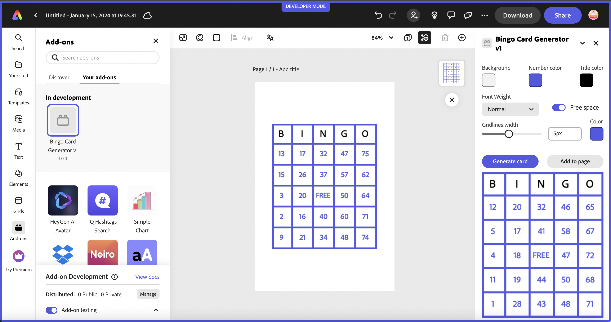
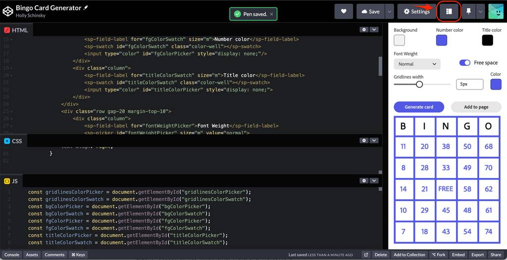

---
keywords:
  - Adobe Express
  - Express Add-on SDK
  - Express Document API
  - Document Model Sandbox
  - Adobe Express
  - Add-on SDK
  - SDK
  - JavaScript
  - Extend
  - Extensibility
  - API
title: Great UIs using Adobe's Spectrum Design System
description: This is an in-depth tutorial that will guide you in using Adobe's Spectrum Design System to help you build great UI's for your add-ons.
contributors:
  - https://github.com/hollyschinsky
---

# Building UIs using Adobe's Spectrum Design System

This tutorial will guide you on how to get started building great UI's for your add-ons using [Adobe Spectrum](https://spectrum.adobe.com/).

## Introduction

In this tutorial, you will learn how to build two fully functioning [Adobe Express](https://new.express.adobe.com/) add-ons from scratch that use [Adobe Spectrum](https://spectrum.adobe.com/) for building the user interface. The concept for the add-on you will build is a bingo card generator, which allows a user to customize a bingo card with their chosen colors, random numbers and an optional FREE space.

The two different add-on's you will create are:

- A basic JavaScript add-on that uses [Spectrum Web Components](https://opensource.adobe.com/spectrum-web-components/) to build out the UI. 

- A React-based add-on that uses the [`swc-react` Spectrum Web Components wrapper library](https://developer.adobe.com/express/add-ons/docs/guides/design/user_interface/#spectrum-web-components-with-react).

An example of the result of what you will build is shown below:



This add-on allows users to select settings to customize a bingo card, including background, foreground and title color, gridline size and whether to include a FREE space. The card is generated with random numbers, and ensures no numbers are used twice. The user can drag the customized card to the page, or click the "Add to page" button to use it in their document.

### Changelog

**January 31st, 2024**

- First publication, by Holly Schinsky

### Prerequisites

- Familiarity with HTML, CSS, JavaScript.
- Familiarity with the Adobe Express add-ons environment; if you need a refresher, follow the [quickstart](/guides/getting_started/quickstart.md) guide.
- An Adobe Express account; use your existing Adobe ID or create one for free.
- Node.js version 16 or newer.

### Sample Projects

- [Lesson 1 project](https://github.com/hollyschinsky/bingo-card-generator-js) - Bingo Card Generator add-on using Spectrum Web Components and JavaScript

<!-- - The [lesson 2 starter project](https://github.com/hollyschinsky/bingo-card-generator-starter/blob/master/webpack.config.js)  -->

- [Lesson 2 project](https://github.com/hollyschinsky/bingo-card-generator-react-js) - Bingo Card Generator add-on using [swc-react](https://opensource.adobe.com/spectrum-web-components/using-swc-react/) and ReactJS

<!-- **TODO** above -->

### Topics Covered

<ListBlock slots="text1, text2" repeat="2" iconColor="#2ac3a2" icon="disc" variant="fullWidth" />

[Configuring your add-on to use Spectrum Web Components](part1.md#create-and-configure-project)

[Using swc-react (React Spectrum Web Components wrappers)](part2.md#import-swc-react-components)

[Using Spectrum variables to customize the layout of your UI](part2.md#style-your-ui)

[Tips, Tricks & Troubleshooting](part3.md#tips-tricks--troubleshooting)

## Quickstart: Try Spectrum Web Components

A quick way to try out [Spectrum Web Components](https://opensource.adobe.com/spectrum-web-components/) without requiring any external tools, is to use a sandboxed environment like a codepen or code sandbox. See this [simple codepen](https://codepen.io/hollyschinsky/pen/xxBweyV), for example. It references the Spectrum Web Components libraries as bundles from a CDN for simplicity, and shows how to specifically use the Express theme with a button component. 

1. To get your feet wet, go ahead and try changing the `scale` value in the `<sp-theme>` tag from the codepen to a value of `"large"` - then back to `"medium"` to see the effect.

2. You can try out using any other Spectrum Web Components in a similar fashion. For instance, try adding the following avatar component, ensuring that it's included within the  opening `<sp-theme>` and closing `</sp-theme>` tags.

  ```html
  <sp-avatar
      size="100"
      label="Demo User"
      src="https://picsum.photos/500/500"
  ></sp-avatar>
  ```

Before moving to lesson 1, where you will build an add-on that uses Spectrum Web Components in a basic JavaScript project, check out [this codepen](https://codepen.io/hollyschinsky/pen/bGZrdoy) which implements the UI for it, to help give you a glimpse of what you're building. You can change the layout in the codepen to represent how it might look running as an add-on in Express by using the layout icon button outlined below, and dragging the width of the frame to 320px:



<InlineAlert slots="text" variant="warning"/>

CDN URL references are used to show you a quick way to get started with Spectrum Web Components. However, you will notice the UI is laggy, so you wouldn't want to use this for your final add-on projects for performance reasons. In the following lessons, you will learn how to configure your projects to use only the modules and components your UI needs to ensure the best performance for your add-ons.
