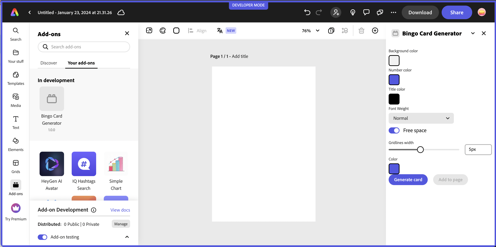

---
keywords:
  - Adobe Express
  - Express Add-on SDK
  - Express Document API
  - Document Model Sandbox
  - Adobe Express
  - Add-on SDK
  - SDK
  - JavaScript
  - Extend
  - Extensibility
  - API
title: Great UIs using Adobe's Spectrum Design System
description: This is an in-depth tutorial that will guide you in using Adobe's Spectrum Design System to help you build great UI's for your add-ons.
contributors:
  - https://github.com/hollyschinsky
---

# Lesson 1: Use Spectrum Web Components in a basic JavaScript add-on

Learn how to configure and use Spectrum Web Components in a basic JavaScript add-on.

## Introduction
There are a few open source Spectrum libraries available, but we specifically recommend using the [Spectrum Web Components](https://opensource.adobe.com/spectrum-web-components) library, as it offers a comprehensive set of UI components with built-in benefits for developers, including:

- Major timesaver due to the built-in styling
- A built-in Express theme
- Accessibility is built-in
- It's lightweight and performant
- Compliant with industry standards

## Steps

### Create and configure
1. Use the CLI to create a new add-on based on the basic `javascript` template:

    `npx @adobe/create-ccweb-add-on bingo-card-generator --template javascript`

    You could use the CDN URL's once again to get started quickly, but since you'll want to ensure your add-on projects are performant, you will learn how to configure your local add-on project to use the specific Spectrum Web Components you'll need, instead.

    Note, you could also clone the [the provided starter project](https://github.com/hollyschinsky/bingo-card-generator-starter/blob/master/webpack.config.js) and just follow along the next couple of steps where the base project is configured since it's done for you in the starter.

1. If you ran the project at this point (`npm run build; npm run start`), you would see just a basic button displayed in the UI, as shown below:

  

    However, since you're going to be implementing a whole new UI, go ahead and remove (or comment out) the existing lines related to the button:

    Open the `src/index.html` file and **remove the following lines** within the `<body>` block:

    ```html
    <div class="container">
        <button id="clickMe" disabled>Click me</button>
    </div>
    ```

    you should also **remove the associated CSS styles** from the `<style>` block since they are no longer needed:

    ```css
    .container {
        margin: 24px;
        display: flex;
        flex-direction: column;
    }

    button {
        background-color: rgb(82, 88, 228);
        border-color: rgb(82, 88, 228);
        border-radius: 16px;
        border-style: solid;
        color: rgb(255, 255, 255);
        font-family: sans-serif;
        height: 32px;
    }

    button:disabled {
        background-color: rgb(177, 177, 177);
        border-color: rgb(177, 177, 177);
    }

    button:not([disabled]):hover {
        background-color: rgb(64, 70, 202);
        cursor: pointer;
    }
    ```            

    Then open the `src/index.js` and **remove the following lines**, (ensuring you keep the `addOnUISdk.ready.then(() => {...}` block intact).

    ```js
        const clickMeButton = document.getElementById("clickMe");
        clickMeButton.addEventListener("click", () => {
            clickMeButton.innerHTML = "Clicked";
        });

        // Enable the button only when:
        // 1. `addOnUISdk` is ready, and
        // 2. `click` event listener is registered.
        clickMeButton.disabled = false;
    ```

1. Next, you're going to need to configure your new add-on project to use webpack, since it's required to bundle the Spectrum Web Components properly. This requires a webpack config file and some additional updates to your `package.json`:

    First, add a new file named `webpack.config.js` to the root of your add-on project and copy in the code from below (or, alternatively, copy it in from [the provided starter project](https://github.com/hollyschinsky/bingo-card-generator-starter/blob/master/webpack.config.js)):

    ```js
    const path = require("path");
    const HtmlWebpackPlugin = require("html-webpack-plugin");
    const CopyWebpackPlugin = require("copy-webpack-plugin");

    const isEnvProduction = process.env.NODE_ENV === "production";

    module.exports = {
        mode: isEnvProduction ? "production" : "development",
        devtool: isEnvProduction ? "source-map" : "eval-source-map",
        entry: "./src/index.js",
        experiments: {
            outputModule: true
        },
        output: {
            path: path.resolve(__dirname, "dist"),
            module: true,
            filename: "index.js"
        },
        externalsType: "module",
        externalsPresets: { web: true },
        plugins: [
            new HtmlWebpackPlugin({
                template: "src/index.html",
                scriptLoading: "module"
            }),
            new CopyWebpackPlugin({            
                patterns: [
                    { from: "src/*.json", to: "[name][ext]" },                
                    { from: "src/*.png", to: "[name][ext]", noErrorOnMissing: true },
                ],
            })
        ],
        module: {
            rules: [
                {
                    test: /\.(js)$/,
                    exclude: /node_modules/,
                    use: ["babel-loader"]
                },
                {
                    test: /(\.css)$/,
                    use: ["style-loader", "css-loader"]
                }
            ]
        },
        resolve: {
            extensions: [".js", ".css"]
        }
    };
    ```

    Now, update your `package.json` to configure it for webpack. This requires you to update the `scripts`(to ensure it's used with the CLI commands), and `devDependencies` objects with the following snippets (or optionally copy in the content from the provided starter project). **TODO check latest versions**

    ```json
     "scripts": {
        "clean": "ccweb-add-on-scripts clean",
        "build": "ccweb-add-on-scripts build --use webpack",
        "start": "ccweb-add-on-scripts start --use webpack",
        "package": "ccweb-add-on-scripts package --use webpack"
    }

    "devDependencies": {
        "@adobe/ccweb-add-on-scripts": "^1.2.1",
        "@adobe/ccweb-add-on-sdk-types": "^1.2.1",
        "@babel/core": "7.23.3",
        "@babel/preset-env": "7.23.3",
        "@babel/preset-react": "7.23.3",
        "babel-loader": "9.1.3",
        "copy-webpack-plugin": "11.0.0",
        "css-loader": "6.8.1",
        "html-webpack-plugin": "5.5.3",
        "style-loader": "3.3.3",
        "webpack": "5.89.0",
        "webpack-cli": "5.1.4"
    }
    ```

    **IMPORTANT:** You will need to run `npm install` now to ensure all of the new dependencies are installed.

### Theme setup

1. Install and use the [Spectrum Web Components `<sp-theme>` component](https://opensource.adobe.com/spectrum-web-components/tools/theme/), which includes the modules that provide the overall theme that will apply to all of the Spectrum Web Components in your UI. It also includes an Express theme that you'll want to use in your add-on project:

    `npm install @spectrum-web-components/theme`

    **Note:** if you prefer to use `yarn`, you could alternatively use the command: `yarn add @spectrum-web-components/theme`.

    Notice your new component is now included in the `package.json`. **TODO** is the installed version going to work or does it need to be manually fixed.

1. Now, open your `src/index.js` and import the specific theme and typography classes below for the Express theme, color and scale you'll want to support in your add-on:

    ```js
    import '@spectrum-web-components/styles/typography.css';
    import '@spectrum-web-components/theme/express/theme-light.js';
    // import '@spectrum-web-components/theme/express/theme-dark.js'; /* optional depending if you want to support a future dark theme */
    import '@spectrum-web-components/theme/express/scale-medium.js';
    // import '@spectrum-web-components/theme/express/scale-large.js'; /* optional unless you want to include future support for mobile for insance */
    import '@spectrum-web-components/theme/sp-theme.js';
    ```

1. You can now add the `<sp-theme>` tag to our UI, but note that you won't actually see anything visually yet, since there are no components for it to be applied to. Let's add it and configure it to use the following options:

    ```html
    <sp-theme scale="medium" color="light" theme="express">
    </sp-theme>
    ```

    **NOTE:** Express currently only supports a light theme, but support for a dark theme will be coming in the future, so you could add some code that listens for the [Add-on UI SDK's `themechange` event](https://developer.adobe.com/express/add-ons/docs/guides/develop/use_cases/) and apply the change to your UI with something like the following:

    ```js
    addOnUISdk.app.on("themechange", (data) => { 
        applyTheme(data.theme); 
    });
    ```

    Another important thing to note, is the existence of the following block in the starter template `index.js` file, which can be used to ensure the Add-on UI SDK has been fully initialized and is ready for use before trying to implement your UI. You may have noticed that the original button included in the UI was set to `disabled`, and is subsequently enabled in this block, as an example:

    ```js
    addOnUISdk.ready.then(() => {        
        // Enable the button only when:
        // 1. `addOnUISdk` is ready, and
        // 2. `click` event listener is registered.
        clickMeButton.disabled = false;
    }
    ```

    You will keep this pattern in your Bingo Card Generator add-on as well.

1. Next, you can start installing all of the Spectrum Web Components that will be used to build the UI of your Bingo Card Generator add-on. These components are installed in a similar fashion to how the `<sp-theme>` component was added, with an `npm install` or `yarn add` command. 

    ```bash
    npm install "@spectrum-web-components/theme" "@spectrum-web-components/button" "@spectrum-web-components/button-group" "@spectrum-web-components/field-label" "@spectrum-web-components/menu" "@spectrum-web-components/picker" "@spectrum-web-components/slider" "@spectrum-web-components/swatch" "@spectrum-web-components/switch"
    ```

    **TODO** Is this still an issue since the npm install will install v 0.40.3? If so - use the version in the install command (@0.39.4) recommend using the manual update **

    Alternatively, you could save time by copying and adding the set of components below into your `dependencies` block of your `package.json` file, and then run `npm install` to install them all at once:

    ```json
    "dependencies": {
        "@spectrum-web-components/button": "0.39.4",
        "@spectrum-web-components/button-group": "0.39.4",    
        "@spectrum-web-components/field-label": "0.39.4",
        "@spectrum-web-components/menu": "0.39.4",
        "@spectrum-web-components/picker": "0.39.4",
        "@spectrum-web-components/slider": "0.39.4",
        "@spectrum-web-components/swatch": "0.39.4",
        "@spectrum-web-components/switch": "0.39.4",            
        "@spectrum-web-components/theme": "0.39.4"        
    }
    ```

<InlineAlert slots="text" variant="warning"/>

**IMPORTANT!!!:** You must ensure the versions of all of your Spectrum Web Components installed are the same, or you will see errors upon build or while running.

    **TODO - NOTE YOU CAN'T RUN IT YET BECAUSE ALL DEPENDENCIES ARE OFF - need  imports to have the componets actually build into the bundle dist folder, so if you use in the UI it won't work (check dist and not enough stuff there)**

1. Add the imports for the new components to the `src/index.js` file with the following block:

    ```js
    import "@spectrum-web-components/button/sp-button.js";
    import "@spectrum-web-components/button-group/sp-button-group.js";
    import "@spectrum-web-components/field-label/sp-field-label.js";
    import '@spectrum-web-components/menu/sp-menu.js';
    import '@spectrum-web-components/menu/sp-menu-item.js';
    import "@spectrum-web-components/number-field/sp-number-field.js";
    import '@spectrum-web-components/picker/sp-picker.js';
    import "@spectrum-web-components/slider/sp-slider.js";
    import "@spectrum-web-components/swatch/sp-swatch.js";
    import '@spectrum-web-components/switch/sp-switch.js';
    ```

1. Next, open the `src/index.html` file and implement the code for the UI components used in the Bingo Card Generator by replacing your `<sp-theme>` block with the one below:

    ```html
    <sp-theme scale="medium" color="light" theme="express">                
        <div class="row gap-20"> 
            <div class="column">
                <sp-field-label for="bgColorSwatch" size="m">Background color</sp-field-label>
                <sp-swatch id="bgColorSwatch" class="color-well"></sp-swatch>
                <input type="color" id="bgColorPicker" style="display: none;"/>                    
            </div>
            <div class="column">
                <sp-field-label for="fgColorSwatch" size="m">Number color</sp-field-label>
                <sp-swatch id="fgColorSwatch" class="color-well"></sp-swatch>
                <input type="color" id="fgColorPicker" style="display: none;"/>                    
            </div>                                                           
            <div class="column">
                <sp-field-label for="titleColorSwatch" size="m">Title color</sp-field-label>
                <sp-swatch id="titleColorSwatch" class="color-well"></sp-swatch>
                <input type="color" id="titleColorPicker" style="display: none;">                    
            </div>                        
        </div>  
        <div class="row gap-20 margin-top-10">  
            <div class="column">
                <sp-field-label for="fontWeightPicker">Font Weight</sp-field-label>
                <sp-picker id="fontWeightPicker" size="m" value="normal">
                    <sp-menu-item value="normal">Normal</sp-menu-item>                        
                    <sp-menu-item value="bold">Bold</sp-menu-item>                            
                    <sp-menu-item value="lighter">Lighter</sp-menu-item>                
                </sp-picker>
            </div>     
            <div class="column gap-20">
                <sp-switch id="freeSpaceToggle" emphasized value="on" checked size="l">Free space</sp-switch>                               
            </div>                                                        
        </div>                   
        <div class="row gap-20">                    
            <sp-slider label="Gridlines width" id="gridlineSize" variant="filled" editable 
                hide-stepper min="1" max="10" value="5"
                format-options='{"style": "unit", "unit": "px"}' step="1">
            </sp-slider>
            <div class="column">
                <sp-field-label for="gridlinesColorSwatch" size="m">Color</sp-field-label>
                <sp-swatch id="gridlinesColorSwatch" class="color-well"></sp-swatch>
                <input type="color" id="gridlinesColorPicker" style="display: none;">                                            
            </div>
        </div> 
        <div class="margin-top-10">
            <sp-button-group horizontal>
                <sp-button id="generateBtn" disabled>Generate card</sp-button>
                <sp-button id="addBtn" variant="secondary" disabled>Add to page</sp-button>
            </sp-button-group>              
        </div>                
        <div class="margin-top-10">            
            <canvas id="finalCard"/>            
        </div>                            
    </sp-theme>
    ```
    
    Notice the properties for each, and use the [Spectrum Web Component documentation](https://opensource.adobe.com/spectrum-web-components) to help provide more context.

1. If you run your add-on project with the CLI at this point (`npm run build; npm run start`), you would notice that your UI layout is less than ideal, as shown below. 

    

    Even though the Spectrum Web Components themselves have styling applied, the layout of them does not. That's because the Spectrum Web Components library doesn't have any specific layout components. However, you can use Spectrum CSS variables to help you with that.

    In this step we will define some styles and selectors to improve the layout and general styling of your UI. You may have noticed there were already some classes set when you copied in the code block above, though they didn't apply yet, since you still need to add them, and will do in this step.

   Locating the `<style>` block in your `src/index.html`, and add the following CSS selectors and classes: **TODO** fix with final.

    ```css
    sp-theme {
        margin: 0 var(--spectrum-global-dimension-static-size-100);
        display: grid;
    }

    h2 {
        font-weight: var(--spectrum-global-font-weight-black);
    }
    
    sp-swatch {
        width: var(--spectrum-swatch-size-medium);                
    }

    sp-button {
        flex: 1;
        max-width: calc(
            (100% - var(--spectrum-global-dimension-static-size-250)) / 2
        );
    }

    sp-textfield,
    sp-picker {
        width: var(--spectrum-global-dimension-static-size-1700);
        display: flex;
    }

    sp-number-field {            
        width: 100%;
    }

    sp-button-group {
        margin-top: var(--spectrum-global-dimension-static-size-300);
        width: 100%;
        display: flex;
        justify-content: space-between;
    }
    
    sp-slider {
        width: 100%;                
        --spectrum-slider-font-size: var(--spectrum-font-size-100);
    } 

    sp-field-label {
        font-size: var(--spectrum-global-dimension-font-size-100);        
    }

    .color-well {
        cursor: pointer;
        --mod-swatch-border-thickness: var(--spectrum-divider-thickness-small);
        --mod-swatch-border-color: var(--spectrum-transparent-black-500);
    }

    .row {
        display: flex;
        flex-direction: row;
        justify-content: space-between;
        width: 100%;
        align-items: flex-end;
    }

    .column {
        display: flex;
        flex-direction: column;        
    }

    .gap-20 {
        gap: var(--spectrum-global-dimension-static-size-250); 
    }

    .margin-top-10 {
        margin-top: var(--spectrum-global-dimension-static-size-125); 
    }

    #finalCard {
        width: 290px;       
    } 
    ```

1. Once you are happy with your UI, you can start implementing the logic for actually generating the bingo card. Since this is not the focus of this tutorial, we will not cover it in-depth, instead, the following code snippet is provided with comments for you to replace in your `src/index.js` file:

    **TODO**
