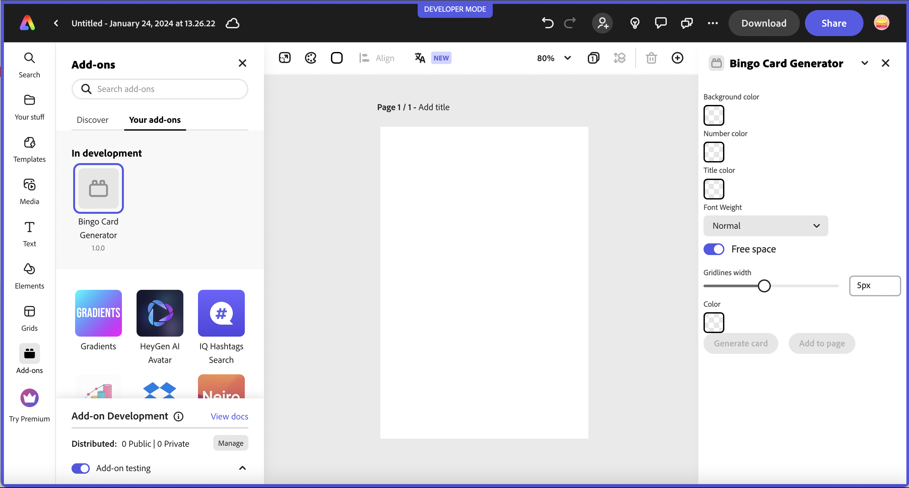
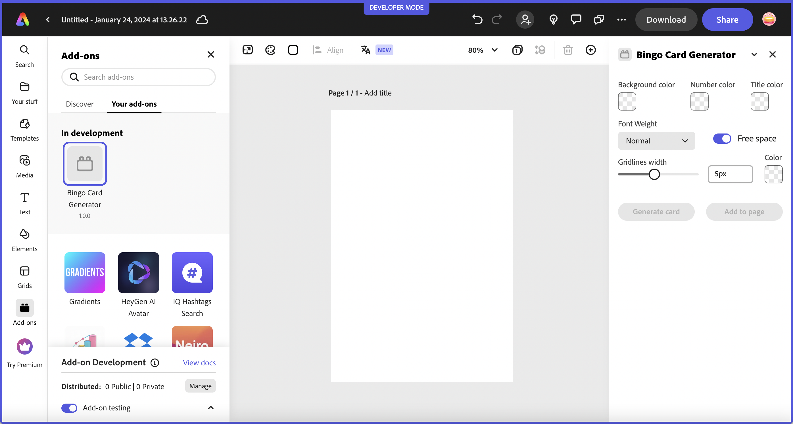

---
keywords:
  - Adobe Express
  - Express Add-on SDK
  - Express Document API
  - Document Model Sandbox
  - Adobe Express
  - Add-on SDK
  - SDK
  - JavaScript
  - Extend
  - Extensibility
  - API
title: Great UIs using Adobe's Spectrum Design System
description: This is an in-depth tutorial that will guide you in using Adobe's Spectrum Design System to help you build great UI's for your add-ons.
contributors:
  - https://github.com/hollyschinsky
---

# Lesson 1: Use Spectrum Web Components in a basic JavaScript add-on

Configure and use Spectrum Web Components in a basic JavaScript add-on.

## Introduction
There are a few open source Spectrum libraries available, but we specifically recommend using the [Spectrum Web Components](https://opensource.adobe.com/spectrum-web-components) library, as it offers a comprehensive set of UI components with built-in benefits for developers, including:

- A built-in Express theme
- Accessibility
- Lightweight and performant
- Time savings due to the built-in styling
- Compliant with industry standards

## Steps

### Create and configure your add-on

Use the CLI to create a new add-on based on the basic `javascript` template:

```js
npx @adobe/create-ccweb-add-on bingo-card-generator-js --template javascript
```

<InlineAlert slots="text" variant="warning"/>

If you've used the CLI prior to this, you may want to run this command to ensure you have the most up-to-date version before creating your project --> `npx clear-npx-cache`

**NOTE:** You could use the CDN URL's once again to get started quickly, but since you'll want to ensure your add-on projects are performant, you will learn how to configure your local add-on project to use the specific Spectrum Web Components you'll need, instead.

If you run the project at this point (`npm run build; npm run start`), you will see a basic button displayed in the UI with custom CSS set to style it for Express, as shown below:


However, since you're going to be implementing a whole new UI, go ahead and remove the existing lines related to the button:

Open the `src/index.html` file and **remove the following lines** within the `<body>` block:

```html
<div class="container">
    <button id="clickMe" disabled>Click me</button>
</div>
```

you should also **remove the associated CSS styles** from the `<style>` block since they are no longer needed:

```css
.container {
    margin: 24px;
    display: flex;
    flex-direction: column;
}

button {
    background-color: rgb(82, 88, 228);
    border-color: rgb(82, 88, 228);
    border-radius: 16px;
    border-style: solid;
    color: rgb(255, 255, 255);
    font-family: sans-serif;
    height: 32px;
}

button:disabled {
    background-color: rgb(177, 177, 177);
    border-color: rgb(177, 177, 177);
}

button:not([disabled]):hover {
    background-color: rgb(64, 70, 202);
    cursor: pointer;
}
```            

Then, open the `src/index.js` and **remove the following lines**, (ensuring you keep the `addOnUISdk.ready.then(() => {...}` block intact).

```js
    const clickMeButton = document.getElementById("clickMe");
    clickMeButton.addEventListener("click", () => {
        clickMeButton.innerHTML = "Clicked";
    });

    // Enable the button only when:
    // 1. `addOnUISdk` is ready, and
    // 2. `click` event listener is registered.
    clickMeButton.disabled = false;
```

Next, you're going to need to configure your new add-on project to use webpack, since it's required to bundle the Spectrum Web Components properly. This requires a `webpack.config.js` file and some additional updates to your `package.json`:

1. First, create a new file named `webpack.config.js` in **the root** of your add-on project, (outside the `src`), and copy in the code block below (or, alternatively, copy it in from [the provided project](https://github.com/hollyschinsky/bingo-card-generator-starter/blob/master/webpack.config.js)):

    ```js
    const path = require("path");
    const HtmlWebpackPlugin = require("html-webpack-plugin");
    const CopyWebpackPlugin = require("copy-webpack-plugin");

    const isEnvProduction = process.env.NODE_ENV === "production";

    module.exports = {
        mode: isEnvProduction ? "production" : "development",
        devtool: isEnvProduction ? "source-map" : "eval-source-map",
        entry: "./src/index.js",
        experiments: {
            outputModule: true
        },
        output: {
            path: path.resolve(__dirname, "dist"),
            module: true,
            filename: "index.js"
        },
        externalsType: "module",
        externalsPresets: { web: true },
        plugins: [
            new HtmlWebpackPlugin({
                template: "src/index.html",
                scriptLoading: "module"
            }),
            new CopyWebpackPlugin({            
                patterns: [
                    { from: "src/*.json", to: "[name][ext]" },                
                    { from: "src/*.png", to: "[name][ext]", noErrorOnMissing: true },
                ],
            })
        ],
        module: {
            rules: [
                {
                    test: /\.(js)$/,
                    exclude: /node_modules/,
                    use: ["babel-loader"]
                },
                {
                    test: /(\.css)$/,
                    use: ["style-loader", "css-loader"]
                }
            ]
        },
        resolve: {
            extensions: [".js", ".css"]
        }
    };
    ```

    Now, update your `package.json` to configure it for webpack. This requires an update to the `scripts` block to ensure webpack is used with the CLI script commands:

    ```json
     "scripts": {
        "clean": "ccweb-add-on-scripts clean",
        "build": "ccweb-add-on-scripts build --use webpack",
        "start": "ccweb-add-on-scripts start --use webpack",
        "package": "ccweb-add-on-scripts package --use webpack"
    }
    ```

    It will also require you to update your `devDependencies` block with the following:

    ```json
    "devDependencies": {
        "@adobe/ccweb-add-on-scripts": "^1.2.1",
        "@adobe/ccweb-add-on-sdk-types": "^1.2.1",
        "@babel/core": "7.23.3",
        "@babel/preset-env": "7.23.3",
        "@babel/preset-react": "7.23.3",
        "babel-loader": "9.1.3",
        "copy-webpack-plugin": "11.0.0",
        "css-loader": "6.8.1",
        "html-webpack-plugin": "5.5.3",
        "style-loader": "3.3.3",
        "webpack": "5.89.0",
        "webpack-cli": "5.1.4"
    }
    ```

    **IMPORTANT:** You will need to run `npm install` to ensure all of the new dependencies are installed.

### Set up the Express theme

1. Install and use the [Spectrum Web Components `<sp-theme>` component](https://opensource.adobe.com/spectrum-web-components/tools/theme/), which includes the modules that provide the overall theme for the Spectrum Web Components in your UI. 

    `npm install @spectrum-web-components/theme@0.39.4`

    **Note:** if you prefer to use `yarn`, you could alternatively use the command: `yarn add @spectrum-web-components/theme@0.39.4`.

    Notice your new component is now included in the `package.json`.

1. Now, open your `src/index.js` and import the specific theme and typography classes below for the Express theme, color and scale you'll want to support in your add-on:

    ```js
    /* Theme and typography imports */
    import '@spectrum-web-components/styles/typography.css';
    import '@spectrum-web-components/theme/express/theme-light.js';
    import '@spectrum-web-components/theme/express/scale-medium.js';
    import '@spectrum-web-components/theme/sp-theme.js';    
    ```

    Optionally, note these theme-related imports to consider if you plan to include support for a future "dark" theme or "large" scale when add-ons are supported on mobile:

    ```js
    // import '@spectrum-web-components/theme/express/theme-dark.js'; /* to support a future dark theme */    
    // import '@spectrum-web-components/theme/express/scale-large.js'; /* future support for mobile for insance */
    ```
    
    **Note:** The `typography.css` import is not required, but is useful to note for using Spectrum CSS variables to help style the typography components of your add-ons, and to provide margins.

1. You can now add the `<sp-theme>` tag to your UI, but note that **you won't actually see anything visually yet**, since there are no components for it to be applied to. Open your `src/index.html` file, and add the following theme component into the `<body>` tags, configured with a `medium` scale, `light` color and `express` theme:

    ```html
    <sp-theme scale="medium" color="light" theme="express">
        <!-- UI content will go here -->
    </sp-theme>
    ```

    **NOTE:** Express currently only supports a light theme, but support for a dark theme will be coming in the future, so you could add some code that listens for the [Add-on UI SDK's `themechange` event](https://developer.adobe.com/express/add-ons/docs/guides/develop/use_cases/) and apply the change to your UI with something like the following:

    ```js
    addOnUISdk.app.on("themechange", (data) => { 
        applyTheme(data.theme); 
    });
    ```

    Another important thing to note, is the existence of the following block in the starter template `src/index.js` file, which can be used to ensure the Add-on UI SDK has been fully initialized and is ready for use before trying to implement your UI. You may have also noticed that the original button in the UI was set to `disabled`, and is subsequently enabled in this block:

    ```js
    addOnUISdk.ready.then(() => {        
        // Enable the button only when:
        // 1. `addOnUISdk` is ready, and
        // 2. `click` event listener is registered.
        clickMeButton.disabled = false;
    }
    ```

    Keep note of this pattern as you develop your own add-ons.

### Install Spectrum Web Components

Now you can start installing all of the Spectrum Web Components that will be used to build the UI of your add-on. These components are installed in a similar fashion to how the `<sp-theme>` component was added, with an `npm install` or `yarn add` command. 

```bash
npm install @spectrum-web-components/button@0.39.4 @spectrum-web-components/button-group@0.39.4 @spectrum-web-components/field-label@0.39.4 @spectrum-web-components/menu@0.39.4 @spectrum-web-components/picker@0.39.4 @spectrum-web-components/slider@0.39.4 @spectrum-web-components/swatch@0.39.4 @spectrum-web-components/switch@0.39.4
```

**NOTE:** The above command specifies the `0.39.4` version specifically, due to an issue found with compatibility using the latest default version `0.40.3` as of this writing.

Alternatively, you could also copy in the following block below to the `dependencies` block of your `package.json` file, and then run `npm install` to install them all at once:

```json
"dependencies": {
    "@spectrum-web-components/button": "0.39.4",
    "@spectrum-web-components/button-group": "0.39.4",    
    "@spectrum-web-components/field-label": "0.39.4",
    "@spectrum-web-components/menu": "0.39.4",
    "@spectrum-web-components/picker": "0.39.4",
    "@spectrum-web-components/slider": "0.39.4",
    "@spectrum-web-components/swatch": "0.39.4",
    "@spectrum-web-components/switch": "0.39.4",            
    "@spectrum-web-components/theme": "0.39.4"        
}
```

<InlineAlert slots="text" variant="warning"/>

**IMPORTANT:** You must ensure **the versions of all of your Spectrum Web Components installed are the same,** or you will see errors upon build or while running. You may want to just open your `package.json` file at this point to double check to ensure they all match, before moving on.

### Import Spectrum Web Components

Add the following list of imports for the new components into your `src/index.js` file with the following block:

```js
import "@spectrum-web-components/button/sp-button.js";
import "@spectrum-web-components/button-group/sp-button-group.js";
import "@spectrum-web-components/field-label/sp-field-label.js";
import '@spectrum-web-components/menu/sp-menu.js';
import '@spectrum-web-components/menu/sp-menu-item.js';
import "@spectrum-web-components/number-field/sp-number-field.js";
import '@spectrum-web-components/picker/sp-picker.js';
import "@spectrum-web-components/slider/sp-slider.js";
import "@spectrum-web-components/swatch/sp-swatch.js";
import '@spectrum-web-components/switch/sp-switch.js';
```

### Build UI with Spectrum Web Components

Next, open the `src/index.html` file and implement the code for the UI components needed within the opening and closing `<sp-theme>` block, as provided below:

```html
<sp-theme scale="medium" color="light" theme="express">                
    <div class="row gap-20"> 
        <div class="column">
            <sp-field-label for="bgColorSwatch" size="m">Background color</sp-field-label>
            <sp-swatch id="bgColorSwatch" class="color-well"></sp-swatch>
            <input type="color" id="bgColorPicker" style="display: none;"/>                    
        </div>
        <div class="column">
            <sp-field-label for="fgColorSwatch" size="m">Number color</sp-field-label>
            <sp-swatch id="fgColorSwatch" class="color-well"></sp-swatch>
            <input type="color" id="fgColorPicker" style="display: none;"/>                    
        </div>                                                           
        <div class="column">
            <sp-field-label for="titleColorSwatch" size="m">Title color</sp-field-label>
            <sp-swatch id="titleColorSwatch" class="color-well"></sp-swatch>
            <input type="color" id="titleColorPicker" style="display: none;">                    
        </div>                        
    </div>  
    <div class="row gap-20 margin-top-10">  
        <div class="column">
            <sp-field-label for="fontWeightPicker">Font Weight</sp-field-label>
            <sp-picker id="fontWeightPicker" size="m" value="normal">
                <sp-menu-item value="normal">Normal</sp-menu-item>                        
                <sp-menu-item value="bold">Bold</sp-menu-item>                            
                <sp-menu-item value="lighter">Lighter</sp-menu-item>                
            </sp-picker>
        </div>     
        <div class="column gap-20">
            <sp-switch id="freeSpaceToggle" emphasized value="on" checked size="l">Free space</sp-switch>                               
        </div>                                                        
    </div>                   
    <div class="row gap-20">                    
        <sp-slider label="Gridlines width" id="gridlineSize" variant="filled" editable 
            hide-stepper min="1" max="10" value="5"
            format-options='{"style": "unit", "unit": "px"}' step="1">
        </sp-slider>
        <div class="column">
            <sp-field-label for="gridlinesColorSwatch" size="m">Color</sp-field-label>
            <sp-swatch id="gridlinesColorSwatch" class="color-well"></sp-swatch>
            <input type="color" id="gridlinesColorPicker" style="display: none;">                                            
        </div>
    </div> 
    <div class="margin-top-10">
        <sp-button-group horizontal>
            <sp-button id="generateBtn" disabled>Generate card</sp-button>
            <sp-button id="addBtn" variant="secondary" disabled>Add to page</sp-button>
        </sp-button-group>              
    </div>                
    <div class="margin-top-10">            
        <canvas id="finalCard"/>            
    </div>                            
</sp-theme>
```

Note the properties for each, and use the [Spectrum Web Component documentation](https://opensource.adobe.com/spectrum-web-components) to help cross-reference them for more context.

Worth mentioning, are the details around the use of the `<sp-swatch>` components, which are coupled with a hidden native `<input>` component to allow the user to pick their colors. Though SWC features a variety of color-related components (Color Area, Color Handle, Color Loupe, Color Slider), there is not an actual picker, so this add-on implements it via an `<sp-swatch>` for the UI and a hidden native `<input>` element behind it.
    
The `<sp-swatch>` click handler programmatically triggers the `<input>` click, which, although hidden, can still display the browser's native color picker. On input (i.e., when the user selects a different color within the picker), the `color` attribute of the `<sp-swatch>` updates as the color is changed to them in sync. 

Also, be sure to check out [Adobe's UX Guidelines](https://xd.adobe.com/view/urn:aaid:sc:US:fd638450-1af8-49c3-ad29-0e76c2a2136f/) as many of these components are included with specific guidelines, including:

`<sp-number-field>` for the gridsize value
`<sp-slider>` for the gridsize picker
`<sp-swatch>` for the color pickers
`<sp-button-group>` and `<sp-button>` for the CTA buttons.

### Style your UI

If you run your add-on project with the CLI at this point (`npm run build; npm run start`), you will notice that your UI layout is less than ideal, as shown below:



Even though the Spectrum Web Components themselves have styling applied, the layout of them does not. That's because the Spectrum Web Components library doesn't include any specific layout components. However, you can use Spectrum CSS variables to help you with that.

In this step you will define some styles and selectors to improve the layout and general styling of your UI. You may have noticed there were already some classes set when you copied in the code block above, but since they don't actually apply yet, you'll eed to define them in this step.

Locate the `<style>` block in your `src/index.html`, and add the following CSS selectors and classes:

```css
sp-theme {
    margin: 0 var(--spectrum-global-dimension-static-size-100);
    display: grid;
}

h2 {
    font-weight: var(--spectrum-global-font-weight-black);
}

sp-swatch {
    width: var(--spectrum-swatch-size-medium);                
}

sp-button {
    flex: 1;
    max-width: calc(
        (100% - var(--spectrum-global-dimension-static-size-250)) / 2
    );
}

sp-textfield,
sp-picker {
    width: var(--spectrum-global-dimension-static-size-1700);
    display: flex;
}

sp-number-field {            
    width: 100%;
}

sp-button-group {
    margin-top: var(--spectrum-global-dimension-static-size-300);
    width: 100%;
    display: flex;
    justify-content: space-between;
}

sp-slider {
    width: 100%;                
    --spectrum-slider-font-size: var(--spectrum-font-size-100);
} 

sp-field-label {
    font-size: var(--spectrum-global-dimension-font-size-100);        
}

.color-well {
    cursor: pointer;
    --mod-swatch-border-thickness: var(--spectrum-divider-thickness-small);
    --mod-swatch-border-color: var(--spectrum-transparent-black-500);
}

.row {
    display: flex;
    flex-direction: row;
    justify-content: space-between;
    width: 100%;
    align-items: flex-end;
}

.column {
    display: flex;
    flex-direction: column;        
}

.gap-20 {
    gap: var(--spectrum-global-dimension-static-size-250); 
}

.margin-top-10 {
    margin-top: var(--spectrum-global-dimension-static-size-125); 
}

#bingoCanvas {
    width: 290px;       
} 
```

**TIP:** You can locate the custom global variables avaiable for use to adjust your UI as desired in the `/node_modules/@spectrum-web-components/styles/express/spectrum-core-global.css` of your project.

If you kept your add-on running in Express after the changes in the steps above, it should automatically refresh and you can view the updates. It should look something like this screenshot below:



### Wire UI code and add canvas drawing logic

After completing the above, you will see that many of the components aren't active yet, since there's currently no associated logic applied to set values or enable the buttons. First, continue adjusting the layout as needed, then, once you're happy with it, you can start implementing the logic to set some default values for the components and enable the **Generate card** button to allow the user to generate their customized bingo card. Open your `src/index.js` and copy in the following code snippet after your imports, replacing the `addOnUISdk.ready.then(() => {`  callback since it's included below.

```js
// Wait for the SDK to be ready
addOnUISdk.ready.then(() => {        
    console.log("addOnUISdk is ready for use.");    
    
    // Refs to the <sp-swatch> and <input> elements for each color
    const gridlinesColorSwatch = document.getElementById("gridlinesColorSwatch");
    const gridlinesColorPicker = document.getElementById("gridlinesColorPicker");
    
    const bgColorSwatch = document.getElementById("bgColorSwatch");        
    const bgColorPicker = document.getElementById("bgColorPicker");
    
    const fgColorSwatch = document.getElementById("fgColorSwatch");
    const fgColorPicker = document.getElementById("fgColorPicker");

    const titleColorSwatch = document.getElementById("titleColorSwatch");
    const titleColorPicker = document.getElementById("titleColorPicker");
    
    // Initialize colors for the above
    gridlinesColorPicker.value = "#5258e5"; // gridline color   
    gridlinesColorSwatch.color = "#5258e5"; // gridline color   
    bgColorPicker.value = "#f2f2f2";        // box background color
    bgColorSwatch.color = "#f2f2f2";        // box background color
    fgColorPicker.value = "#5258e5";        // bingo number color
    fgColorSwatch.color = "#5258e5";        // bingo number color
    titleColorPicker.value = "#000000";     // title color
    titleColorSwatch.color = "#000000";     // title color
  
    // Trigger click on the native color pickers for each
    gridlinesColorSwatch.addEventListener("click", function () {
        gridlinesColorPicker.click();
    });
  
    gridlinesColorPicker.addEventListener("input", function (event) {
      const selectedColor = event.target.value;
      gridlinesColorSwatch.setAttribute("color", selectedColor);
    });

    fgColorSwatch.addEventListener("click", function () {
        fgColorPicker.click();
    });

    fgColorPicker.addEventListener("input", function (event) {
        const selectedColor = event.target.value;
        fgColorSwatch.setAttribute("color", selectedColor);
    });
  
    bgColorSwatch.addEventListener("click", function () {
      bgColorPicker.click();
    });
  
    bgColorPicker.addEventListener("input", function (event) {
      const selectedColor = event.target.value;
      bgColorSwatch.setAttribute("color", selectedColor);
    });
  
    titleColorSwatch.addEventListener("click", function () {
        titleColorPicker.click();
    });
  
    titleColorPicker.addEventListener("input", function (event) {
      const selectedColor = event.target.value;
      titleColorSwatch.setAttribute("color", selectedColor);
    });
  
    // CTA button references
    const generateBtn = document.getElementById("generateBtn");  
    const addBtn = document.getElementById("addBtn");  
  
    // Generate button handler
    generateBtn.onclick = async (event) => {                    
      generateBingoCard();        
    };
  
    /* Enable the generate button now that the SDK is ready and the button event handler has been registered. The add to page button should only be enabled once a card has been generated. */
    generateBtn.disabled = false;        
});

// Function to generate the bingo card using an HTML canvas and drawing context 
function generateBingoCard() {
    const canvas = document.getElementById("finalCard");
    const ctx = canvas.getContext("2d");

    // Set canvas width and height
    canvas.width = 300;
    canvas.height = 360;

    // Set grid properties    
    let gridlineSize = document.getElementById("gridlineSize").value;        
    const numRows = 6;
    const numCols = 5;
    const cellWidth = 60;
    const cellHeight = 60;
    
    // Draw background rects with user selected color
    ctx.fillStyle = bgColorPicker.value; 
    for (let x = gridlineSize/2; x <= canvas.width; x += cellWidth-gridlineSize) {            
        for (let y = gridlineSize/2; y <= canvas.height; y += cellHeight-gridlineSize) {
            ctx.fillRect(x, y, cellWidth-gridlineSize, cellHeight-gridlineSize);                
        }
    } 
    
    // Draw gridlines
    ctx.lineWidth = gridlineSize;
    for (let i = 0; i <= numCols; i++) {        
        // Need to adjust for left/right gridlines size           
        ctx.moveTo(gridlineSize/2, 0);
        ctx.lineTo(gridlineSize/2, canvas.height);      

        ctx.moveTo(i * cellWidth-gridlineSize/2, 0);
        ctx.lineTo(i * cellWidth-gridlineSize/2, canvas.height);        
    }

    for (let i = 0; i <= numRows; i++) { 
        // Need to adjust for top/bottom gridlines size               
        ctx.moveTo(0, gridlineSize/2);
        ctx.lineTo(canvas.height, gridlineSize/2,);            
    
        ctx.moveTo(0, i * cellWidth-gridlineSize/2);
        ctx.lineTo(canvas.height, i * cellWidth-gridlineSize/2);                    
    }
    
    ctx.strokeStyle = gridlinesColorPicker.value;        
    ctx.stroke();
    
    // Draw bingo title
    ctx.font = fontWeightPicker.value +' 28px adobe clean';    
    ctx.textAlign = "center";
    ctx.textBaseline = 'middle'; 
    ctx.fillStyle = titleColorPicker.value; //font color                        
    let bingoTitle = ['B','I','N','G','O'];
    for (let charCnt = 0; charCnt < bingoTitle.length; charCnt++) {
        let letter = bingoTitle[charCnt];
        ctx.fillText(letter, charCnt * cellWidth + cellWidth / 2 - 4, cellHeight / 2 + 8);    
    }       
    
    // Generate random numbers
    const freeSpace = [3, 2]; // Coordinates of the FREE space
    const numbers = [];
    const usedNumbers = new Set(); // Track used numbers
    ctx.font = fontWeightPicker.value +' 22px adobe clean';
    ctx.fillStyle = fgColorPicker.value; // color of the numbers 
    ctx.textAlign = "center";
    const freeSpaceToggle = document.getElementById("freeSpaceToggle");
    
    for (let i = 1; i < numRows; i++) {
        numbers[i] = [];
        for (let j = 0; j < numCols; j++) {
            if (freeSpaceToggle.checked) {
                if (i === freeSpace[0] && j === freeSpace[1]) {
                    numbers[i][j] = "FREE";
                    continue; // Skip the FREE space
                }
            }
            let num;
            do {
                num = Math.floor(Math.random() * 15) + 1 + (j * 15);
            } while (usedNumbers.has(num)); // Generate unique numbers

            usedNumbers.add(num);
            numbers[i][j] = num;        
            ctx.fillText(num, j * cellWidth + cellWidth / 2 - 3, i * cellHeight + cellHeight / 2 + 3);
        }
    }

    // Draw "FREE" if the toggle is checked
    if (freeSpaceToggle.checked) {
        ctx.font = fontWeightPicker.value +' 20px adobe clean';     
        ctx.fillText("FREE", freeSpace[1] * cellWidth + cellWidth / 2 - 3, freeSpace[0] * cellHeight + cellHeight / 2 + 3);   
        ctx.drawImage(canvas, 0, 0);
    }    

    // Enable drag and drop for the card
    addOnUISdk.app.enableDragToDocument(canvas, {
        previewCallback: el => new URL(canvas.toDataURL()),
        completionCallback: async el => {
            const r = await fetch(canvas.toDataURL());
            const blob = await r.blob();
            return [{blob}];
        }
    })    
            
    // Add button click handler
    addBtn.onclick = async () => {      
        const r = await fetch(canvas.toDataURL());
        const blob = await r.blob();    
        addOnUISdk.app.document.addImage(blob);  
    }

    // Enable the add to page button    
    addBtn.disabled = false;
}
```

Once you've updated your code, your add-on should reload and you can generate a custom bingo card! Try playing with some settings and see how they render in a new card. You can also try to drag your card to the page, or add it with the add button etc. If your add-on didn't pick up the changes for any reason, you can always use the [add-on developer tools](https://opensource.adobe.com/spectrum-web-components/using-swc-react/) to do a refresh, or simply run `npm run build; npm run start` again. 


If you have any trouble, or don't see what you expect, see the [Troubleshooting section](./part3.md#troubleshooting-faq) of this tutorial for help. In the next lesson, we'll learn how to build the same add-on with a React and [**swc-react**](https://opensource.adobe.com/spectrum-web-components/using-swc-react/), Spectrum Web Component wrappers for React.
