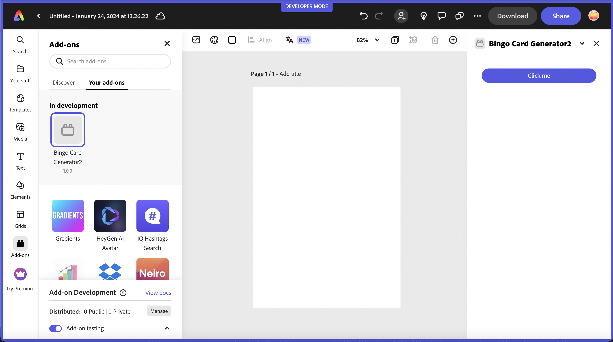
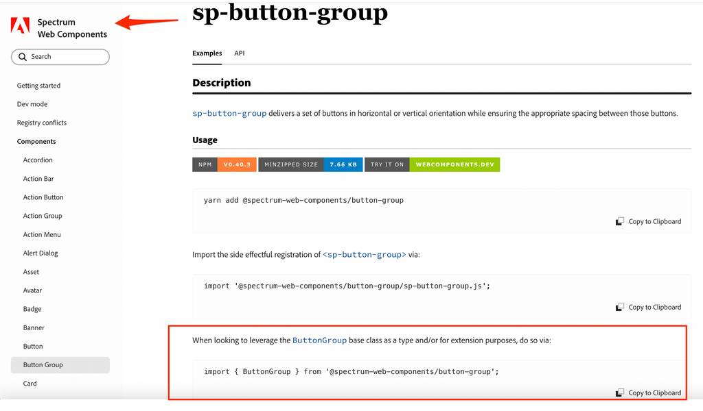

---
keywords:
  - Adobe Express
  - Express Add-on SDK
  - Express Document API
  - Document Model Sandbox
  - Adobe Express
  - Add-on SDK
  - SDK
  - JavaScript
  - Extend
  - Extensibility
  - API
title: Great UIs using Adobe's Spectrum Design System
description: This is an in-depth tutorial that will guide you in using Adobe's Spectrum Design System to help you build great UI's for your add-ons.
contributors:
  - https://github.com/hollyschinsky
---

# Lesson 2: Use Spectrum Web Components in a React-based add-on

Learn how to configure and use Spectrum Web Components in a basic JavaScript add-on.

## Introduction

In this lesson, you will implement the bingo card generator add-on in a React-based project with [`swc-react`](https://opensource.adobe.com/spectrum-web-components/using-swc-react/). `swc-react` is a collection of wrapper components designed to make Spectrum Web Components (SWC) work like native React components in a React application. They serve as a bridge between React and Spectrum Web Components, and their properties and event names are directly derived from their corresponding SWC components. As such, the corresponding [Spectrum Web Components documentation](https://opensource.adobe.com/spectrum-web-components/) can be used as the documentation reference for usage.

<InlineAlert slots="text" variant="info"/>

We recommend using **swc-react** over **React Spectrum** currently due to the fact that Spectrum Web Components provides a more extensive set of components with an explicit Express theme that is continuously updated. React Spectrum’s Express theme is in alpha and lacks full-support and is currently not being updated. Note, however, that a new version of Spectrum will be released this year, and an update to the React Spectrum libraries will follow, but the timeline remains to be determined, so we recommend using swc-react until then.

## Steps

### Create and configure

1. Create a new project with the CLI based on the basic `react-javascript` template:

    `npx @adobe/create-ccweb-add-on bingo-card-generator-react --template react-javascript`

1. Open the project in your favorite code editor and navigate to the `src/components/App.jsx` file. Notice that it's preconfigured with the `@swc-react/theme` and `@swc-react/button` packages and associated imports, with a basic usage. If you run the project at this point, you should see the button show up in your add-on:

    

    Take a moment to get familiar with what's included in the starter project in general before moving on.

1. Next, start installing the UI components to your new add-on project for use. These components are installed in a similar fashion to how you installed the Spectrum Web Components to lesson 1, via `npm install` or `yarn add`, with just a change to the package prefix (from `@spectrum-web-components` to `@swc-react`). Remember, the **@swc-react/button** and **@swc-react/theme** components were already included in the project generated by the template, so you can skip those.

    ```bash
    npm install "@swc-react/button-group" "@swc-react/field-label" "@swc-react/menu" "@swc-react/picker" "@swc-react/slider" "@swc-react/swatch" "@swc-react/switch"
    ```

    Alternatively, you could save time by replacing your `dependencies` block in your `package.json` file with the following, and then run `npm install` to install them all at once:

    ```json
    "dependencies": {
            "@swc-react/button": "0.39.4",
            "@swc-react/button-group": "0.39.4",        
            "@swc-react/field-label": "0.39.4",
            "@swc-react/menu": "0.39.4",
            "@swc-react/picker": "0.39.4",
            "@swc-react/slider": "0.39.4",
            "@swc-react/swatch": "0.39.4",
            "@swc-react/switch": "0.39.4",        
            "@swc-react/theme": "0.39.4",
            "react": "18.2.0",
            "react-dom": "18.2.0"
    },    
    ```

1. Now, add the imports for the components needed into the `src/components/App.jsx` file. The pattern of the imports will follow in a similar manner to what was included in the generated project for `Button` and `Theme`, and you can locate the exact name to use by checking the [Spectrum Web Components Reference](https://opensource.adobe.com/spectrum-web-components/) for the corresponding component name, in the "Usage" section. So, for instance, the first import needed is for a Button Group component. If we look at the [corresponding reference for Spectrum Web Components - Button Group](https://opensource.adobe.com/spectrum-web-components/components/button-group/#usage), the last import shows how to use it as the base class, with `import { ButtonGroup } from '@spectrum-web-components/button-group';`. It's outlined in the image below as well for visual reference:

          
 
 You can copy that import from the reference for any given component you want to use and just change the prefix from `@spectrum-web-components` to `@swc-react`. (Note, again the existing imports for Button and Theme as a guide). So the resulting import to use in your add-on would be:
 
    `import { ButtonGroup } from '@swc-react/button-group';`. 
 
 You can then use this same pattern for all of the `@swc-react` wrapper components you want to use.
 
 The imports needed for the Bingo Card Generator are also listed below for you to copy in quickly:

    ```js
    import { ButtonGroup } from '@swc-react/button-group';
    import { FieldLabel } from '@swc-react/field-label';
    import { MenuItem } from '@swc-react/menu';
    import { Picker } from '@swc-react/picker';
    import { Slider } from '@swc-react/slider';
    import { Swatch } from '@swc-react/swatch';
    import { Switch } from "@swc-react/switch";
    ```

1. In this next step, we need to create a new class to handle a known issue where React events and web components don't always work well together.  See [this issue for more details](https://github.com/facebook/react/issues/19846). The issue is most often seen in the case of the React `onChange` event, and the events won't properly fire. An option to work around this is to create a helper class that will automatically register the native browser version of the events for the components to ensure they are properly fired. 

  Create this new helper class in your `src/components` folder, name it `WC.jsx` and copy in the block of code below. **Note:** this class is also included in the [lesson 2 starter project](**TODO**) if you want to copy it in from there instead.

    ```js
    import React from "react";

    export class WC extends React.Component {
        constructor(props) {
            super(props);
            this.el = React.createRef();
            this.handleEvent = this.handleEvent.bind(this);
        }

        handleEvent(evt) {
            const propName = `on${evt.type[0].toUpperCase()}${evt.type.substr(1)}`;
            if (this.props[propName]) {
                this.props[propName].call(evt.target, evt);
            }
        }

        componentDidMount() {
            const el = this.el.current;
            const eventProps = Object.entries(this.props).filter(([k,v]) => k.startsWith("on"));
            eventProps.forEach(([k,v]) => el.addEventListener(k.substr(2).toLowerCase(), this.handleEvent));
        }

        componentWillUnmount() {
            const el = this.el.current;
            const eventProps = Object.entries(this.props).filter(([k,v]) => k.startsWith("on"));
            eventProps.forEach(([k,v]) => el.removeEventListener(k.substr(2).toLowerCase(), this.handleEvent));
        }

        render() {
            const filteredProps = Object.fromEntries(Object.entries(this.props).filter(([k,v]) => !k.startsWith("on")));
            return <div ref={this.el} {...filteredProps}>{this.props.children}</div>
        }
    }
    ```

1. Now, go back into your `src/components/App.jsx` and import your new helper class:

    `import { WC } from "./WC.jsx";`

1. At this point you are ready to start using the `swc-react` components. We'll also wrap them with the `<WC>` helper class as needed to handle events. 

  The easiest and quickest way to do this would be to replace the current `<Theme>` block with the following block:

    ```html
    <Theme theme="express" scale="medium" color="light">                    
        <div>                
            <div className="row gap-20"> 
                <div className="column">
                    <FieldLabel for="fontColorSwatch" size="m">Number color</FieldLabel>
                    <WC onChange={onFontColorClick}>
                        <Swatch id="fontColorSwatch" className="color-well" color={fontColorSwatch}></Swatch>
                    </WC>
                    <input ref={fontColorInput} type="color" id="fontColor" style={{display: "none"}}
                        value={fontColor} onChange={onFontColorChange}
                    />                        
                </div>                                       
                <div className="column">
                    <FieldLabel for="bgColorSwatch" size="m">Background</FieldLabel>
                    <WC onChange={onBgColorClick}>
                        <Swatch id="bgColorSwatch" className="color-well" color={bgColorSwatch}></Swatch>
                    </WC>
                    <input ref={bgColorInput} type="color" id="bgColorPicker" style={{display: "none"}}
                        value={bgColor} onChange={onBgColorChange}
                    />
                </div>
                <div className="column">
                    <FieldLabel for="titleColorSwatch" size="m">Title color</FieldLabel>
                    <WC onChange={onTitleColorClick}>
                        <Swatch id="titleColorSwatch" className="color-well" color={titleColorSwatch}></Swatch>
                    </WC>
                    <input ref={titleColorInput} type="color" id="titleColorPicker" style={{display: "none"}}
                        value={titleColor} onChange={onTitleColorChange}
                    />
                </div>                    
            </div>
            <div className="row gap-20 margin-top-10">
                <div className="column">
                    <FieldLabel for="fontWeightPicker">Font Weight</FieldLabel>
                    <Picker id="fontWeightPicker" size="m" value={fontWeightPicker} 
                        change={event => setFontWeightPicker(event.target.value)}>
                        <MenuItem value="normal">Normal</MenuItem>                        
                        <MenuItem value="bold">Bold</MenuItem>                            
                        <MenuItem value="lighter">Lighter</MenuItem>                
                    </Picker>
                </div>  
                <WC onChange={event => setFreeSpaceToggle(event.target.checked)}>
                    <Switch id="freeSpaceToggle" emphasized value={freeSpaceToggle} size="l">Free space</Switch>
                </WC>
            </div>                
            <div className="row gap-20">                    
                <WC onChange={event => setGridlineWidth(event.target.value)}>
                    <Slider label="Gridlines width" id="gridlineWidth" variant="filled" editable value={gridlineWidth}
                        hide-stepper min="1" max="10"
                        format-options='{"style": "unit", "unit": "px"}' step="1">
                    </Slider>
                </WC>
                <div className="column">
                    <FieldLabel for="gridColorSwatch" size="m">Grid</FieldLabel>
                    <WC onChange={onGridColorClick}>
                        <Swatch id="gridColorSwatch" className="color-well" color={gridColorSwatch}></Swatch>
                    </WC>
                    <input ref={gridColorInput} type="color" id="gridColorPicker" style={{display: "none"}}
                        value={gridColor} onChange={onGridColorChange}
                    />
                </div>                    
            </div>               
            <div className="margin-top-10">
                <ButtonGroup horizontal>
                    <Button id="generateBtn" onClick={event => generateCard(event.target.value)}>Generate Card</Button>
                    <Button ref={addBtn} variant="secondary" disabled onClick={handleAddBtnClick}>Add to page</Button>
                </ButtonGroup>              
            </div>
            <span style={{display:"none"}}>
                <canvas id="titleCanvas" ref={titleCanvas} width="300"/>        
            </span> 
            <span style={{display:"none"}}>
                <canvas id="gridCanvas" ref={gridCanvas} width="300" height="300"/> 
            </span>
            <div className="margin-top-10">            
                <canvas id="finalCardCanvas" ref={finalCardCanvas} width="300" height="360"/>            
            </div>                              
        </div>
    </Theme>
    ```

    Note the use of the `<WC>..</WC>` component you created in the previous step to wrap the `swc-react` components to ensure the events are are properly fired.

1. You could run your add-on project now and view it in Express. You'll notice that the layout of the UI is not up to par, so in the next sections we'll work on adding styling to ensure our UI is presented with a better layout. Note that since Spectrum Web Components do not provide any specific layout components, we'll need to manage that with some custom styling and selectors instead.

    Open the `/src/components/App.css` file and start adding the following custom type, class and id selectors for your UI.    

**TODO**

1. Once your UI is styled to your liking, you'll be able to add the logic for it to actually generate the bingo card by adding code to your `/src/components/App.jsx` file.

**TODO**

