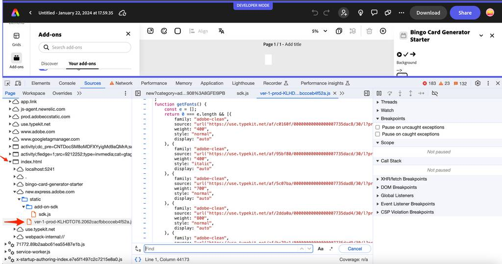

# Tips, Tricks & Troubleshooting

Useful information to use as a reference when you are developing your add-on UI's with Spectrum and how to troubleshoot issues you may see while trying.

## Tips & Tricks

### Using icons
    
You can import and use an icon from the Spectrum icon libraries provided in the [`icons-workflow`](https://opensource.adobe.com/spectrum-web-components/components/icons-workflow/) (icons representing graphical metaphors - a document, trash can, cloud etc) packages and [`icons-ui`](https://opensource.adobe.com/spectrum-web-components/components/icons-ui/) (icons that are parts of a component definition like an X or checkmark, expand icon etc). To use, first add to your project by installing them from the command line, or via the `package.json` with an `npm install`. Below are the package names for reference, and an example of using one from each:

    ```json
    "@spectrum-web-components/icons-ui": "0.39.4",
    "@spectrum-web-components/icons-workflow": "0.39.4",
    ```

    ```js
    import "@spectrum-web-components/icons-workflow/icons/sp-icon-play-circle.js;"
    import '@spectrum-web-components/icons-ui/icons/sp-icon-arrow75.js';

    <sp-icon-play-circle size="s"></sp-icon-play-circle>
    <sp-icon-arrow75 size="m"></sp-icon-arrow75>    
    ```    

    **NOTE:** Icons go by t-shirt sizing, with a default of `size="m"` for medium.

    You can also use the [`[sp-icon]` package](https://opensource.adobe.com/spectrum-web-components/components/icon/) and specify an image directly via the `src` attribute, either with the image reference or a data URL. Both are shown below for example:

    ```html
    <sp-icon src="icon-144x144.png"/>

    <sp-icon
        size="l"
        label="Previous"
        src="data:image/svg+xml;base64,PHN2ZyB4bWxucz0iaHR0cDovL3d3dy53My5vcmcvMjAwMC9zdmciIHZpZXdCb3g9Ii0yOTU3Ljk5NSAtNTUzMC4wMzIgNiAxMCI+PGRlZnM+PHN0eWxlPi5he2ZpbGw6bm9uZTtzdHJva2U6IzE0NzNlNjtzdHJva2UtbGluZWNhcDpyb3VuZDtzdHJva2UtbGluZWpvaW46cm91bmQ7c3Ryb2tlLW1pdGVybGltaXQ6MTA7c3Ryb2tlLXdpZHRoOjJweDt9PC9zdHlsZT48L2RlZnM+PHBhdGggY2xhc3M9ImEiIGQ9Ik0yNTEuMywzMzNsNC00LTQtNCIgdHJhbnNmb3JtPSJ0cmFuc2xhdGUoLTI3MDEuNjk1IC01MTk2LjAzMikgcm90YXRlKDE4MCkiLz48L3N2Zz4="
    />
    ```

    or as `svg` in the `<sp-icon>` component:

    ```html
    <sp-icon>
        <svg
            xmlns="http://www.w3.org/2000/svg"
            viewBox="0 0 22 22"
            role="img"
            fill="currentColor"
            height="18"
            width="18"
            aria-hidden="true"
        >
            <path
                d="M19.75,10.04h-15l5.97-5.97a.483.483,0,0,0,0-.7l-.35-.36a.513.513,0,0,0-.71,0L2.24,10.44a.513.513,0,0,0,0,.71l7.39,7.84a.513.513,0,0,0,.71,0l.35-.35a.513.513,0,0,0,0-.71L4.76,11.5H19.75a.25.25,0,0,0,.25-.25v-.96A.25.25,0,0,0,19.75,10.04Z"
            ></path>
        </svg>
    </sp-icon>                    
    ```

    **Note:** using an iconset reference from one of the `icons-workflow` or `icons-ui` packages in the `name` on an `sp-icon` should no longer be used (ie: `<sp-icon name="ui:Arrow100"></sp-icon>`), as it's deprecated. Use the specific named import mentioned in the first bullet above instead.

### Spectrum sizing

In Spectrum, there are two sizing notions:

- **scale** - the overall size of all components on the page, it's either medium for desktop, or large for touch.
- **t-shirt sizes** - the size of a specific component, set as a variant/modifier to that component (ie: `size="m"`). Note, a component whose size is set with t-shirt sizing is still affected by `scale`.

### Fonts

There are a set of Adobe Clean fonts automatically injected by the Add-on SDK for use in your add-ons. You can see which are available by checking the documentation, but you could also see them while running in add-on via the browser devtools like shown in the following:

  

### Debugging tips:

- Use the devtools to inspect the HTML, and do a find on `add-on-iframe-slot` element to find the add-on code more quickly.
- From the devtools, click into the stylesheets to see what variables are available for use more quickly along with their values.
- Dig into the `node_modules/@spectrum-web-components` folder and view the component details to help better understand why an issue might be happening.
- Use the [API tab in the component reference](https://opensource.adobe.com/spectrum-web-components/components/slider/api/) or the Storybook to locate the supported events details.

### Styling for layout and typography

Use Spectrum CSS variables for padding, gaps between controls, etc. Also, since SWC has no components for typography, it can also be used to customize typography. Note: by default, typography components do not include outer margins, but adding the `.spectrum-Typography` class to your container will provide margins to the typography components within it.

- [Color variables](https://spectrum.adobe.com/page/color-fundamentals/): provided as part of the theme imports. The color value’s contrast with the background increases as the number increases, so colors progressively get darker in a light theme and lighter in a dark theme (`--spectrum-global-color-purple-600` is *lighter* than `--spectrum-global-color-purple-900` in a `light` theme but *darker* in a `dark` theme). [Preview the color palette](https://spectrum.adobe.com/page/color-palette/) in the reference for more details.
    
    **TIP:** Use theme-specific color variables (defined in `theme-light.js` for instace) for most uses of color, like when the color will be applied to text, icons, or the borders of a component. Use static color variables from the overall `theme.js` when the color is going to be fixed and not dependent on theme. The naming for the relative color vs the static color variables are `--spectrum-global-color-purple-600` and
    `--spectrum-global-color-static-purple-600`, respectively.
    
- [Typography](https://opensource.adobe.com/spectrum-css/typography.html) classes:

    ```html
    import "@spectrum-web-components/styles/typography.css";
     <div className="spectrum-Typography">  
            <p className="spectrum-Heading spectrum-Heading--sizeL">This is custom medium header text</p>
    </div>
    </h3>
    ```          

### Custom modifier variables
        
Components have a set of variables defined to use for modifiers of classes specific to that component. They are prefixed with `--mod-*`, and you used them in the lessons for modifying the Swatch component in the `.color-well` class for reference. A list of the prefixed custom properties for each UI component can be found in the Spectrum CSS repo's `mods.md` file for each, such as [here for swatch](https://github.com/adobe/spectrum-css/blob/main/components/swatch/metadata/mods.md), [here for button](https://github.com/adobe/spectrum-css/blob/main/components/button/metadata/mods.md) etc.

    Example:

    ```css
    .color-well {
        `--mod-swatch-border-color: var(--spectrum-transparent-black-500);`
    ```     

## Troubleshooting

### Known issues

- Picker flicker issue

    Currently there's a known issue with the swc-react Picker component in versions `0.37.0-0.40.0` where you will see the UI flicker when using it.

- Spectrum Web Component versions

    You must use matching component versions for all Spectrum Web Components (or swc-react components) in your `package.json` or you will receive errors that are often not clear to determine the cause, so save yourself time and double check this if you're having issues running your add-on.

    This is mentioned in this tutorial a couple of times, but there is a known issue seen when using `@spectrum-web-components` (or `@swc-react`) packages with version `0.40.3`, but in general, at the moment `0.39.4` is a stable version that should work if you suspect a component version issue.

### Troubleshooting FAQ

This section is provided to help troubleshoot any errors you may encounter while following this tutorial.

- Why do I see registry errors in the console when running my add-on, like: `Uncaught DOMException: Failed to execute 'define' on 'CustomElementRegistry': the name "sp-icon-chevron100" has already been used with this registry` and `Base.dev.js:164 Attempted to redefine <sp-icon-chevron100>. This usually indicates that multiple versions of the same web component were loaded onto a single page. https://opensource.adobe.com/spectrum-web-components/registry-conflicts`

    This is probably due to mismatched versions of the `@spectrum-web-components` (or `@swc-react`) packages being used in your `package.json`. Don't forget to run `npm install` after updating your `package.json` to match the versions. 

    **Solution:** open your `package.json` file and set all of the versions to the same (ie: `0.39.4`) the one from the starter project.

- When I try to build or start my add-on with the CLI, I see an error like: `ERROR in ./node_modules/@spectrum-web-components/button/src/Button.dev.js 145:6-78 Module not found: Error: Can't resolve '@spectrum-web-components/progress-circle/sp-progress-circle.js' in '/Users/hollyschinsky/spectrum-workshop-2023/workshop-projects/bingo-card-addon-react-start/node_modules/@spectrum-web-components/button/src' ... Field 'browser' doesn't contain a valid alias configuration resolve as module`

    **Solution:** there's a known issue seen when using `@spectrum-web-components` (or `@swc-react`) packages with version `0.40.3`, which is the latest version that are installed at the time of writing this tutorial, unfortunately. The solution is to update the versions of all components used in your `package.json` file to a known stable one like `0.39.4`. Don't forget to run `npm install` after updating to ensure the stable versions are installed before trying to build and run your add-on again.

- General troubleshooting when running with the CLI and seeing errors. Try running `npx clear-npx-cache` to ensure the latest CLI version is installed, then run the CLI commands again. 

- Did I include a `webpack.config.js` file in the root of my project? Is it configured properly?

    **Solution:** replace your `package.json` file with the one from the starter project.

- Did I update the `scripts` object in the `package.json` to ensure the webpack parameter is used?

    **Solution:** ensure your `package.json` has the following `scripts` block:

    ```json
    "scripts": {
        "clean": "ccweb-add-on-scripts clean",
        "build": "ccweb-add-on-scripts build --use webpack",
        "start": "ccweb-add-on-scripts start --use webpack",
        "package": "ccweb-add-on-scripts package --use webpack"
    }
    ```

- Are all of my components wrapped within an opening and closing `<sp-theme>` or `<Theme>` tag? 

    You need to make sure all components are surrounded by the corresponding opening and closing theme tags for either Spectrum Web Components or swc-react depending on which project, or you will not see the components rendered properly.

Still having issues? Ping me on [discord](https://discord.com/invite/nc3QDyFeb4) (username `hollyschinsky`) or email me at [hschinsk@adobe.com](mailto:hschinsk@adobe.com) for help.

## Resources

- [Adobe's UX Guidelines](https://xd.adobe.com/view/urn:aaid:sc:US:fd638450-1af8-49c3-ad29-0e76c2a2136f/)
- Example codepens:
    - [Simple button using SWC](https://codepen.io/hollyschinsky/pen/xxBweyV)
    - [Bingo Card Generator](https://codepen.io/hollyschinsky/pen/bGZrdoy)
    - [Spectrum CSS](https://codepen.io/lazd/pen/Exevvey)
- [Storybook reference](https://opensource.adobe.com/spectrum-web-components/storybook/)
- [Spectrum Tokens Visualizer](https://opensource.adobe.com/spectrum-tokens/visualizer/)
- [Spectrum XD Plugin](https://spectrum.adobe.com/page/spectrum-xd-plugin/)
- [Spectrum Figma plugin](https://www.figma.com/community/file/1211274196563394418/adobe-spectrum-design-system)
- [CDN Bundle](https://jspm.dev/@spectrum-web-components/bundle/elements.js/) 
    To be used for quick testing, but note that it will default to the Spectrum base theme unless you include the Express theme bundles. See the example codepens for details.
- [Add-on Code Samples](https://developer.adobe.com/express/add-ons/docs/samples/)
- [Color Wheel](https://color.adobe.com/create/color-wheel)
