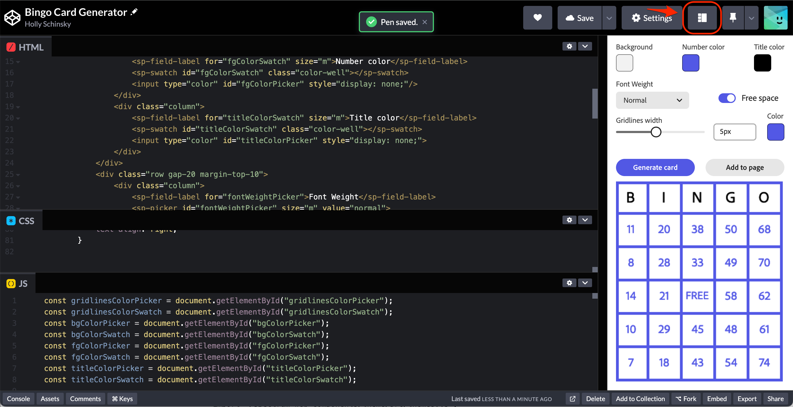
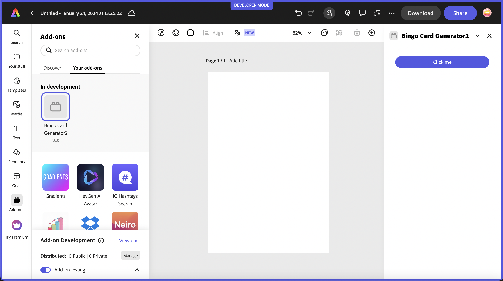
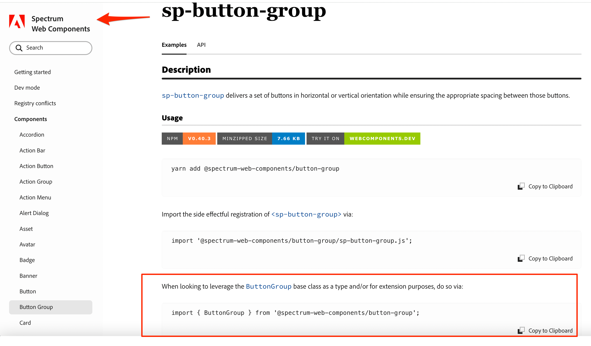

---
keywords:
  - Adobe Express
  - Express Add-on SDK
  - Express Document API
  - Document Model Sandbox
  - Adobe Express
  - Add-on SDK
  - SDK
  - JavaScript
  - Extend
  - Extensibility
  - API
title: Great UIs using Adobe's Spectrum Design System
description: This is an in-depth tutorial that will guide you in using Adobe's Spectrum Design System to help you build great UI's for your add-ons.
contributors:
  - https://github.com/hollyschinsky
---

# Great UIs using Adobe's Spectrum Design System

This is an in-depth tutorial that will guide you in using Adobe's Spectrum Design System to help you build great UI's for your add-ons.

## Introduction

In this tutorial, you will learn how to build a fully functioning Bingo Card Generator add-on from scratch, using two different approaches. The first approach will teach you how to start with a vanilla JavaScript add-on project and implement [Spectrum Web Components](https://opensource.adobe.com/spectrum-web-components/) (also referred to as SWC) to build out the UI. The second approach will walk through how to start with a React-based add-on (via the [`react-javascript` template](https://developer.adobe.com/express/add-ons/docs/guides/getting_started/dev_tooling/#templates)), and build out your UI using the the [`swc-react` Spectrum Web Components wrapper library](https://developer.adobe.com/express/add-ons/docs/guides/design/user_interface/#spectrum-web-components-with-react). 


Your add-on will allow users to select certain settings to customize a bingo card, including background, foreground and title color, gridline thickness and whether to include a FREE space. The card is generated with random numbers and ensures no numbers are used twice. The user can drag the customized card to the page, or click the "Add to page" button to use it in their document.

### Changelog

This tutorial has been written by Holly Schinsky. The revision history follows.

**January 31st, 2024**

- First publication.

### Prerequisites

- Familiarity with HTML, CSS, JavaScript.
- Familiarity with the Adobe Express add-ons environment; if you need a refresher, follow the [quickstart](/guides/getting_started/quickstart.md) guide.
- An Adobe Express account; use your existing Adobe ID or create one for free.
- Node.js version 16 or newer.

### Sample Projects (**TODO**)
- Lesson 1 Starter Project: The [Lesson 1 starter project](https://github.com/hollyschinsky/bingo-card-generator-starter/blob/master/webpack.config.js) is provided for you to use as an alternative to creating one with the CLI in the steps below. It has some configuration done for you that is covered in the initial steps, though we will be walking through how to start from scratch with the CLI as well. If you use the starter projects, you can skip the **Create and configure** steps and start hands-on with the **Theme setup** step.

- Lesson 1 Final Project: The [lesson 1 final project](https://github.com/hollyschinsky/bingo-card-generator-starter/blob/master/webpack.config.js) is provided for you to use to reference what the final project result should contain.

- Lesson 2 Starter Project: The [lesson 2 starter project](https://github.com/hollyschinsky/bingo-card-generator-starter/blob/master/webpack.config.js) 

- Lesson 2 Final Project: [The lesson 2 final project]()

### Topics Covered

<!-- List block here TODO -->
<ListBlock slots="text1, text2" repeat="2" iconColor="#2ac3a2" icon="disc" variant="fullWidth" />

[Configuring your add-on to use Spectrum Web Components](#)

[Using swc-react (React Spectrum Web Components wrappers)](#)

[Using Spectrum variables to customize the layout of your UI](#)

[Tips and Debugging](#)

<!-- [Using icons in your UI](#) -->

## Quickstart: Try Spectrum Web Components in a codepen

A quick way to get started trying out Spectrum Web Components without requiring any external tools, is to use a sandboxed environment like a codepen or code sandbox. See my simple [example codepen](https://codepen.io/hollyschinsky/pen/xxBweyV) for reference. This codepen references Spectrum Web Components libraries from a CDN and shows how to use the Express theme with a button component for starters.

You can then check out [this codepen](https://codepen.io/hollyschinsky/pen/bGZrdoy) which implements the UI for the bingo card generator add-on we'll be building in this tutorial, so you can get a glimpse of what it will look like in the end. You can change the layout in the codepen to represent how your add-on may look by using the layout button next to the Settings button outlined below, and drag the width of the frame to 320px, as shown below:



<InlineAlert slots="text" variant="warning"/>

Using CDN URL references are provided to show you a quick way to get started checking out Spectrum Web Components, but you will notice it will make your UI laggy, so you would never want to use this approach in your final add-on projects for performance reasons. You will learn more in the following steps about how to configure your projects to use only the modules and components your UI needs to ensure the best performance of your add-ons.

## Lesson 1: Use Spectrum Web Components in a basic JavaScript add-on

Though there are a few open source libraries based on Spectrum available, we specifically recommend using the [Spectrum Web Components](https://opensource.adobe.com/spectrum-web-components) library, as it offers a comprehensive set of UI components with built-in benefits for developers, including:

- Major timesaver due to the built-in styling
- An Express theme is specifically provided
- Accessibility is built-in
- It's lightweight and performant
- Compliant with industry standards

## Steps

### Create and configure
1. Use the CLI to create a new add-on based on the basic `javascript` template:

    `npx @adobe/create-ccweb-add-on bingo-card-generator --template javascript`

    You could use the CDN URL's once again to get started quickly, but since you'll want to ensure your add-on projects are performant, you will learn how to configure your local add-on project to use the specific Spectrum Web Components you'll need, instead.

    Note, you could also clone the [the provided starter project](https://github.com/hollyschinsky/bingo-card-generator-starter/blob/master/webpack.config.js) and just follow along the next couple of steps where the base project is configured since it's done for you in the starter.

1. If you ran the project at this point (`npm run build; npm run start`), you would see just a basic button displayed in the UI, as shown below:

  

    However, since you're going to be implementing a whole new UI, go ahead and remove (or comment out) the existing lines related to the button:

    Open the `src/index.html` file and **remove the following lines** within the `<body>` block:

    ```html
    <div class="container">
        <button id="clickMe" disabled>Click me</button>
    </div>
    ```

    you should also **remove the associated CSS styles** from the `<style>` block since they are no longer needed:

    ```css
    .container {
        margin: 24px;
        display: flex;
        flex-direction: column;
    }

    button {
        background-color: rgb(82, 88, 228);
        border-color: rgb(82, 88, 228);
        border-radius: 16px;
        border-style: solid;
        color: rgb(255, 255, 255);
        font-family: sans-serif;
        height: 32px;
    }

    button:disabled {
        background-color: rgb(177, 177, 177);
        border-color: rgb(177, 177, 177);
    }

    button:not([disabled]):hover {
        background-color: rgb(64, 70, 202);
        cursor: pointer;
    }
    ```            

    Then open the `src/index.js` and **remove the following lines**, (ensuring you keep the `addOnUISdk.ready.then(() => {...}` block intact).

    ```js
        const clickMeButton = document.getElementById("clickMe");
        clickMeButton.addEventListener("click", () => {
            clickMeButton.innerHTML = "Clicked";
        });

        // Enable the button only when:
        // 1. `addOnUISdk` is ready, and
        // 2. `click` event listener is registered.
        clickMeButton.disabled = false;
    ```

1. Next, you're going to need to configure your new add-on project to use webpack, since it's required to bundle the Spectrum Web Components properly. This requires a webpack config file and some additional updates to your `package.json`:

    First, add a new file named `webpack.config.js` to the root of your add-on project and copy in the code from below (or, alternatively, copy it in from [the provided starter project](https://github.com/hollyschinsky/bingo-card-generator-starter/blob/master/webpack.config.js)):

    ```js
    const path = require("path");
    const HtmlWebpackPlugin = require("html-webpack-plugin");
    const CopyWebpackPlugin = require("copy-webpack-plugin");

    const isEnvProduction = process.env.NODE_ENV === "production";

    module.exports = {
        mode: isEnvProduction ? "production" : "development",
        devtool: isEnvProduction ? "source-map" : "eval-source-map",
        entry: "./src/index.js",
        experiments: {
            outputModule: true
        },
        output: {
            path: path.resolve(__dirname, "dist"),
            module: true,
            filename: "index.js"
        },
        externalsType: "module",
        externalsPresets: { web: true },
        plugins: [
            new HtmlWebpackPlugin({
                template: "src/index.html",
                scriptLoading: "module"
            }),
            new CopyWebpackPlugin({            
                patterns: [
                    { from: "src/*.json", to: "[name][ext]" },                
                    { from: "src/*.png", to: "[name][ext]", noErrorOnMissing: true },
                ],
            })
        ],
        module: {
            rules: [
                {
                    test: /\.(js)$/,
                    exclude: /node_modules/,
                    use: ["babel-loader"]
                },
                {
                    test: /(\.css)$/,
                    use: ["style-loader", "css-loader"]
                }
            ]
        },
        resolve: {
            extensions: [".js", ".css"]
        }
    };
    ```

    Now, update your `package.json` to configure it for webpack. This requires you to update the `scripts`(to ensure it's used with the CLI commands), and `devDependencies` objects with the following snippets (or optionally copy in the content from the provided starter project). **TODO check latest versions**

    ```json
     "scripts": {
        "clean": "ccweb-add-on-scripts clean",
        "build": "ccweb-add-on-scripts build --use webpack",
        "start": "ccweb-add-on-scripts start --use webpack",
        "package": "ccweb-add-on-scripts package --use webpack"
    }

    "devDependencies": {
        "@adobe/ccweb-add-on-scripts": "^1.2.1",
        "@adobe/ccweb-add-on-sdk-types": "^1.2.1",
        "@babel/core": "7.23.3",
        "@babel/preset-env": "7.23.3",
        "@babel/preset-react": "7.23.3",
        "babel-loader": "9.1.3",
        "copy-webpack-plugin": "11.0.0",
        "css-loader": "6.8.1",
        "html-webpack-plugin": "5.5.3",
        "style-loader": "3.3.3",
        "webpack": "5.89.0",
        "webpack-cli": "5.1.4"
    }
    ```

    You will need to run `npm install` now to ensure all of the new dependencies are installed.

### Theme setup

1. Install and use the [Spectrum Web Components `<sp-theme>` component](https://opensource.adobe.com/spectrum-web-components/tools/theme/), which includes the modules that provide the overall theme that will apply to all of the Spectrum Web Components in your UI. It also includes an Express theme that you'll want to use in your add-on project:

    `npm install @spectrum-web-components/theme`

    **Note:** if you prefer to use `yarn`, you could alternatively use the command: `yarn add @spectrum-web-components/theme`.

    Notice your new component is now included in the `package.json`. **TODO** is the installed version going to work or does it need to be manually fixed.

1. Now, open your `src/index.js` and import the specific theme and typography classes below for the Express theme, color and scale you'll want to support in your add-on:

    ```js
    import "@spectrum-web-components/styles/typography.css";
    import '@spectrum-web-components/theme/express/theme-light.js';
    // import '@spectrum-web-components/theme/express/theme-dark.js'; /* optional depending if you want to support a future dark theme */
    import '@spectrum-web-components/theme/express/scale-medium.js';
    // import '@spectrum-web-components/theme/express/scale-large.js'; /* optional unless you want to include future support for mobile for insance */
    import '@spectrum-web-components/theme/sp-theme.js';
    ```

1. You can now add the `<sp-theme>` tag to our UI, but note that you won't actually see anything visually yet, since there are no components for it to be applied to. Let's add it and configure it to use the following options:

    ```html
    <sp-theme scale="medium" color="light" theme="express">
    </sp-theme>
    ```

    **NOTE:** Express currently only supports a light theme, but support for a dark theme will be coming in the future, so you could add some code that listens for the [Add-on UI SDK's `themechange` event](https://developer.adobe.com/express/add-ons/docs/guides/develop/use_cases/) and apply the change to your UI with something like the following:

    ```js
    addOnUISdk.app.on("themechange", (data) => { 
        applyTheme(data.theme); 
    });
    ```

    Another important thing to note, is the existence of the following block in the starter template `index.js` file, which can be used to ensure the Add-on UI SDK has been fully initialized and is ready for use before trying to implement your UI. You may have noticed that the original button included in the UI was set to `disabled`, and is subsequently enabled in this block, as an example:

    ```js
    addOnUISdk.ready.then(() => {        
        // Enable the button only when:
        // 1. `addOnUISdk` is ready, and
        // 2. `click` event listener is registered.
        clickMeButton.disabled = false;
    }
    ```

    You will keep this pattern in your Bingo Card Generator add-on as well.

1. Next, you can start installing all of the Spectrum Web Components that will be used to build the UI of your Bingo Card Generator add-on. These components are installed in a similar fashion to how the `<sp-theme>` component was added, with an `npm install` or `yarn add` command. 

    ```bash
    npm install "@spectrum-web-components/theme" "@spectrum-web-components/button" "@spectrum-web-components/button-group" "@spectrum-web-components/field-label" "@spectrum-web-components/menu" "@spectrum-web-components/picker" "@spectrum-web-components/slider" "@spectrum-web-components/swatch" "@spectrum-web-components/switch"
    ```

    **TODO** Is this still an issue since the npm install will install v 0.40.3? If so - must recommend using the manual update **

    Alternatively, you could save time by copying and adding the set of components below into your `dependencies` block of your `package.json` file, and then run `npm install` to install them all at once:

    ```json
    "dependencies": {
            "@spectrum-web-components/button": "0.39.4",
            "@spectrum-web-components/button-group": "0.39.4",    
            "@spectrum-web-components/field-label": "0.39.4",
            "@spectrum-web-components/menu": "0.39.4",
            "@spectrum-web-components/picker": "0.39.4",
            "@spectrum-web-components/slider": "0.39.4",
            "@spectrum-web-components/swatch": "0.39.4",
            "@spectrum-web-components/switch": "0.39.4",            
            "@spectrum-web-components/theme": "0.39.4",        
        },    
    ```

<InlineAlert slots="text" variant="warning"/>

**IMPORTANT!!!:** You must ensure the versions of all of your Spectrum Web Components installed match, or you will see errors upon build or while running.

<!-- **Note:** There's a [Spectrum bundle](https://www.npmjs.com/package/@spectrum-web-components/bundle) available which includes all of the Spectrum Web Components for quick prototyping/testing, but it should never be used in your final add-on project. You would `npm install` or `yarn add` just the `@spectrum-web-components/bundle` package, then import `import '@spectrum-web-components/bundle/elements.js';` to use it. -->

1. Add the imports for the new components to the `src/index.js` file with the following block:

    ```js
    import "@spectrum-web-components/button/sp-button.js";
    import "@spectrum-web-components/button-group/sp-button-group.js";
    import "@spectrum-web-components/field-label/sp-field-label.js";
    import '@spectrum-web-components/menu/sp-menu.js';
    import '@spectrum-web-components/menu/sp-menu-item.js';
    import "@spectrum-web-components/number-field/sp-number-field.js";
    import '@spectrum-web-components/picker/sp-picker.js';
    import "@spectrum-web-components/slider/sp-slider.js";
    import "@spectrum-web-components/swatch/sp-swatch.js";
    import '@spectrum-web-components/switch/sp-switch.js';
    ```

1. Next, open the `src/index.html` file and implement the code for the UI components below:

    ```html
    <sp-theme scale="medium" color="light" theme="express">                
        <div class="row gap-20"> 
            <div class="column">
                <sp-field-label for="bgColorSwatch" size="m">Background</sp-field-label>
                <sp-swatch id="bgColorSwatch" class="color-well"></sp-swatch>
                <input type="color" id="bgColorPicker" style="display: none;"/>                    
            </div>
            <div class="column">
                <sp-field-label for="fgColorSwatch" size="m">Number color</sp-field-label>
                <sp-swatch id="fgColorSwatch" class="color-well"></sp-swatch>
                <input type="color" id="fgColorPicker" style="display: none;"/>                    
            </div>                                                           
            <div class="column">
                <sp-field-label for="titleColorSwatch" size="m">Title color</sp-field-label>
                <sp-swatch id="titleColorSwatch" class="color-well"></sp-swatch>
                <input type="color" id="titleColorPicker" style="display: none;">                    
            </div>                        
        </div>  
        <div class="row gap-20 margin-top-10">  
            <div class="column">
                <sp-field-label for="fontWeightPicker">Font Weight</sp-field-label>
                <sp-picker id="fontWeightPicker" size="m" value="normal">
                    <sp-menu-item value="normal">Normal</sp-menu-item>                        
                    <sp-menu-item value="bold">Bold</sp-menu-item>                            
                    <sp-menu-item value="lighter">Lighter</sp-menu-item>                
                </sp-picker>
            </div>     
            <div class="column gap-20">
                <sp-switch id="freeSpaceToggle" emphasized value="on" checked size="l">Free space</sp-switch>                               
            </div>                                                         
        </div>                   
        <div class="row gap-20">                    
            <sp-slider label="Gridlines size" id="gridlineSize" variant="filled" editable 
                hide-stepper min="1" max="10" value="5"
                format-options='{"style": "unit", "unit": "px"}' step="1">
            </sp-slider>
            <div class="column">
                <sp-field-label for="gridlinesColorSwatch" size="m">Color</sp-field-label>
                <sp-swatch id="gridlinesColorSwatch" class="color-well"></sp-swatch>
                <input type="color" id="gridlinesColorPicker" style="display: none;">                                            
            </div>
        </div> 
        <div class="margin-top-10">
            <sp-button-group horizontal>
                <sp-button id="generateBtn" disabled>Generate card</sp-button>
                <sp-button id="addBtn" variant="secondary" disabled>Add to page</sp-button>
            </sp-button-group>              
        </div>                        
        <div class="margin-top-10">            
            <canvas id="finalCard"/>            
        </div>            
    </sp-theme>
    ```

    Notice the properties for each, and use the [Spectrum Web Component documentation](https://opensource.adobe.com/spectrum-web-components) to help provide more context.

1. If you run your add-on project with the CLI at this point (`npm run build; npm run start`), you would notice that your UI layout leaves something to be desired. Note that since Spectrum Web Components do not provide any specific layout components, we'll need to manage that with some custom styling and selectors instead, which we'll do now.

   /** TODO - SCREENSHOT **/

1. Now that you have your components implemented, you can begin styling it in a more user-friendly layout. Since Spectrum Web Components doesn't include specific layout components, you'll want to add some additional styling to your add-on. Some of those custom classes were already included in the code block from above, but you'll need to define them in the following steps for them to apply.

   Begin by locating the `<style>` block in your `src/index.html`, and add the following CSS selectors and classes: **TODO** fix with final. Mention that some of those custom classes were already included in the components pasted in.

    ```css
    sp-theme {
        margin: 0 var(--spectrum-global-dimension-static-size-100);
        display: grid;
    }

    h2 {
        font-weight: var(--spectrum-global-font-weight-black);
    }
    
    sp-swatch {
        width: var(--spectrum-swatch-size-medium);                
    }

    sp-button {
        flex: 1;
        max-width: calc(
            (100% - var(--spectrum-global-dimension-static-size-250)) / 2
        );
    }

    sp-textfield,
    sp-picker {
        width: var(--spectrum-global-dimension-static-size-1700);
        display: flex;
    }

    sp-number-field {            
        width: 100%;
    }

    sp-button-group {
        margin-top: var(--spectrum-global-dimension-static-size-300);
        width: 100%;
        display: flex;
        justify-content: space-between;
    }

    sp-slider {
        width: 100%;                
        --spectrum-slider-font-size: var(--spectrum-font-size-100);
    } 

    sp-field-label {
        font-size: var(--spectrum-global-dimension-font-size-100);        
    }

    .color-well {
        cursor: pointer;
        --mod-swatch-border-thickness: var(--spectrum-divider-thickness-small);
        --mod-swatch-border-color: var(--spectrum-transparent-black-500);
    }

    .row {
        display: flex;
        flex-direction: row;
        justify-content: space-between;
        width: 100%;
        align-items: flex-end;
    }

    .column {
        display: flex;
        flex-direction: column;                
    }

    .gap-20 {
        gap: var(--spectrum-global-dimension-static-size-250); 
    }

    .margin-top-10 {
        margin-top: var(--spectrum-global-dimension-static-size-125); 
    }

    #finalCard {
        width: 290px;                
    } 

    #maxChars {
        font-size: var(--spectrum-global-dimension-static-size-115);
        text-align: right;
    }
    ```

1. Once you are happy with your UI, you can start implementing the logic for actually generating the bingo card. Since this is not the focus of this tutorial, we will not cover it in-depth, instead, the following code snippet is provided with comments for you to replace in your `src/index.js` file:

    **TODO**

    ```js
    import addOnUISdk from "https://new.express.adobe.com/static/add-on-sdk/sdk.js";

    // Wait for the SDK to be ready
    addOnUISdk.ready.then(() => {        
        console.log("addOnUISdk is ready for use.");    
            
        const gridlinesColorPicker = document.getElementById("gridlinesColorPicker");
        const gridlinesColorSwatch = document.getElementById("gridlinesColorSwatch");
        const bgColorPicker = document.getElementById("bgColorPicker");
        const bgColorSwatch = document.getElementById("bgColorSwatch");    
        const fgColorPicker = document.getElementById("fgColorPicker");
        const fgColorSwatch = document.getElementById("fgColorSwatch");
        const titleColorPicker = document.getElementById("titleColorPicker");
        const titleColorSwatch = document.getElementById("titleColorSwatch");
        
        gridlinesColorPicker.value = "#5258e5";    
        gridlinesColorSwatch.color = "#5258e5";
        bgColorPicker.value = "#f2f2f2"; // box background color
        bgColorSwatch.color = "#f2f2f2";
        fgColorPicker.value = "#5258e5"; // number color
        fgColorSwatch.color = "#5258e5";    
        titleColorPicker.value = "#000000";
        titleColorSwatch.color = "#000000";    
    
        gridlinesColorSwatch.addEventListener("click", function () {
            gridlinesColorPicker.click();
        });
    
        gridlinesColorPicker.addEventListener("input", function (event) {
        const selectedColor = event.target.value;
        gridlinesColorSwatch.setAttribute("color", selectedColor);
        });

        fgColorSwatch.addEventListener("click", function () {
            fgColorPicker.click();
        });

        fgColorPicker.addEventListener("input", function (event) {
            const selectedColor = event.target.value;
            fgColorSwatch.setAttribute("color", selectedColor);
        });
    
        bgColorSwatch.addEventListener("click", function () {
        bgColorPicker.click();
        });
    
        bgColorPicker.addEventListener("input", function (event) {
        const selectedColor = event.target.value;
        bgColorSwatch.setAttribute("color", selectedColor);
        });
    
        titleColorSwatch.addEventListener("click", function () {
            titleColorPicker.click();
        });
    
        titleColorPicker.addEventListener("input", function (event) {
        const selectedColor = event.target.value;
        titleColorSwatch.setAttribute("color", selectedColor);
        });
    
        // CTA Buttons 
        const generateBtn = document.getElementById("generateBtn");  
        const addBtn = document.getElementById("addBtn");  
    
        generateBtn.onclick = async (event) => {                    
        generateBingoCard();        
        };
    
        // Safe to enable the buttons
        generateBtn.disabled = false;        
    });

    function generateBingoCard() {
        const canvas = document.getElementById("finalCard");
        const ctx = canvas.getContext("2d");

        // Set canvas width and height
        canvas.width = 300;
        canvas.height = 360;

        // Set grid properties    
        let gridlineSize = document.getElementById("gridlineSize").value;        
        const numRows = 6;
        const numCols = 5;
        const cellWidth = 60;
        const cellHeight = 60;
        
        // Draw gridlines
        ctx.beginPath();
        ctx.fillStyle = bgColorPicker.value;    
        ctx.lineWidth = gridlineSize; // Stroke width

        for (let i = 0; i <= numCols; i++) {        
            // Need to adjust for left/right gridlines size            
            ctx.moveTo(gridlineSize/2, 0);
            ctx.lineTo(gridlineSize/2, canvas.height);      

            ctx.moveTo(i * cellWidth-gridlineSize/2, 0);
            ctx.lineTo(i * cellWidth-gridlineSize/2, canvas.height);        
        }

        for (let i = 0; i <= numRows; i++) { 
            // Need to adjust for top/bottom gridlines size               
            ctx.moveTo(0, gridlineSize/2);
            ctx.lineTo(canvas.height, gridlineSize/2,);            
        
            ctx.moveTo(0, i * cellWidth-gridlineSize/2);
            ctx.lineTo(canvas.height, i * cellWidth-gridlineSize/2);                    
        }
        
        ctx.strokeStyle = gridlinesColorPicker.value;        
        ctx.stroke();
                            
        // Draw bingo title
        ctx.font = fontWeightPicker.value +' 28px adobe clean';    
        ctx.textAlign = "center";
        ctx.fillStyle = titleColorPicker.value; //font color                        
        let bingoTitle = ['B','I','N','G','O'];
        for (let charCnt = 0; charCnt < bingoTitle.length; charCnt++) {
            let letter = bingoTitle[charCnt];
            ctx.fillText(letter, charCnt * cellWidth + cellWidth / 2 - 4, cellHeight / 2 + 8);    
        }       
        
        // Generate random numbers
        const freeSpace = [3, 2]; // Coordinates of the FREE space
        const numbers = [];
        const usedNumbers = new Set(); // Track used numbers
        ctx.font = fontWeightPicker.value +' 22px adobe clean';
        ctx.fillStyle = fgColorPicker.value; // color of the numbers 
        ctx.textAlign = "center";
        const freeSpaceToggle = document.getElementById("freeSpaceToggle");
        
        for (let i = 1; i < numRows; i++) {
            numbers[i] = [];
            for (let j = 0; j < numCols; j++) {
                if (freeSpaceToggle.checked) {
                    if (i === freeSpace[0] && j === freeSpace[1]) {
                        numbers[i][j] = "FREE";
                        continue; // Skip the FREE space
                    }
                }
                let num;
                do {
                    num = Math.floor(Math.random() * 15) + 1 + (j * 15);
                } while (usedNumbers.has(num)); // Generate unique numbers

                usedNumbers.add(num);
                numbers[i][j] = num;        
                ctx.fillText(num, j * cellWidth + cellWidth / 2 - 3, i * cellHeight + cellHeight / 2 + 3);
            }
        }

        // Draw "FREE" on the FREE space
        if (freeSpaceToggle.checked) {
            ctx.font = fontWeightPicker.value +' 20px adobe clean';     
            ctx.fillText("FREE", freeSpace[1] * cellWidth + cellWidth / 2 - 4, freeSpace[0] * cellHeight + cellHeight / 2 + 2);   
            ctx.drawImage(canvas, 0, 0);
        }    

        // Enable drag and drop for the card
        addOnUISdk.app.enableDragToDocument(canvas, {
            previewCallback: el => new URL(canvas.toDataURL()),
            completionCallback: async el => {
                const r = await fetch(canvas.toDataURL());
                const blob = await r.blob();
                return [{blob}];
            }
        })    
            
        // Enable the add button    
        addBtn.disabled = false;  

        addBtn.onclick = async () => {      
            const r = await fetch(canvas.toDataURL());
            const blob = await r.blob();    
            addOnUISdk.app.document.addImage(blob);  
        }
    }
    ```   

## Lesson 2: Use Spectrum Web Components in a React-based add-on

In this lesson, you will implement the bingo card generator add-on in a React-based project with [`swc-react`](https://opensource.adobe.com/spectrum-web-components/using-swc-react/). `swc-react` is a collection of wrapper components designed to make Spectrum Web Components (SWC) work like native React components in a React application. They serve as a bridge between React and Spectrum Web Components, and their properties and event names are directly derived from their corresponding SWC components. As such, the corresponding [Spectrum Web Components documentation](https://opensource.adobe.com/spectrum-web-components/) can be used as the documentation reference for usage.

<InlineAlert slots="text" variant="info"/>

We recommend using **swc-react** over **React Spectrum** currently due to the fact that Spectrum Web Components provides a more extensive set of components with an explicit Express theme that is continuously updated. React Spectrum’s Express theme is in alpha and lacks full-support and is currently not being updated. Note, however, that a new version of Spectrum will be released this year, and an update to the React Spectrum libraries will follow, but the timeline remains to be determined, so we recommend using swc-react until then.

## Steps

### Create and configure

1. Create a new project with the CLI based on the basic `react-javascript` template:

    `npx @adobe/create-ccweb-add-on bingo-card-generator-react --template react-javascript`

1. Open the project in your favorite code editor and navigate to the `src/components/App.jsx` file. Notice that it's preconfigured with the `@swc-react/theme` and `@swc-react/button` packages and associated imports, with a basic usage. If you run the project at this point, you should see the button show up in your add-on:

    

    Take a moment to get familiar with what's included in the starter project in general before moving on.

1. Next, start installing the UI components to your new add-on project for use. These components are installed in a similar fashion to how you installed the Spectrum Web Components to lesson 1, via `npm install` or `yarn add`, with just a change to the package prefix (from `@spectrum-web-components` to `@swc-react`). Remember, the **@swc-react/button** and **@swc-react/theme** components were already included in the project generated by the template, so you can skip those.

    ```bash
    npm install "@swc-react/button-group" "@swc-react/field-label" "@swc-react/menu" "@swc-react/picker" "@swc-react/slider" "@swc-react/swatch" "@swc-react/switch"
    ```

    Alternatively, you could save time by replacing your `dependencies` block in your `package.json` file with the following, and then run `npm install` to install them all at once:

    ```json
    "dependencies": {
            "@swc-react/button": "0.39.4",
            "@swc-react/button-group": "0.39.4",        
            "@swc-react/field-label": "0.39.4",
            "@swc-react/menu": "0.39.4",
            "@swc-react/picker": "0.39.4",
            "@swc-react/slider": "0.39.4",
            "@swc-react/swatch": "0.39.4",
            "@swc-react/switch": "0.39.4",        
            "@swc-react/theme": "0.39.4",
            "react": "18.2.0",
            "react-dom": "18.2.0"
    },    
    ```

1. Now, add the imports for the components needed into the `src/components/App.jsx` file. The pattern of the imports will follow in a similar manner to what was included in the generated project for `Button` and `Theme`, and you can locate the exact name to use by checking the [Spectrum Web Components Reference](https://opensource.adobe.com/spectrum-web-components/) for the corresponding component name, in the "Usage" section. So, for instance, the first import needed is for a Button Group component. If we look at the [corresponding reference for Spectrum Web Components - Button Group](https://opensource.adobe.com/spectrum-web-components/components/button-group/#usage), the last import shows how to use it as the base class, with `import { ButtonGroup } from '@spectrum-web-components/button-group';`. It's outlined in the image below as well for visual reference:

          
 
 You can copy that import from the reference for any given component you want to use and just change the prefix from `@spectrum-web-components` to `@swc-react`. (Note, again the existing imports for Button and Theme as a guide). So the resulting import to use in your add-on would be:
 
    `import { ButtonGroup } from '@swc-react/button-group';`. 
 
 You can then use this same pattern for all of the `@swc-react` wrapper components you want to use.
 
 The imports needed for the Bingo Card Generator are also listed below for you to copy in quickly:

    ```js
    import { ButtonGroup } from '@swc-react/button-group';
    import { FieldLabel } from '@swc-react/field-label';
    import { MenuItem } from '@swc-react/menu';
    import { Picker } from '@swc-react/picker';
    import { Slider } from '@swc-react/slider';
    import { Swatch } from '@swc-react/swatch';
    import { Switch } from "@swc-react/switch";
    ```

1. In this next step, we need to create a new class to handle a known issue where React events and web components don't always work well together.  See [this issue for more details](https://github.com/facebook/react/issues/19846). The issue is most often seen in the case of the React `onChange` event, and the events won't properly fire. An option to work around this is to create a helper class that will automatically register the native browser version of the events for the components to ensure they are properly fired. 

  Create this new helper class in your `src/components` folder, name it `WC.jsx` and copy in the block of code below. **Note:** this class is also included in the [lesson 2 starter project](**TODO**) if you want to copy it in from there instead.

    ```js
    import React from "react";

    export class WC extends React.Component {
        constructor(props) {
            super(props);
            this.el = React.createRef();
            this.handleEvent = this.handleEvent.bind(this);
        }

        handleEvent(evt) {
            const propName = `on${evt.type[0].toUpperCase()}${evt.type.substr(1)}`;
            if (this.props[propName]) {
                this.props[propName].call(evt.target, evt);
            }
        }

        componentDidMount() {
            const el = this.el.current;
            const eventProps = Object.entries(this.props).filter(([k,v]) => k.startsWith("on"));
            eventProps.forEach(([k,v]) => el.addEventListener(k.substr(2).toLowerCase(), this.handleEvent));
        }

        componentWillUnmount() {
            const el = this.el.current;
            const eventProps = Object.entries(this.props).filter(([k,v]) => k.startsWith("on"));
            eventProps.forEach(([k,v]) => el.removeEventListener(k.substr(2).toLowerCase(), this.handleEvent));
        }

        render() {
            const filteredProps = Object.fromEntries(Object.entries(this.props).filter(([k,v]) => !k.startsWith("on")));
            return <div ref={this.el} {...filteredProps}>{this.props.children}</div>
        }
    }
    ```

1. Now, go back into your `src/components/App.jsx` and import your new helper class:

    `import { WC } from "./WC.jsx";`

1. At this point you are ready to start using the `swc-react` components. We'll also wrap them with the `<WC>` helper class as needed to handle events. 

  The easiest and quickest way to do this would be to replace the current `<Theme>` block with the following block:

    ```html
    <Theme theme="express" scale="medium" color="light">                    
        <div>                
            <div className="row gap-20"> 
                <div className="column">
                    <FieldLabel for="fontColorSwatch" size="m">Number color</FieldLabel>
                    <WC onChange={onFontColorClick}>
                        <Swatch id="fontColorSwatch" className="color-well" color={fontColorSwatch}></Swatch>
                    </WC>
                    <input ref={fontColorInput} type="color" id="fontColor" style={{display: "none"}}
                        value={fontColor} onChange={onFontColorChange}
                    />                        
                </div>                                       
                <div className="column">
                    <FieldLabel for="bgColorSwatch" size="m">Background</FieldLabel>
                    <WC onChange={onBgColorClick}>
                        <Swatch id="bgColorSwatch" className="color-well" color={bgColorSwatch}></Swatch>
                    </WC>
                    <input ref={bgColorInput} type="color" id="bgColorPicker" style={{display: "none"}}
                        value={bgColor} onChange={onBgColorChange}
                    />
                </div>
                <div className="column">
                    <FieldLabel for="titleColorSwatch" size="m">Title color</FieldLabel>
                    <WC onChange={onTitleColorClick}>
                        <Swatch id="titleColorSwatch" className="color-well" color={titleColorSwatch}></Swatch>
                    </WC>
                    <input ref={titleColorInput} type="color" id="titleColorPicker" style={{display: "none"}}
                        value={titleColor} onChange={onTitleColorChange}
                    />
                </div>                    
            </div>
            <div className="row gap-20 margin-top-10">
                <div className="column">
                    <FieldLabel for="fontWeightPicker">Font Weight</FieldLabel>
                    <Picker id="fontWeightPicker" size="m" value={fontWeightPicker} 
                        change={event => setFontWeightPicker(event.target.value)}>
                        <MenuItem value="normal">Normal</MenuItem>                        
                        <MenuItem value="bold">Bold</MenuItem>                            
                        <MenuItem value="lighter">Lighter</MenuItem>                
                    </Picker>
                </div>  
                <WC onChange={event => setFreeSpaceToggle(event.target.checked)}>
                    <Switch id="freeSpaceToggle" emphasized value={freeSpaceToggle} size="l">Free space</Switch>
                </WC>
            </div>                
            <div className="row gap-20">                    
                <WC onChange={event => setGridlineWidth(event.target.value)}>
                    <Slider label="Gridlines width" id="gridlineWidth" variant="filled" editable value={gridlineWidth}
                        hide-stepper min="1" max="10"
                        format-options='{"style": "unit", "unit": "px"}' step="1">
                    </Slider>
                </WC>
                <div className="column">
                    <FieldLabel for="gridColorSwatch" size="m">Grid</FieldLabel>
                    <WC onChange={onGridColorClick}>
                        <Swatch id="gridColorSwatch" className="color-well" color={gridColorSwatch}></Swatch>
                    </WC>
                    <input ref={gridColorInput} type="color" id="gridColorPicker" style={{display: "none"}}
                        value={gridColor} onChange={onGridColorChange}
                    />
                </div>                    
            </div>               
            <div className="margin-top-10">
                <ButtonGroup horizontal>
                    <Button id="generateBtn" onClick={event => generateCard(event.target.value)}>Generate Card</Button>
                    <Button ref={addBtn} variant="secondary" disabled onClick={handleAddBtnClick}>Add to page</Button>
                </ButtonGroup>              
            </div>
            <span style={{display:"none"}}>
                <canvas id="titleCanvas" ref={titleCanvas} width="300"/>        
            </span> 
            <span style={{display:"none"}}>
                <canvas id="gridCanvas" ref={gridCanvas} width="300" height="300"/> 
            </span>
            <div className="margin-top-10">            
                <canvas id="finalCardCanvas" ref={finalCardCanvas} width="300" height="360"/>            
            </div>                              
        </div>
    </Theme>
    ```

    Note the use of the `<WC>..</WC>` component you created in the previous step to wrap the `swc-react` components to ensure the events are are properly fired.

1. You could run your add-on project now and view it in Express. You'll notice that the layout of the UI is not up to par, so in the next sections we'll work on adding styling to ensure our UI is presented with a better layout. Note that since Spectrum Web Components do not provide any specific layout components, we'll need to manage that with some custom styling and selectors instead.

    Open the `/src/components/App.css` file and start adding the following custom type, class and id selectors for your UI.    

**TODO**

1. Once your UI is styled to your liking, you'll be able to add the logic for it to actually generate the bingo card by adding code to your `/src/components/App.jsx` file.

**TODO**

## General notes, tips, caveats & debugging

- Using icons
    
    You can import and use an icon from the Spectrum icon libraries provided in the [`icons-workflow`](https://opensource.adobe.com/spectrum-web-components/components/icons-workflow/) (icons representing graphical metaphors - a document, trash can, cloud etc) packages and [`icons-ui`](https://opensource.adobe.com/spectrum-web-components/components/icons-ui/) (icons that are parts of a component definition like an X or checkmark, expand icon etc). To use, first add to your project by installing them from the command line, or via the `package.json` with an `npm install`. Below are the package names for reference, and an example of using one from each:

    ```json
    "@spectrum-web-components/icons-ui": "0.39.4",
    "@spectrum-web-components/icons-workflow": "0.39.4",
    ```

    ```js
    import "@spectrum-web-components/icons-workflow/icons/sp-icon-play-circle.js;"
    import '@spectrum-web-components/icons-ui/icons/sp-icon-arrow75.js';

    <sp-icon-play-circle size="s"></sp-icon-play-circle>
    <sp-icon-arrow75 size="m"></sp-icon-arrow75>    
    ```    

    **NOTE:** Icons go by t-shirt sizing, with a default of `size="m"` for medium.

    You can also use the [`[sp-icon]` package](https://opensource.adobe.com/spectrum-web-components/components/icon/) and specify an image directly via the `src` attribute, either with the image reference or a data URL. Both are shown below for example:

    ```html
    <sp-icon src="icon-144x144.png"/>

    <sp-icon
        size="l"
        label="Previous"
        src="data:image/svg+xml;base64,PHN2ZyB4bWxucz0iaHR0cDovL3d3dy53My5vcmcvMjAwMC9zdmciIHZpZXdCb3g9Ii0yOTU3Ljk5NSAtNTUzMC4wMzIgNiAxMCI+PGRlZnM+PHN0eWxlPi5he2ZpbGw6bm9uZTtzdHJva2U6IzE0NzNlNjtzdHJva2UtbGluZWNhcDpyb3VuZDtzdHJva2UtbGluZWpvaW46cm91bmQ7c3Ryb2tlLW1pdGVybGltaXQ6MTA7c3Ryb2tlLXdpZHRoOjJweDt9PC9zdHlsZT48L2RlZnM+PHBhdGggY2xhc3M9ImEiIGQ9Ik0yNTEuMywzMzNsNC00LTQtNCIgdHJhbnNmb3JtPSJ0cmFuc2xhdGUoLTI3MDEuNjk1IC01MTk2LjAzMikgcm90YXRlKDE4MCkiLz48L3N2Zz4="
    />
    ```

    or as `svg` in the `sp-icon` component:

    ```html
    <sp-icon>
        <svg
            xmlns="http://www.w3.org/2000/svg"
            viewBox="0 0 22 22"
            role="img"
            fill="currentColor"
            height="18"
            width="18"
            aria-hidden="true"
        >
            <path
                d="M19.75,10.04h-15l5.97-5.97a.483.483,0,0,0,0-.7l-.35-.36a.513.513,0,0,0-.71,0L2.24,10.44a.513.513,0,0,0,0,.71l7.39,7.84a.513.513,0,0,0,.71,0l.35-.35a.513.513,0,0,0,0-.71L4.76,11.5H19.75a.25.25,0,0,0,.25-.25v-.96A.25.25,0,0,0,19.75,10.04Z"
            ></path>
        </svg>
    </sp-icon>                    
    ```

    **Note:** using an iconset reference from one of the `icons-workflow` or `icons-ui` packages in the `name` on an `sp-icon` should no longer be used (ie: `<sp-icon name="ui:Arrow100"></sp-icon>`), as it's deprecated. Use the specific named import mentioned in the first bullet above instead.

- Sizing

    In Spectrum, there are two sizing notions:

    **Scale** - This is the overall size of all components on the page, it's either medium for desktop, or large for touch.
    **T-shirt sizes** - This is the size of a specific component, basically a variant/modifier that resizes one instance of a component only. A component whose size is set with t-shirt sizing is still affected by scale.

- Fonts

    There are a set of Adobe Clean fonts automatically injected by the Add-on SDK for use in your add-ons. You can see which are available by checking the documentation, but you could also see them while running in add-on via the browser devtools like shown in the following:

  

- Styling for layout and typography

    Use Spectrum CSS variables for padding, gaps between controls, etc. Also, since SWC has no components for typography, it can also be used to customize typography. Note: by default, typography components do not include outer margins, but adding the `.spectrum-Typography` class to your container will provide margins to the typography components within it.


    [Colors](https://spectrum.adobe.com/page/color-fundamentals/): provided as part of the theme imports. The color value’s contrast with the background increases as the number increases, so colors progressively get darker in a light theme and lighter in a dark theme (so a purple 600 var would be lighter than a purple 900 in a light theme but darker in a dark theme). [Preview the color palette](https://spectrum.adobe.com/page/color-palette/) here in the reference for more details.
    
    Use theme-specific color variables (defined in `theme-light.js` for instace) for most uses of color, like when the color will be applied to text, icons, or the borders of a component. Use static color variables from the overall `theme.js` when the color is going to be fixed and not dependent on theme. The naming for the relative color vs the static color variables are `--spectrum-global-color-purple-600` and
    `--spectrum-global-color-static-purple-600`, respectively.


    
    [Typography](https://opensource.adobe.com/spectrum-css/typography.html) classes:

    ```html
    import "@spectrum-web-components/styles/typography.css";
     <div className="spectrum-Typography">  
            <p className="spectrum-Heading spectrum-Heading--sizeL">This is custom medium header text</p>
    </div>
    </h3>
    ```          

    **TODO**
    Custom Properties API 
        
    - Components can be modified via their `--mod-*` prefixed custom properties. A list of the prefixed custom properties for each UI component can be found in the Spectrum CSS repo's `mods.md` file for each, such as for button -> https://github.com/adobe/spectrum-css/blob/main/components/button/metadata/mods.md.

    Example:

    ```css
    .color-well {
        `--mod-swatch-border-color: var(--spectrum-transparent-black-500);`
    ```     

    Component level styles

- Picker flicker issue

    Currently there's a known issue with the swc-react Picker component in versions `0.37.0-0.40.0` where you will see the UI flicker when using it.

- Component versions

    You must use matching component versions for all Spectrum Web Components (or swc-react components) in your `package.json` or you will receive errors and things won't work right.

- Debugging tips:

    - Use the devtools to inspect the HTML, and do a find on `add-on-iframe-slot` element to find the add-on code more quickly.
    - From the devtools, click into the stylesheets to see what variables are available for use more quickly along with their values.
    - Dig into the `node_modules/@spectrum-web-components` folder and view the component details to help better understand why an issue might be happening.
    - Use the [API tab in the component reference](https://opensource.adobe.com/spectrum-web-components/components/slider/api/) or the Storybook to locate the supported events details.

### Troubleshooting/FAQ

This section is provided to help troubleshoot any errors you may encounter while following this tutorial.

- Why do I see registry errors in the console when running my add-on, like: `Uncaught DOMException: Failed to execute 'define' on 'CustomElementRegistry': the name "sp-icon-chevron100" has already been used with this registry` and `Base.dev.js:164 Attempted to redefine <sp-icon-chevron100>. This usually indicates that multiple versions of the same web component were loaded onto a single page. https://opensource.adobe.com/spectrum-web-components/registry-conflicts`

    This is probably due to mismatched versions of the `@spectrum-web-components` (or `@swc-react`) packages being used in your `package.json`. Don't forget to run `npm install` after updating your `package.json` to match the versions. 

    **Solution:** open your `package.json` file and set all of the versions to the same (ie: `0.39.4`) the one from the starter project.

- When I try to build or start my add-on with the CLI, I see an error like: `ERROR in ./node_modules/@spectrum-web-components/button/src/Button.dev.js 145:6-78 Module not found: Error: Can't resolve '@spectrum-web-components/progress-circle/sp-progress-circle.js' in '/Users/hollyschinsky/spectrum-workshop-2023/workshop-projects/bingo-card-addon-react-start/node_modules/@spectrum-web-components/button/src' ... Field 'browser' doesn't contain a valid alias configuration resolve as module`

    **Solution:** there's a known issue seen when using `@spectrum-web-components` (or `@swc-react`) packages with version `0.40.3`, which is the latest version that are installed at the time of writing this tutorial, unfortunately. The solution is to update the versions of all components used in your `package.json` file to a known stable one like `0.39.4`. Don't forget to run `npm install` after updating to ensure the stable versions are installed before trying to build and run your add-on again.

- General troubleshooting when running with the CLI and seeing errors. Try running `npx clear-npx-cache` to ensure the latest CLI version is installed, then run the CLI commands again. 

- Did I include a `webpack.config.js` file in the root of my project? Is it configured properly?

    **Solution:** replace your `package.json` file with the one from the starter project.

- Did I update the `scripts` object in the `package.json` to ensure the webpack parameter is used?

    **Solution:** ensure your `package.json` has the following `scripts` block:

    ```json
    "scripts": {
        "clean": "ccweb-add-on-scripts clean",
        "build": "ccweb-add-on-scripts build --use webpack",
        "start": "ccweb-add-on-scripts start --use webpack",
        "package": "ccweb-add-on-scripts package --use webpack"
    }
    ```

- Are all of my components wrapped within an opening and closing `<sp-theme>` or `<Theme>` tag? 

    You need to make sure all components are surrounded by the corresponding opening and closing theme tags for either Spectrum Web Components or swc-react depending on which project, or you will not see the components rendered properly.

Still having issues? Ping me on [discord](https://discord.com/invite/nc3QDyFeb4) (username `hollyschinsky`) or email me at [hschinsk@adobe.com](mailto:hschinsk@adobe.com) for help.

## Resources

- Example codepens:
    - [Simple button using SWC](https://codepen.io/hollyschinsky/pen/xxBweyV)
    - [Bingo Card Generator](https://codepen.io/hollyschinsky/pen/bGZrdoy)
    - [Spectrum CSS](https://codepen.io/lazd/pen/Exevvey)
- [Storybook reference](https://opensource.adobe.com/spectrum-web-components/storybook/)
- [Spectrum Tokens Visualizer](https://opensource.adobe.com/spectrum-tokens/visualizer/)
- [Spectrum XD Plugin](https://spectrum.adobe.com/page/spectrum-xd-plugin/)
- [Spectrum Figma plugin](https://www.figma.com/community/file/1211274196563394418/adobe-spectrum-design-system)
- [CDN Bundle](https://jspm.dev/@spectrum-web-components/bundle/elements.js/) 
    To be used for quick testing, but note that it will default to the Spectrum base theme unless you include the Express theme bundles. See the example codepens for details.
- [Add-on Code Samples](https://developer.adobe.com/express/add-ons/docs/samples/)
- [Color Wheel](https://color.adobe.com/create/color-wheel)
