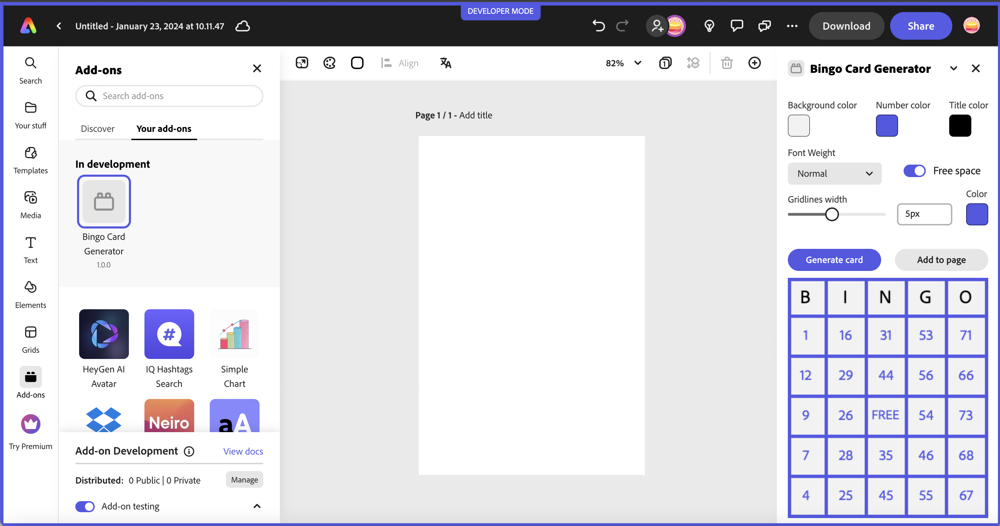

---
keywords:
  - Adobe Express
  - Express Add-on SDK
  - Express Document API
  - Document Model Sandbox
  - Adobe Express
  - Add-on SDK
  - SDK
  - JavaScript
  - Extend
  - Extensibility
  - API
title: Great UIs using Adobe's Spectrum Design System
description: This is an in-depth tutorial that will guide you in using Adobe's Spectrum Design System to help you build great UI's for your add-ons.
contributors:
  - https://github.com/hollyschinsky
---

# Great UIs using Adobe's Spectrum Design System

This is an in-depth tutorial that will guide you in using Adobe's Spectrum Design System to help you build great UI's for your add-ons.

## Introduction

In this tutorial, you will learn how to build a fully functioning Bingo Card Generator add-on from scratch, using two different approaches. The first approach will teach you how to start with a vanilla JavaScript add-on project and implement [Spectrum Web Components](https://opensource.adobe.com/spectrum-web-components/) to build out the UI. The second approach will walk through how to start with a React-based add-on (via the [`react-javascript` template](https://developer.adobe.com/express/add-ons/docs/guides/getting_started/dev_tooling/#templates)), and build out your UI using the the [`swc-react` Spectrum Web Components wrapper library](https://developer.adobe.com/express/add-ons/docs/guides/design/user_interface/#spectrum-web-components-with-react). 




Your add-on will allow users to select certain settings to customize a bingo card, including background, foreground and title color, gridline thickness and whether to include a FREE space. The card is generated with random numbers and ensures no numbers are used twice. The user can drag the customized card to the page, or click the "Add to page" button to use it in their document.

### Changelog

This tutorial has been written by Holly Schinsky. The revision history follows.

**January 31st, 2024**

- First publication.

### Prerequisites

- Familiarity with HTML, CSS, JavaScript.
- Familiarity with the Adobe Express add-ons environment; if you need a refresher, follow the [quickstart](/guides/getting_started/quickstart.md) guide.
- An Adobe Express account; use your existing Adobe ID or create one for free.
- Node.js version 16 or newer.

### Starter Projects
 **TODO**

### Topics Covered

<!-- List block here TODO -->
<ListBlock slots="text1, text2" repeat="2" iconColor="#2ac3a2" icon="disc" variant="fullWidth" />

[Configuring your add-on to use Spectrum Web Components](#)

[Using swc-react (React Spectrum Web Components wrappers)](#)

[Using Spectrum variables to customize the layout of your UI](#)

[Tips and Debugging](#)

<!-- [Using icons in your UI](#) -->


## Part 0: Quickstart Codepen: Try Spectrum Web Components

A quick way to get started with Spectrum Web Components without requiring any external tools is to use a sandboxed environment like a codepen. See my simple [example codepen](https://codepen.io/hollyschinsky/pen/xxBweyV) for reference. This codepen references Spectrum Web Components from a CDN and shows how to use the Express theme with a button component for starters.

You can then check out [this codepen](https://codepen.io/hollyschinsky/pen/bGZrdoy) which implements the UI for the bingo card generator to get a glimpse of what you'll be building in this workshop. You can even change the layout to represent how your add-on may look by using the layout button next to the Settings button, and drag the width to 320px, as shown below:


<InlineAlert slots="text" variant="warning"/>

Using CDN URL references are provided to show you a quick way to get started checking out Spectrum Web Components, but you will notice it will make your UI laggy, so you would never want to use this approach in your final add-on projects for performance reasons. You will learn more in the following steps about how to configure your projects to use only the modules and components your UI needs to ensure the best performance of your add-ons.

## Part 1: Create the Bingo Card Generator starting with a basic JavaScript project

Though there are a few open source libraries based on Spectrum available, we specifically recommend using the [Spectrum Web Components](https://opensource.adobe.com/spectrum-web-components) library, as it offers a comprehensive set of UI components with built-in benefits for developers, including:

- Saves time (you don’t have to do your own custom styling)
- Express theme is built-in
- Accessibility is built-in
- Lightweight and performant
- Compliant with industry standards

### Steps

1. Use the CLI to create a new add-on based on the basic `javascript` template:

    `npx @adobe/create-ccweb-add-on bingo-card-generator --template javascript`

    You could use the CDN URL's once again to get started quickly, but since you'll want to ensure your add-on projects are performant, you will learn how to configure your local add-on project to use the specific Spectrum Web Components you'll need, instead.

1. You could run the project at this point and see just the basic button displayed in the UI. However, since you're going to be implementing a whole new UI, go ahead and remove (or comment out) the existing lines related to the button.

Go ahead now and open the `src/index.html` file and remove the following lines within the `<body>` block:

```html
<div class="container">
    <button id="clickMe" disabled>Click me</button>
</div>
```

and associated CSS styles from the `<style>` block, since we'll be creating new ones:

```css
.container {
    margin: 24px;
    display: flex;
    flex-direction: column;
}

button {
    background-color: rgb(82, 88, 228);
    border-color: rgb(82, 88, 228);
    border-radius: 16px;
    border-style: solid;
    color: rgb(255, 255, 255);
    font-family: sans-serif;
    height: 32px;
}

button:disabled {
    background-color: rgb(177, 177, 177);
    border-color: rgb(177, 177, 177);
}

button:not([disabled]):hover {
    background-color: rgb(64, 70, 202);
    cursor: pointer;
}
```            

and `src/index.js` (ensuring you keep the `addOnUISdk.ready.then(() => {}` block intact).

```js
    const clickMeButton = document.getElementById("clickMe");
    clickMeButton.addEventListener("click", () => {
        clickMeButton.innerHTML = "Clicked";
    });

    // Enable the button only when:
    // 1. `addOnUISdk` is ready, and
    // 2. `click` event listener is registered.
    clickMeButton.disabled = false;
```

1. Next, you're going to configure your new add-on project to use specific Spectrum Web Components, which requires webpack and some additional updates to your `package.json`:

    First, add a `webpack.config.js` file to the root of the project and copy in the code from below (or, alternatively, copy it in from the provided starter project):

    ```js
    const path = require("path");
    const HtmlWebpackPlugin = require("html-webpack-plugin");
    const CopyWebpackPlugin = require("copy-webpack-plugin");

    const isEnvProduction = process.env.NODE_ENV === "production";

    module.exports = {
        mode: isEnvProduction ? "production" : "development",
        devtool: isEnvProduction ? "source-map" : "eval-source-map",
        entry: "./src/index.js",
        experiments: {
            outputModule: true
        },
        output: {
            path: path.resolve(__dirname, "dist"),
            module: true,
            filename: "index.js"
        },
        externalsType: "module",
        externalsPresets: { web: true },
        plugins: [
            new HtmlWebpackPlugin({
                template: "src/index.html",
                scriptLoading: "module"
            }),
            new CopyWebpackPlugin({            
                patterns: [
                    { from: "src/*.json", to: "[name][ext]" },                
                    { from: "src/*.png", to: "[name][ext]", noErrorOnMissing: true },
                ],
            })
        ],
        module: {
            rules: [
                {
                    test: /\.(js)$/,
                    exclude: /node_modules/,
                    use: ["babel-loader"]
                },
                {
                    test: /(\.css)$/,
                    use: ["style-loader", "css-loader"]
                }
            ]
        },
        resolve: {
            extensions: [".js", ".css"]
        }
    };
    ```

    Now, update your `package.json` to configure it for webpack. This requires you to update the `scripts` and `devDependencies` objects with the following snippets (or optionally copy in the content from the provided starter project). **TODO check latest versions**

    ```json
     "scripts": {
        "clean": "ccweb-add-on-scripts clean",
        "build": "ccweb-add-on-scripts build --use webpack",
        "start": "ccweb-add-on-scripts start --use webpack",
        "package": "ccweb-add-on-scripts package --use webpack"
    }

    "devDependencies": {
        "@adobe/ccweb-add-on-scripts": "^1.2.1",
        "@adobe/ccweb-add-on-sdk-types": "^1.2.1",
        "@babel/core": "7.23.3",
        "@babel/preset-env": "7.23.3",
        "@babel/preset-react": "7.23.3",
        "babel-loader": "9.1.3",
        "copy-webpack-plugin": "11.0.0",
        "css-loader": "6.8.1",
        "html-webpack-plugin": "5.5.3",
        "style-loader": "3.3.3",
        "webpack": "5.89.0",
        "webpack-cli": "5.1.4"
    }
    ```

1. Install and use the [Spectrum Web Components `<sp-theme>` component](https://opensource.adobe.com/spectrum-web-components/tools/theme/), which includes the modules that provide the overall theme that will apply to all of the Spectrum Web Components in your UI. It also includes an Express theme that you'll want to use in your add-on project:

    `npm install @spectrum-web-components/theme`

    **Note:** if you prefer to use `yarn`, you could alternatively use the command: `yarn add @spectrum-web-components/theme`.

    Notice your new component is now included in the `package.json`. **TODO** is the installed version going to work or does it need to be manually fixed.

1. Now, open your `src/index.js` and import the specific theme and typography classes below for the Express theme, color and scale you'll want to support in your add-on:

    ```js
    import "@spectrum-web-components/styles/typography.css";
    import '@spectrum-web-components/theme/express/theme-light.js';
    // import '@spectrum-web-components/theme/express/theme-dark.js'; /* optional depending if you want to support a future dark theme */
    import '@spectrum-web-components/theme/express/scale-medium.js';
    // import '@spectrum-web-components/theme/express/scale-large.js'; /* optional unless you want to include future support for mobile for insance */
    import '@spectrum-web-components/theme/sp-theme.js';
    ```

1. You can now add the `<sp-theme>` tag to our UI, but note that you won't actually see anything visually yet, since there are no components for it to be applied to. Let's add it and configure it to use the following options:

    ```html
    <sp-theme scale="medium" color="light" theme="express">
    </sp-theme>
    ```

    **NOTE:** Express currently only supports a light theme, but support for a dark theme will be coming in the future, so you could add some code that listens for the [Add-on UI SDK's `themechange` event](https://developer.adobe.com/express/add-ons/docs/guides/develop/use_cases/) and apply the change to your UI with something like the following:

    ```js
    addOnUISdk.app.on("themechange", (data) => { 
        applyTheme(data.theme); 
    });
    ```

    Another important thing to note, is the existence of the following block in the starter template `index.js` file, which can be used to ensure the Add-on UI SDK has been fully initialized and is ready for use before trying to implement your UI. You may have noticed that the original button included in the UI was set to `disabled`, and is subsequently enabled in this block, as an example:

    ```js
    addOnUISdk.ready.then(() => {        
        // Enable the button only when:
        // 1. `addOnUISdk` is ready, and
        // 2. `click` event listener is registered.
        clickMeButton.disabled = false;
    }
    ```

    You will keep this pattern in your Bingo Card Generator add-on as well.

1. Next, you can start adding all of the UI components to your Bingo Card Generator add-on. These components are installed in a similar fashion to how the `<sp-theme>` component was added, with an `npm install` or `yarn add` command. 

    ```bash
    npm install "@spectrum-web-components/theme" "@spectrum-web-components/button" "@spectrum-web-components/button-group" "@spectrum-web-components/field-label" "@spectrum-web-components/menu" "@spectrum-web-components/picker" "@spectrum-web-components/slider" "@spectrum-web-components/swatch" "@spectrum-web-components/switch"
    ```

    **TODO** Is this still an issue since the npm install will install v 0.40.3? If so - must recommend using the manual update **

    Alternatively, you could save time by copying and adding the set of components below into your `dependencies` block of your `package.json` file, and then run `npm install` to install them all at once:

    ```json
    "dependencies": {
            "@spectrum-web-components/button": "0.39.4",
            "@spectrum-web-components/button-group": "0.39.4",    
            "@spectrum-web-components/field-label": "0.39.4",
            "@spectrum-web-components/menu": "0.39.4",
            "@spectrum-web-components/picker": "0.39.4",
            "@spectrum-web-components/slider": "0.39.4",
            "@spectrum-web-components/swatch": "0.39.4",
            "@spectrum-web-components/switch": "0.39.4",            
            "@spectrum-web-components/theme": "^0.39.4",        
        },    
    ```

<InlineAlert slots="text" variant="warning"/>

**IMPORTANT!!!:** You must ensure the versions of all of your Spectrum Web Components installed match, or you will see errors upon build or while running.

1. Add the imports for the new components to the `src/index.js` file:

    ```js
    import "@spectrum-web-components/button/sp-button.js";
    import "@spectrum-web-components/button-group/sp-button-group.js";
    import "@spectrum-web-components/field-label/sp-field-label.js";
    import '@spectrum-web-components/menu/sp-menu.js';
    import '@spectrum-web-components/menu/sp-menu-item.js';
    import "@spectrum-web-components/number-field/sp-number-field.js";
    import '@spectrum-web-components/picker/sp-picker.js';
    import "@spectrum-web-components/slider/sp-slider.js";
    import "@spectrum-web-components/swatch/sp-swatch.js";
    import '@spectrum-web-components/switch/sp-switch.js';
    ```

1. Next, open the `src/index.html` file and implement the code for the UI components below:

    ```html
    <sp-theme scale="medium" color="light" theme="express">                
        <div class="row gap-20"> 
            <div class="column">
                <sp-field-label for="bgColorSwatch" size="m">Background</sp-field-label>
                <sp-swatch id="bgColorSwatch" class="color-well"></sp-swatch>
                <input type="color" id="bgColorPicker" style="display: none;"/>                    
            </div>
            <div class="column">
                <sp-field-label for="fgColorSwatch" size="m">Number color</sp-field-label>
                <sp-swatch id="fgColorSwatch" class="color-well"></sp-swatch>
                <input type="color" id="fgColorPicker" style="display: none;"/>                    
            </div>                                                           
            <div class="column">
                <sp-field-label for="titleColorSwatch" size="m">Title color</sp-field-label>
                <sp-swatch id="titleColorSwatch" class="color-well"></sp-swatch>
                <input type="color" id="titleColorPicker" style="display: none;">                    
            </div>                        
        </div>  
        <div class="row gap-20 margin-top-10">  
            <div class="column">
                <sp-field-label for="fontWeightPicker">Font Weight</sp-field-label>
                <sp-picker id="fontWeightPicker" size="m" value="normal">
                    <sp-menu-item value="normal">Normal</sp-menu-item>                        
                    <sp-menu-item value="bold">Bold</sp-menu-item>                            
                    <sp-menu-item value="lighter">Lighter</sp-menu-item>                
                </sp-picker>
            </div>     
            <div class="column gap-20">
                <sp-switch id="freeSpaceToggle" emphasized value="on" checked size="l">Free space</sp-switch>                               
            </div>                                                         
        </div>                   
        <div class="row gap-20">                    
            <sp-slider label="Gridlines size" id="gridlineSize" variant="filled" editable 
                hide-stepper min="1" max="10" value="5"
                format-options='{"style": "unit", "unit": "px"}' step="1">
            </sp-slider>
            <div class="column">
                <sp-field-label for="gridlinesColorSwatch" size="m">Color</sp-field-label>
                <sp-swatch id="gridlinesColorSwatch" class="color-well"></sp-swatch>
                <input type="color" id="gridlinesColorPicker" style="display: none;">                                            
            </div>
        </div> 
        <div class="margin-top-10">
            <sp-button-group horizontal>
                <sp-button id="generateBtn" disabled>Generate card</sp-button>
                <sp-button id="addBtn" variant="secondary" disabled>Add to page</sp-button>
            </sp-button-group>              
        </div>                        
        <div class="margin-top-10">            
            <canvas id="finalCard"/>            
        </div>            
    </sp-theme>
    ```

1. Notice the properties for each and use the documentation references.

1. Now that you have your components implemented, you can begin styling it in a more user-friendly layout. Since Spectrum Web Components doesn't include specific layout components, you'll want to add some additional styling to your add-on. Some of those custom classes were already included in the code block from above, but you'll need to define them in the following steps for them to apply.

Begin by locating the `<style>` block in your `src/index.html`, and add the following CSS selectors and classes: **TODO** fix with final. Mention that some of those custom classes were already included in the components pasted in.

    ```css
    sp-theme {
        margin: 0 var(--spectrum-global-dimension-static-size-100);
        display: grid;
    }

    h2 {
        font-weight: var(--spectrum-global-font-weight-black);
    }
    
    sp-swatch {
        width: var(--spectrum-swatch-size-medium);                
    }

    sp-button {
        flex: 1;
        max-width: calc(
            (100% - var(--spectrum-global-dimension-static-size-250)) / 2
        );
    }

    sp-textfield,
    sp-picker {
        width: var(--spectrum-global-dimension-static-size-1700);
        display: flex;
    }

    sp-number-field {            
        width: 100%;
    }

    sp-button-group {
        margin-top: var(--spectrum-global-dimension-static-size-300);
        width: 100%;
        display: flex;
        justify-content: space-between;
    }

    sp-slider {
        width: 100%;                
        --spectrum-slider-font-size: var(--spectrum-font-size-100);
    } 

    sp-field-label {
        font-size: var(--spectrum-global-dimension-font-size-100);        
    }

    .color-well {
        cursor: pointer;
        --mod-swatch-border-thickness: var(--spectrum-divider-thickness-small);
        --mod-swatch-border-color: var(--spectrum-transparent-black-500);
    }

    .row {
        display: flex;
        flex-direction: row;
        justify-content: space-between;
        width: 100%;
        align-items: flex-end;
    }

    .column {
        display: flex;
        flex-direction: column;                
    }

    .gap-20 {
        gap: var(--spectrum-global-dimension-static-size-250); 
    }

    .margin-top-10 {
        margin-top: var(--spectrum-global-dimension-static-size-125); 
    }

    #finalCard {
        width: 290px;                
    } 

    #maxChars {
        font-size: var(--spectrum-global-dimension-static-size-115);
        text-align: right;
    }
    ```

1. Once you are happy with your UI, you can start implementing the logic for actually generating the bingo card. Since this is not the focus of this tutorial, we will not cover it in-depth, instead, the following code snippet is provided with comments for you to replace in your `src/index.js` file:

**TODO**

## Part 2: Create the Bingo Card Generator with `swc-react` (React wrapper library for Spectrum Web Components)

**NOTE:** We recommend **swc-react** over **React Spectrum** currently due to the fact that Spectrum Web Components provides a more extensive set of components with an explicit Express theme that is continuosly updated. React Spectrum’s Express theme is in alpha and lacks full-support and is currently not being updated.

<InlineAlert slots="text" variant="info"/>

A new version of Spectrum will be released this year and will eventually include an update to the React Spectrum libraries, but the timeline remains to be determined, so we recommend using swc-react until then.

### Steps

1. Create a new project with the CLI based on the basic `react-javascript` template:

    `npx @adobe/create-ccweb-add-on bingo-card-generator-react --template react-javascript`

1. Open the project in your favorite code editor and notice that it's preconfigured with the `@swc-react/theme` and `@swc-react/button` packages, with a basic usage. You could run the project at this point and see the button show up in your UI if desired.

1. Next, start adding all of the UI components to your new Bingo Card Generator project. These components are installed in a similar fashion to how the `<sp-theme>` component was added, with an `npm install` or `yarn add` command. 

    ```bash
    npm install "@swc-react/button" "@swc-react/button-group" "@swc-react/field-label" "@swc-react/menu" "@swc-react/picker" "@swc-react/slider"
    "@swc-react/swatch" "@swc-react/switch" "@swc-react/theme"
    ```

    Alternatively, you could save time by replacing your `dependencies` block in your `package.json` file with the following, and then run `npm install` to install them all at once:

    ```json
    "dependencies": {
            "@swc-react/button": "0.39.4",
            "@swc-react/button-group": "0.39.4",        
            "@swc-react/field-label": "0.39.4",
            "@swc-react/menu": "0.39.4",
            "@swc-react/picker": "0.39.4",
            "@swc-react/slider": "0.39.4",
            "@swc-react/swatch": "0.39.4",
            "@swc-react/switch": "0.39.4",        
            "@swc-react/theme": "^0.39.4",
            "react": "18.2.0",
            "react-dom": "18.2.0"
        },    
    ```

1. Imports

**TODO**

1. Styles

**TODO**

1. Logic

**TODO**

### Tips, Caveats, Debugging

- Using fonts
- Using icons

```bash
npm install @spectrum-web-components/icon
npm install @spectrum-web-components/icons
```
Base.dev.js:164 DEPRECATION NOTICE: Iconsets have been deprecated and will be removed from the project in an upcoming version. For default Spectrum Icons, learn more about leveraging UI Icons (https://opensource.adobe.com/spectrum-web-components/components/icons-ui/) or Workflow Icons (https://opensource.adobe.com/spectrum-web-components/components/icons-workflow/) as an alternative.

```js
import '@spectrum-web-components/icon/sp-icon.js';
import '@spectrum-web-components/icons/sp-icons-medium.js';

<sp-icons-medium></sp-icons-medium>
<sp-icon name="ui:Arrow100"></sp-icon>
```

- Picker flicker (v.0.37-40?) **TODO**
- Matching versions

### Troubleshooting

This section is provided to help troubleshoot any errors you may encounter while following this tutorial.

- Do all of my Spectrum Web Component versions in my `package.json` match?

    **Solution:** replace your `package.json` file with the one from the starter project.

- Did I include a `webpack.config.js` file in the root of my project? Is it configured properly?

    **Solution:** replace your `package.json` file with the one from the starter project.

- Did I update the `scripts` object in the `package.json` to ensure the webpack parameter is used?

    **Solution:** ensure your `package.json` has the following `scripts` block:

    ```json
    "scripts": {
        "clean": "ccweb-add-on-scripts clean",
        "build": "ccweb-add-on-scripts build --use webpack",
        "start": "ccweb-add-on-scripts start --use webpack",
        "package": "ccweb-add-on-scripts package --use webpack"
    }
    ```

Still having issues? Ping me on [discord](https://discord.com/invite/nc3QDyFeb4) (username `hollyschinsky`) or email me at [hschinsk@adobe.com](mailto:hschinsk@adobe.com) for help.
