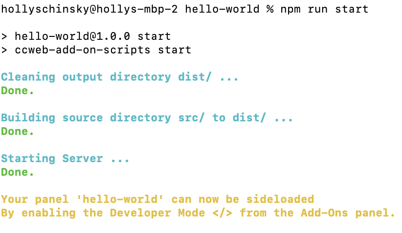

---
keywords:
  - Adobe Express
  - Express Add-on SDK
  - Express Editor
  - Adobe Express
  - Add-on SDK
  - SDK
  - JavaScript
  - Extend
  - Extensibility
  - API
  - Add-on Manifest
title: Documentation for Adobe Express Add-ons
description: Documentation for building Adobe Express add-ons.
contributors:
  - https://github.com/hollyschinsky
---

<Hero slots="heading, text" background="rgb(64, 34, 138)" />

# Adobe Express Add-on Documentation

Adobe Express add-ons allow developers to extend the Adobe Express core functionality, unlocking new capabilities and creative features, all while leveraging familiar web technologies like JavaScript, HTML and CSS.

<InlineAlert slots="text" variant="info"/>

These docs are for Adobe Express add-on APIs which are still in private beta. [Join the waitlist](https://airtable.com/shr3IK38z2MCNHJEm)

<Resources slots="heading, links"/>

#### Quick Links

* [Getting Started](getting_started/)
* [References](references/)
* [Samples](https://github.com/AdobeDocs/express-add-on-samples)
  
<DiscoverBlock width="100%" slots="heading, text"/>

## Overview
This guide covers everything you need to know to get started building add-ons for the beta version of Adobe Express. At a high level, add-ons refer to any feature distributed independently from the core product that a user can enable or install to extend the capabilities of the core product. Typically, add-ons will be created by 3rd party developers, however, there will also be scenarios where Adobe will be creating and distributing our own add-ons. These docs are available to provide you with all of the information you need to get set up and well on your way to developing your own add-ons for Adobe Express. Please see the [main help guides](https://helpx.adobe.com/express/using/express-overview.html) for more information and frequently asked questions about Adobe Express.

## Extensibility

The new beta version of Adobe Express enables a new add-ons feature, which extends Adobe Express to provide maximum flexibility for using Web technologies to create and share assets. These add-ons are  self-contained and available in a new add-ons panel to enhance the end user's projects. Some examples of features which an add-on may contain include:

- Importing images and video
- Exporting renditions of images in different formats
- Connecting to external sources via OAuth 2.0
- Storing and retrieving data
- Dragging and dropping of content
- Retrieving manifest data
- Managing language and locale
- Retrieving the current theme and detecting theme changes

<InlineAlert slots="text" variant="info"/>

The upcoming releases will incorporate more APIs, features, and components that will facilitate developers and creatives to build new experiences.

<TitleBlock slots="heading, text"  />

### Featured Topics
Check out these featured topics below and learn something new today!

<TextBlock slots="image, heading, text, buttons" width="33%" />

### Getting Started

Start building your first app now by heading over to our Getting Started section.

- [Getting Started](getting_started/)

<TextBlock slots="image, heading, text, buttons" width="33%" />

### API Reference

Gain inspiration and learn what capabilities are possible by checking out our API References and Code Samples.

- [API References](references/)
- [Code Samples](guides/develop/samples.md)

<TextBlock slots="image, heading, text, buttons" width="33%" />

### Developer Guides

Head on over to our developer guides where you will find specific content to help you with each stage of your development journey, including designing, debugging and distributing your add-ons.

- [Developer Guides](guides/)