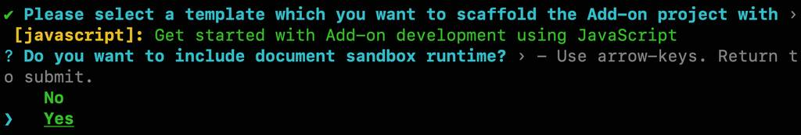
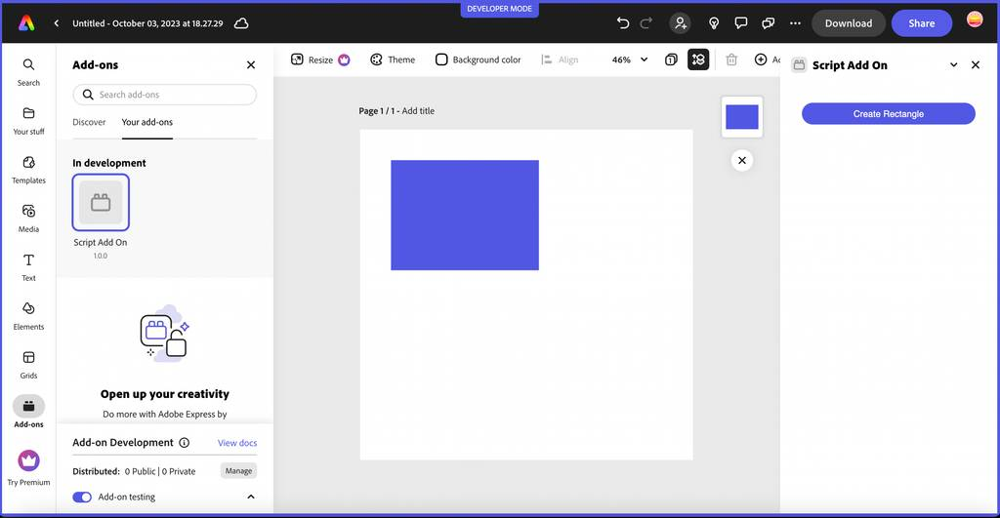

---
keywords:
  - Adobe Express
  - Express Add-on SDK
  - Express Editor
  - Adobe Express
  - Add-on SDK
  - SDK
  - JavaScript
  - Extend
  - Extensibility
  - API
  - Add-on Manifest
title: Document Sandbox Overview
description: An overview of the document sandbox used for content authoring with the Adobe Express Document APIs.
contributors:
  - https://github.com/hollyschinsky
---

# Document Sandbox

The document sandbox is a sandboxed JavaScript execution environment, which allows to execute add-on's JavaScript code securely and synchronously in another JavaScript environment e.g., browser.

<InlineAlert slots="text" variant="warning"/>

The document sandbox references are currently **experimental only**, so you will need to set `experimentalApis` flag to `true` in the [`requirements`](../manifest/index.md#requirements) section of the `manifest.json` to use them. *Please do not use these APIs in any add-ons you plan to distribute or submit with updates until they have been deemed stable.*  Also, please be aware that you should only test these experimental APIs against non-essential documents, as they could be lost or corrupted.

## Overview

The document sandbox exposes three categories of APIs, which each have their own specific references and are outlined below.

### Communication APIs

The [communication APIs](./communication/index.md) allow you to communicate between the document sandbox and the iframe runtime where your add-on is running via exposed APIs.

### Web APIs

The document sandbox does NOT provide a full fledged browser’s JavaScript execution environment. Most of the browsers APIs/Global Objects are not available. For these, the developers can use iframe runtime environment and [communicate](./communication/index.md#expose-apis-from-the-ui) the result back to the script running inside document sandbox environment. Some of the commonly used [Web APIs](./web/index.md) (with limited scope) have been provided inside document sandbox environment.

### Document APIs

The [document APIs](./document-apis/) provide access to the user's document structure and properties, and allow you to make changes and author content to the Adobe Express document via the provided APIs.

<InlineAlert slots="text" variant="success"/>

Please see the [tutorials section](../../guides/tutorials/) to learn more about using the document sandbox and Adobe Express Document APIs.

## Document Sandbox's JavaScript Engine

The document sandbox is a sandboxed JavaScript execution environment, which allows to execute add-on's JavaScript code securely and synchronously in another JavaScript environment e.g., browser.

Some key concepts to note about the document sandbox include:

- Limited access to browser APIs (see the [Web APIs](./web/index.md) reference). Note however, you can use the [communication APIs](./communication/index.md) to expose browser APIs (ie: `fetch`) from the iframe environment to be used in the document sandbox.
- Runs in a slower execution environment.
- Provides no debugging capabilities other than those provided by the [injected `console` functions](./web/index.md#console-object).
- Runs in the same context/thread as the host's application business logic, thus providing access to interact with it via the injected APIs.

## Getting Started with the APIs

The methods defined in the [communication API reference](./communication/) are used to expose and use the API proxies between the iframe and script environments of your add-on. Start with the [communication reference](./communication/) to learn more about how to expose APIs and use them from either environment.

### Document sandbox entry point

To use the document sandbox APIs in your add-on, start by defining a new `documentSandbox` entry point in your `manifest.json` file with the value set to the name of the file containing the JavaScript code you're using with the document sandbox APIs:

```json
    "entryPoints": [
        {
            "type": "panel",
            "id": "panel1",
            "main": "index.html",
            "documentSandbox": "code.js"
        }
    ]
```

The JavaScript code in the file referenced can then access any of the injected global objects and module APIs defined in all of the APIs outlined in this set of references ([communication APIs](./communication/), [Web APIs](./web/) and [document APIs](./document-apis/)).

### CLI Generated Document Sandbox Add-on

The quickest way to get started with a scaffolded project set up with the document sandbox bindings for you is via the CLI. When creating a new add-on, the CLI will prompt you to choose from the [base templates](../../guides/getting_started/dev_tooling.md#templates), then ask if you want to include the document sandbox:



Choose `Yes` at the prompt to include the document sandbox setup in your generated project. The project structure that's generated will differ depending on which base template you chose, but the two important additions to note, are the existence of a `script` entry point in your `manifest.json`, and the `code.js` file it references.

```json
"entryPoints": [
        {
            "type": "panel",
            "id": "panel1",
            "main": "index.html",
            "documentSandbox": "code.js"
        }
    ]
```

<InlineAlert slots="text" variant="info"/>

Since these APIs are still experimental, choosing to include the document sandbox when creating an add-on with the CLI also automatically includes the `"experimentalApis": true` in the `manifest.json`.

The screenshot below shows what the default script-based add-on generated from the CLI looks like when running:



<InlineAlert slots="text" variant="info"/>

Please refer to the [Using the CLI](../../guides/getting_started/dev_tooling.md#using-the-cli) section to get more information on how to use the CLI and create new add-on.
<br/>

## Code Samples

The following [code samples](https://github.com/AdobeDocs/express-add-on-samples/tree/main/document-sandbox-samples) have also been provided to help you get started using these new document sandbox APIs.

### [communication-iframe-script-runtime sample](https://github.com/AdobeDocs/express-add-on-samples/tree/main/document-sandbox-samples/communication-iframe-script-runtime)

Demonstrates the use of the communication APIs to expose and proxy APIs bidirectionally between the iframe and document sandbox environments. Also includes demonstrating how to use some of the [Web APIs](./web/) such as `console.log()`.

### [editor-apis sample](https://github.com/AdobeDocs/express-add-on-samples/tree/main/document-sandbox-samples/editor-apis)

Demonstrates how to use the [document APIs](./document-apis/) to create various shapes and add them to the document.

### [image-and-page sample](https://github.com/AdobeDocs/express-add-on-samples/tree/main/document-sandbox-samples/image-and-page)

A more comprehensive example of using the [document APIs](./document-apis/) to add a page, images and shapes, as well as clear the artboard.

## Debugging script based add-ons

Debugging with breakpoints from the document sandbox (via `code.js`) is currently not supported and for the time-being, only console logging (via `console.log()`) can be used. However, support for debugging by applying breakpoints in the code will be available in the near future. Please refer to [Example Code Snippet](./document-apis/index.md#example-code-snippet), where a `rectangle` object is printed to console for debugging purpose.
