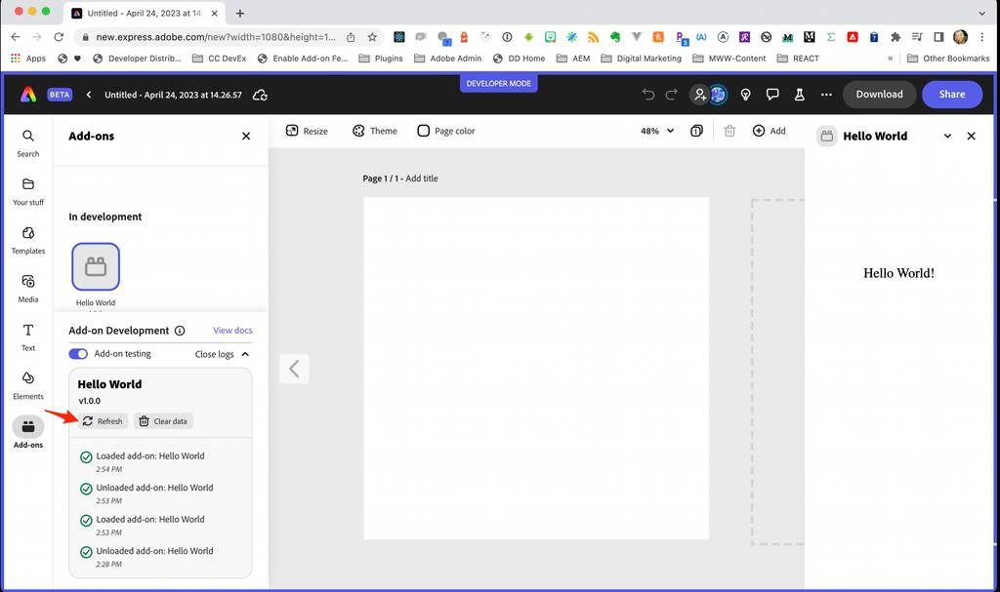

---
keywords:
  - Adobe Express
  - Express Add-on SDK
  - Express Editor
  - Adobe Express
  - Add-on SDK
  - SDK
  - JavaScript
  - Extend
  - Extensibility
  - API
  - Add-on Manifest
title: Manifest Version 2
description: This is the manifest version 2 page
contributors:
  - https://github.com/hollyschinsky
---

# Manifest Schema Reference

## Introduction
Each add-on bundle contains a `manifest.json` file at the root level which defines the metadata for your add-on and how it should behave. This guide outlines the latest manifest version available, which is version 2. 

### Sample manifest.json
```json
{
    "testId": "addon-sample",
    "name": "Add-on Sample",
    "version": "1.0.0",
    "manifestVersion": 2,
    "requirements": {
        "apps": [
            {
                "name": "Express",
                "apiVersion": 1
            }
        ],
        "experimentalApis": true,
        "supportsTouch": false
    },
    "entryPoints": [
        {
            "type": "panel",
            "id": "panel1",
            "main": "index.html",
            "permissions": {
                "sandbox": ["allow-popups", "allow-presentation", "allow-downloads"],
                "oauth": ["www.dropbox.com"]
            }
        }
    ]
}
```


## Manifest Properties

**Note:** The **?** denotes the key is optional. 

| Key         | Type         | Description   |
| -------------| -------------| -----------:  |
| `testId?`     | `string`     | Used to uniquely identify an add-on among other add-ons during a **development workflows only**. This is auto-generated and inserted into the manifest by the CLI when an add-on is created. This is mandatory in the development workflow and ignored in add-ons submitted to the marketplace. |
| `name?`     | `string`     | Add-on name **for development workflow only**. The name provided in the UI during submission is used in all other workflows. |
| `version`     | `string`     | Add-on version in "major.minor.patch" format (e.g. "1.2.0") |
| `manifestVersion`     | `number`     | Version of the manifest schema (e.g. 2).    |
| [`requirements`](#requirements)     | `object`     | Specify the apps the add-on is applicable for. |
| [`entryPoints`](#entrypoints)     | `object []`     | An entry point for your add-on. **At least one is required.** |

## requirements
| Key               | Type         | Description   |
| -------------------| -------------| -----------:  |
| [`apps`](#requirementsapps)    | `object []`  | Add-on authors can specify the apps that the add-on is intended for. |
| `experimentalApis?`| `boolean`    | Add-ons can opt to use experimental apis by specifying this flag. This flag is **only allowed during development** and needs to be removed during submission.                               |
| `supportsTouch?`   | `boolean`    | Whether the add-on supports touch-only devices. If not specified, the default value assumed is `false`.  |
| `renditionPreview?` | `boolean` |	Ensure premium content preview is properly handled for free users when add-ons create renditions. |

<!-- | `privilegedApis?` | `boolean` | Identify the add-on as privileged. If not specified, default value assumed is 'false'.    | -->

**Example:**<br/>
```json
"requirements": {
    "apps": [  
    {  
        "name": "Express", 
        "apiVersion": 1,
        "supportedDeviceClass": ["desktop"]
    }, 
    {…}],
    "experimentalApis": true,
    "supportsTouch": false
} 
```

### requirements.apps
| Key               | Type         | Description   |
| -------------------| -------------| -----------:  |
| `name`             | `string`       | Currently supported values: `"Express"` |
| `apiVersion`         | `number`       | API version that the add-on uses. Currently supported values: 1 |
| [`supportedDeviceClass?`](#requirementsappssupporteddeviceclass ) | `string []`  | Supported platforms by the add-on. If not specified, the default value assumed is: `["desktop"]`. |

<!-- | `supportedDeviceClass?` | `string []`  | Supported platforms by the add-on. Possible values are <ul><li>"desktop"</li><li>"mobile</li><li>"app"</li></ul> If not specified, default value assumed is: \["desktop"\]. | -->
**Example:**<br/>
```json
"apps": [
    {
        "name": "Express",
        "apiVersion": 1,
        "supportedDeviceClass": ["desktop"]
    }
],
```

#### requirements.apps.supportedDeviceClass 
The following platform values are currently supported in the `supportedDeviceClass` key.

| Platform       | Description |
| ----------------| -------------|
| `desktop`       | Browser on desktop. |
| `mobile`        | Browser on mobile and tablet devices. |               
| `app`           | Native app on mobile and tablet devices. |


**Note:** *The beta version of Adobe Express is currently not yet supported on mobile or tablet devices.*

## entryPoints
| Key         | Type         | Description   |
| -------------| -------------| -----------:  |
| `type`       | `string`     | The type of the entry point. Currently supported values: `"panel"`.    | 
| `id`         | `string`     | Identifier for the entry point. Must be unique within the add-on.  |
| `main`        | `string`    | Main file for this entry point when launched.   |
| [`permissions`](#entrypointspermissions) | `object`    | The permissions defined for this entry point. |

**Example:**<br/>
```json
"entryPoints": [
    {
        "type": "panel",
        "id": "panel1",
        "main": "index.html",
        "permissions": {
            "sandbox": ["allow-popups", "allow-presentation", "allow-downloads"],
            "oauth": ["www.dropbox.com"]
        }
    }
]
```

### entrypoints.permissions
| Key                   | Type         | Description   |
| -----------------------| -------------| -----------:  |
| [`sandbox?`](#entrypointspermissionssandbox) | `string []`  | List of iframe sandbox permissions.  | 
| `oauth?`               | `string []` | List of 3rd party auth server domains for which OAuth workflow may be requested. |
| `clipboard?`  | `string []` | The allowed values for the list of clipboard permissions. Currently, `clipboard-write` is supported and allows an add-on to write arbitrary data to the clipboard. |

**Example:**<br/>
```json
"permissions" : {
    "sandbox": [" allow-popups ", "allow-downloads"],
    "oauth" : [“...”, “...”], 
    "clipboard": ["clipboard-write"]
}
```

#### entrypoints.permissions.sandbox 
The following permission values are currently supported in the `sandbox` key.

| Permission      |  Description |
| ----------------| -------------|
| `allow-popups`  |  Allows popups (such as `window.open()`, `target="_blank"`, or `showModalDialog()`). **Note: If this permission is not set and you're using popups, the popup will silently fail to open.** |
| `allow-popups-to-escape-sandbox` | Allows a sandboxed document to open new windows without forcing the sandboxing flags upon them |
| `allow-presentation`  | Lets the add-on start a [presentation session](https://developer.mozilla.org/en-US/docs/Web/API/PresentationRequest). |
| `allow-downloads`     | Allows downloading files through an &lt;a&gt; or &lt;area&gt; element with the download attribute, as well as through the navigation that leads to a download of a file.          |

**Example:**<br/>
```json
"permissions" : {
    "sandbox": ["allow-popups ", "allow-downloads"],    
}
```

## Notes
- Files within the add-on bundle can refer to each other via relative paths.
- Changes to your add-on manifest currently require a reload, but you can simply use the **Refresh** button from the **Add-on Development** panel to force the add-on to reload and pick up your manifest changes.

  