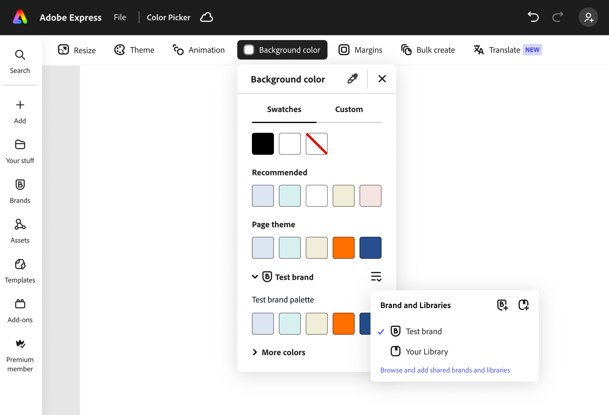
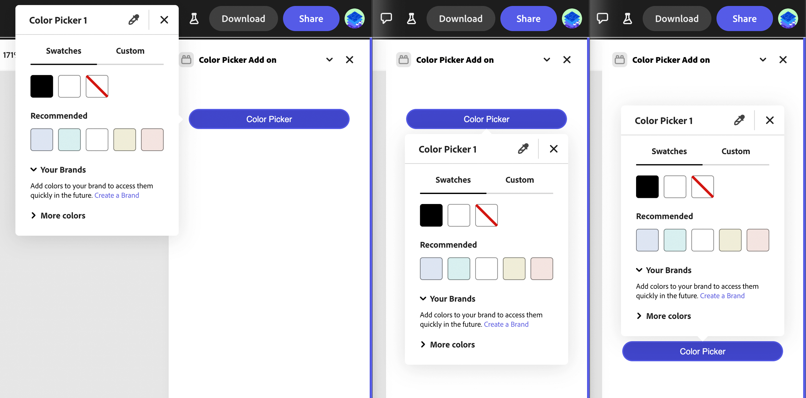

---
keywords:
  - Adobe Express
  - Express Add-on SDK
  - Express Editor
  - Adobe Express
  - Add-on SDK
  - SDK
  - JavaScript
  - Extend
  - Extensibility
  - API
title: Color Picker
description: Adobe Express built-in Color Picker component
contributors:
  - https://github.com/undavide
---

# Built-in UI Components: Color Picker

Adobe Express includes a set of built-in UI Components that provide a consistent experience across different parts of the application.

## Features

The Adobe Express native Color Picker offers several unique features, compared to the Browser's default alternative, for example:

- **Recommended Swatches**: a collection of colors that are curated by Adobe Express to provide a consistent color palette.
- **Themes**: color palettes that are designed to work well together.
- **Library**: collections that you can save and reuse in your designs.
- **Eyedropper**: a tool that allows you to pick a color from anywhere on the screen.
- **Brand colors**: collections of approved swatches and palettes to create consistent branded content



Using the Adobe Express Color Picker in your add-on instead of building your own version provides a few benefits:

- It simplifies the process of selecting a color, bypassing the Browser's color picker.
- It provides a consistent experience to users, as the color picker is integrated with Adobe Express.
- It's in sync with any swatches or Brand colors defined in the application.
- It will evolve with Adobe Express, adding new features over time.

Please note that the Color Picker is going to be available to add-ons in Adobe Express on desktop environment only.

## API

The [`addOnUISdk.app`](../addonsdk/addonsdk-app.md) has two dedicated method:

- [`showColorPicker()`](../addonsdk/addonsdk-app.md#showcolorpicker)
- [`hideColorPicker()`](../addonsdk/addonsdk-app.md#hidecolorpicker)

<InlineAlert variant="info" slots="text" />

Please refer to the [API reference](../addonsdk/addonsdk-app.md) for a complete list of the available options.

### `showColorPicker()`

```js
showColorPicker(
  anchorElement: HTMLElement,
  options?: ColorPickerOptions): Promise<void>;
```

The method accepts a reference to an HTML element as its first argument, which will become the color picker's anchor element. This is important for two reasons:

1. The picker will be positioned relative to this element, based on the placement options available in the [`ColorPickerPlacement`](../addonsdk/addonsdk-constants.md#constants) enumerable;
2. The anchor will receive two custom events:
   - `"colorpicker-color-change"` when the color changes—use it to get the color.
   - `"colorpicker-close"` when the picker is closed—use it to clean up any state.

<InlineAlert variant="warning" slots="text" />

When colors are changed during a drag action (e.g., on the color area or slider), only the final color at the end of the drag will be sent, to avoid performance issues.

The second argument is an object of type [`ColorPickerOptions`](../addonsdk/addonsdk-app.md#colorpickeroptions) that allows you to customize the picker with the following options:

- `title?`: the title of the picker (string, default: `""`).
- `initialColor?`: the color to be selected when the picker is opened (HEX number, default: `0xFFFFFF`).
- `placement?`: the placement of the picker relative to the anchor element (enum, default: `ColorPickerPlacement.left`).
- `eyedropperHidesPicker?`: if `true`, the eyedropper will hide the picker when activated (boolean, default: `false`).
- `disableAlphaChannel?`: if `true`, the alpha channel will be disabled (boolean, default: `false`).

### `hideColorPicker()`

```js
hideColorPicker(): Promise<void>;
```

This method will programmatically close the color picker.

## Examples

<InlineAlert variant="info" slots="text" />

Please also refer to the the Color Picker section of the [Use Color](../../guides/learn/how_to/use-color.md#use-the-color-picker) how-to guide for more examples.

### Basic usage

```js
import addOnUISdk, {
  ColorPickerPlacement,
} from "https://express.adobe.com/static/add-on-sdk/sdk.js";

// Basic usage - just show color picker
addOnUISdk.app.showColorPicker(element);

// Example 1: With title, initial color and eyedropper
addOnUISdk.app.showColorPicker(element, {
  title: "Color Picker 1",
  initialColor: 0x00ff00,
  eyedropperHidesPicker: true,
});

// Example 2: With alpha channel disabled
addOnUISdk.app.showColorPicker(element, {
  title: "Color Picker 2",
  initialColor: 0xff0000,
  disableAlphaChannel: true,
});

// Example 3: With initial color only
addOnUISdk.app.showColorPicker(element, {
  title: "Color Picker 3",
  initialColor: 0x0000ff,
});

// Example 4: Basic with title
addOnUISdk.app.showColorPicker(element, {
  title: "Color Picker 4",
});

// Example 5: With title and placement
addOnUISdk.app.showColorPicker(element, {
  title: "Color Picker 5",
  placement: ColorPickerPlacement.bottom,
});
```

### Listening to events

```js
import addOnUISdk, {
  ColorPickerEvent,
} from "https://express.adobe.com/static/add-on-sdk/sdk.js";

addOnUISdk.ready.then(async () => {
  const colorPickerButton = document.getElementById("colorPicker");

  // Add event listeners for color picker events
  colorPickerButton.addEventListener(ColorPickerEvent.colorChange, (event) => {
    console.log("Color picker color change event from add-on:", event.detail);
  });

  colorPickerButton.addEventListener(ColorPickerEvent.close, (event) => {
    console.log("Color picker closed from add-on:", event.detail);
  });

  colorPickerButton.addEventListener("click", () => {
    addOnUISdk.app.showColorPicker(colorPickerButton, {
      title: "JS Color Picker",
      initialColor: 0x00ff00,
      placement: "bottom",
    });
  });
});
```

### Using ReactJS

```jsx
// Example of Color Picker with auto-hide after 10 seconds
<Button
  size="s"
  ref={buttonRef2}
  id="color-picker1"
  style={{ width: "200px" }}
  onClick={() => {
    addOnUISdk.app.showColorPicker(buttonRef2.current, {
      title: "Color Picker 2",
      initialColor: 0xff0000,
      disableAlphaChannel: true,
    });
    setTimeout(() => {
      console.log("Hiding Color Picker 1 after 10 seconds");
      addOnUISdk.app.hideColorPicker();
    }, 10000);
  }}
>
  Color Picker
</Button>
```

## Positioning

The color picker can be positioned relative to the anchor element using the `placement` option in the `ColorPickerOptions` object. The position will be flipped (right to left or bottom to top) when there is not enough space to show the picker in the specified placement.



## Error Conditions

**Invalid anchor element: must be an instance of `HTMLElement`.**

- **Origin:** Parameter `anchorElement`.
- **Fix:** the anchorElement should be a valid `HTMLElement`.

**Invalid title: must be a string.**

- **Origin:** Property `title` in the `ColorPickerOptions`.
- **Fix:** the `title` should be a valid string.

**Invalid initialColor: must be either a number in `0xRRGGBB[AA]` format or a string in `"#RRGGBB[AA]"` format.**

- **Origin:** Property `initialColor` in the `ColorPickerOptions`.
- **Fix:** the `initialColor` should be a valid number in `0xRRGGBB[AA]` format or a valid string in `"#RRGGBB[AA]"` format.

**Invalid placement value: must be one of the valid `ColorPickerPlacement` values.**

- **Origin:** Property `placement` in the `ColorPickerOptions`.
- **Fix:** the `placement` should be a valid string from the `ColorPickerPlacement` enum.

**Invalid `eyedropperHidesPicker`: must be a boolean value.**

- **Origin:** Property `eyedropperHidesPicker` in the `ColorPickerOptions`.
- **Fix:** the `eyedropperHidesPicker` must be a boolean value.

**Invalid `disableAlphaChannel`: must be a boolean value.**

- **Origin:** Property `disableAlphaChannel` in the `ColorPickerOptions`.
- **Fix:** the `disableAlphaChannel` must be a boolean value.
